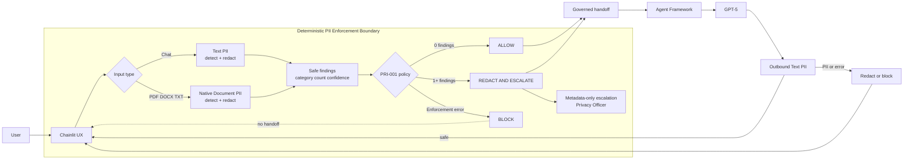
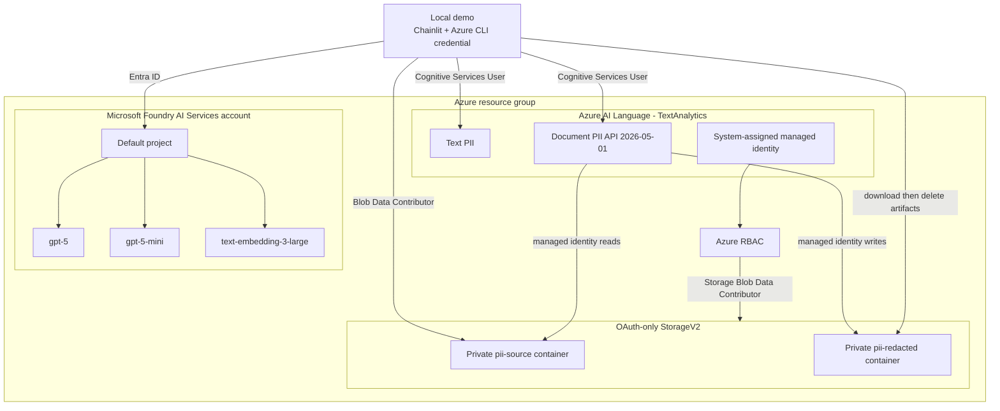

# Forged with Foundry — AI Governance Controls Demo

A practical demonstration of **AI governance outside the AI agent**, built with
Microsoft Foundry, Azure AI Language, Agent Framework, and Chainlit.

> **Governance outside the agent; intelligence inside the agent.**

## Quick links

- [Get started](#getting-started)
- [Recommended demo scenarios](#recommended-demo-scenarios)
- [Detected versus redacted](#detected-is-not-redacted)
- [Architecture](#logical-design)
- [Testing](#testing)
- [Troubleshooting](#troubleshooting)
- [Infrastructure details](infra/README.md)
- [PRI-001 control documentation](controls/privacy/PRI-001_pii_exposure/README.md)

## Featured demo: PRI-001 PII exposure

The first implemented control demonstrates a deterministic PII enforcement
boundary around an AI agent:

- chat strings use Azure AI Language **Text PII**;
- PDF, DOCX, and TXT uploads use **native Document PII**;
- one detected occurrence triggers redaction and immediate Privacy Officer escalation;
- service errors fail closed and never invoke the agent;
- only governed content reaches Agent Framework and GPT-5;
- model output passes through Text PII before it is displayed.

### Detected is not redacted

| Term | Meaning | Consequence |
|---|---|---|
| **Detected** | Azure AI Language found PII and returned safe metadata. | Detection drives PRI-001 and one occurrence triggers escalation. |
| **Redacted** | A separate output was created in which detected values are masked. | Only this transformed output may be sent to GPT-5. |

Detection is a **governance signal**; redaction is a **content transformation**.
Detection does not prove that redaction succeeded. If detection or required
redaction fails, PRI-001 blocks processing.

| Detection | Redaction | Policy | Agent handoff |
|---|---|---|---|
| No PII | Not required | `ALLOW` | Original content may continue |
| PII found | Succeeded | `REDACT_AND_ESCALATE` | Only redacted content may continue |
| PII found | Failed | `BLOCK` | No handoff |
| Detection failed | Cannot be performed | `BLOCK` | No handoff |

## Logical design

This flow shows the location of the deterministic governance boundary. The
agent never receives ungoverned input, and its response is checked again before
display.



> **Governance outside the agent; intelligence inside the agent.**

## Infrastructure design

All resources are placed in one resource group through Bicep. The Language
managed identity processes documents directly from private Blob containers.
The local user receives only the required data-plane roles.



### Native document processing versus the previous approach

The new approach uses **Azure AI Language native Document PII** as a single
asynchronous service workflow. The application temporarily uploads the original
file, starts a Document PII job, polls its status, and downloads both the native
redacted document and the structured detection result. It then deletes the
source and result Blobs.

| Previous / traditional approach | New native Document PII approach |
|---|---|
| The application extracts text using PDF or Word libraries. | Azure AI Language reads PDF, DOCX, and TXT files natively. |
| PII detection runs only on application-extracted text. | Detection and redaction occur within the same managed document job. |
| The application must map positions back and reconstruct the document. | Microsoft provides a redacted file in the original document format. |
| Layout, tables, images, and text positions may be lost. | The native pipeline is designed to preserve document fidelity. |
| More custom code and dependencies increase the chance of PII entering temporary files or logs. | No custom parser or reconstruction is needed, reducing code and the PII attack surface. |
| Filenames and intermediate results often become application data. | The demo uses generic Blob and result names with metadata-only escalation. |

The native service provides two distinct results. The **structured result**
records what was detected and drives PRI-001. The **redacted artifact** is the
transformed output that can be provided safely. If either result is missing,
the demo fails closed and the original document never reaches GPT-5.

## UX/UI theme pack

The Chainlit demo uses a custom **Governance Console** theme pack:

- a calm dark default view with teal and violet governance accents;
- a wide layout for the four process phases and document results;
- modern status messages and a clear typographic hierarchy;
- a custom shield logo and assistant avatar;
- hidden chain of thought: only explicit governance statuses are shown, never
  internal model reasoning;
- support for light/dark mode and `prefers-reduced-motion`;
- standard Chainlit components and accessible CSS variables instead of a custom
  frontend build.

The configuration is in [.chainlit/config.toml](.chainlit/config.toml), the
styling is in [public/theme.css](public/theme.css), and the brand mark is in
[public/brand-mark.svg](public/brand-mark.svg).

---

## 🗂️ Project Structure

The `controls/` folder mirrors the **Governance Signal / Control Repository**
(see [docs/Governance Signals Repo.pdf](docs/Governance%20Signals%20Repo.pdf)).
It is organised in two levels:

- **1st level = Category / domain** (e.g. `security`, `privacy`, `value`, `runtime`)
- **2nd level = Control / signal** (e.g. `SEC-001_prompt_injection_attempts`)

```
forged-with-foundry/
├── app/pri_001/               # Chainlit app and deterministic PII boundary
├── controls/
│   ├── security/
│   │   ├── SEC-001_prompt_injection_attempts/README.md
│   │   ├── SEC-002_successful_prompt_injection/README.md
│   │   └── ...
│   ├── privacy/
│   │   ├── PRI-001_pii_exposure/README.md
│   │   └── ...
│   ├── grounding/
│   │   └── QLT-005_citation_support_failure/README.md
│   └── ... (56 categories, 160 controls)
├── scripts/
│   └── scaffold_controls.py   # Regenerates the controls/ structure
├── shared/
│   └── utils.py               # Shared client setup & helpers
├── docs/
│   └── Governance Signals Repo.pdf
├── infra/                     # Bicep and deployment wrapper
├── public/                    # Chainlit theme and governance brand mark
├── run_all_demos.py
├── requirements.txt
├── .env.example
└── .gitignore
```

Each control folder contains a `README.md` with its metadata: **ID, lifecycle
phase, evidence/source, trigger/threshold, action/gate effect, and accountable
role**. Add the detection/evaluation implementation inside the relevant control
folder.

### Regenerating the structure

```bash
python scripts/scaffold_controls.py
```

---

## 🛡️ Governance Categories

The repository spans **three lifecycle phases** (Pre-Live, Live, Portfolio) and
**56 categories**, including:

| Category | Example controls |
|---|---|
| **Security** | Prompt injection, data exfiltration, secret exposure |
| **Privacy** | PII exposure, retention violation, personal data in logs |
| **Grounding / Quality** | Low grounding score, hallucination rate, citation support |
| **Runtime** | Escalation spike, agent loops, context contamination |
| **Responsible AI** | Bias indicators, fairness degradation, explainability |
| **Value / FinOps** | KPI underperformance, cost spikes, value leakage |
| **Tool Governance** | Unauthorized tool usage, credential misuse |
| **Compliance / Legal** | Regulatory classification, policy violations, IP risk |

See the individual control READMEs under `controls/` for the full list.


---

## 🚀 Getting Started

### 1. Clone the repo

```bash
git clone https://github.com/doruit/forged-with-foundry.git
cd forged-with-foundry
```

### 2. Set up a virtual environment

```bash
python3.13 -m venv .venv
source .venv/bin/activate
```

### 3. Install dependencies

```bash
pip install -r requirements.txt
```

### 4. Configure environment variables

```bash
cp .env.example .env
# Enter your Azure subscription, resource group, and globally unique resource names
```

### 5. Deploy the infrastructure

Provisions Microsoft Foundry, a default project, GPT-5 models, a single-service
Azure AI Language resource, private Blob containers, and least-privilege RBAC.
The script writes runtime endpoints back into `.env`.

```bash
az login          # if not already signed in
./infra/deploy.sh
```

Use `./infra/deploy.sh` or `bash ./infra/deploy.sh`, but not
`sh ./infra/deploy.sh`: the script uses Bash syntax.

See [infra/README.md](infra/README.md) for details and options.

### 6. Run the PRI-001 demo

```bash
chainlit run chainlit_app.py -w
```

Open the displayed local URL, enter text, or attach a PDF, DOCX, or TXT file.
Use synthetic data for demonstrations.

---

## 🎬 Recommended demo scenarios

Use synthetic data only. For every request, the chat displays the phases
**Detect → Decide → Redact → Handoff**.

### 1. No PII

Enter:

> Explain why governance belongs outside an AI agent.

Expected: `NOT_DETECTED` → `ALLOW` → redaction `NOT_REQUIRED` → GPT-5 →
outbound PII check.

### 2. Synthetic PII

Enter:

> Contact Alex at alex@example.com.

Expected: `DETECTED` → `REDACT_AND_ESCALATE` → redacted preview → only redacted
text reaches GPT-5. The escalation shows an event reference, categories, and a
count, but never the detected value.

### 3. Native document

Upload a PDF, DOCX, or TXT file of up to 10 MB containing synthetic PII.

Expected: native Document PII creates a downloadable redacted document. The
original document content and filename do not enter the agent context or the
escalation payload.

### 4. Fail closed

A service, authorization, or processing error results in `BLOCK`. No content is
sent to GPT-5, and no unverified redacted output is released.

---

## ✅ Testing

```bash
source .venv/bin/activate
python -m compileall -q app chainlit_app.py tests
python -m pytest -q
```

The tests verify deterministic policy, fail-closed behavior, safe Blob names,
metadata-only findings, and the explanations in the chat interface.

## Explore a control

Open `controls/<category>/<control>/README.md` to view a control's metadata. For
example:

```bash
cat controls/security/SEC-001_prompt_injection_attempts/README.md
cat controls/grounding/QLT-005_citation_support_failure/README.md
```

### Regenerate the control catalog

```bash
python scripts/scaffold_controls.py
```

---

## 📋 Prerequisites

- an Azure subscription with access to **Microsoft Foundry** and **Azure AI Language**;
- Python 3.10–3.13; the current Chainlit stack does not work correctly on Python 3.14;
- the **Azure CLI** with `az login` completed;
- sufficient **GPT-5 quota** in the selected region, `swedencentral` by default.

---

## 🔧 Troubleshooting

| Problem | Solution |
|---|---|
| `sh ./infra/deploy.sh` fails | Use `./infra/deploy.sh` or `bash ./infra/deploy.sh`. |
| Chainlit reports event-loop errors | Check `python --version` and use Python 3.10–3.13. |
| An import error occurs at startup | Start from the repository root with `chainlit run chainlit_app.py -w`. |
| Azure authorization fails after deployment | Wait several minutes for RBAC propagation and retry; the application remains fail closed. |
| The model deployment has insufficient capacity | Select another region or reduce the `*_CAPACITY` values in `.env`. |
| Document PII takes too long | Check Storage RBAC, ensure resources use the same region, and review `PII_DOCUMENT_TIMEOUT_SECONDS`. |

## Delete resources

Warning: this deletes the entire resource group and all resources it contains.

```bash
az group delete --name <AZURE_RESOURCE_GROUP> --yes --no-wait
```
