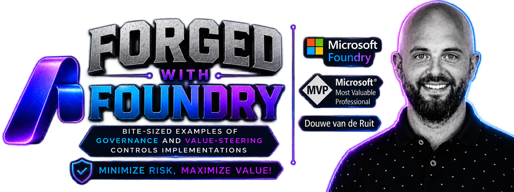

<p align="center">
	
</p>

# Forged with Foundry — AI Governance Control Demos

Forged with Foundry is a hands-on series of practical AI governance control demos. The examples primarily build on Microsoft Foundry and the broader Microsoft AI ecosystem, with the Microsoft Agent Governance Toolkit featuring where it provides a useful governance or enforcement capability. Individual demos may combine additional Microsoft and non-Microsoft technologies where they help demonstrate the control in the most practical way.

> **Governance outside the agent. Intelligence inside the agent.**

## Start here

> [!TIP]
> **New to the repository? Start with a runnable demo below.** The wider control
> catalog is the roadmap; planned entries are useful for discovery but do not
> contain a working implementation yet.

### Recently added — runnable demos

<!-- Keep runnable controls only. Newest first. Update when a control becomes Implemented or Validated. -->

| Demo | What you will learn | Level · time |
|---|---|---|
| **[PRI-003 — Data subject request SLA breach](controls/privacy/PRI-003_data_subject_request_sla_breach/README.md)**<br>[Run the demo](controls/privacy/PRI-003_data_subject_request_sla_breach/README.md#demo) · [Scope](controls/privacy/PRI-003_data_subject_request_sla_breach/README.md#demo-scope) · [Assessment](controls/privacy/PRI-003_data_subject_request_sla_breach/ASSESSMENT.md) | Detect an at-risk or breached DSR SLA deadline, keep the model non-authoritative, and guard a one-time due-date extension with ETag concurrency. | Foundation / Intermediate · 30–45 min |
| **[PRI-002 — Retention violation](controls/privacy/PRI-002_retention_violation/README.md)**<br>[Run the demo](controls/privacy/PRI-002_retention_violation/README.md#demo) · [Scope](controls/privacy/PRI-002_retention_violation/README.md#demo-scope) · [Assessment](controls/privacy/PRI-002_retention_violation/ASSESSMENT.md) | Detect a Blob missed by a lifecycle tag, keep the model non-authoritative, require explicit approval, and verify guarded deletion. | Foundation / Intermediate · 30–45 min |
| **[PRI-001 — PII exposure](controls/privacy/PRI-001_pii_exposure/README.md)**<br>[Run the demo](controls/privacy/PRI-001_pii_exposure/README.md#demo) · [Scope](controls/privacy/PRI-001_pii_exposure/README.md#demo-scope) · [Assessment](controls/privacy/PRI-001_pii_exposure/ASSESSMENT.md) | Put Text PII and native Document PII around a Foundry agent so only safe or redacted content crosses the boundary. | Foundation · 30–45 min |

### Choose your path

- **Run something now:** choose a demo from the table above.
- **Understand the approach:** read [Purpose](#purpose) and the
  [standard control structure](#standard-control-readme).
- **Explore the roadmap:** browse the [category groups](#category-overview), the
  [controls directory](controls), or the
  [source catalog](docs/Governance%20Signals%20Repo.pdf).
- **Add a control:** start with the
  [control assessment template](docs/control-assessment-template.md), then use
  the [control README template](docs/control-readme-template.md).

## Purpose

AI governance becomes useful when policy is translated into observable, testable, and enforceable controls. This repository demonstrates that translation in code. Each implemented control shows:

- the risk or signal being governed and the control contract;
- how the control works and the resulting gate or escalation;
- where enforcement sits relative to an AI agent or workflow;
- the evidence the control produces;
- a small working implementation with safe scenarios and expected outcomes;
- relevant observability, security, privacy, and validation considerations.

This is a demonstration repository, not a complete production governance platform. Implementations should be adapted to organizational policy, risk appetite, legal requirements, and operational standards.

## Incremental roadmap

<p align="center">
	
</p>

The repository is intentionally expanded **weekly or monthly**, one or more controls at a time. Each increment may add a new demo, improve an existing control, refresh dependencies, or align documentation and architecture with new platform capabilities.

Updates follow these principles:

1. **Use current best practices.** Implementations are reviewed against the latest authoritative Microsoft documentation and supported SDK/API behavior.
2. **Prefer focused demos.** Each control remains understandable and runnable without requiring a complete governance platform.
3. **Keep governance explicit.** Thresholds, decisions, actions, accountable roles, and failure behavior are documented rather than hidden in model reasoning.
4. **Secure by default.** Prefer managed identity, least privilege, data minimization, metadata-only alerts, secure cleanup, and fail-closed behavior for mandatory controls.
5. **Evolve transparently.** API versions, model choices, assumptions, known limitations, and validation evidence belong in the control documentation.

Because cloud and AI capabilities change quickly, “latest best practices” means **reviewed at the time of each control update**, not permanently current. Every implemented control should identify the authoritative references on which it is based.

## Repository model

The catalog is organized by governance category and control:

```text
controls/<category-group>/<control-id_control-name>/
├── README.md          # Complete control and demo documentation
├── infra/             # Additional Azure resources owned by this control
├── src/               # Control-specific implementation
├── tests/             # Control-specific automated tests
└── ...                # Optional UI, configuration, and media assets
```

Control-specific code, infrastructure, variables, dependencies, tests,
configuration, and media belong in that control's folder. Only resources and
variables generic to all controls belong in [infra](infra). Control deployments
run incrementally after the shared deployment. The source catalog is available
in [docs/Governance Signals Repo.pdf](docs/Governance%20Signals%20Repo.pdf).

The catalog currently covers **160 controls across 56 categories, grouped into 13 category groups**, and three lifecycle phases: **Pre-Live**, **Live**, and **Portfolio**. A catalog entry may be planned before its demo is implemented; its README states the current status.

## Category overview

The full roadmap is under [controls](controls). Most catalog folders currently
describe **planned** controls. Use [Recently added — runnable demos](#recently-added--runnable-demos)
when you want working code; use this overview when you want to explore what may
be implemented next.

| Category group | Example controls covered by the catalog |
|---|---|
| **Privacy** | PII exposure, retention violations, personal data in logs, DPIA and lawful-basis checks |
| **Security** | Prompt-injection attempts, successful prompt injection, unauthorized access, data exfiltration, secret exposure, supply-chain vulnerabilities |
| **Grounding and quality** | Low grounding scores, hallucination rate, answer accuracy, citation support, production evaluation regressions |
| **Responsible AI and fairness** | Bias indicators, fairness degradation, explainability gaps, missing impact assessments |
| **Data and knowledge** | Data classification, lineage, data quality, knowledge freshness, conflicting sources, retrieval relevance, permission trimming |
| **Runtime and operations** | Availability, latency, failure rates, rate limits, agent loops, context contamination, stale memory, missing traces |
| **Autonomy and human oversight** | Undefined autonomy boundaries, HITL bypass, irreversible actions, missing human gates |
| **Tool governance** | Unauthorized tool use, excessive calls, tool failures, credential misuse, missing inventories |
| **Change, release, and evaluation** | Unapproved prompt/model/source changes, guardrail regression, test-coverage gaps, red-team testing, release evidence |
| **Compliance, legal, and risk** | Regulatory control failures, policy violations, IP/copyright risk, residual-risk acceptance, risk concentration |
| **Value, adoption, and FinOps** | KPI underperformance, ROI degradation, adoption decline, cost spikes, retry-loop leakage, portfolio value |
| **Architecture, resilience, and scale** | Architecture drift, unapproved integration patterns, rollback design, scale readiness, reusable capabilities |
| **Lifecycle and portfolio governance** | Ownership changes, overdue reviews, registry completeness, retirement, archival evidence, governance cadence |

Selected catalog entries and their current status:

- 🟢 **Validated:** [PRI-001 — PII exposure](controls/privacy/PRI-001_pii_exposure/README.md)
- 🟡 **Implemented:** [PRI-002 — Retention violation](controls/privacy/PRI-002_retention_violation/README.md)
- 🟡 **Implemented:** [PRI-003 — Data subject request SLA breach](controls/privacy/PRI-003_data_subject_request_sla_breach/README.md)
- ⚪ **Planned:** [SEC-001 — Prompt injection attempts](controls/security/SEC-001_prompt_injection_attempts/README.md)
- ⚪ **Planned:** [RUN-001 — Low confidence or grounding score](controls/runtime_and_operations/RUN-001_low_confidence_or_grounding_score/README.md)
- ⚪ **Planned:** [QLT-005 — Citation support failure](controls/grounding_and_quality/QLT-005_citation_support_failure/README.md)
- ⚪ **Planned:** [TOOL-001 — Unauthorized tool usage](controls/tool_governance/TOOL-001_unauthorized_tool_usage/README.md)
- ⚪ **Planned:** [FIN-001 — Cost spike](controls/value_adoption_and_finops/FIN-001_cost_spike/README.md)

## Standard control README

Every control README follows the same readable pattern:

1. **Status and overview**
2. **Demo profile and scope** — level, time, core path, simplifications, and proof boundaries
3. **Control contract** — ID, phase, category, signal, evidence, threshold, action, and accountable role
4. **Control objective**
5. **Logical design** — Mermaid decision-flow diagram
6. **Infrastructure architecture** — Mermaid component/deployment diagram
7. **Implementation** — components and best-practice requirements
8. **Demo** — prerequisites, run instructions, and expected scenarios
9. **Evidence and observability**
10. **Security and privacy**
11. **Validation and known limitations**
12. **Further exploration** — optional extensions with Microsoft documentation
13. **Cleanup and references**

Use [docs/control-readme-template.md](docs/control-readme-template.md) when implementing or reviewing a control. Planned controls contain explicit placeholders; implemented controls replace those placeholders with concrete architecture, commands, evidence, and test results.

## Shared setup

General infrastructure guidance is in [infra/README.md](infra/README.md).
Control-specific setup and run instructions belong in each control README.
Environment files stay beside their owning infrastructure or control and must
never be committed.

## Disclaimer

The controls and thresholds in this repository are examples for education and prototyping. They do not constitute legal, compliance, security, or risk advice. Production adoption requires review and approval by the appropriate accountable roles.

<p align="center">
	
</p>
