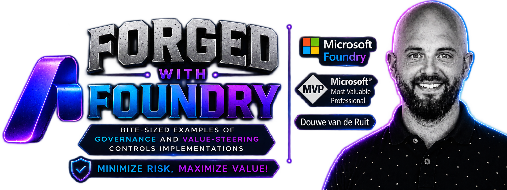
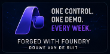

<p align="center">
	
</p>

# Forged with Foundry 🛡️ AI Governance Control Demos 

Forged with Foundry is a hands-on series of practical AI governance control demos. The examples primarily build on Microsoft Foundry and the broader Microsoft AI ecosystem, with the Microsoft Agent Governance Toolkit featuring where it provides a useful governance or enforcement capability. Individual demos may combine additional Microsoft and non-Microsoft technologies where they help demonstrate the control in the most practical way.

> **Governance outside the agent. Intelligence inside the agent.**

## Table of contents

* [Start here](#start-here)
* [Purpose](#purpose)
* [Incremental roadmap](#incremental-roadmap)
* [Repository model](#repository-model)
* [Category overview](#category-overview)
* [Shared setup](#shared-setup)
* [Disclaimer](#disclaimer)

## Start here

> [!TIP]
> **New to the repository? Start with a community demo below.** The wider control
> catalog is the roadmap; planned entries are useful for discovery but do not
> contain a working implementation yet.

### Recently added — community demos

<!-- Keep implemented or validated demos only, newest first. Show five rows above the collapsed remainder. Include guided exercises, hybrid demos, and deployable demos. -->

| Demo | What you will learn | Format · level · time | Date added |
|---|---|---|---|
| **[AUT-PRE-002 - HITL gates missing](controls/autonomy_and_human_oversight/AUT-PRE-002_hitl_gates_missing/README.md)**<br>[Run the demo](controls/autonomy_and_human_oversight/AUT-PRE-002_hitl_gates_missing/README.md#demo) · [Scope](controls/autonomy_and_human_oversight/AUT-PRE-002_hitl_gates_missing/README.md#demo-scope) · [Assessment](controls/autonomy_and_human_oversight/AUT-PRE-002_hitl_gates_missing/ASSESSMENT.md) | Reject release when a protected action lacks a complete human gate; follow its requirements into ACS enforcement. | Hybrid · Intermediate · 60-90 min · Azure, GitHub and Entra required | 2026-10-08 |
| **[AUT-PRE-001 - Autonomy boundary undefined](controls/autonomy_and_human_oversight/AUT-PRE-001_autonomy_boundary_undefined/README.md)**<br>[Run the demo](controls/autonomy_and_human_oversight/AUT-PRE-001_autonomy_boundary_undefined/README.md#demo) · [Scope](controls/autonomy_and_human_oversight/AUT-PRE-001_autonomy_boundary_undefined/README.md#demo-scope) · [Assessment](controls/autonomy_and_human_oversight/AUT-PRE-001_autonomy_boundary_undefined/ASSESSMENT.md) | Compare the mandate with actual Foundry tools and carry the checked boundaries through release to runtime. | Hybrid · Intermediate · 60-90 min · Azure, GitHub and Entra required | 2026-10-08 |
| **[AUT-002 - Irreversible action attempted](controls/autonomy_and_human_oversight/AUT-002_irreversible_action_attempted/README.md)**<br>[Run the demo](controls/autonomy_and_human_oversight/AUT-002_irreversible_action_attempted/README.md#demo) · [Scope](controls/autonomy_and_human_oversight/AUT-002_irreversible_action_attempted/README.md#demo-scope) · [Assessment](controls/autonomy_and_human_oversight/AUT-002_irreversible_action_attempted/ASSESSMENT.md) | Bind OpsManager approval to an ACS action, verify execution, and reject replay, expiry and forged-role callbacks. | Deployable · Intermediate · 60-90 min · Azure and Entra required; Teams Workflows optional | 2026-10-07 |
| **[QLT-001 — Hallucination rate high](controls/grounding_and_quality/QLT-001_hallucination_rate_high/README.md)**<br>[Run the demo](controls/grounding_and_quality/QLT-001_hallucination_rate_high/README.md#demo) · [Scope](controls/grounding_and_quality/QLT-001_hallucination_rate_high/README.md#demo-scope) · [Assessment](controls/grounding_and_quality/QLT-001_hallucination_rate_high/ASSESSMENT.md) | Use Foundry groundedness scores as a hallucination-risk signal; fail closed on incomplete evaluation. Groundedness does not prove factual correctness. | Hybrid · Advanced · 60-90 min + up to 24 h evaluation · Azure required; Teams optional | 2026-09-25 |
| **[VAL-001 — KPI underperformance](controls/value_adoption_and_finops/VAL-001_kpi_underperformance/README.md)**<br>[Run the demo](controls/value_adoption_and_finops/VAL-001_kpi_underperformance/README.md#demo) · [Scope](controls/value_adoption_and_finops/VAL-001_kpi_underperformance/README.md#demo-scope) · [Assessment](controls/value_adoption_and_finops/VAL-001_kpi_underperformance/ASSESSMENT.md) | Compare verified outcomes with KPI targets and route sustained underperformance for review. | Deployable · Intermediate · 45-60 min · Azure and Teams required | 2026-09-21 |

<details>
<summary>More community demos</summary>

| Demo | What you will learn | Format · level · time | Date added |
|---|---|---|---|
| **[VAL-PRE-002: KPI baseline missing](controls/value_adoption_and_finops/VAL-PRE-002_kpi_baseline_missing/README.md)**<br>[Run the demo](controls/value_adoption_and_finops/VAL-PRE-002_kpi_baseline_missing/README.md#demo) · [Scope](controls/value_adoption_and_finops/VAL-PRE-002_kpi_baseline_missing/README.md#demo-scope) · [Assessment](controls/value_adoption_and_finops/VAL-PRE-002_kpi_baseline_missing/ASSESSMENT.md) | Gate missing baseline evidence in CI; compare Azure Policy denial and an OIDC route that is not yet live-validated. | Deployable · Foundation · CI 5 min / Azure 20-30 min · No deployment for CI; Azure required for platform routes | 2026-09-21 |
| **[VAL-PRE-001 — Value hypothesis missing](controls/value_adoption_and_finops/VAL-PRE-001_value_hypothesis_missing/README.md)**<br>[Run the demo](controls/value_adoption_and_finops/VAL-PRE-001_value_hypothesis_missing/README.md#demo) · [Scope](controls/value_adoption_and_finops/VAL-PRE-001_value_hypothesis_missing/README.md#demo-scope) · [Assessment](controls/value_adoption_and_finops/VAL-PRE-001_value_hypothesis_missing/ASSESSMENT.md) | Block go-live when measurable value evidence is missing; Azure Policy and the optional CI/OIDC gate are live-verified. | Deployable · Foundation · 15-20 min · Azure required | 2026-09-17 |
| **[PRI-PRE-003 — Retention design missing](controls/privacy/PRI-PRE-003_retention_design_missing/README.md)**<br>[Run the demo](controls/privacy/PRI-PRE-003_retention_design_missing/README.md#demo) · [Scope](controls/privacy/PRI-PRE-003_retention_design_missing/README.md#demo-scope) · [Assessment](controls/privacy/PRI-PRE-003_retention_design_missing/ASSESSMENT.md) | Deny go-live when governed data lacks a complete retention design. | Deployable · Foundation · 15-20 min · Azure required | 2026-09-04 |
| **[PRI-PRE-002 — Lawful basis or purpose missing](controls/privacy/PRI-PRE-002_lawful_basis_or_purpose_missing/README.md)**<br>[Run the demo](controls/privacy/PRI-PRE-002_lawful_basis_or_purpose_missing/README.md#demo) · [Scope](controls/privacy/PRI-PRE-002_lawful_basis_or_purpose_missing/README.md#demo-scope) · [Assessment](controls/privacy/PRI-PRE-002_lawful_basis_or_purpose_missing/ASSESSMENT.md) | Flag missing GDPR lawful-basis or purpose documentation with a non-blocking audit. | Deployable · Advanced · 30-45 min · Azure required | 2026-09-04 |
| **[PRI-PRE-001 — DPIA required but missing](controls/privacy/PRI-PRE-001_dpia_required_but_missing/README.md)**<br>[Run the demo](controls/privacy/PRI-PRE-001_dpia_required_but_missing/README.md#demo) · [Scope](controls/privacy/PRI-PRE-001_dpia_required_but_missing/README.md#demo-scope) · [Assessment](controls/privacy/PRI-PRE-001_dpia_required_but_missing/ASSESSMENT.md) | Deny go-live for a high-risk AI system without a completed DPIA. | Deployable · Advanced · 45-60 min · Azure required | 2026-09-04 |
| **[PRI-004 — Personal data in logs](controls/privacy/PRI-004_personal_data_in_logs/README.md)**<br>[Run the demo](controls/privacy/PRI-004_personal_data_in_logs/README.md#demo) · [Scope](controls/privacy/PRI-004_personal_data_in_logs/README.md#demo-scope) · [Assessment](controls/privacy/PRI-004_personal_data_in_logs/ASSESSMENT.md) | Detect personal data in Azure Monitor Logs and govern purge and suppression actions at ACS tool boundaries. | Deployable · Intermediate · 45-60 min · Azure required | 2026-09-04 |
| **[PRI-003 — Data subject request SLA breach](controls/privacy/PRI-003_data_subject_request_sla_breach/README.md)**<br>[Run the demo](controls/privacy/PRI-003_data_subject_request_sla_breach/README.md#demo) · [Scope](controls/privacy/PRI-003_data_subject_request_sla_breach/README.md#demo-scope) · [Assessment](controls/privacy/PRI-003_data_subject_request_sla_breach/ASSESSMENT.md) | Detect an at-risk DSR deadline and gate a one-time extension with ACS approval. | Deployable · Foundation / Intermediate · 30-45 min · Azure required | 2026-09-03 |
| **[PRI-002 — Retention violation](controls/privacy/PRI-002_retention_violation/README.md)**<br>[Run the demo](controls/privacy/PRI-002_retention_violation/README.md#demo) · [Scope](controls/privacy/PRI-002_retention_violation/README.md#demo-scope) · [Assessment](controls/privacy/PRI-002_retention_violation/ASSESSMENT.md) | Detect missed Blob lifecycle tags and gate deletion through ACS approval. | Deployable · Foundation / Intermediate · 30-45 min · Azure required | 2026-09-03 |
| **[PRI-001 — PII exposure](controls/privacy/PRI-001_pii_exposure/README.md)**<br>[Run the demo](controls/privacy/PRI-001_pii_exposure/README.md#demo) · [Scope](controls/privacy/PRI-001_pii_exposure/README.md#demo-scope) · [Assessment](controls/privacy/PRI-001_pii_exposure/ASSESSMENT.md) | Gate Foundry inputs and outputs with native PII detection and ACS redaction. | Deployable · Foundation · 30-45 min · Azure required | 2026-08-31 |

</details>

### Choose your path

- **Try a control now:** choose a demo from the table above.
- **Understand the approach:** read [Purpose](#purpose) and the
  [repository model](#repository-model).
- **Explore the roadmap:** browse the [category groups](#category-overview), the
  [controls directory](controls), or the
  [source catalog](docs/Governance%20Signals%20Repo.pdf).
- **Add a control:** start with the
  [control assessment template](docs/control-assessment-template.md), then use
  the [control README template](docs/control-readme-template.md).

The VAL-PRE-001 and VAL-PRE-002 demos above build on the **Forged with
Foundry Agent Governance Contract**, a small pattern for declaring which
controls an agent implements and what evidence proves each one
(`.fwf/agents/<agent-id>/governance.yaml`). It composes three distinct,
purpose-built building blocks rather than one monolithic checker: JSON
Schema for a contract's own structural validity, a
[Conftest/OPA Rego policy layer](policy/governance-contract/README.md) for
"which controls are mandatory for which agents," and Azure Policy for a
reduced-tag check at deployment time. See
[`docs/governance-contract.md`](docs/governance-contract.md) for the full
architecture and how those guarantees differ.

## Purpose

AI governance becomes useful when policy is translated into observable,
reviewable, testable, or enforceable controls. This repository demonstrates
that translation through guided exercises, small executable examples, and
deployable demos. Each implemented control shows:

- the risk or signal being governed and the control contract;
- how the control works and the resulting gate or escalation;
- where enforcement or authoritative decision-making sits relative to an AI
  agent, workflow, or human governance process;
- the evidence the control produces;
- the smallest useful demonstration, with synthetic scenarios and expected outcomes;
- relevant observability, security, privacy, and validation considerations.

### Two kinds of implementation

The catalog intentionally combines **tech-based implementations** and
**process-template implementations**, and neither is a lesser outcome:

- A **process-template implementation** is a `GUIDED_EXERCISE`: a reproducible
  scenario, evidence pack, decision rubric, and answer key. No code or
  deployment is required, because a walkthrough proves the governance decision
  as clearly as running software would.
- A **tech-based implementation** is a `HYBRID_DEMO` or `DEPLOYABLE_DEMO`: real
  Azure resources, policies, or agent-runtime gates — Azure Policy, Agent
  Control Specification intervention points, Purview, Content Safety, and
  similar — that produce an authoritative, inspectable decision and evidence.

A control only becomes a tech-based implementation when deployment adds a
distinct learning outcome a guided exercise cannot show as clearly, such as a
real admission decision, an identity boundary, or runtime enforcement. Each
control's **Demo profile** table states which one it is; see the
[control README template](docs/control-readme-template.md) for the underlying
criteria.

This is a demonstration repository, not a complete production governance platform. Implementations should be adapted to organizational policy, risk appetite, legal requirements, and operational standards.

## Incremental roadmap

<p align="center">
	
</p>

The repository is intentionally expanded **weekly or monthly**, one or more controls at a time. Each increment may add a new demo, improve an existing control, refresh dependencies, or align documentation and architecture with new platform capabilities.

Updates follow these principles:

1. **Use current best practices.** Implementations are reviewed against the latest authoritative Microsoft documentation and supported SDK/API behavior.
2. **Prefer focused demos.** Each control remains understandable and reproducible without requiring a complete governance platform or unnecessary deployment.
3. **Keep governance explicit.** Thresholds, decisions, actions, accountable roles, and failure behavior are documented rather than hidden in model reasoning.
4. **Secure by default.** Prefer managed identity, least privilege, data minimization, metadata-only alerts, secure cleanup, and fail-closed behavior for mandatory controls.
5. **Evolve transparently.** API versions, model choices, assumptions, known limitations, and validation evidence belong in the control documentation.

Because cloud and AI capabilities change quickly, “latest best practices” means **reviewed at the time of each control update**, not permanently current. Every implemented control should identify the authoritative references on which it is based.

## Repository model

The catalog is organized by governance category and control. A control uses
only the folders needed by its selected demo format:

```text
controls/<category-group>/<control-id_control-name>/
├── README.md          # Complete control and demo documentation
├── exercise/          # Optional guided scenario, evidence pack, and answer key
├── infra/             # Optional Azure resources owned by this control
├── src/               # Optional control-specific implementation
├── tests/             # Optional tests for executable decision logic
└── ...                # Optional templates, UI, configuration, and media assets
```

Control-specific code, infrastructure, variables, dependencies, tests,
configuration, and media belong in that control's folder. Only resources and
variables generic to all controls belong in [infra](infra). Control deployments
run incrementally after the shared deployment. The original source catalog is available
in [docs/Governance Signals Repo.pdf](docs/Governance%20Signals%20Repo.pdf).
Repository additions are included in the [complete control roadmap](docs/roadmap.md).

The catalog currently covers **161 controls across 56 categories, grouped into 13 category groups**, and three lifecycle phases: **Pre-Live**, **Live**, and **Portfolio**. A catalog entry may exist before its community demo is available.

## Category overview

The full roadmap is under [controls](controls). Most catalog folders currently
describe **planned** controls. Use [Recently added — community demos](#recently-added--community-demos)
when you want a completed exercise or working example; use this overview when
you want to explore what may be implemented next.

| Category group | Example controls covered by the catalog |
|---|---|
| **Privacy** | PII exposure, retention violations, personal data in logs, DPIA and lawful-basis checks |
| **Security** | Prompt-injection attempts, successful prompt injection, unauthorized access, data exfiltration, secret exposure, supply-chain vulnerabilities |
| **Grounding and quality** | Low grounding scores, hallucination rate, answer accuracy, citation support, production evaluation regressions |
| **Responsible AI and fairness** | Bias indicators, fairness degradation, explainability gaps, missing impact assessments |
| **Data and knowledge** | Data classification, lineage, data quality, knowledge freshness, conflicting sources, retrieval relevance, permission trimming |
| **Runtime and operations** | Availability, latency, failure rates, rate limits, agent loops, context contamination, stale memory, missing traces |
| **Autonomy and human oversight** | Undefined autonomy boundaries, HITL bypass, irreversible actions, missing human gates, emergency stop and controlled recovery |
| **Tool governance** | Unauthorized tool use, excessive calls, tool failures, credential misuse, missing inventories |
| **Change, release, and evaluation** | Unapproved prompt/model/source changes, guardrail regression, test-coverage gaps, red-team testing, release evidence |
| **Compliance, legal, and risk** | Regulatory control failures, policy violations, IP/copyright risk, residual-risk acceptance, risk concentration |
| **Value, adoption, and FinOps** | KPI underperformance, ROI degradation, adoption decline, cost spikes, retry-loop leakage, portfolio value |
| **Architecture, resilience, and scale** | Architecture drift, unapproved integration patterns, rollback design, scale readiness, reusable capabilities |
| **Lifecycle and portfolio governance** | Ownership changes, overdue reviews, registry completeness, retirement, archival evidence, governance cadence |

## Shared setup

General infrastructure guidance is in [infra/README.md](infra/README.md).
Control-specific setup, exercise, and run instructions belong in each control README.
Environment files stay beside their owning infrastructure or control and must
never be committed.

## Disclaimer

The controls and thresholds in this repository are examples for education and prototyping. They do not constitute legal, compliance, security, or risk advice. Production adoption requires review and approval by the appropriate accountable roles.

> **Transparency note:** This repository — including its demos, code, and
> documentation — is built with AI coding agents (GitHub Copilot) under
> human direction and review.

---

*Maintained by [Douwe van de Ruit](https://www.linkedin.com/in/dvanderuit/), Sr. AI Transformation Lead & Solution Architect at Capgemini and Microsoft MVP on Microsoft Foundry.*

<p align="center">
	
</p>
