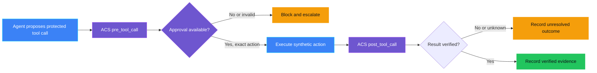
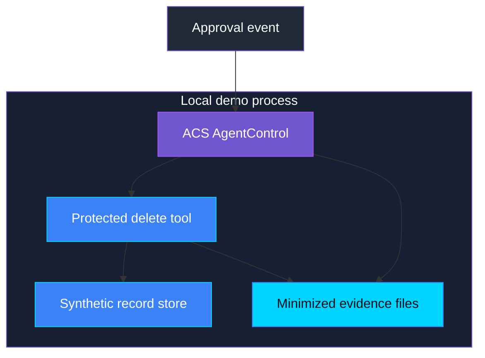

<p align="center">
  
</p>

# AUT-002 - Irreversible action attempted

> **Status:** Implemented
>
> **Last reviewed:** 2026-09-28 against the local ACS demo and governance-contract validation.

## Table of contents

* [Overview](#overview)
* [Demo profile](#demo-profile)
* [Demo scope](#demo-scope)
* [Control contract](#control-contract)
* [Control objective](#control-objective)
* [Logical design](#logical-design)
* [Demo infrastructure setup (simplified)](#demo-infrastructure-setup-simplified)
* [Implementation](#implementation)
* [Demo](#demo)
* [Evidence and observability](#evidence-and-observability)
* [Security and privacy](#security-and-privacy)
* [Validation](#validation)
* [Further exploration](#further-exploration)
* [Cleanup](#cleanup)
* [References](#references)

## Overview

**Real-life scenario:** An assistant is asked to delete a customer record. The
action cannot be undone, but the assistant treats its own plan as permission
and calls the delete operation anyway. A human approval must be required at
the action boundary, not hidden in the assistant's conversation.

AUT-002 demonstrates a deterministic runtime gate around a synthetic
irreversible action. Agent Control Specification (ACS) escalates every
protected tool call, fails closed without approval, binds approval to the
evaluated action identity, and verifies the result after execution.

> **The agent may propose the action. ACS decides whether the tool may run.**

### Why this matters in a real agent

In a real support, finance, or operations agent, the agent may be able to call
tools that delete records, publish content, approve a request, send a payment,
or change access. The dangerous moment is not when the agent writes, “I will
delete this record.” The dangerous moment is when the delete tool is actually
called.

This control places the human approval check at that exact moment:

1. The agent proposes a protected action.
2. ACS intercepts the tool call before the tool runs.
3. Without approval, ACS blocks the call, so the irreversible action does not happen.
4. An authorized operator approves the exact action.
5. ACS allows that action, then checks the result after the tool returns.

The approval is tied to the exact action, not just to the conversation. If the
agent changes the record, target, or other important arguments after approval,
the approval cannot be reused. In practice, this gives a team a small but
important safety boundary: an agent can remain useful and autonomous for normal
work, while high-impact actions stop for human review before anything
irreversible occurs.

This pattern is useful anywhere an incorrect tool call could create financial,
legal, operational, privacy, or customer harm. It does not require the model
to judge its own safety, and it produces evidence showing whether the action
was blocked, approved, executed, and verified.

### Where the list of protected actions comes from

This control does not decide which actions are protected. That decision is
made before release, in the Pre-Live control
[AUT-PRE-002 - HITL gates missing](../AUT-PRE-002_hitl_gates_missing/README.md),
which requires a **protected-action matrix**: every tool the agent can call
that changes state, its reversibility, its impact, and the human gate it needs.
AUT-002 enforces one entry from that matrix at runtime. In this demo the
matrix is reduced to a single tool, `permanently_delete_demo_record`, declared
in [policy/acs_manifest.yaml](policy/acs_manifest.yaml) with `human_approval`
by the Ops Manager and a five-minute approval expiry. In a real agent the
ACS manifest should be derived from the declared matrix so the release-time
declaration and the runtime enforcement cannot drift apart.

## Demo profile

| Property | Value |
|---|---|
| **Demo format** | Hybrid demo |
| **Learning level** | Foundation / Intermediate |
| **Estimated time** | 30 minutes |
| **Primary decision** | May this irreversible tool call execute with the current approval? |
| **Primary capabilities** | Agent Control Specification, ACS `pre_tool_call`/`post_tool_call`, action identity |
| **Deployment** | Not required for the core learning outcome |
| **Infrastructure** | Local Python process and in-memory synthetic record store |
| **Model/Foundry role** | Active - governed subject at the ACS tool boundary; no model call is needed for the core proof |
| **AGT / ACS** | Reused as the real approval and enforcement mechanism |

## Demo scope

### Core demo

The runnable path attempts to permanently delete one synthetic record twice:
first without approval, then with a current approval ticket. ACS blocks the
first attempt before the execute function runs. It allows the second attempt,
the synthetic store verifies the record is absent, and the demo writes
metadata-only evidence for both outcomes.

### Intentional simplifications

- The record store is in memory and contains synthetic identifiers only.
- The approval ticket represents the approval event without authenticating a
  real person. Entra integration is outside the core learning outcome.
- Evidence is written locally rather than to a durable audit service.
- The policy dispatcher is native Python rather than an OPA/Rego bundle.

### What this demo proves

- A protected irreversible action is not executed without an approval resolver.
- ACS performs the authoritative runtime enforcement outside model reasoning.
- An approved action reaches the tool and its result is verified.
- An expired or replayed approval cannot authorize another action.
- Evidence distinguishes escalation, execution, and verification.

### What this demo does not prove

It does not prove universal coverage of every tool in an arbitrary agent,
authenticated approver identity, durable approval across process restarts,
physical deletion, legal compliance, or the ability to undo a completed
irreversible action. It also does not prove that the set of protected actions
is complete; that is the Pre-Live responsibility of
[AUT-PRE-002](../AUT-PRE-002_hitl_gates_missing/README.md).

## Control contract

| Field | Value |
|---|---|
| **ID** | AUT-002 |
| **Lifecycle phase** | Live |
| **Category / domain** | Autonomy and Human Oversight |
| **Control / signal** | Irreversible action attempted |
| **Evidence / source** | ACS tool-call decision, approval identity, action result |
| **Trigger / threshold** | One unauthorized attempt |
| **Action / gate effect** | Block action and escalate |
| **Accountable role** | Ops Manager |

## Control objective

Prevent an unauthorized irreversible action from reaching its tool
implementation. Any approval must be current and bound to the exact action
evaluated by ACS. Missing, stale, rejected, mismatched, or unavailable control
decisions fail closed.

## Logical design



## Demo infrastructure setup (simplified)



## Implementation

| Component | Responsibility | Location |
|---|---|---|
| ACS manifest | Declares the guarded tool and intervention points | [policy/acs_manifest.yaml](policy/acs_manifest.yaml) |
| Policy dispatcher | Escalates every irreversible action | [src/aut_002/acs_gate.py](src/aut_002/acs_gate.py) |
| Approval resolver | Enforces current, exact, single-use approval behavior | [src/aut_002/acs_gate.py](src/aut_002/acs_gate.py) |
| Synthetic action | Makes blocked versus executed behavior observable | [src/aut_002/demo.py](src/aut_002/demo.py) |
| Chainlit live chat | Presents the blocked action, Ops Manager approval, verification, and cleanup | [app.py](app.py), [src/aut_002/chat.py](src/aut_002/chat.py) |
| Evidence writer | Emits minimized control evidence | [src/aut_002/evidence.py](src/aut_002/evidence.py) |
| Focused tests | Validate ACS decisions and fail-closed behavior | [tests/test_acs_gate.py](tests/test_acs_gate.py) |
| Governance schema | Validates declared AUT-002 evidence shape | [schemas/governance-contract/v1alpha1/controls/AUT-002.schema.json](../../../schemas/governance-contract/v1alpha1/controls/AUT-002.schema.json) |

The model is not an approval authority. The protected tool must be invoked
through ACS `run_tool`; a direct call to the synthetic action would be outside
this demonstrated boundary.

## Demo

### Prerequisites

Run from the repository root with the existing virtual environment and the
installed `agent-control-specification` dependency.

### Run

```bash
cd controls/autonomy_and_human_oversight/AUT-002_irreversible_action_attempted
PYTHONPATH=. ../../../.venv/bin/python -m src.aut_002.demo
```

The command creates local `evidence/blocked.json` and
`evidence/approved.json` files and prints both metadata-only records.

### Live chat test

Start the local Chainlit chat from the control directory:

```bash
cd controls/autonomy_and_human_oversight/AUT-002_irreversible_action_attempted
../../../.venv/bin/python -m pip install -c ../../../constraints.txt -r requirements.txt
../../../.venv/bin/chainlit run app.py --host 127.0.0.1 --port 8008
```

Open `http://localhost:8008`, select **1. Attempt irreversible action**, observe
the ACS block, then select **2. Approve as Ops Manager**. The chat must
show the ACS action identity and `Verification: True`. Use **Cleanup evidence**
after the test. This local chat uses a synthetic record and does not require
Azure credentials or a Foundry deployment.

### Captured proof

The documented command was run on 2026-09-28. It produced one record with
`decision: escalate`, `executed: false`, and `reason: approval_missing`, then
one record with `decision: allow`, `executed: true`, and `verified: true`.
The approved record contained an ACS `sha256:` action identity and the same
correlation identity as the blocked attempt.

The same flow was also tested live through the local Chainlit chat agent:


_Figure 1. The chat agent presents the protected action and the explicit test steps._


_Figure 2. ACS blocks the action before the synthetic delete tool executes._


_Figure 3. The Ops Manager approval allows the exact action, and the result is verified._

Captured evidence excerpt:

```json
{
  "control_id": "AUT-002",
  "decision": "allow",
  "action_identity": "sha256:7598b31cf2c0ed5ac3669132f2835305ed329e81a21e19e07a3bb757ad49cecc",
  "executed": true,
  "verified": true,
  "reason": "exact_action_approved_and_verified",
  "accountable_role": "Ops Manager"
}
```

### What the live test shows

Read the three screenshots as one real-world moment. In Figure 1 the agent is
about to do something that cannot be undone. In Figure 2 nothing happens,
because ACS stopped the tool call before the delete ran; no one had to trust
the agent to stop itself. In Figure 3 a named person approved that exact
action, ACS let it through once, and the demo checked that the record is
really gone before it reported success.

The evidence excerpt is what makes this usable in practice. The
`action_identity` hash ties the approval to this specific tool call and its
arguments, so the same approval cannot be reused for a different record.
`executed` and `verified` are separate fields, so a team can tell the
difference between "the agent said it deleted it" and "it is actually gone."
The `accountable_role` records who was responsible without storing a name or
any record content. See
[Why this matters in a real agent](#why-this-matters-in-a-real-agent) for the
full explanation of the flow.

## Evidence and observability

Each evidence record includes the control ID, policy version, timestamp,
correlation ID, guarded tool name, ACS action identity when available,
decision, execution status, verification status, reason, and accountable role.
It does not include prompts, secrets, complete tool arguments, record content,
or personal data.

The governance contract schema validates structural completeness only. It does
not prove that the action was safe, that an approver was authenticated, or
that every agent action passed through ACS.

## Security and privacy

- The action is synthetic and contains no customer data.
- ACS enforcement is outside model reasoning.
- Missing approval and enforcement errors fail closed.
- The demo does not expose secrets or raw prompts in evidence.
- The approval ticket is not an enterprise identity proof and must not be
  presented as one.
- A production implementation would need authenticated approvers, durable
  approval records, replay protection across restarts, and complete tool
  coverage.

## Validation

Run the focused control tests:

```bash
.venv/bin/python -m pytest controls/autonomy_and_human_oversight/AUT-002_irreversible_action_attempted/tests -q
```

Run the control-contract tests:

```bash
.venv/bin/python -m pytest tests/test_aut_002_governance_contract.py tests/test_governance_contract_consistency.py -q
```

The implemented validation covers dispatcher escalation, missing approval,
current approval, expired approval, complete evidence, incomplete evidence,
and the rule that escalation cannot claim execution.

## Further exploration

- Use Microsoft Entra ID to authenticate the accountable approver.
- Persist approval and evidence records in a durable, access-controlled store.
- Add a real Foundry-hosted agent while preserving ACS as the enforcement point.
- Add multiple irreversible action classes with separate accountable roles.
- Send minimized telemetry to Application Insights or Azure Monitor.

## Cleanup

Remove only the control-local generated evidence after the demo:

```bash
rm -rf controls/autonomy_and_human_oversight/AUT-002_irreversible_action_attempted/evidence
```

The core demo creates no Azure resources, containers, or shared infrastructure.

## References

- [Agent Control Specification](https://github.com/microsoft/agent-governance-toolkit/tree/main/policy-engine)
- [Agent Governance Toolkit](https://github.com/microsoft/agent-governance-toolkit)
- [FwF governance contract](../../../docs/governance-contract.md)
- [AUT-PRE-002 - HITL gates missing (protected-action matrix)](../AUT-PRE-002_hitl_gates_missing/README.md)
- [Control assessment](ASSESSMENT.md)

---

<p align="center">
    
</p>