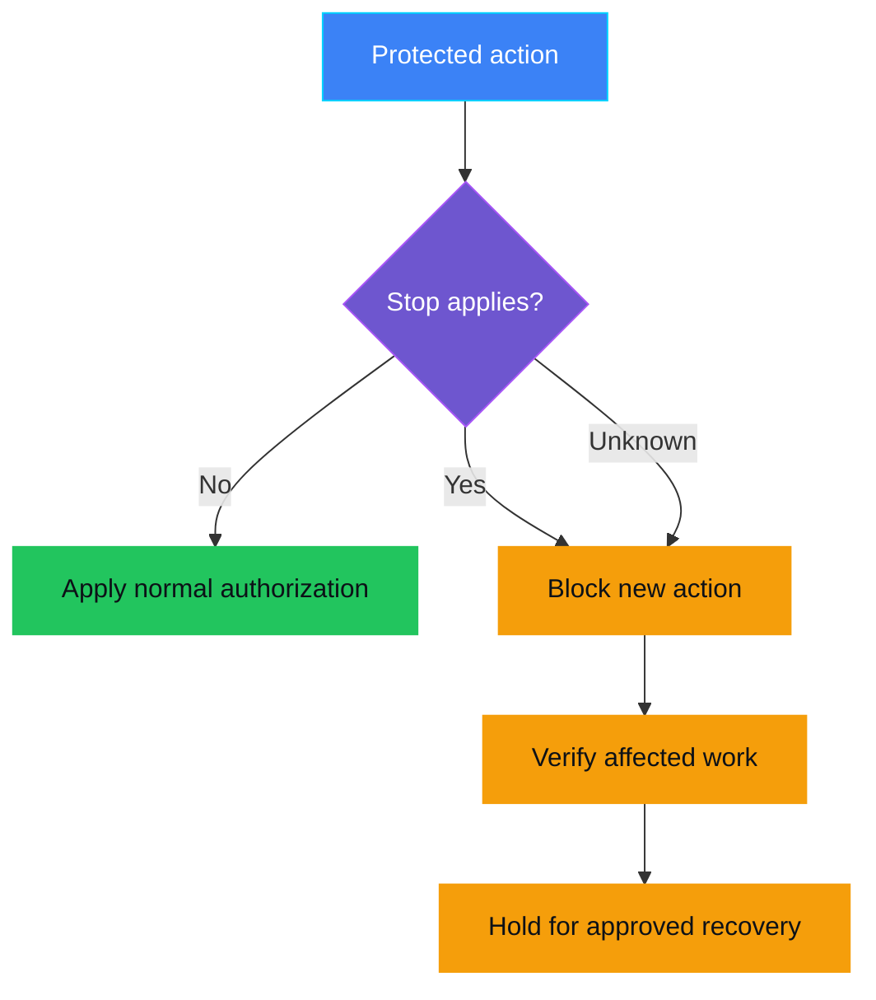
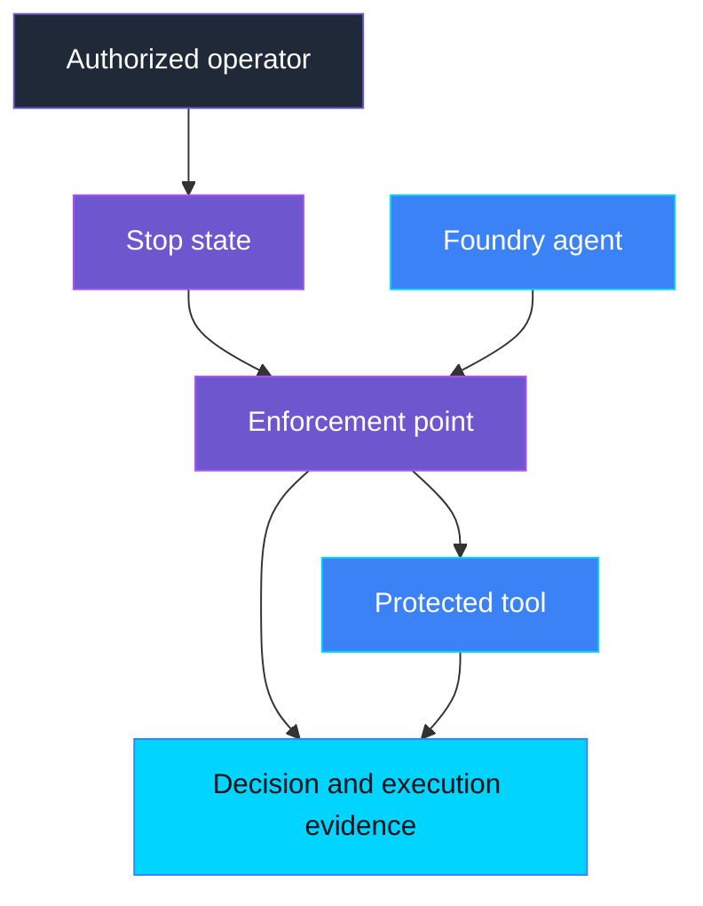

    

# AUT-004 — Emergency stop not enforced

> **Status:** Planned — no runnable demo or infrastructure yet.
>
> **Last reviewed:** 2026-09-17 — catalog scope only; capability assessment pending.

## Overview

A support assistant starts deleting the wrong customer files. An operator
needs to stop those deletions while keeping unaffected customer support
available. Pressing a stop button is only useful if the deletion service
actually refuses further work and someone verifies what already happened.

This planned control covers **emergency stop and controlled recovery**:
limit the affected actions, verify the stop, and require authorized recovery.
It belongs to **Autonomy and human oversight → Human Oversight**.

## Demo profile

| Property | Planned direction |
|---|---|
| **Demo format** | Deployable demo; confirm during assessment |
| **Learning level** | Intermediate |
| **Estimated time** | Establish after implementation |
| **Primary decision** | May this protected action proceed while a stop is in effect? |
| **Primary capabilities** | Assess existing Microsoft Foundry and runtime enforcement capabilities before selection |
| **Deployment / infrastructure** | Required for the proposed runtime demonstration; resources not selected |
| **AGT / ACS** | Assess Agent Governance Toolkit and Agent Control Specification reuse before implementation |
| **Model/Foundry role** | Active — governed subject (planned) |

## Control contract

| Field | Value |
|---|---|
| **ID** | AUT-004 |
| **Lifecycle phase** | Live |
| **Category / domain** | Human Oversight |
| **Control / signal** | Emergency stop not enforced |
| **Evidence / source** | Stop request, enforcement state, action outcomes, recovery approval |
| **Trigger / threshold** | Stop deadline missed, new protected action admitted while blocked, or unauthorized restart |
| **Action / gate effect** | Contain affected scope; verify stop; require approved recovery |
| **Accountable role** | Ops Manager |

## Control objective

Enforce an authorized stop outside model reasoning for a defined agent and
action scope. Agree the safe state, enforcement deadline, treatment of work
already in progress, and recovery authority before enabling the control.
Keep unaffected work available only where it remains safe.

## Logical design

Proposed decision flow; this is not evidence of an implemented gate.

## Infrastructure architecture

Conceptual responsibilities only. Select supported services and validate
bypass prevention in the assessment before choosing infrastructure.

## Implementation

Not started. Complete an `ASSESSMENT.md` using the
[assessment template](../../../docs/control-assessment-template.md) before
adding exercise artifacts, code, or infrastructure. Check supported native
controls first; use one authoritative enforcement path and its actual evidence.

The initial proposal is one agent with read and delete actions on synthetic
files. An authorized operator blocks deletion; safe read access remains.

## Demo

No setup or run commands are available yet. Intended acceptance scenarios:

| Scenario | Expected behavior to validate |
|---|---|
| Normal operation | Actions follow the existing authorization rules. |
| Scoped stop | New deletion attempts are denied; permitted reads continue. |
| Work already in progress | Verify its outcome separately; do not claim cancellation or rollback without evidence. |
| Stop state unavailable | Deny new protected actions; report unresolved execution status as unknown. |
| Retry or process restart | The stop persists and old approval cannot authorize new protected actions. |
| Recovery | A separate authorized decision permits controlled resumption; queued work is reassessed. |

## Evidence and observability

Plan to correlate stop scope and version, verified caller identity, run and
action identifiers, request time, effective-block time, execution outcome, and
recovery authorization. Distinguish **requested**, **enforced**, and **verified**;
missing evidence must not be reported as a successful stop.

## Security and privacy

The agent must not clear its own stop or bypass the enforcement point.
Use synthetic data and exclude personal data, prompts, secrets, and credentials
from evidence. A stop must not disable required protection and leave an
unprotected processing route open.

## Validation

Runtime validation has not been performed. The future demo must exercise the
scenarios above against the actual enforcement path, including the gap between
checking permission and committing an action. It will not establish a universal
Copilot shutdown, undo completed actions, or certify physical machine safety.

## Further exploration

MCP/A2A task cancellation, identity revocation, network isolation, and a physical
button are possible extensions. None is implemented or required by this scaffold.
Keep physical safety systems separate from a button that merely calls an API.

Related planned controls cover [incident procedures](../../runtime_and_operations/OPS-PRE-002_incident_runbook_missing/README.md),
[fallback and recovery design](../../architecture_resilience_and_scale/ARC-PRE-003_resilience_rollback_design_missing/README.md),
and [unauthorized tool usage](../../tool_governance/TOOL-001_unauthorized_tool_usage/README.md).

## Cleanup

Not applicable: this catalog entry creates no deployed resources or runtime
state. Any future demo must provide cleanup limited to its own synthetic data
and control-owned resources.

## References

- [NIST AI RMF Playbook — Manage, including MANAGE 2.4](https://airc.nist.gov/airmf-resources/playbook/manage/)
- [Complete control roadmap](../../../docs/roadmap.md)
- AUT-004 is a repository addition to the original governance catalog.

---

    

