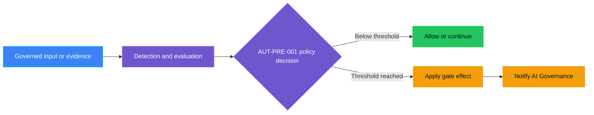
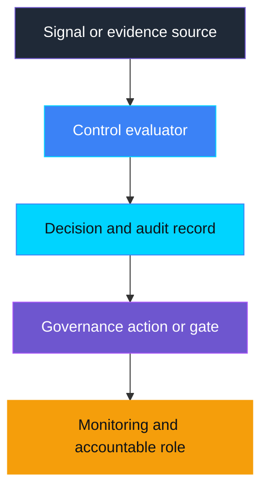

<!-- generated-control-readme -->

    

# AUT-PRE-001 — Autonomy boundary undefined

> **Status:** Planned — the demo has not been implemented yet.
>
> **Last reviewed:** Not yet reviewed; set a date when implementation begins.

Remove the `generated-control-readme` marker when implementation begins so
future catalog regeneration preserves this README.

## Overview

This control detects **autonomy boundary undefined** during the **Pre-Live** lifecycle
phase. This page will evolve with the implementation while retaining the
standard control documentation structure.

## Demo

### Prerequisites

To be documented with the implementation.

### Run

To be documented with the implementation.

### Expected scenarios

| Scenario | Expected result |
|---|---|
| Below threshold | Control allows processing or records a healthy signal. |
| Threshold reached | Control applies **Define autonomy boundary** and routes accountability to **AI Governance**. |
| Evaluation unavailable | Mandatory enforcement fails closed or follows the documented fallback. |

## Control contract

| Field | Value |
|---|---|
| **ID** | AUT-PRE-001 |
| **Lifecycle phase** | Pre-Live |
| **Category / domain** | Autonomy |
| **Control / signal** | Autonomy boundary undefined |
| **Evidence / source** | Autonomy policy, action matrix |
| **Trigger / threshold** | No clear allowed/prohibited actions |
| **Action / gate effect** | Define autonomy boundary |
| **Accountable role** | AI Governance |

## Control objective

Document the risk addressed by this control, the expected outcome, and why the
control must remain deterministic and independently enforceable where relevant.

## Logical design

## Infrastructure architecture

The implementation must replace this conceptual diagram with the actual Azure,
Microsoft Foundry, storage, identity, monitoring, and integration components.

## Implementation

### Components

- **Detector/evaluator:** To be implemented.
- **Policy decision:** To be implemented from the control contract above.
- **Action or gate:** To be implemented.
- **Audit evidence:** To be implemented without exposing sensitive payloads.

### Best-practice requirements

- Keep policy enforcement outside model reasoning when a deterministic control
  is possible.
- Use least-privilege identity and secretless authentication where supported.
- Minimize retained data and exclude sensitive values from logs and alerts.
- Fail closed when a mandatory control cannot complete safely.
- Pin or document API/model versions and review them during repository updates.

## Evidence and observability

Document emitted metrics, traces, audit records, alert payloads, retention, and
the evidence required to prove that the control operated as designed.

## Security and privacy

Document threat boundaries, RBAC, managed identities, network/data flows,
sensitive-data handling, cleanup, and failure behavior.

## Validation

Document automated tests, manual demo checks, expected results, and known
limitations.

## Cleanup

Document control-specific cleanup steps and identify shared resources that must
not be deleted accidentally.

## References

- Add links to the latest authoritative Microsoft Learn documentation used by
  the implementation.
- Source catalog: [Governance Signals Repo.pdf](../../../docs/Governance%20Signals%20Repo.pdf)

---

    

