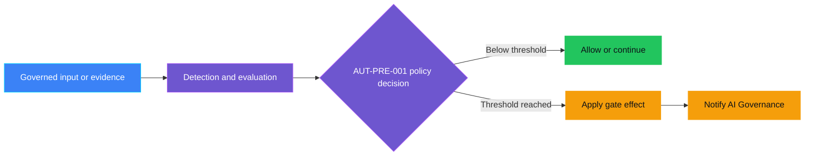
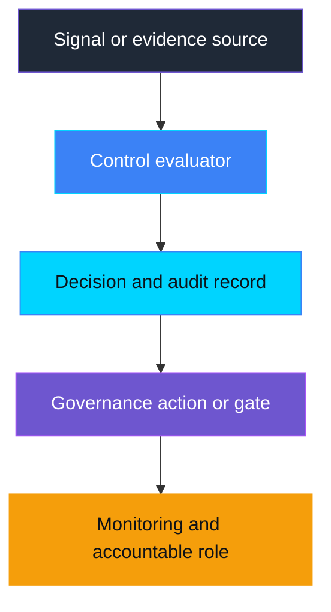

<p align="center">
    
</p>

# AUT-PRE-001 — Autonomy boundary undefined

> **Status:** Implementation in progress - local paired gate and real scoped
> Azure Policy denials pass. Protected OIDC release, cloud runtime acceptance
> and owned-resource cleanup remain pending; not Validated.
>
> **Last reviewed:** 2026-10-07 against the shared gate, SDK candidate and ACS tests.

## Table of contents

* [Overview](#overview)
* [Control contract](#control-contract)
* [Control objective](#control-objective)
* [Logical design](#logical-design)
* [Demo infrastructure setup (simplified)](#demo-infrastructure-setup-simplified)
* [Implementation](#implementation)
* [Demo](#demo)
* [Evidence and observability](#evidence-and-observability)
* [Security and privacy](#security-and-privacy)
* [Validation](#validation)
* [Cleanup](#cleanup)
* [References](#references)

## Overview

An assistant may have access to a customer system without authority to perform
every action in it. Before release, a team must define its mandate, target scope
and which decisions remain with people.

AUT-PRE-001 compares that declaration with the actual built Foundry tools.
AUT-PRE-002 checks sign-off requirements against the same bytes. One workflow
produces distinct findings. The model cannot certify its own mandate.

**Business analogy:** access is not delegated authority; the mandate is the
job description, scope limits where it applies, and sign-off authorizes an
exact action. Accountability remains with people.

## Control contract

| Field | Value |
|---|---|
| **ID** | AUT-PRE-001 |
| **Lifecycle phase** | Pre-Live |
| **Category / domain** | Autonomy |
| **Control / signal** | Autonomy boundary undefined |
| **Evidence / source** | Autonomy policy, action matrix |
| **Trigger / threshold** | No clear allowed/prohibited actions |
| **Action / gate effect** | Define autonomy boundary |
| **Accountable role** | AI Governance |

## Control objective

Document the risk addressed by this control, the expected outcome, and why the
control must remain deterministic and independently enforceable where relevant.

## Logical design


```mermaid
flowchart LR
    I[Governed input or evidence] --> D[Detection and evaluation]
    D --> P{AUT-PRE-001 policy decision}
    P -->|Below threshold| A[Allow or continue]
    P -->|Threshold reached| E[Apply gate effect]
    E --> O[Notify AI Governance]

    classDef governance fill:#6E56CF,stroke:#A855F7,color:#FFFFFF
    classDef platform fill:#3B82F6,stroke:#00D4FF,color:#FFFFFF
    classDef success fill:#22C55E,stroke:#22C55E,color:#0D1117
    classDef attention fill:#F59E0B,stroke:#F59E0B,color:#0D1117
    class D,P governance
    class I platform
    class A success
    class E,O attention
```

## Demo infrastructure setup (simplified)


```mermaid
flowchart TB
    S[Signal or evidence source] --> C[Control evaluator]
    C --> R[Decision and audit record]
    R --> G[Governance action or gate]
    G --> M[Monitoring and accountable role]

    classDef governance fill:#6E56CF,stroke:#A855F7,color:#FFFFFF
    classDef platform fill:#3B82F6,stroke:#00D4FF,color:#FFFFFF
    classDef evidence fill:#00D4FF,stroke:#3B82F6,color:#0D1117
    classDef neutral fill:#1F2937,stroke:#6E56CF,color:#FFFFFF
    classDef attention fill:#F59E0B,stroke:#F59E0B,color:#0D1117
    class S neutral
    class C platform
    class R evidence
    class G governance
    class M attention
```

The implementation must replace this conceptual diagram with the actual Azure,
Microsoft Foundry, storage, identity, monitoring, and integration components.

## Implementation

### Components

- [demo.py](demo.py) builds the synthetic candidate from the real Foundry SDK.
- [candidate](candidate) contains one declaration and two contract references.
- [Shared resolver](../../../scripts/resolve_autonomy_mandate.py) enforces local paths and reviewed hashes.
- [Existing Rego gate](../../../policy/governance-contract/deployment_gate.rego) checks scope, coverage and sign-off.
- [AUT-002 publisher](../AUT-002_irreversible_action_attempted/infra/deploy.py) gates full/code publication and packages the checked source for ACS.

### Best-practice requirements

- Keep policy enforcement outside model reasoning when a deterministic control
  is possible.
- Use least-privilege identity and secretless authentication where supported.
- Minimize retained data and exclude sensitive values from logs and alerts.
- Fail closed when a mandatory control cannot complete safely.
- Pin or document API/model versions and review them during repository updates.

## Demo

### Prerequisites

Install Python 3.12, the existing pinned AUT-002 and governance-contract
dependencies, and Conftest 0.70.0. Follow
[AUT-002 prerequisites](../AUT-002_irreversible_action_attempted/README.md#demo)
for cloud setup. Local gate feedback requires no Azure credentials.

### Run

From the repository root:

```bash
.venv/bin/python controls/autonomy_and_human_oversight/AUT-PRE-001_autonomy_boundary_undefined/demo.py
```

Continue only with exit zero and `ALLOWED`. This real run was exercised:

```text
1/3 Building the deployment plan (profile: autonomy-mandate-review)...
2/3 Evaluating the Conftest policy (policy/governance-contract)...
3/3 Recording evidence...
ALLOWED: every expected agent has a valid contract with every required control complete.
```

Evidence is written under the control's gitignored `.azure/`. `--build` only
constructs the synthetic reviewed sample; never use it to silently reapprove
an altered release. The normal gate checks the existing reviewed hash.

After shared infrastructure and AUT-002 bootstrap, release to its existing
Azure resources from the repository root:

```bash
controls/autonomy_and_human_oversight/AUT-002_irreversible_action_attempted/infra/deploy.sh --release
controls/autonomy_and_human_oversight/AUT-002_irreversible_action_attempted/infra/deploy.sh --status
```

The release path does not recreate Entra/RBAC. Continue only once the uploaded
build is complete and active. Check read/deny/sign-off outcomes in the real
cloud chat; the actual OpsManager must approve the synthetic delete.

The [hosted workflow](../../../.github/workflows/autonomy-mandate-gate-demo.yml)
provides CI-only, combined and independent Policy-only routes. Hosted execution
is unvalidated and needs a protected `autonomy-mandate-demo` environment,
Entra OIDC, private target configuration/state and GitHub workflow permission.
Tags are forgeable summaries; Policy does not inspect the source declaration.

### Expected scenarios

| Scenario | Expected result |
|---|---|
| Below threshold | Control allows processing or records a healthy signal. |
| Threshold reached | Control applies **Define autonomy boundary** and routes accountability to **AI Governance**. |
| Evaluation unavailable | Mandatory enforcement fails closed or follows the documented fallback. |

## Evidence and observability

Document emitted metrics, traces, audit records, alert payloads, retention, and
the evidence required to prove that the control operated as designed.

## Security and privacy

Document threat boundaries, RBAC, managed identities, network/data flows,
sensitive-data handling, cleanup, and failure behavior.

## Validation

Run from the repository root:

```bash
.venv/bin/python -m pytest tests/test_autonomy_mandate.py tests/test_governance_contract_consistency.py tests/test_deployment_gate.py -q
conftest verify --policy policy/governance-contract
```

Independent control references, exact hashes, unsafe paths, real Conftest
decisions and existing release regressions pass. Full hosted/runtime acceptance
is pending. Review metadata is not an authenticated business signature.

## Cleanup

Remove only this control's generated `.azure/` evidence when no longer needed.
Use [paired Policy cleanup](../AUT-PRE-002_hitl_gates_missing/README.md#cleanup)
for the owned assignments/definitions. Do not delete reused AUT-002 or shared
Foundry resources as this Pre-Live control's cleanup.

## References

- [Assessment](ASSESSMENT.md)
- [AUT-PRE-002 paired gate](../AUT-PRE-002_hitl_gates_missing/README.md)
- [AUT-002 runtime](../AUT-002_irreversible_action_attempted/README.md)
- Source catalog: [Governance Signals Repo.pdf](../../../docs/Governance%20Signals%20Repo.pdf)

---

<p align="center">
    
</p>
