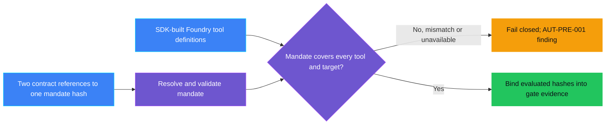

<p align="center">
    
</p>

# AUT-PRE-001 — Autonomy boundary undefined

> **Status:** Implementation in progress - local paired gate, real scoped
> Azure Policy denials, protected OIDC release and active Azure deployment
> pass. Cloud read and prohibited-action denial pass; runtime delete approval
> and owned-resource cleanup remain pending; not Validated.
>
> **Last reviewed:** 2026-10-07 against the shared gate, SDK candidate and ACS tests.

## Table of contents

* [Overview](#overview)
* [Demo profile](#demo-profile)
* [Control contract](#control-contract)
* [Control objective](#control-objective)
* [Logical design](#logical-design)
* [Demo infrastructure setup (simplified)](#demo-infrastructure-setup-simplified)
* [Implementation](#implementation)
* [Demo](#demo)
* [Evidence and observability](#evidence-and-observability)
* [Security and privacy](#security-and-privacy)
* [Validation](#validation)
* [Cleanup](#cleanup)
* [References](#references)

## Overview

An assistant may have access to a customer system without authority to perform
every action in it. Before release, a team must define its mandate, target scope
and which decisions remain with people.

AUT-PRE-001 compares that declaration with the actual built Foundry tools.
AUT-PRE-002 checks sign-off requirements against the same bytes. One workflow
produces distinct findings. The model cannot certify its own mandate.

**Business analogy:** access is not delegated authority; the mandate is the
job description, scope limits where it applies, and sign-off authorizes an
exact action. Accountability remains with people.

## Demo profile

| Property | Value |
|---|---|
| **Demo format** | Hybrid demo: credential-free candidate gate plus protected cloud release and runtime handoff |
| **Learning level** | Intermediate |
| **Estimated time** | 60-90 minutes after Azure/GitHub prerequisites are ready; tenant setup and build time vary |
| **Primary decision** | Does the mandate cover every tool and target in this release candidate? |
| **Primary capabilities** | FwF governance contract, shared JSON Schema/Rego gate, Foundry SDK candidate definition, protected GitHub Actions release, Entra OIDC |
| **Deployment requirement** | Required to demonstrate that the checked candidate reaches the real Azure/Foundry workload |
| **Infrastructure** | Existing AUT-002 Foundry project, model, agent, App Service and managed identity; protected GitHub environment and release identity |
| **AGT / ACS usage** | Not the Pre-Live decision surface; the checked mandate is consumed by the existing AUT-002 ACS runtime |
| **Model/Foundry role** | Not used to decide the mandate; Foundry supplies the actual candidate definition and later governed workload |

## Control contract

| Field | Value |
|---|---|
| **ID** | AUT-PRE-001 |
| **Lifecycle phase** | Pre-Live |
| **Category / domain** | Autonomy |
| **Control / signal** | Autonomy boundary undefined |
| **Evidence / source** | Autonomy policy, action matrix |
| **Trigger / threshold** | No clear allowed/prohibited actions |
| **Action / gate effect** | Define autonomy boundary |
| **Accountable role** | AI Governance |

## Control objective

Require a default-deny mandate that names permitted, prohibited and
approval-required actions and their synthetic target scope. The release gate
compares that declaration with every function in the actual SDK-built Foundry
definition and blocks publication when the source or coverage is missing,
inconsistent or unverifiable. AI Governance owns the mandate decision; the
model does not interpret or approve it.

## Logical design


```mermaid
flowchart LR
    C[Two contract references to one mandate hash] --> M[Resolve and validate mandate]
    T[SDK-built Foundry tool definitions] --> G{Mandate covers every tool and target?}
    M --> G
    G -->|No, mismatch or unavailable| B[Fail closed; AUT-PRE-001 finding]
    G -->|Yes| E[Bind evaluated hashes into gate evidence]

    classDef source fill:#3B82F6,stroke:#00D4FF,color:#FFFFFF
    classDef gate fill:#6E56CF,stroke:#A855F7,color:#FFFFFF
    classDef pass fill:#22C55E,stroke:#22C55E,color:#0D1117
    classDef stop fill:#F59E0B,stroke:#F59E0B,color:#0D1117
    class C,T source
    class M,G gate
    class E pass
    class B stop
```

This is the AUT-PRE-001 decision only. The combined release and runtime
handoffs are shown in the [shared lifecycle walkthrough](docs/DEMO-WALKTHROUGH.md).
In the diagram, blue denotes candidate inputs, purple the deterministic check,
green the passing evidence path and amber a fail-closed result.

## Demo infrastructure setup (simplified)

The candidate and shared validator/Rego gate run in the repository or CI
runner. A protected GitHub environment pauses the cloud release for human
review; Entra OIDC authenticates the release job to the existing AUT-002 Azure
resources. The release packages the evaluated mandate and SDK-built definition
for the existing Foundry agent and ACS runtime. No second agent, approval
service or evidence store is introduced. See the
[shared lifecycle diagram](docs/DEMO-WALKTHROUGH.md#lifecycle-at-a-glance)
for the end-to-end composition.

## Implementation

### Components

- [demo.py](demo.py) builds the synthetic candidate from the real Foundry SDK.
- [candidate](candidate) contains one mandate and two independently owned contract entries referencing the same digest.
- [Shared resolver](../../../scripts/resolve_autonomy_mandate.py) confines attachment paths and checks the referenced digest.
- [Existing Rego gate](../../../policy/governance-contract/deployment_gate.rego) evaluates scope, tool coverage and human-gate completeness as separate findings.
- [AUT-002 publisher](../AUT-002_irreversible_action_attempted/infra/deploy.py) rechecks evaluated hashes and packages the checked mandate and definition for ACS.

The shared gate owns the release decision. This control adds neither a second
Python policy evaluator nor an authenticated-review claim based on sample
metadata.

## Demo

Follow the [captured release and runtime walkthrough](docs/DEMO-WALKTHROUGH.md)
for the two different approvals, real cloud screenshots, OIDC correction and
explicit observed-versus-pending validation boundary.

### Prerequisites

Install Python 3.12, the existing pinned AUT-002 and governance-contract
dependencies, and Conftest 0.70.0. Follow
[AUT-002 prerequisites](../AUT-002_irreversible_action_attempted/README.md#demo)
for cloud setup. Local gate feedback requires no Azure credentials.

### Run

From the repository root:

```bash
.venv/bin/python controls/autonomy_and_human_oversight/AUT-PRE-001_autonomy_boundary_undefined/demo.py
```

Continue only with exit zero and `ALLOWED`. This real run was exercised:

```text
1/3 Building the deployment plan (profile: autonomy-mandate-review)...
2/3 Evaluating the Conftest policy (policy/governance-contract)...
3/3 Recording evidence...
ALLOWED: every expected agent has a valid contract with every required control complete.
```

Evidence is written under the control's gitignored `.azure/`. `--build` only
constructs the synthetic reviewed sample; never use it to silently reapprove
an altered release. The normal gate checks the existing reviewed hash.

The [hosted workflow](../../../.github/workflows/autonomy-mandate-gate-demo.yml)
provides CI-only, combined and independent Policy-only routes. The valid
combined run passed its protected `autonomy-mandate-demo` release using Entra
OIDC, and the active Azure build was verified. For the exact release, status,
and runtime steps, follow the
[shared walkthrough](docs/DEMO-WALKTHROUGH.md). Runtime delete approval and
owned-resource cleanup remain open. Tags are forgeable summaries; Policy does
not inspect the source declaration.

### Expected scenarios

| Scenario | Expected result |
|---|---|
| Valid mandate covers all actual SDK-built tools | Gate passes this control and records mandate and candidate hashes. |
| Tool is missing from the mandate or target is out of scope | Gate blocks release with a reason-coded finding. |
| Attachment is missing, malformed, unsafe to resolve or has a stale digest | Gate fails closed; release does not proceed. |
| Gate evaluation is unavailable or errors | Release stops; no fallback allow is used. |

## Evidence and observability

The shared gate evidence binds the resolved mandate hash and actual candidate
definition hash to the evaluated contract and control findings. AUT-PRE-001
evidence identifies the accountable role and review reference/date; these are
declared metadata, not a cryptographic reviewer signature. Later ACS evidence
includes the mandate hash and observed tool decision. See the concrete
[runtime excerpts](docs/DEMO-WALKTHROUGH.md#6-read-within-the-mandate) and
[handoff evidence](docs/DEMO-WALKTHROUGH.md#handoff-evidence).

## Security and privacy

The candidate uses synthetic targets and contains no credentials or personal
data. Gate hashes bind bytes, not truth, reviewer identity or completeness of
actions omitted from the candidate. Release credentials are supplied to the
protected job as secrets; Entra OIDC avoids a long-lived Azure client secret.
Fail closed on missing sources, hash mismatch, unknown tools and evaluation
errors. Azure Policy status tags are forgeable and are not the authority for
this mandate decision.

## Validation

Run from the repository root:

```bash
.venv/bin/python -m pytest tests/test_autonomy_mandate.py tests/test_governance_contract_consistency.py tests/test_deployment_gate.py -q
conftest verify --policy policy/governance-contract
```

Independent control references, exact hashes, unsafe paths, real Conftest
decisions and existing release regressions pass. The hosted candidate gate and
protected release completed successfully; Azure reported deployment status
`4`, complete and active. The real runtime read and prohibited-action denial
also passed. Exact-action delete approval and owned-resource cleanup are still
pending. Review metadata is not an authenticated business signature.

## Cleanup

Remove only this control's generated `.azure/` evidence when no longer needed.
Use [paired Policy cleanup](../AUT-PRE-002_hitl_gates_missing/README.md#cleanup)
for the owned assignments/definitions. Do not delete reused AUT-002 or shared
Foundry resources as this Pre-Live control's cleanup.

## References

- [Assessment](ASSESSMENT.md)
- [AUT-PRE-002 paired gate](../AUT-PRE-002_hitl_gates_missing/README.md)
- [AUT-002 runtime](../AUT-002_irreversible_action_attempted/README.md)
- Source catalog: [Governance Signals Repo.pdf](../../../docs/Governance%20Signals%20Repo.pdf)

---

<p align="center">
    
</p>
