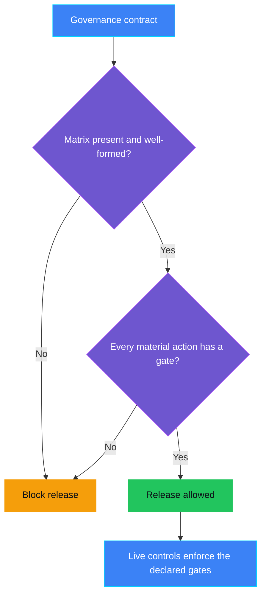
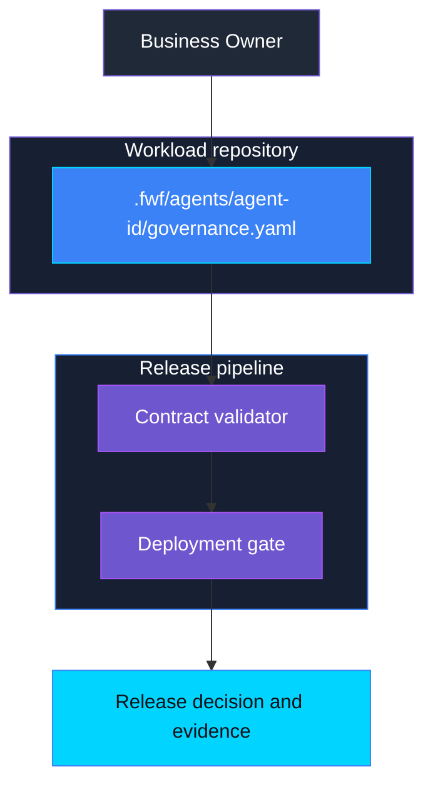

<p align="center">
    
</p>

# AUT-PRE-002 - HITL gates missing

> **Status:** Implementation in progress - local human-gate checks and real
> scoped Azure Policy denials pass. Protected OIDC release, cloud acceptance
> and cleanup verification remain pending; not Validated.
>
> **Last reviewed:** 2026-10-07 - lifecycle responsibilities and declaration guidance clarified; implementation assessment pending.

## Table of contents

* [Overview](#overview)
* [Demo profile](#demo-profile)
* [Control contract](#control-contract)
* [Control objective](#control-objective)
* [Protected-action matrix](#protected-action-matrix)
* [Determining reversibility](#determining-reversibility)
* [Pre-Live to Live handoff](#pre-live-to-live-handoff)
* [Logical design](#logical-design)
* [Demo infrastructure setup (simplified)](#demo-infrastructure-setup-simplified)
* [Implementation](#implementation)
* [Demo](#demo)
* [Evidence and observability](#evidence-and-observability)
* [Security and privacy](#security-and-privacy)
* [Validation](#validation)
* [Further exploration](#further-exploration)
* [Cleanup](#cleanup)
* [References](#references)

## Overview

**Real-life scenario:** A team is about to release an agent that can delete
records, approve requests, or send payments. Nobody has written down which of
those actions need a human decision first. The agent goes live, and the first
time it reaches a high-impact action, there is no agreed rule about who must
approve it.

AUT-PRE-002 fixes that gap before release. It requires a declared
protected-action matrix: the list of material actions an agent can perform,
whether each one is reversible, and which human gate applies. This matrix is
the intended Pre-Live source of truth for runtime enforcement. The current
AUT-002 demo demonstrates the ACS boundary for one manually configured
equivalent action; it does not yet load or validate this matrix.

The declaration combines three inputs:
[TOOL-PRE-001](../../tool_governance/TOOL-PRE-001_tool_inventory_incomplete/README.md)
identifies the tools/actions,
[TOOL-PRE-002](../../tool_governance/TOOL-PRE-002_tool_risk_tier_not_approved/README.md)
reviews high-impact tool risk, and
[AUT-PRE-001](../AUT-PRE-001_autonomy_boundary_undefined/README.md)
defines the allowed/prohibited autonomy boundary. These controls are also
planned. Tool-risk approval concerns whether a tool may be exposed; it is not
approval to execute a particular irreversible call.

## Demo profile

| Property | Planned direction |
|---|---|
| **Demo format** | Guided exercise or hybrid demo; confirm during assessment |
| **Learning level** | Foundation |
| **Estimated time** | Establish after implementation |
| **Primary decision** | May this agent be released while a material action has no declared human gate? |
| **Primary capabilities** | Forged with Foundry governance contract, shared contract validator, deployment gate |
| **Deployment / infrastructure** | Not required for the core learning outcome |
| **AGT / ACS** | Not the enforcement point for this Pre-Live decision; ACS enforces the declared gates in Live controls such as AUT-002 |
| **Model/Foundry role** | Not used - not applicable to the core path |

## Control contract

| Field | Value |
|---|---|
| **ID** | AUT-PRE-002 |
| **Lifecycle phase** | Pre-Live |
| **Category / domain** | Human Oversight |
| **Control / signal** | HITL gates missing |
| **Evidence / source** | Protected-action matrix in the agent governance contract |
| **Trigger / threshold** | A material action has no declared human gate, approver role, or approval expiry |
| **Action / gate effect** | Block release |
| **Accountable role** | Business Owner |

## Control objective

Make the human-oversight boundary explicit before an agent goes live. The
matrix must declare every material action, classify its reversibility and
impact, and assign a human gate where the impact requires one. A missing,
empty, or incomplete matrix must block release in the planned implementation.
A reviewed, versioned matrix is intended to configure AUT-002's Live gate
and inform the related bypass/containment controls. The paired local release
check and ACS consumer now exist; full cloud and protected OIDC acceptance
are still pending.

## Protected-action matrix

Declare every exposed tool/action, including read-only actions, so coverage
can be checked against the actual agent tool inventory. Use `required_gate:
none` only when the reviewed risk and autonomy boundary permit ungated access;
read-only does not automatically mean low risk. If a tool supports multiple
operations, assess each operation's effects rather than hiding a destructive
operation behind the tool's general name. The schema and matching semantics
for that granularity remain an implementation decision.

| Field | Meaning | Allowed values |
|---|---|---|
| `tool_name` | Exact tool name as exposed to the agent | String |
| `action_class` | What the action does | `read`, `create`, `update`, `delete`, `publish`, `approve`, `pay`, `grant_access`, `submit` |
| `reversibility` | Whether the effect can be undone | `reversible`, `partially_reversible`, `irreversible` |
| `impact` | Harm category if the action is wrong | One or more of `financial`, `legal`, `privacy`, `operational`, `customer` |
| `required_gate` | Human decision required before execution | `none`, `human_approval`, `dual_approval` |
| `approver_role` | Role that may approve | String, required when `required_gate` is not `none` |
| `approval_ttl` | How long an approval stays valid | ISO 8601 duration, required when `required_gate` is not `none` |
| `evidence_required` | Evidence the runtime control must record | List of field names |

Proposed declaration for the AUT-002 demo tool, not a currently accepted
governance-contract instance or a file consumed by the runtime:

```yaml
protectedActions:
  - tool_name: permanently_delete_demo_record
    action_class: delete
    reversibility: irreversible
    impact: [customer, operational]
    required_gate: human_approval
    approver_role: Ops Manager
    approval_ttl: PT5M
    evidence_required: [action_identity, decision, executed, verified]
```

Rules the Pre-Live check must apply:

- Every `irreversible` action requires a gate other than `none`.
- Every action with `financial` or `legal` impact requires a gate other than `none`.
- `approver_role` and `approval_ttl` are mandatory whenever a gate is declared.
- A missing matrix, an empty matrix, or an entry with an unknown value blocks release.

## Determining reversibility

The Agent Owner describes actual tool effects and recovery behavior. The
technical owner verifies restoration against the affected system. The
Business Owner remains accountable for the gate declaration, using the
Security Officer's tool-risk review and the AI Governance autonomy boundary.
The agent's prompt, confidence or explanation is not classification evidence.

| Classification | Review question | Example |
|---|---|---|
| `reversible` | Can the original state and all material effects reliably be restored within the required recovery window? | A versioned draft change with tested restoration and no external publication. |
| `partially_reversible` | Can some state be restored, while costs, disclosure, notifications or other effects remain? | A refundable payment that still incurred fees or notified another party. |
| `irreversible` | Is a material effect impossible to undo, or is reliable restoration not established? | Permanent deletion without recovery, or disclosure that cannot be recalled from recipients. |

Record the scope of the effect, dependencies, recovery method and window,
residual effects, supporting test/reference, reviewer and review date in the
tool-risk assessment linked to the declaration. These are proposed review
requirements, not additional implemented schema fields. A compensating
transaction is not automatically restoration of the original state.

If recovery is unknown or untested, do not certify the action as reversible:
stop release review until the classification and gate are resolved. Even a
reversible action can require human approval because of financial, legal,
privacy, operational or customer impact. The declaration must also distinguish
prohibited actions from actions permitted only with approval; approving a
prohibited action must not make it allowed.

## Pre-Live to Live handoff

The intended lifecycle is **approved inventory and risk assessment → reviewed
autonomy boundary → protected-action declaration → ACS runtime enforcement**.
This is a design contract, not a claim of an implemented pipeline:

1. Reconcile the declaration with the actual released tool inventory; reject
  missing actions and unresolved classifications.
2. Have the accountable Business Owner review the human gate, approver role,
  approval expiry and minimum evidence. Keep role names mapped explicitly to
  the runtime identity system.
3. Bind the reviewed declaration and policy version to the deployment candidate
  in the FwF governance contract. Add supported schema validation only when
  this control is assessed and implemented; do not assume the existing shared
  validator accepts `protectedActions` today.
4. Generate or verify ACS tool configuration from that same declaration. Fail
  closed on missing coverage, changed tool identity or policy drift. Reassess
  the declaration when tool behavior, arguments or external effects change.
5. At runtime, AUT-002 passes the protected call through ACS and binds approval
  to the exact action, relevant state and expiry. A release-time tool approval
  or model statement cannot replace that per-action authorization.

**Current AUT-002 equivalent:** `permanently_delete_demo_record` is manually
configured as irreversible. Its ACS dispatcher requires approval, its resolver
uses five-minute expiry, and the Azure chat checks the Entra `OpsManager` app
role for the accountable Ops Manager. Neither the manifest nor the runtime
reads this proposed matrix. See
[AUT-002's integration boundary](../AUT-002_irreversible_action_attempted/README.md#where-the-list-of-protected-actions-comes-from).

## Logical design

Proposed decision flow; this is not evidence of an implemented gate.



## Demo infrastructure setup (simplified)

Conceptual responsibilities only. No cloud resources are expected for the core
learning outcome.



## Implementation

The [assessment](ASSESSMENT.md) is complete. The paired implementation reuses
the shared governance-contract validator and Rego deployment gate. Its schemas
reference the same reviewed attachment, and AUT-002 packages that attachment
for the existing ACS dispatcher. No second checker or approval service exists.
Cloud/hosted acceptance is still open. The remaining integration requirements are:

- Add an `AUT-PRE-002` schema under `schemas/governance-contract/v1alpha1/controls/`
  that validates the matrix shape and the rules above.
- Add a Conftest rule only if a deployment profile should require this control.
- Do not put the matrix in ACS manifests or application code; the contract is
  the source of truth and runtime controls read from it.

## Demo

Use the [paired candidate procedure](../AUT-PRE-001_autonomy_boundary_undefined/README.md#demo)
for the same source and separate control findings. No second approval protocol
or copied declaration is introduced.

After the actual paired gate passes and AUT-002 is bootstrapped, run from the
repository root:

```bash
.venv/bin/python controls/autonomy_and_human_oversight/AUT-PRE-002_hitl_gates_missing/infra/azure_policy.py setup
.venv/bin/python controls/autonomy_and_human_oversight/AUT-PRE-002_hitl_gates_missing/infra/azure_policy.py prove
```

The real 2026-10-07 run produced:

```text
AUT-PRE-001: RequestDisallowedByPolicy verified
AUT-PRE-002: RequestDisallowedByPolicy verified
Matching ARM request allowed; existing webapp preserved.
```

The policies target the existing webapp, not an unrelated dummy resource.
Status tags remain forgeable and cannot prove contract validation or govern
Foundry data-plane publication. Policy-only proof never authorizes normal release.

Intended acceptance scenarios:

| Scenario | Expected behavior to validate |
|---|---|
| Complete matrix | Release allowed; evidence lists every declared action and gate. |
| Missing matrix | Release blocked; reason names the missing evidence. |
| Empty matrix | Release blocked; an agent with tools cannot declare zero actions. |
| Irreversible action with `required_gate: none` | Release blocked; reason names the tool. |
| Gate declared without `approver_role` or `approval_ttl` | Release blocked as structurally incomplete. |
| Unknown `action_class` or `impact` value | Release blocked; fail closed on unrecognized values. |

## Evidence and observability

Plan to record the contract version, the count of declared actions, the count
of gated actions, each blocking reason, and the release decision. Evidence
proves structural completeness of the declaration only. It does not prove the
runtime enforces the gates; that proof belongs to AUT-002 and AUT-001.

## Security and privacy

The matrix contains tool names, roles, and classifications. It must not
contain credentials, record identifiers, or personal data. A declared gate is a
requirement, not a guarantee; an agent that reaches a tool outside the ACS
boundary is a gap for AUT-001 to detect, not something this control can see.

## Validation

The shared validator/Conftest and ACS parity tests pass. Actual Azure Policy
denial was verified for each reduced gate-status tag. Complete hosted release,
all cloud runtime outcomes and destructive cleanup remain unverified; neither
a schema-valid pointer nor a passing mock establishes those outcomes.

## Further exploration

- Generate the ACS `tools:` map for a control from the matrix so declaration
  and enforcement cannot drift.
- Extend `required_gate` with `dual_approval` semantics once a Live control
  needs two distinct approvers.
- Feed the matrix into AUT-004 as the scope definition for an emergency stop.

## Cleanup

Preview the two recorded Policy assignments/definitions from the repository root:

```bash
.venv/bin/python controls/autonomy_and_human_oversight/AUT-PRE-002_hitl_gates_missing/infra/azure_policy.py cleanup
```

After verifying targets/ownership, repeat with `--confirm`. The reused webapp,
Foundry and runtime identity resources are not deleted. State is under the
control's gitignored `.azure/policy-state.json`. Destructive cleanup acceptance
has not yet been run.

## References

- [AUT-002 - Irreversible action attempted](../AUT-002_irreversible_action_attempted/README.md)
- [AUT-PRE-001 - Autonomy boundary undefined](../AUT-PRE-001_autonomy_boundary_undefined/README.md)
- [TOOL-PRE-001 - Tool inventory incomplete](../../tool_governance/TOOL-PRE-001_tool_inventory_incomplete/README.md)
- [TOOL-PRE-002 - Tool risk tier not approved](../../tool_governance/TOOL-PRE-002_tool_risk_tier_not_approved/README.md)
- [FwF governance contract](../../../docs/governance-contract.md)
- Source catalog: [Governance Signals Repo.pdf](../../../docs/Governance%20Signals%20Repo.pdf)

---

<p align="center">
    
</p>
