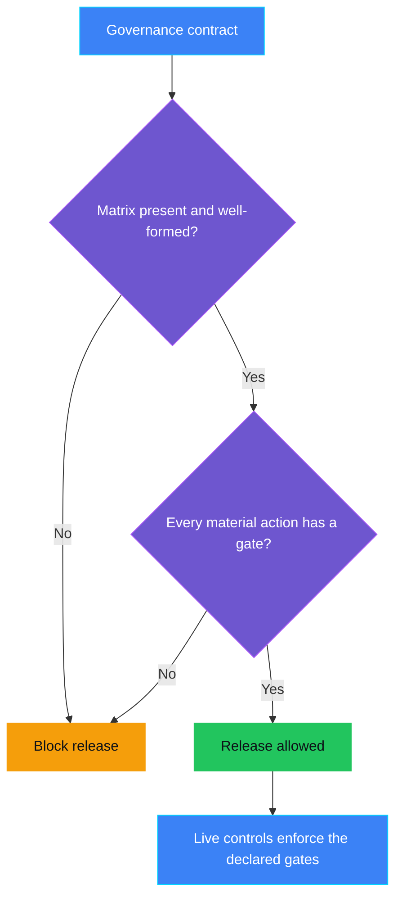
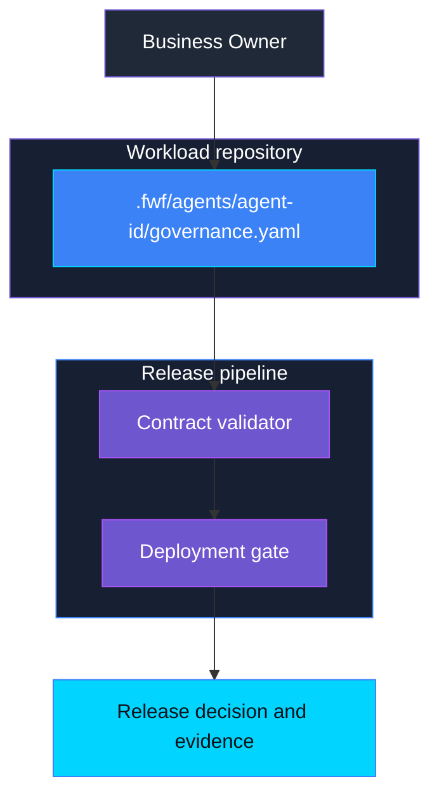

<p align="center">
    
</p>

# AUT-PRE-002 - HITL gates missing

> **Status:** Planned - no runnable demo yet; the control design below defines the protected-action matrix that AUT-002 enforces at runtime.
>
> **Last reviewed:** 2026-09-28 - scope defined from the AUT-002 implementation; assessment pending.

## Table of contents

* [Overview](#overview)
* [Demo profile](#demo-profile)
* [Control contract](#control-contract)
* [Control objective](#control-objective)
* [Protected-action matrix](#protected-action-matrix)
* [Logical design](#logical-design)
* [Demo infrastructure setup (simplified)](#demo-infrastructure-setup-simplified)
* [Implementation](#implementation)
* [Demo](#demo)
* [Evidence and observability](#evidence-and-observability)
* [Security and privacy](#security-and-privacy)
* [Validation](#validation)
* [Further exploration](#further-exploration)
* [Cleanup](#cleanup)
* [References](#references)

## Overview

**Real-life scenario:** A team is about to release an agent that can delete
records, approve requests, or send payments. Nobody has written down which of
those actions need a human decision first. The agent goes live, and the first
time it reaches a high-impact action, there is no agreed rule about who must
approve it.

AUT-PRE-002 fixes that gap before release. It requires a declared
protected-action matrix: the list of material actions an agent can perform,
whether each one is reversible, and which human gate applies. This matrix is
the Pre-Live source of truth that runtime controls enforce. AUT-002 enforces
one entry from that matrix at the ACS tool boundary.

## Demo profile

| Property | Planned direction |
|---|---|
| **Demo format** | Guided exercise or hybrid demo; confirm during assessment |
| **Learning level** | Foundation |
| **Estimated time** | Establish after implementation |
| **Primary decision** | May this agent be released while a material action has no declared human gate? |
| **Primary capabilities** | Forged with Foundry governance contract, shared contract validator, deployment gate |
| **Deployment / infrastructure** | Not required for the core learning outcome |
| **AGT / ACS** | Not the enforcement point for this Pre-Live decision; ACS enforces the declared gates in Live controls such as AUT-002 |
| **Model/Foundry role** | Not used - not applicable to the core path |

## Control contract

| Field | Value |
|---|---|
| **ID** | AUT-PRE-002 |
| **Lifecycle phase** | Pre-Live |
| **Category / domain** | Human Oversight |
| **Control / signal** | HITL gates missing |
| **Evidence / source** | Protected-action matrix in the agent governance contract |
| **Trigger / threshold** | A material action has no declared human gate, approver role, or approval expiry |
| **Action / gate effect** | Block release |
| **Accountable role** | Business Owner |

## Control objective

Make the human-oversight boundary explicit before an agent goes live. The
matrix must declare every material action, classify its reversibility and
impact, and assign a human gate where the impact requires one. A missing,
empty, or incomplete matrix blocks release. A complete matrix becomes the
reference that AUT-002, AUT-001, and AUT-004 consume in the Live phase.

## Protected-action matrix

One entry per tool the agent can call that changes state outside the
conversation. Read-only tools are listed with `required_gate: none` so
coverage is explicit rather than assumed.

| Field | Meaning | Allowed values |
|---|---|---|
| `tool_name` | Exact tool name as exposed to the agent | String |
| `action_class` | What the action does | `read`, `create`, `update`, `delete`, `publish`, `approve`, `pay`, `grant_access`, `submit` |
| `reversibility` | Whether the effect can be undone | `reversible`, `partially_reversible`, `irreversible` |
| `impact` | Harm category if the action is wrong | One or more of `financial`, `legal`, `privacy`, `operational`, `customer` |
| `required_gate` | Human decision required before execution | `none`, `human_approval`, `dual_approval` |
| `approver_role` | Role that may approve | String, required when `required_gate` is not `none` |
| `approval_ttl` | How long an approval stays valid | ISO 8601 duration, required when `required_gate` is not `none` |
| `evidence_required` | Evidence the runtime control must record | List of field names |

Example for the AUT-002 demo tool:

```yaml
protectedActions:
  - tool_name: permanently_delete_demo_record
    action_class: delete
    reversibility: irreversible
    impact: [customer, operational]
    required_gate: human_approval
    approver_role: Ops Manager
    approval_ttl: PT5M
    evidence_required: [action_identity, decision, executed, verified]
```

Rules the Pre-Live check must apply:

- Every `irreversible` action requires a gate other than `none`.
- Every action with `financial` or `legal` impact requires a gate other than `none`.
- `approver_role` and `approval_ttl` are mandatory whenever a gate is declared.
- A missing matrix, an empty matrix, or an entry with an unknown value blocks release.

## Logical design

Proposed decision flow; this is not evidence of an implemented gate.



## Demo infrastructure setup (simplified)

Conceptual responsibilities only. No cloud resources are expected for the core
learning outcome.



## Implementation

Not started. Complete an `ASSESSMENT.md` using the
[assessment template](../../../docs/control-assessment-template.md) before
adding artifacts. The intended path reuses the existing governance-contract
validator and deployment gate rather than adding a new checker:

- Add an `AUT-PRE-002` schema under `schemas/governance-contract/v1alpha1/controls/`
  that validates the matrix shape and the rules above.
- Add a Conftest rule only if a deployment profile should require this control.
- Do not put the matrix in ACS manifests or application code; the contract is
  the source of truth and runtime controls read from it.

## Demo

No setup or run commands are available yet. Intended acceptance scenarios:

| Scenario | Expected behavior to validate |
|---|---|
| Complete matrix | Release allowed; evidence lists every declared action and gate. |
| Missing matrix | Release blocked; reason names the missing evidence. |
| Empty matrix | Release blocked; an agent with tools cannot declare zero actions. |
| Irreversible action with `required_gate: none` | Release blocked; reason names the tool. |
| Gate declared without `approver_role` or `approval_ttl` | Release blocked as structurally incomplete. |
| Unknown `action_class` or `impact` value | Release blocked; fail closed on unrecognized values. |

## Evidence and observability

Plan to record the contract version, the count of declared actions, the count
of gated actions, each blocking reason, and the release decision. Evidence
proves structural completeness of the declaration only. It does not prove the
runtime enforces the gates; that proof belongs to AUT-002 and AUT-001.

## Security and privacy

The matrix contains tool names, roles, and classifications. It must not
contain credentials, record identifiers, or personal data. A declared gate is a
requirement, not a guarantee; an agent that reaches a tool outside the ACS
boundary is a gap for AUT-001 to detect, not something this control can see.

## Validation

No validation has been performed. The future implementation must test missing,
empty, invalid, and valid matrices through the shared validator, and must show
that the AUT-002 demo tool entry above validates as complete.

## Further exploration

- Generate the ACS `tools:` map for a control from the matrix so declaration
  and enforcement cannot drift.
- Extend `required_gate` with `dual_approval` semantics once a Live control
  needs two distinct approvers.
- Feed the matrix into AUT-004 as the scope definition for an emergency stop.

## Cleanup

Not applicable: this planned control creates no deployed resources or runtime
state.

## References

- [AUT-002 - Irreversible action attempted](../AUT-002_irreversible_action_attempted/README.md)
- [FwF governance contract](../../../docs/governance-contract.md)
- Source catalog: [Governance Signals Repo.pdf](../../../docs/Governance%20Signals%20Repo.pdf)

---

<p align="center">
    
</p>
