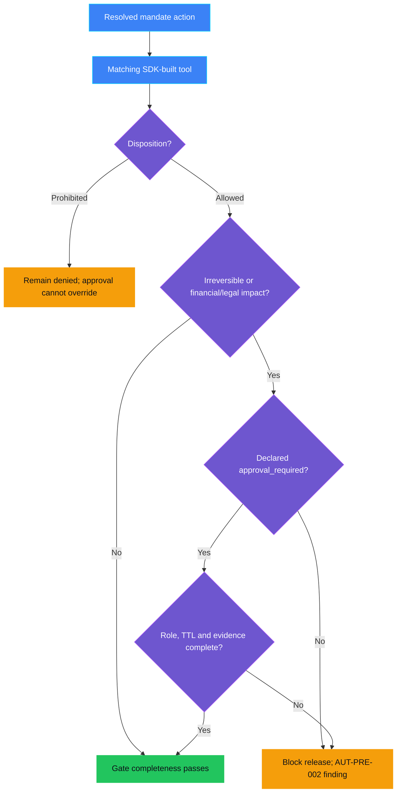

<p align="center">
    
</p>

# AUT-PRE-002 - HITL gates missing

> **Status:** Implementation in progress - local human-gate checks, real
> scoped Azure Policy denials, protected OIDC release and active Azure
> deployment pass. Cloud read and prohibited-action denial pass; runtime
> delete approval and cleanup verification remain pending; not Validated.
>
> **Last reviewed:** 2026-10-07 against the shared mandate schema, hosted release and live runtime outcomes.

## Table of contents

* [Overview](#overview)
* [Demo profile](#demo-profile)
* [Control contract](#control-contract)
* [Control objective](#control-objective)
* [Protected-action matrix](#protected-action-matrix)
* [Determining reversibility](#determining-reversibility)
* [Pre-Live to Live handoff](#pre-live-to-live-handoff)
* [Logical design](#logical-design)
* [Demo infrastructure setup (simplified)](#demo-infrastructure-setup-simplified)
* [Implementation](#implementation)
* [Demo](#demo)
* [Evidence and observability](#evidence-and-observability)
* [Security and privacy](#security-and-privacy)
* [Validation](#validation)
* [Further exploration](#further-exploration)
* [Cleanup](#cleanup)
* [References](#references)

## Overview

**Real-life scenario:** A team is about to release an agent that can delete
records, approve requests, or send payments. Nobody has written down which of
those actions need a human decision first. The agent goes live, and the first
time it reaches a high-impact action, there is no agreed rule about who must
approve it.

AUT-PRE-002 checks that each protected action in the shared, versioned mandate
has a complete human gate before release. The gate is evaluated against the
actual SDK-built tool definition; AUT-002 consumes that same mandate at the
ACS tool boundary. AUT-PRE-001 separately checks that the mandate defines the
agent's authority and scope. These are different findings over one source,
not two copies of an action matrix.

[TOOL-PRE-001](../../tool_governance/TOOL-PRE-001_tool_inventory_incomplete/README.md)
and
[TOOL-PRE-002](../../tool_governance/TOOL-PRE-002_tool_risk_tier_not_approved/README.md)
remain planned supporting controls, not prerequisites or additional decision
engines in this demo. Tool-risk review concerns whether a tool may be exposed;
it is not approval to execute a particular call.

## Demo profile

| Property | Value |
|---|---|
| **Demo format** | Hybrid demo: credential-free paired candidate gate, protected Azure release and ACS runtime handoff |
| **Learning level** | Intermediate |
| **Estimated time** | 60-90 minutes after Azure/GitHub prerequisites are ready; tenant setup and build time vary |
| **Primary decision** | Does every permitted protected action have the required human gate before release? |
| **Primary capabilities** | FwF governance contract, shared JSON Schema/Rego gate, Foundry SDK candidate definition, protected GitHub Actions release, ACS |
| **Deployment requirement** | Required to demonstrate the checked gate reaching the active ACS runtime |
| **Infrastructure** | Reuses AUT-002 Foundry project, model, agent, App Service and managed identity; protected GitHub environment and release identity |
| **AGT / ACS usage** | ACS enforces the checked runtime disposition; it does not make the Pre-Live release decision |
| **Model/Foundry role** | Not used to decide gate completeness; Foundry supplies the actual candidate and governed runtime workload |

## Control contract

| Field | Value |
|---|---|
| **ID** | AUT-PRE-002 |
| **Lifecycle phase** | Pre-Live |
| **Category / domain** | Human Oversight |
| **Control / signal** | HITL gates missing |
| **Evidence / source** | Versioned autonomy-mandate attachment referenced by the agent governance contract |
| **Trigger / threshold** | A material action has no declared human gate, approver role, or approval expiry |
| **Action / gate effect** | Block release |
| **Accountable role** | Business Owner |

## Control objective

Require approval metadata for any allowed irreversible action, and for
allowed actions with financial or legal impact. An action marked
`approval_required` must declare the supported `OpsManager` role, bounded
expiry and minimum evidence. The gate rejects incomplete declarations before
release; ACS enforces the same mandate at runtime. The live release, allowed
read, prohibited publication and blocked delete are verified. Approved cloud
delete execution and owned-resource cleanup remain pending.

## Protected-action matrix

Declare every function in the actual SDK-built candidate, including read-only
functions. This demo deliberately limits scope to the synthetic `record_id`
argument and `synthetic-record-NNN` targets; it does not claim to model
arbitrary nested arguments or multiple effects hidden behind one tool.
Read-only does not automatically mean low risk, and a compensating operation
does not necessarily undo an external effect.

| Field | Meaning | Allowed values |
|---|---|---|
| `toolName` | Exact tool name as exposed by the SDK-built agent | Tool identifier |
| `disposition` | Whether the action is allowed, prohibited, or conditional | `allowed`, `prohibited`, `approval_required` |
| `targets` | Synthetic targets in scope for this action | One or more `synthetic-record-NNN` identifiers |
| `reversibility` | Whether the effect can be undone | `reversible`, `partially_reversible`, `irreversible` |
| `impact` | Harm category if the action is wrong | One or more of `financial`, `legal`, `privacy`, `operational`, `customer` |
| `riskReviewRef` | Reference to the synthetic risk review | Non-empty reference |
| `approval` | Conditional human gate | `kind: human_approval`, `approverRole: OpsManager`, `ttlSeconds: 1..300`, and bounded `evidenceRequired` |

The current mandate uses `toolName`, `disposition`, synthetic `targets`,
reversibility and impact classifications, and a bounded `approval` object
where required. This excerpt shows the delete action:

```json
{
  "toolName": "permanently_delete_demo_record",
  "disposition": "approval_required",
  "targets": ["synthetic-record-001"],
  "reversibility": "irreversible",
  "impact": ["customer", "operational"],
  "riskReviewRef": "SYNTHETIC-RISK-DELETE-001",
  "approval": {
    "kind": "human_approval",
    "approverRole": "OpsManager",
    "ttlSeconds": 300,
    "evidenceRequired": ["action_identity", "decision", "executed", "verified"]
  }
}
```

The implemented gate applies these rules:

- An `allowed` action that is `irreversible`, or has `financial` or `legal` impact, must use `approval_required`.
- An `approval_required` action must specify `kind: human_approval`, `approverRole: OpsManager`, a `ttlSeconds` value from 1 through 300, and all four evidence fields shown above.
- A `prohibited` action cannot also declare approval; a human cannot approve an action the mandate forbids.
- Missing, empty, malformed, unknown or out-of-scope mandate/tool data blocks release. AUT-PRE-001 and AUT-PRE-002 emit distinct findings for their respective decisions.

## Determining reversibility

The Agent Owner describes actual tool effects and recovery behavior. The
technical owner verifies restoration against the affected system. The
Business Owner remains accountable for the gate declaration, using the
Security Officer's tool-risk review and the AI Governance autonomy boundary.
The agent's prompt, confidence or explanation is not classification evidence.

| Classification | Review question | Example |
|---|---|---|
| `reversible` | Can the original state and all material effects reliably be restored within the required recovery window? | A versioned draft change with tested restoration and no external publication. |
| `partially_reversible` | Can some state be restored, while costs, disclosure, notifications or other effects remain? | A refundable payment that still incurred fees or notified another party. |
| `irreversible` | Is a material effect impossible to undo, or is reliable restoration not established? | Permanent deletion without recovery, or disclosure that cannot be recalled from recipients. |

Record the scope of the effect, dependencies, recovery method and window,
residual effects, supporting test/reference, reviewer and review date in the
tool-risk assessment linked to the declaration. These are proposed review
requirements, not additional implemented schema fields. A compensating
transaction is not automatically restoration of the original state.

If recovery is unknown or untested, do not certify the action as reversible:
stop release review until the classification and gate are resolved. Even a
reversible action can require human approval because of financial, legal,
privacy, operational or customer impact. The declaration must also distinguish
prohibited actions from actions permitted only with approval; approving a
prohibited action must not make it allowed.

## Pre-Live to Live handoff

The implemented handoff uses one mandate attachment and one actual candidate:

1. The governance contract references the mandate path and SHA-256 for each
   control independently. AI Governance owns the AUT-PRE-001 declaration;
   the Business Owner owns the AUT-PRE-002 gate requirement.
2. The shared validator checks each evidence entry and resolves the attachment.
   The existing Rego gate compares its actions and scopes with the SDK-built
   Foundry tools, emitting separate control findings.
3. AUT-002's release wrapper re-runs the gate, checks contract/mandate/
   definition hashes against gate evidence, and packages the checked mandate
   and definition. The protected GitHub release uses Entra OIDC and waits for
   a human release reviewer.
4. The active app requires the packaged mandate hash and checks the pinned
   Foundry definition. ACS applies the mandate disposition to each observed
   tool call; the runtime `OpsManager` decision applies only to one exact
   pending action, not to the release or future calls.
5. Minimized runtime evidence carries the mandate hash and per-call decision,
   action identity, correlation and verification fields for review against the
   declaration.

The shared [lifecycle walkthrough](../AUT-PRE-001_autonomy_boundary_undefined/docs/DEMO-WALKTHROUGH.md)
shows this flow and observed proof. Hashes bind bytes; they do not authenticate
business review or establish that the candidate lists every action a real
workload could perform.

## Logical design

AUT-PRE-002 checks gate completeness as a distinct release finding:



The shared lifecycle diagram shows how this check composes with AUT-PRE-001,
protected release and AUT-002 runtime enforcement.
In the diagram, blue denotes inputs, purple deterministic checks, green a
complete gate declaration and amber a release block; a prohibited action
remains denied regardless of approval metadata.

## Demo infrastructure setup (simplified)

The local candidate gate runs without Azure credentials. The combined cloud
route uses a protected GitHub Actions environment and Entra OIDC to release
the checked mandate and Foundry definition to the existing AUT-002 Azure
resources. ACS runs inside the existing App Service; no new workload, approval
service or data store is created for AUT-PRE-002. See the
[shared lifecycle diagram](../AUT-PRE-001_autonomy_boundary_undefined/docs/DEMO-WALKTHROUGH.md#lifecycle-at-a-glance)
for deployment boundaries and handoffs.

## Implementation

The [assessment](ASSESSMENT.md) is complete. The paired implementation reuses
the shared governance-contract validator and Rego deployment gate. Its schemas
reference the same reviewed attachment, and AUT-002 packages that attachment
for the existing ACS dispatcher. No second checker or approval service exists.
The hosted candidate gate, protected OIDC release, active Azure deployment,
cloud read and prohibited-action denial have passed. Runtime delete approval
and owned-resource cleanup remain open.

## Demo

Follow the [captured release and runtime walkthrough](../AUT-PRE-001_autonomy_boundary_undefined/docs/DEMO-WALKTHROUGH.md)
for real approval boundaries, cloud screenshots and the remaining acceptance
checks. Release approval does not authorize an individual runtime delete.

Use the [paired candidate procedure](../AUT-PRE-001_autonomy_boundary_undefined/README.md#demo)
for the same source and separate control findings. No second approval protocol
or copied declaration is introduced.

The scoped Azure Policy experiment is a separate ARM-admission demonstration.
After its setup prerequisites are complete, run these commands from the
repository root:

```bash
.venv/bin/python controls/autonomy_and_human_oversight/AUT-PRE-002_hitl_gates_missing/infra/azure_policy.py setup
.venv/bin/python controls/autonomy_and_human_oversight/AUT-PRE-002_hitl_gates_missing/infra/azure_policy.py prove
```

The real 2026-10-07 run produced:

```text
AUT-PRE-001: RequestDisallowedByPolicy verified
AUT-PRE-002: RequestDisallowedByPolicy verified
Matching ARM request allowed; existing webapp preserved.
```

The policies target the existing webapp, not an unrelated dummy resource.
Status tags remain forgeable and cannot prove contract validation or govern
Foundry data-plane publication. Policy-only proof never authorizes normal release.

Observed and tested scenarios:

| Scenario | Expected behavior to validate |
|---|---|
| Canonical three-tool mandate | Passed schema, resolver, candidate coverage and shared paired gate; protected cloud release completed. |
| Delete marked `approval_required` without its approval object | Local real-Conftest test failed with `AUT-PRE-002: human_gate_incomplete`. |
| Required human gate has wrong/missing role, invalid expiry or incomplete evidence fields | Rego/JSON Schema require `OpsManager`, TTL 1-300 seconds and action identity, decision, execution and verification evidence. |
| Prohibited action also declares approval | Local gate test failed with `AUT-PRE-001: contradictory_permission`; approval does not override prohibition. |
| Candidate tool scope differs from the mandate | AUT-PRE-001 coverage/scope rules block the candidate; unavailable or malformed inputs fail closed. |
| Azure Policy status request omits a required tag | Separate live ARM experiment returned `RequestDisallowedByPolicy`; this does not run the mandate gate or authorize release. |

## Evidence and observability

The existing gate artifact records the evaluated contract and mandate bindings,
candidate definition hash, decision, reason-coded findings, timestamp,
correlation and accountable roles. The hosted run then records the protected
environment approval and release result. AUT-002's minimized runtime event
adds the mandate hash, observed disposition, action identity, tool-call
correlation, execution and verification. The
[shared walkthrough](../AUT-PRE-001_autonomy_boundary_undefined/docs/DEMO-WALKTHROUGH.md#handoff-evidence)
shows real excerpts. These records support review of this candidate and these
observed actions; they are not signed business attestations, an immutable audit
service or an automated compliance certification.

## Security and privacy

The mandate contains tool names, supported roles, synthetic targets and
classifications only. It must not contain credentials or personal data.
Release authentication uses Entra OIDC; the workflow supplies target
configuration as protected secrets. A digest binds the declared bytes, not
reviewer identity or business truth. This bounded demo checks the SDK-built
functions and their exact synthetic target schema; it cannot establish that
all actions in an external workload have been inventoried or prevent a
privileged release bypass.

## Validation

The shared validator, real Conftest gate tests and ACS parity tests pass. The
protected OIDC release completed and Azure reported an active deployment.
Cloud read was allowed, prohibited publication was denied before execution,
and delete was escalated before execution. Exact-action cloud approval and
verification, wrong-role/expiry/replay browser checks and ownership-checked
resource cleanup remain unverified. The independent Azure Policy denial was
verified for both reduced status-tag requests. A schema-valid reference alone
does not establish any runtime result.

## Further exploration

- Add additional typed target/action shapes only with matching schema, policy,
  packaging and ACS parity tests.
- Consider multiple approvers only through an explicit governance design; the
  current schema and runtime support one `OpsManager` approval, not dual approval.
- Feed the matrix into AUT-004 as the scope definition for an emergency stop.

## Cleanup

Preview the two recorded Policy assignments/definitions from the repository root:

```bash
.venv/bin/python controls/autonomy_and_human_oversight/AUT-PRE-002_hitl_gates_missing/infra/azure_policy.py cleanup
```

After verifying targets/ownership, repeat with `--confirm`. The reused webapp,
Foundry and runtime identity resources are not deleted. State is under the
control's gitignored `.azure/policy-state.json`. Destructive cleanup acceptance
has not yet been run.

## References

- [AUT-002 - Irreversible action attempted](../AUT-002_irreversible_action_attempted/README.md)
- [AUT-PRE-001 - Autonomy boundary undefined](../AUT-PRE-001_autonomy_boundary_undefined/README.md)
- [TOOL-PRE-001 - Tool inventory incomplete](../../tool_governance/TOOL-PRE-001_tool_inventory_incomplete/README.md)
- [TOOL-PRE-002 - Tool risk tier not approved](../../tool_governance/TOOL-PRE-002_tool_risk_tier_not_approved/README.md)
- [FwF governance contract](../../../docs/governance-contract.md)
- Source catalog: [Governance Signals Repo.pdf](../../../docs/Governance%20Signals%20Repo.pdf)

---

<p align="center">
    
</p>
