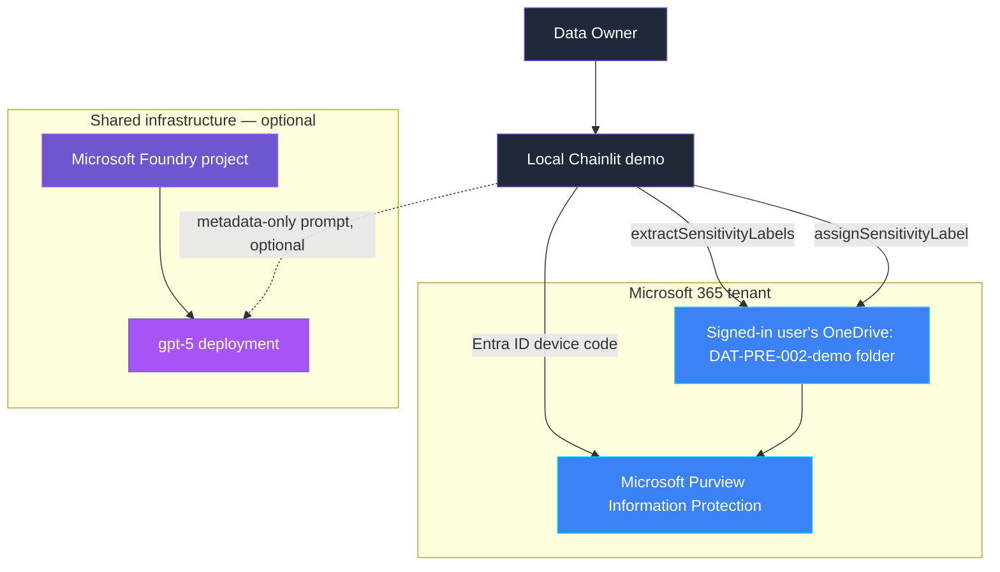

<p align="center">
    
</p>

# DAT-PRE-002 — Data classification missing

> **Status:** In progress — implementation complete locally; held back from the root README pending a dedicated announcement.
>
> **Last reviewed:** 2026-09-04 against the Microsoft references below.

## Overview

**Real-life scenario:** A data engineer drops a spreadsheet of customer
records into a shared OneDrive folder so a colleague can build a report. No
one ever marked the file as confidential, so it carries no sensitivity
label — and nothing downstream (sharing policy, retention, an AI system
reading from that folder) can tell it apart from a public FAQ draft sitting
right next to it. The gap is usually only discovered after the file has
already been shared too widely.

DAT-PRE-002 demonstrates a file with unknown classification, and a safe
response using real Microsoft Purview Information Protection state read
and assigned through Microsoft Graph. A deterministic policy compares each
file's real, platform-reported sensitivity label against the label its
synthetic content category requires, and classifies it as compliant,
flagged, or blocked. A Microsoft Foundry agent optionally explains the
metadata-only result; it never sees file content and cannot classify a
file on its own. The only state-changing action — assigning a label — is a
real, asynchronous, metered Microsoft Graph operation that a Data Owner
must explicitly request, and its outcome is re-verified against the
platform rather than assumed from the initial response.

> **The control decides from real platform state; the agent explains.**

This is the first control in this repository whose primary, authoritative
capability is Microsoft 365/Microsoft Graph — specifically Microsoft
Purview Information Protection — rather than an Azure resource. The
repository's own planned catalog already names "Classification labels,
Purview/DLP" as this control's evidence source; this implementation follows
that intent directly instead of substituting an Azure-only mechanism.

## Demo profile

| Property | Value |
|---|---|
| **Demo format** | Hybrid demo |
| **Learning level** | Intermediate |
| **Estimated time** | 45–60 minutes after prerequisites are ready |
| **Primary decision** | Compliant, flagged (missing or mismatched classification), or blocked (extraction failed) for each file |
| **Primary capabilities** | Microsoft Purview Information Protection sensitivity labels via Microsoft Graph (`extractSensitivityLabels`, `assignSensitivityLabel`), Microsoft Entra ID, Microsoft Foundry Agent Framework (optional), Agent Control Specification |
| **Deployment** | Optional — no Azure resource is owned by this control; the Foundry explanation step optionally reuses the shared root infrastructure |
| **Infrastructure** | Local Chainlit UI, a registered Microsoft Entra public-client app, published tenant sensitivity labels; shared Foundry project/model only if the optional explanation step is used |
| **Model/Foundry role** | Active — governed subject: ACS `pre_tool_call`/`post_tool_call` gates the guarded classify tool; the optional Foundry explanation agent remains Explanatory only |
| **AGT / ACS** | Reused as the real approval/enforcement mechanism (native Python policy dispatcher, no OPA/Rego bundle) |

> Estimated time covers running the guided demo after prerequisites are ready;
> it excludes the one-time Entra app registration and reading this README.

## Demo scope

### Core demo

The runnable path creates three synthetic files in a dedicated OneDrive demo
folder, reads each file's real Purview sensitivity-label state through
Microsoft Graph, optionally lets a Foundry agent explain the metadata-safe
result, and lets a Data Owner classify a flagged file through a guarded,
real, asynchronous `assignSensitivityLabel` call that is re-verified after
the fact.

### Intentional simplifications

- The "required label" policy is inferred from a synthetic filename content
  marker (`confidential` / `public`), not real content inspection or a
  Purview trainable classifier.
- One file uses a demo-only sentinel name that this control's own code
  recognizes to simulate an extraction failure, rather than depending on a
  real, unreliably reproducible Graph error (a locked or double-key
  encrypted file).
- Label GUIDs are pre-configured through `.env` rather than looked up
  through Graph's `/security/informationProtection/sensitivityLabels`
  listing call, which remains in `/beta`.
- Classify approvals are a single, explicit UI action per file; there is no
  authenticated enterprise approval service.
- Evidence is written locally rather than to a durable audit system.
- The demo scans one dedicated OneDrive folder for one signed-in user, not
  a whole SharePoint site.

### What this demo proves

- Classification status is read from real, externally verifiable
  Purview/Graph platform state — the application and the agent never
  assert it themselves.
- A file is never treated as classified until Microsoft Graph confirms it
  after the classify call; the initial `202 Accepted` response is not
  treated as success.
- An extraction failure blocks automatic clearance instead of silently
  defaulting to compliant.
- A classify action is only permitted for a flagged file whose label state
  has not changed since it was evaluated.

### What this demo does not prove

It does not prove regulatory compliance, complete tenant-wide
classification coverage, real content-based auto-classification, or that
every file storage location in an organization is covered.

## Control contract

| Field | Value |
|---|---|
| **ID** | DAT-PRE-002 |
| **Lifecycle phase** | Pre-Live |
| **Category / domain** | Data |
| **Control / signal** | Data classification missing |
| **Evidence / source** | Classification labels, Purview/DLP |
| **Trigger / threshold** | Unknown data sensitivity |
| **Action / gate effect** | Classify before use |
| **Accountable role** | Data Owner |

## Control objective

Detect a file whose real Purview sensitivity-label state does not satisfy
the classification its content requires, and make classification
controlled, reviewable, and independently verifiable rather than assumed.
Extraction failure fails closed rather than clearing a file by default. A
classify action only proceeds against the exact, unchanged label state that
was evaluated, and its result is confirmed against the platform, not the
initial asynchronous response.

## Logical design

```mermaid
flowchart LR
  S[File in OneDrive demo folder] --> P[Deterministic classification policy]
  P -->|Required label present| C[COMPLIANT]
  P -->|Required label missing/mismatched| D[FLAGGED]
  P -->|Extraction unavailable or category unknown| X[BLOCKED]
  D --> A[Foundry agent explains]
  X --> A
  A --> M{Data Owner decision}
  M -->|Classify| G{Classify guard: still flagged and label state unchanged?}
  G -->|Denied| A
  G -->|Allowed| ACS{ACS pre_tool_call: escalate}
  ACS -->|approval_resolver allows exact action_identity| U[Real assignSensitivityLabel call]
  U --> POST{ACS post_tool_call}
  POST --> V[Poll operation, then re-verify via extractSensitivityLabels]
  V --> R[Record evidence]

    classDef governance fill:#6E56CF,stroke:#A855F7,color:#FFFFFF
    classDef platform fill:#3B82F6,stroke:#00D4FF,color:#FFFFFF
    classDef intelligence fill:#A855F7,stroke:#6E56CF,color:#FFFFFF
    classDef success fill:#22C55E,stroke:#22C55E,color:#0D1117
    classDef attention fill:#F59E0B,stroke:#F59E0B,color:#0D1117
    class S,U,V platform
    class P,M,G,ACS,POST governance
    class A intelligence
    class C,R success
    class D,X attention
```



> Diagram color key: purple = governance decision, blue = platform/data operation,
> light purple = agent, green = allowed outcome, amber = blocked outcome. The
> same key applies to the infrastructure diagram below.

## Infrastructure architecture



## Implementation

### Components

| Component | Responsibility | Location |
|---|---|---|
| Chainlit orchestration | Guided seed, scan, explain, and classify flow | [src/dat_pre_002/chat.py](src/dat_pre_002/chat.py) |
| Deterministic policy | Classifies compliant/flagged/blocked and guards classify eligibility | [src/dat_pre_002/policy.py](src/dat_pre_002/policy.py) |
| Microsoft Graph adapter | Creates demo files, extracts and assigns real sensitivity labels, polls, and re-verifies | [src/dat_pre_002/graph_client.py](src/dat_pre_002/graph_client.py) |
| ACS enforcement boundary | Escalates the guarded classify at `pre_tool_call`/`post_tool_call`; the UI click resolves the approval | [src/dat_pre_002/acs_gate.py](src/dat_pre_002/acs_gate.py), [policy/acs_manifest.yaml](policy/acs_manifest.yaml) |
| Foundry agent (optional) | Explains only metadata-safe deterministic decisions | [src/dat_pre_002/agent.py](src/dat_pre_002/agent.py) |
| Evidence | Emits metadata-only classify evidence | [src/dat_pre_002/evidence.py](src/dat_pre_002/evidence.py) |
| Infrastructure | Not applicable — no Azure resource is owned by this control | [infra/README.md](infra/README.md) |

### Agent role and authority

The agent receives `ClassificationDecision.safe_dict()` values only — a
decision id, file name, synthetic content category, and reason. It never
sees file content or label GUIDs. It may explain outcomes and the classify
path. It may not alter a decision or call `assignSensitivityLabel`. The
guarded Microsoft Graph adapter is the only state-changing path. The
agent's only value is explaining that decision in plain language for the
Data Owner; it adds no authority the deterministic policy does not already
have, and the demo runs identically if the optional Foundry explanation is
unavailable.

### Decision rules

| Condition | Decision | Action |
|---|---|---|
| Required label already present | `COMPLIANT` | No action |
| Required label missing or different label present | `FLAGGED` | Classify offered |
| Extraction failed, or content category unknown | `BLOCKED` | Fail closed and investigate |

| Classify eligibility | Result |
|---|---|
| Decision action is not `FLAGGED` | Refused |
| Current label state differs from the evaluated decision | Refused; rescan first |
| `FLAGGED` and label state unchanged | Permitted |

### Best-practice choices

- Uses delegated, least-privilege Microsoft Graph permissions
  (`Files.ReadWrite.All`, `User.Read`) against the signed-in user's own
  OneDrive — no admin-consented application permission or tenant-wide DLP
  policy authoring is required.
- Device-code authentication requires no client secret; the Entra app is a
  public client.
- Every classify action is re-checked against a freshly extracted label
  state immediately before the call, and re-verified against a fresh
  extraction immediately after — the asynchronous `202 Accepted` response
  is never treated as confirmation.
- Evidence excludes file content and label GUIDs; only metadata is logged.
- Fails closed: an extraction failure or unrecognized content category
  blocks automatic clearance rather than defaulting to compliant.

## Demo

### Prerequisites

- Python 3.10–3.13 and this control's dependencies.
- A Microsoft 365 tenant where the signed-in user has at least two
  published sensitivity labels available.
- A registered Microsoft Entra public-client app with delegated
  `Files.ReadWrite.All` and `User.Read` Graph permissions (see
  [infra/README.md](infra/README.md)).
- Metered Microsoft Graph APIs enabled for your tenant (required by
  `assignSensitivityLabel`).
- A DAT-PRE-002 `.env` copied from [.env.example](.env.example).
- Synthetic data only.
- Optional: shared Foundry infrastructure deployed, for the explanation
  step.

### Deploy

Not applicable for this control's own resources. Optionally, from the
repository root:

```bash
./infra/deploy.sh
```

Then, regardless of whether you deploy shared infrastructure:

```bash
cp controls/data_and_knowledge/DAT-PRE-002_data_classification_missing/.env.example \
   controls/data_and_knowledge/DAT-PRE-002_data_classification_missing/.env
```

Fill in the Entra app client ID, tenant ID, and the two sensitivity label
GUIDs as described in [infra/README.md](infra/README.md).

### Inspect in Microsoft 365

Not applicable in the Azure Portal sense — there is no Azure resource group
to inspect. Instead, inspect the tenant-level Microsoft 365 configuration:

| What to inspect | Where | What to verify and why it matters |
|---|---|---|
| Entra app registration | Microsoft Entra admin center → **App registrations** → your app → **Authentication** | **Allow public client flows** is enabled and no client secret exists — the device-code flow needs neither. |
| Delegated permissions | Same app → **API permissions** | Only `Files.ReadWrite.All` and `User.Read` (Microsoft Graph, delegated) are granted — least privilege, no application permission. |
| Sensitivity labels | Microsoft Purview portal → **Information Protection** → **Sensitivity labels** | The two label GUIDs in `.env` correspond to real, published labels your account can apply. |
| Demo folder and files | OneDrive → `DAT-PRE-002-demo` folder | Only synthetic files created by this demo exist here; nothing else was touched. |

### Run

```bash
cd controls/data_and_knowledge/DAT-PRE-002_data_classification_missing
../../../.venv/bin/python -m pip install -c ../../../constraints.txt -r requirements.txt
../../../.venv/bin/chainlit run app.py -w
```

Use the buttons in order: seed synthetic files (approve the device-code
sign-in prompt in your browser the first time), scan classification state,
review the optional agent explanation, and classify any flagged file.

### Expected scenarios

| Synthetic scenario | Expected decision | Expected response |
|---|---|---|
| `datpre002-demo-public-faq-draft.txt` (pre-classified during seeding) | `COMPLIANT` | No action |
| `datpre002-demo-confidential-customer-record.txt` (no label) | `FLAGGED` | Classify offered; re-verified after the call |
| `datpre002-demo-blocked-simulated-extraction-failure.txt` (sentinel) | `BLOCKED` | Fail closed; no classify offered |

## Evidence and observability

Evidence contains the control and decision IDs, file name, synthetic
content category, the action taken, the required label id, the Graph
operation location when applicable, timestamp, and accountable role. It
excludes file content and never logs a raw sensitivity label GUID's
association with real content beyond the label id itself.

### Example evidence record

Illustrative only — actual IDs vary per run:

```json
{
  "evidence_id": "2a7c9e4b-5f1d-4a8e-9c3f-6b2a8d5e1f70",
  "timestamp": "2026-09-04T14:11:02+00:00",
  "control_id": "DAT-PRE-002",
  "decision_id": "8b6e...",
  "file_name": "datpre002-demo-confidential-customer-record.txt",
  "content_category": "confidential",
  "action": "flagged",
  "action_taken": "classified",
  "required_label_id": "11111111-1111-1111-1111-111111111111",
  "operation_id": "https://contoso.sharepoint.com/_api/v2.0/monitor/...",
  "accountable_role": "Data Owner"
}
```

## Security and privacy

- Delegated Microsoft Graph permissions (`Files.ReadWrite.All`,
  `User.Read`) are scoped to the signed-in demo user's own OneDrive — no
  admin-consented application permission or tenant-wide DLP authoring is
  required.
- Device-code authentication requires no client secret and no stored
  credential; the token exists only in process memory for the session.
- Classify approval is bound to a freshly re-extracted label snapshot
  taken immediately before the `assignSensitivityLabel` call — a file
  whose label state changed since the decision was evaluated is refused,
  not classified.
- The classify outcome is never reported as resolved from the `202
  Accepted` response alone; a fresh `extractSensitivityLabels` call after
  polling is the authoritative confirmation.
- Cleanup deletes only the `DAT-PRE-002-demo` OneDrive folder and its
  synthetic files; no other file, folder, or tenant configuration is
  touched.
- File content is synthetic placeholder text only; no real personal or
  business data is ever created or read.

## Validation

```bash
../../../.venv/bin/python -m compileall -q src app.py tests
../../../.venv/bin/python -m pytest -q tests
```

Tests cover content-category inference from filename markers, the
required-label mapping, classification outcomes (compliant, flagged,
mismatched, extraction failure, unknown category), classify eligibility
(allowed, denied when not flagged, denied on a label-state mismatch), the
ACS escalate/approve/fail-closed gate around the guarded classify action,
and that metadata-safe payloads exclude label GUIDs and content-category
internals beyond what is safe to show. Microsoft Graph calls themselves are
exercised through the guided demo, not mocked in the automated test suite.

### Known limitations

- The demo scans one dedicated OneDrive folder for one signed-in user, not
  a whole SharePoint site.
- The simulated extraction-failure scenario is a demo-only sentinel, not a
  genuine locked or double-key-encrypted file.
- `assignSensitivityLabel` is a metered API; if metered APIs are not
  enabled for your tenant, the classify action fails closed with a clear
  error rather than silently succeeding.
- Polling the Graph long-running-operation `Location` header is
  best-effort and bounded; the demo always falls back to a fresh
  `extractSensitivityLabels` re-verification regardless of poll outcome.
- Evidence is logged locally rather than sent to an immutable audit store.
- The ACS policy dispatcher is a native Python implementation, suitable
  for a single-process demo; an OPA/Rego bundle is the production extension.

## Further exploration

| Concern | Core demo | Possible extension | Authoritative guidance |
|---|---|---|---|
| Classification method | Synthetic filename content-category marker | Use a real Purview trainable classifier or content-based auto-labeling policy | [Automatically apply a sensitivity label](https://learn.microsoft.com/purview/apply-sensitivity-label-automatically) |
| Policy dispatcher | Native Python `PolicyDispatcher` (`acs_gate.py`) | Move to an OPA/Rego bundle for teams standardizing decision logic across agent paths | [Agent Control Specification](https://github.com/microsoft/agent-governance-toolkit/tree/main/policy-engine) |
| Evidence | Local metadata log | Store classify events in a durable governed audit sink | [ACS evidence and telemetry](https://github.com/microsoft/agent-governance-toolkit/blob/main/policy-engine/spec/SPECIFICATION.md) |
| Scope | One OneDrive folder, on-demand scan | Scan a whole SharePoint site on a schedule and alert on `FLAGGED`/`BLOCKED` results | [Enable sensitivity labels for Office files in SharePoint and OneDrive](https://learn.microsoft.com/en-us/microsoft-365/compliance/sensitivity-labels-sharepoint-onedrive-files?view=o365-worldwide) |
| Related oversharing signal | Not covered by this control | Microsoft Priva Privacy Risk Management data-overexposure policies flag personal data shared too broadly — a distinct signal from missing classification, with no public Graph API for policy authoring today | [Learn about privacy risk management](https://learn.microsoft.com/privacy/priva/risk-management) |

These extensions are not implemented in the core demo.

### Community ideas

- Replace the native Python ACS policy dispatcher with an OPA/Rego bundle.
- Replace the filename content-category marker with a real Purview
  trainable-classifier evaluation call.
- Add a scheduled scan across a whole SharePoint site instead of one
  OneDrive folder.
- Persist evidence to a durable, governed sink and correlate scan and
  classify events.

## Cleanup

Use the **Cleanup demo folder** action in the running demo. It deletes only
the `DAT-PRE-002-demo` OneDrive folder and the synthetic files inside it —
no other file, folder, Azure resource, or shared infrastructure is
affected, because none is owned by this control. If you also deployed the
optional shared Foundry infrastructure, its own cleanup is documented in
[the root infra README](../../../infra/README.md).

## References

- [driveItem: extractSensitivityLabels](https://learn.microsoft.com/graph/api/driveitem-extractsensitivitylabels?view=graph-rest-1.0)
- [driveItem: assignSensitivityLabel](https://learn.microsoft.com/graph/api/driveitem-assignsensitivitylabel?view=graph-rest-1.0)
- [Working with long-running actions](https://learn.microsoft.com/graph/long-running-actions-overview)
- [Enable metered APIs and services in Microsoft Graph](https://learn.microsoft.com/en-us/graph/metered-api-setup?tabs=azurecloudshell)
- [Enable sensitivity labels for Office files in SharePoint and OneDrive](https://learn.microsoft.com/en-us/microsoft-365/compliance/sensitivity-labels-sharepoint-onedrive-files?view=o365-worldwide)
- [Create and configure sensitivity labels and their policies](https://learn.microsoft.com/purview/create-sensitivity-labels)
- [Agent Control Specification](https://github.com/microsoft/agent-governance-toolkit/tree/main/policy-engine)
- Source catalog: [Governance Signals Repo.pdf](../../../docs/Governance%20Signals%20Repo.pdf)

---

<p align="center">
    
</p>

