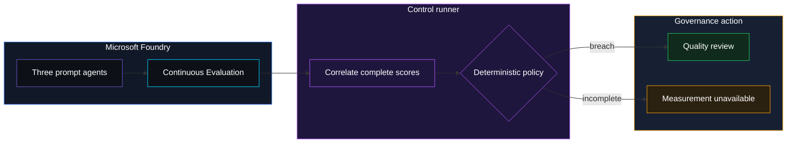

<p align="center">
  
</p>

# QLT-001 — Hallucination rate high

> **Status:** Implemented, not Validated. The deterministic policy, fleet
> orchestration, fail-closed handling, infrastructure, and notification routing
> are implemented. A real Microsoft Foundry deployment has returned Continuous
> Evaluation results and accepted a Teams notification, but the current
> fleet design has not yet produced and captured a real
> `quality_review_required` decision. See [Validation](#validation).
>
> **Last reviewed:** 2026-09-25 against `main`, the current implementation,
> repository CI, and the evidence retained in this folder.

## Table of contents

- [Overview](#overview)
- [Demo profile](#demo-profile)
- [Demo scope](#demo-scope)
- [Control contract](#control-contract)
- [Control objective](#control-objective)
- [Logical design](#logical-design)
- [Demo infrastructure setup (simplified)](#demo-infrastructure-setup-simplified)
- [Implementation](#implementation)
- [Demo](#demo)
- [Evidence and observability](#evidence-and-observability)
- [Security and privacy](#security-and-privacy)
- [Validation](#validation)
- [Cleanup](#cleanup)
- [References](#references)

## Overview

An agent can sound polished while its answer is unsupported by the knowledge
it was given. Users may act on that answer before anyone notices that the
agent's source material has gone stale.

QLT-001 samples live responses from a small fleet with Microsoft Foundry
Continuous Evaluation. A deterministic policy opens a quality review when one
agent's **groundedness evaluator failure rate** exceeds the configured
threshold, when an evaluator score is severely below its own pass threshold,
or when the measurement is incomplete.

> **Important terminology:** this demo measures support by supplied context.
> It does not establish factual truth. “Hallucination rate” is the catalog
> label; the implemented signal is an **ungrounded-response rate**, used as a
> proxy for hallucination risk.

## Demo profile

| Property | Value |
|---|---|
| **Format** | Hybrid demo |
| **Level** | Advanced |
| **Time** | 60–90 minutes for setup and traffic, plus up to roughly 24 hours for asynchronous scores |
| **Decision** | Does any fleet agent require a quality review for this completed measurement window? |
| **Platform** | Microsoft Foundry prompt agents, Continuous Evaluation, Application Insights, Log Analytics, Teams Workflows |
| **Deployment** | Required for the core learning outcome |
| **Model/Foundry role** | Monitored workload; the policy evaluates asynchronous measurements, not an inline turn |

## Demo scope

### Core demo

The demo sends three synthetic IT-helpdesk requests to each of three prompt
agents in each window.

| Agent | Windows 1–2 | Windows 3–4 |
|---|---|---|
| Platform Team | Current KB; strict instructions | Current KB; strict instructions |
| Regional Team | Current KB; strict instructions | Degraded KB; refuses to invent |
| Contractor Team | Current KB; permissive instructions | Missing KB; answers confidently from general conventions |

This progression provides a genuinely healthy fleet in windows 1–2 and a
policy-triggering candidate in windows 3–4. The model output and Foundry
evaluator result remain non-deterministic; the code does not script a score.

### Intentional simplifications

- three synthetic topics and three responses per agent keep the run inspectable;
- a 5% illustrative threshold makes any single failed item visible in this small sample;
- one shared Eval and one rule per agent demonstrate fleet governance without
  claiming production-scale statistical calibration;
- Teams delivery is optional; the deterministic decision exists independently
  of notification transport.

### What this demo proves

- a real `kind: prompt` fleet can be registered and sampled by Continuous
  Evaluation;
- evaluator results can be correlated back to recorded response IDs;
- the policy rejects partial, duplicate, malformed, or missing evidence;
- one agent cannot hide behind a healthy fleet average;
- quality findings and measurement failures route to different roles.

### What this demo does not prove

- that groundedness equals factual correctness;
- that the evaluator has no false positives or false negatives;
- that 5% is a suitable production threshold;
- that a self-reported confidence score is reliable;
- that the current fleet scenario has already produced a real breach;
- that this control eliminates hallucinations or satisfies a regulation.

## Control contract

| Field | Value |
|---|---|
| **ID** | QLT-001 |
| **Lifecycle** | Live |
| **Authoritative signal** | Foundry Continuous Evaluation `builtin.groundedness` result for each recorded final response |
| **Deterministic trigger** | Any agent's evaluator-failure rate > 5%, or any score ≤ 50% of that result's own pass threshold |
| **Measurement failure** | Missing, partial, duplicate, ambiguous, or malformed results → `cannot_evaluate` |
| **Governance action** | Quality review |
| **Accountable role** | Product Owner for quality review; AI Governance Operations for measurement failure |

The 5% threshold is an illustrative catalog value. With only three responses
per agent per demo window, one failed item produces 33.3%; the demo therefore
shows the control mechanics, not a statistically calibrated production SLO.

## Control objective

Detect when one fleet member's answers are no longer sufficiently supported by
the context supplied to it, reject incomplete measurement as unevaluable, and
route an evidence-backed review without allowing a healthy fleet average or the
agent's own confidence claim to suppress the finding.

## Logical design



## Demo infrastructure setup (simplified)

<p align="center">
  
</p>

Bicep creates a control-owned Log Analytics workspace, Application Insights
resource, Foundry connection, and the required role assignments. `demo.py`
registers the agents and evaluation rules, sends traffic, reads completed
scores, writes minimized local evidence, and routes a Teams card.

## Implementation

| Component | Responsibility |
|---|---|
| [agent.py](agent.py) | Prompt-agent declaration, tool contract, structured response |
| [workload.py](workload.py) | Synthetic fleet profiles and controlled KB degradation |
| [demo.py](demo.py) | Setup, invocation, score correlation, evidence, notification |
| [evaluator.py](evaluator.py) | Per-agent rate, fleet rollup, deterministic decision |
| [infra/main.bicep](infra/main.bicep) | Monitor resources, Foundry connection, RBAC |
| [infra/cleanup.py](infra/cleanup.py) | Ownership-checked deletion of agents, rules, Eval, and Monitor resources |

The response's `self_reported_confidence` and suggested follow-ups are a
non-authoritative UX experiment. They are displayed to the user, are not
persisted as governance evidence, and never influence the policy.

## Demo

### 1. Install dependencies

From the repository root:

```bash
python -m venv .venv
.venv/bin/python -m pip install -c constraints.txt \
  -r controls/grounding_and_quality/QLT-001_hallucination_rate_high/requirements.txt
```

Continue only when `.venv/bin/python -m pip check` succeeds.

### 2. Deploy the control-owned Monitor resources

```bash
cd controls/grounding_and_quality/QLT-001_hallucination_rate_high
az login
azd auth login
azd up
```

Continue only when `azd up` completes and prints the Application Insights
and Log Analytics outputs.

### 3. Register the fleet and evaluation rules

```bash
../../../.venv/bin/python demo.py setup
```

Verify that the output contains one Eval ID and all three agent IDs.

### 4. Generate one measurement window

```bash
WINDOW_OUTPUT=$(../../../.venv/bin/python demo.py run --window 1)
printf '%s\n' "$WINDOW_OUTPUT"
WINDOW_ID=$(printf '%s\n' "$WINDOW_OUTPUT" |
  sed -n 's/^Window: \([0-9a-f-]*\).*/\1/p')
```

Use windows 1–2 for the healthy fleet and windows 3–4 for the degraded-KB
scenario.

### 5. Evaluate only after scores arrive

```bash
../../../.venv/bin/python demo.py evaluate --window-id "$WINDOW_ID"
```

Continuous Evaluation is asynchronous. Running this too soon returns exit code
2 and `cannot_evaluate`; it must never manufacture a healthy result from a
partial window. Retry later with the same window ID.

### 6. Route the governance action

Configure the two tenant-authenticated Teams Workflows described in
[docs/TEAMS-DELIVERY.md](docs/TEAMS-DELIVERY.md), then run:

```bash
../../../.venv/bin/python demo.py notify --window-id "$WINDOW_ID"
```

A quality breach routes to the Product Owner. Missing measurement routes to AI
Governance Operations. HTTP acceptance is recorded separately from verified
Teams delivery.

### Inspect in Azure

| Inspect | Where | Verify |
|---|---|---|
| Agents | Foundry project → Agents | Three `kind: prompt` agents are enabled |
| Rules | Foundry project → Evaluations | One enabled rule per agent |
| Traces | Application Insights → Logs | Synthetic agent input/output rows arrive |
| Scores | Foundry evaluation runs | Final-response results contain `passed`, `score`, and `threshold` |

## Evidence and observability

| Claim | Repository evidence | Status |
|---|---|---|
| Deterministic policy and fail-closed behavior | Unit tests in [tests](tests) | Reproducible in CI |
| Bicep compiles | Repository `bicep` CI job | Reproducible in CI |
| Prompt-agent traffic reaches Application Insights | Operator observation documented on 2026-09-25 | Live-observed; no current screenshot retained |
| Continuous Evaluation results are readable | Operator observation and current parser shape | Live-observed; current breach not captured |
| Teams endpoint accepted a measurement-failure card | Recorded HTTP 202 in the prior live run | Live-observed; no current card screenshot retained |
| Current fleet emits a quality-review card | No current evidence | Not yet demonstrated |

Only `media/architecture.png` describes the current design. Historical
single-agent/batch screenshots were removed because they did not prove the
current fleet/Continuous Evaluation path.

## Security and privacy

- The workload, KB, identities, and messages are synthetic.
- Application Insights content recording is enabled for the demo, so synthetic
  prompts and responses are stored in Azure Monitor for the configured
  retention period. Do not substitute personal or confidential traffic.
- Local evidence and Teams cards contain IDs, counts, scores, and decisions,
  not full prompts or responses.
- Python clients authenticate with Azure CLI credentials. Teams workflow URLs
  remain in the local, git-ignored azd environment.
- The Foundry Application Insights connection is an Azure resource containing
  connection material; no connection string or credential is committed.
- Incomplete measurement fails closed and is routed separately.

## Validation

Run from the repository root:

```bash
.venv/bin/python -m pytest \
  controls/grounding_and_quality/QLT-001_hallucination_rate_high/tests -q
az bicep build \
  --file controls/grounding_and_quality/QLT-001_hallucination_rate_high/infra/main.bicep \
  --stdout >/dev/null
```

Publication requires the repository-wide `pytest`, `bicep`, and `links`
jobs to be green.

The control remains **Implemented**, not **Validated**, until a fresh run of
the current fleet design captures all of the following:

1. a complete window with exactly one score per recorded final response;
2. a real `quality_review_required` decision;
3. a current fleet-aware Product Owner card and verified delivery receipt;
4. successful ownership-checked cleanup of agents, rules, Eval, Application
   Insights, and Log Analytics.

A previous deliberately fabricated answer received a perfect groundedness
score. That is not evidence that the answer was correct; it is evidence that
the evaluator can miss the risk this control is intended to surface. This
limitation must remain visible even after a successful retest.

## Further exploration

- calibrate thresholds and minimum sample sizes against labeled production-like
  data;
- add separate correctness, citation, retrieval, and task-adherence signals;
- replace the synthetic lookup with an Azure AI Search retrieval path;
- add a bounded scheduler for multi-day trend evidence;
- evaluate claim-level user-facing evidence instead of self-reported confidence.

## Cleanup

Inspect targets first:

```bash
../../../.venv/bin/python infra/cleanup.py \
  --subscription <subscription-id> \
  --resource-group <resource-group> \
  --project-endpoint <foundry-project-endpoint>
```

After verifying the printed targets, repeat with `--confirm`. The script
deletes only the three named prompt agents, their exact rules, the shared
QLT-001 Eval, and the two tagged Monitor resources. It does not delete the
shared Foundry project or resource group.

## References

- [Continuous evaluation for agents](https://learn.microsoft.com/en-us/azure/ai-foundry/how-to/continuous-evaluation-agents?view=foundry&preserve-view=true)
- [Azure Monitor OpenTelemetry configuration](https://learn.microsoft.com/en-us/azure/azure-monitor/app/opentelemetry-configuration)
- [Groundedness detection](https://learn.microsoft.com/en-us/azure/ai-services/content-safety/concepts/groundedness)
- [Teams incoming webhooks with Workflows](https://learn.microsoft.com/en-us/microsoftteams/platform/webhooks-and-connectors/how-to/add-incoming-webhook)
- [Assessment](ASSESSMENT.md)
- [Implementation notes](docs/IMPLEMENTATION.md)
- [Remediation guidance](docs/REMEDIATION-GUIDANCE.md)

---

<p align="center">
  
</p>
