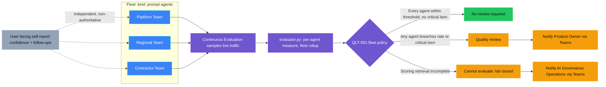

<p align="center">
    
</p>

# QLT-001 — Hallucination rate high

> **Status:** Implemented — a real Foundry project and a three-agent fleet of
> `kind: prompt` agents were registered, wired to Continuous Evaluation, and
> run for real end to end: `demo.py setup` → `run` → `evaluate` → `notify`
> all executed live against real Azure resources, including a real, accepted
> Teams delivery (see "Demo"). Not yet `Validated`: Continuous Evaluation's
> own computed score has not yet been observed to surface anywhere
> queryable, so every live `evaluate` run to date correctly reports
> `cannot_evaluate` rather than a real breach decision — see "Known
> limitations" and `docs/UPSTREAM-FEEDBACK.md`.
>
> **Last reviewed:** 2026-09-25 against `ASSESSMENT.md`, a real deployment,
> and the Microsoft sources it cites.

## Table of contents

* [Overview](#overview)
* [Demo profile](#demo-profile)
* [Demo scope](#demo-scope)
* [Control contract](#control-contract)
* [Control objective](#control-objective)
* [Logical design](#logical-design)
* [Demo infrastructure setup (simplified)](#demo-infrastructure-setup-simplified)
* [Implementation](#implementation)
* [Demo](#demo)
* [Evidence and observability](#evidence-and-observability)
* [Security and privacy](#security-and-privacy)
* [Validation](#validation)
* [Further exploration](#further-exploration)
* [Cleanup](#cleanup)
* [References](#references)

## Overview

An IT helpdesk assistant answers questions from a knowledge base. For months
it answers correctly, because the knowledge base is current. Then part of it
quietly goes stale — an article is migrated and never restored — and the
assistant keeps answering just as fluently, except now it is filling the gap
from its own general training instead of the organization's real, current
policy. Nobody notices, because a wrong-but-confident answer looks exactly
like a right one. And an organization can have several teams running the
same kind of assistant with very different discipline, so one agent's health
says nothing about the fleet's.

This control measures the share of an agent's responses that are **not**
grounded in the context they were given, across a small **fleet** of three
agents representing three teams with deliberately different KB and
instruction rigor, using Microsoft Foundry's **Continuous Evaluation**
(automatic, sampled scoring of real live traffic) as the authoritative
signal. It opens a **Quality review** the moment any single agent's
hallucination rate exceeds 5% or a response is confirmed critically
ungrounded — regardless of whether the *fleet average* still looks healthy.

<details>
<summary><strong>Why Continuous Evaluation, and what "two self-healing mechanisms" means</strong> (expand for the short version; full history in <code>ASSESSMENT.md</code> revision note 5 and <code>docs/UPSTREAM-FEEDBACK.md</code>)</summary>

This control originally used periodic batch evaluation because Continuous
Evaluation rejects `kind: hosted`/`kind: external` agents. A later session
found and confirmed live that **`kind: prompt` agents are accepted** — with
a real, previously-undocumented IAM/telemetry prerequisite chain (see
`docs/IMPLEMENTATION.md`) and one genuine Microsoft SDK bug found along the
way ([azure-sdk-for-python#46544](https://github.com/Azure/azure-sdk-for-python/issues/46544)).
Real trace content now reaches Application Insights within about a minute of
a live request; what is **not yet confirmed** is where the rule's own
computed score surfaces — see "Known limitations".

This control also combines two independent signals that can each raise
groundedness over time. From the **user's** perspective, every response
`demo.py run` displays carries the agent's own self-reported groundedness
confidence (1–5) and, when low, suggested follow-up questions (see
`agent.py`) — a real-time nudge, never a substitute for the independent
score. From the **Product Owner's** perspective, Continuous Evaluation's
async score drives the actual Quality review decision. Together: a
real-time nudge a user can act on immediately, and an async, authoritative
signal a Product Owner acts on per window.

</details>

## Demo profile

| Property | Value |
|---|---|
| **Demo format** | Hybrid demo |
| **Learning level** | Intermediate |
| **Estimated time** | 30–45 minutes, assuming an existing Foundry project and model deployment |
| **Primary decision** | Does this measurement window's aggregated hallucination rate for any single fleet agent (or a confirmed critical hallucination) require a Quality review before the next window is trusted? |
| **Primary capabilities** | Microsoft Foundry `kind: prompt` agents, Continuous Evaluation (`builtin.groundedness`/`relevance`/`retrieval`), Application Insights/Log Analytics, Microsoft Teams Workflows |
| **Deployment** | Required for the core learning outcome |
| **Infrastructure** | One Foundry project + model deployment (shared or control-owned); Log Analytics + Application Insights (`infra/main.bicep`) is required, not optional, for Continuous Evaluation's trace path |
| **AGT / ACS** | Not applicable — this is asynchronous outcome monitoring over sampled live traffic, not an inline intervention on one turn; see `ASSESSMENT.md` |
| **Model/Foundry role** | `Monitored workload` — three real `kind: prompt` agents' live traffic is the measured workload; the decision is computed asynchronously from Continuous Evaluation's own score, not narrated by a second agent |

## Demo scope

### Core demo

Four measurement windows against a fleet of three IT-helpdesk agents — see
`workload.FLEET` — each representing a different team's KB and instruction
rigor:

| Fleet agent | KB rigor | Instruction rigor | Real, live-observed behavior |
|---|---|---|---|
| Platform Team | Never degrades within the demo's 4 windows | Strict — forbidden from guessing | Stays fully grounded throughout |
| Regional Team | Current through window 2, degrades from window 3 | Strict — forbidden from guessing | Correctly refuses to answer once its KB goes stale, rather than inventing |
| Contractor Team | Never had a current article — degraded from window 1 | Permissive — may offer a labeled "reasonable assumption" | Produces real, unscripted fabricated detail (specific VPN client names, invented setup steps) from window 1 onward, confirmed live |

Continuous Evaluation scores each fleet agent's real live traffic
independently (`evaluator.py`'s `measure_agent`); `rollup()` combines the
three into one fleet-level record reporting the fleet average alongside the
best- and worst-performing agent by name — deliberately not only an average,
since an average alone would dilute away exactly the Contractor Team's
regression this demo exists to catch. `demo.py` sends a Teams Adaptive Card
to the Product Owner when any single fleet agent breaches.

### Intentional simplifications

- A small, fixed synthetic knowledge base (three topics) instead of a real
  production retrieval pipeline. Further exploration: point the same agents
  at a real Azure AI Search index.
- Three agents, not a larger fleet — enough to demonstrate a real
  average/best/worst rollup and a genuine single-agent regression.
- The Contractor Team's "weaker instructions" are a deliberate, disclosed
  lever to produce a real breach reliably, not a claim about how any real
  team's agent should be instructed.

None of these simplifications create an unsafe path: the rate/threshold
policy, the critical-item override, and the fail-closed behavior on
incomplete scoring are unaffected by any of them.

### What this demo proves

That `kind: prompt` agents are a real, working path to Continuous
Evaluation today, with a fully documented setup recipe; that
`evaluator.py`'s rollup logic correctly combines per-agent measurements into
a fleet average/best/worst without hiding a single agent's regression
(verified at the code level against the real, confirmed per-item score
schema — not yet against real Continuous Evaluation scores end to end, since
none have surfaced yet); and that this control's own pipeline (`demo.py
setup` → `run` → `evaluate` → `notify`) works end to end against real Azure
resources, including a real, accepted (`HTTP 202`) Teams delivery for the
fail-closed `cannot_evaluate` case (see "Demo"). It also proves the
Contractor Team's weaker instructions produce genuine, unscripted
fabrication live, not a scripted string.

### What this demo does not prove

That Continuous Evaluation's own computed score is retrievable anywhere
today (see "Known limitations"), so no real `quality_review_required`
decision driven by a real score has yet been produced; that the underlying
LLM-judge evaluator is free of false positives/negatives; that 5% is the
correct threshold for any given production system; that this constitutes
regulatory compliance evidence; or that hallucination is eliminated once the
control is in place.

## Control contract

| Field | Value |
|---|---|
| **ID** | QLT-001 |
| **Lifecycle phase** | Live |
| **Category / domain** | Quality |
| **Control / signal** | Hallucination rate high |
| **Evidence / source** | Continuous Evaluation (`builtin.groundedness`/`relevance`/`retrieval`), sampled automatically from each fleet agent's real live traffic. Trace ingestion into Application Insights is live-confirmed; the computed score's own read path is not yet confirmed retrievable — see `docs/UPSTREAM-FEEDBACK.md` |
| **Trigger / threshold** | Any single fleet agent's window hallucination rate > 5%, or any response confirmed critically ungrounded |
| **Action / gate effect** | Quality review |
| **Accountable role** | Product Owner |

## Control objective

Detect a rising rate of ungrounded (hallucinated) responses from any agent
in a monitored fleet before it becomes a quiet, systemic quality failure,
using Foundry's own groundedness evaluator via Continuous Evaluation as the
one authoritative signal source per agent, and never only a fleet-wide
average that a single regressed agent could hide inside. The decision is
**model-assisted measurement plus a deterministic policy**: each evaluator's
pass/fail and score are untrusted input; the rate threshold, the
critical-item override, the any-agent-breach rule, and the fail-closed rule
on incomplete scoring are deterministic code, not a model judgment.
Explicit non-goal: this control does not remediate the underlying knowledge
base or agent instructions — see "Further exploration".

## Logical design



The dashed arrows mark the second, independent, non-authoritative mechanism:
each agent's own self-reported confidence, displayed to the user in real
time, never feeding into the fleet policy itself. Colors: purple is
Continuous Evaluation and the fleet policy's decision logic, blue is the
fleet agents themselves, green/amber are the two policy-driven outcomes, and
gray is the separate, non-authoritative self-report nudge.

## Demo infrastructure setup (simplified)

This control's infrastructure is minimal: `demo.py`, run locally and
authenticated via `az`/`azd auth login`, orchestrates every step below
against an already-deployed Foundry project. This is a different view from
"Logical design" above: that shows the decision *branches*; this shows the
building blocks and data flow that produce the score those branches decide
on.

<p align="center">
    
</p>

Three `kind: prompt` agents are registered directly via
`client.agents.create_version()` (no container, no `azd` service).
`demo.py`'s client-side loop executes each tool call locally (a prompt agent
cannot execute its own tool) and instruments its own traffic into
Application Insights, where three Continuous Evaluation rules (one per
agent) sample it against a shared `Eval` definition. `evaluator.py`
aggregates each agent's results into a fleet rollup, and `demo.py` notifies
Teams when any agent breaches. See `docs/IMPLEMENTATION.md` for the full
IAM/instrumentation recipe this requires.

## Implementation

### Components

| Component | Responsibility | Location |
|---|---|---|
| Fleet agents (`kind: prompt`) | Answer synthetic IT questions from each profile's own KB rigor; self-report groundedness confidence and follow-ups | [agent.py](agent.py), [workload.py](workload.py) |
| Continuous Evaluation | Authoritative groundedness/relevance/retrieval scoring, sampled automatically from each agent's real live traffic | [demo.py](demo.py) `setup_fleet`, [docs/IMPLEMENTATION.md](docs/IMPLEMENTATION.md) |
| Telemetry instrumentation | Wires this process's own traffic into Application Insights, the prerequisite for Continuous Evaluation to have anything to sample | [demo.py](demo.py) `instrument` |
| Decision rubric / policy | Per-agent aggregation, fleet rollup (average/best/worst), 5% threshold, critical-item override, any-agent-breach rule, fail-closed rule | [evaluator.py](evaluator.py) |
| Action/escalation | Teams Adaptive Card to Product Owner or AI Governance Operations | [demo.py](demo.py), [docs/TEAMS-DELIVERY.md](docs/TEAMS-DELIVERY.md) |
| Infrastructure | Log Analytics + Application Insights, an `AppInsights` Foundry connection, and the IAM roles Continuous Evaluation and telemetry publishing need | [infra/main.bicep](infra/main.bicep) |

### Decision rules

1. A window is only evaluable once every fleet agent's Continuous Evaluation
   results have been retrieved; if any agent is missing results, the
   decision is `cannot_evaluate` (fail closed) — never treated as healthy by
   silently rolling up a partial fleet.
2. A response an evaluator itself marks `passed: false` counts as ungrounded
   for its agent's rate (the raw score scale is never hardcoded — see
   `docs/IMPLEMENTATION.md`).
3. `quality_review_required` fires when **any single fleet agent's** window
   ungrounded rate exceeds 5%, **or** any single response scores at or below
   half of its own evaluator's pass threshold (a critical hallucination) —
   deliberately per-agent, not only against the fleet average.
4. `quality_review_required` notifies the Product Owner; `cannot_evaluate`
   notifies AI Governance Operations on a separate channel.
5. A notification is sent at most once per window per decision; a prior
   `401`/`403` rejection can be explicitly retried (`--retry-rejected`).
6. Every displayed response also carries a self-reported groundedness
   confidence and, when below 4, suggested follow-up questions — printed for
   the user, never persisted as evidence and never an input to the rules
   above.

### Best-practice choices

- Foundry's own groundedness/relevance/retrieval evaluators, sampled by
  Continuous Evaluation, are the authoritative signal source, reused
  directly rather than reimplemented — see `ASSESSMENT.md` revision note 5.
- `kind: prompt` is the confirmed-working agent kind for Continuous
  Evaluation today; `kind: hosted`/`kind: external` are both confirmed
  rejected (see `docs/UPSTREAM-FEEDBACK.md`).
- Least-privilege, secretless authentication throughout: `AzureCliCredential`
  for every Azure/Foundry call and the Teams bearer token.
- Evidence is content-minimized: no raw prompts, full responses, or
  knowledge-base content beyond a window's aggregate counts and score
  summary.

See `docs/IMPLEMENTATION.md` for the full telemetry/IAM prerequisite chain
these choices depend on.

## Demo

### Prerequisites

- An existing Microsoft Foundry project with one GA chat-model deployment.
- `azd` and the Azure CLI, authenticated (`az login`, `azd auth login`).
- Python 3.13, this repository's root virtual environment:
  `python -m venv .venv && .venv/bin/pip install -r requirements.txt`.
- Two Teams Workflows webhooks (Product Owner, AI Governance Operations) —
  see [docs/TEAMS-DELIVERY.md](docs/TEAMS-DELIVERY.md).

### Deploy

```zsh
cd controls/grounding_and_quality/QLT-001_hallucination_rate_high
azd auth login
azd up
```

`azd up` provisions Log Analytics, Application Insights, the Foundry
project's `AppInsights` connection, and the IAM roles `infra/main.bicep`
declares. Then register the fleet and its Continuous Evaluation rules:

```zsh
.venv/bin/python demo.py setup
```

### Inspect in Azure

| What to inspect | Where in Azure Portal / Foundry portal | What to verify and why it matters |
|---|---|---|
| Fleet agents | Foundry project → Agents → `it-helpdesk-kb-assistant-platform` / `-regional` / `-contractor` | Each shows `kind: prompt`, `state: enabled` |
| Continuous Evaluation rules | Foundry project → Evaluations → the three `*-rule` entries | Each shows `enabled: true` and its own agent-name filter |
| Application Insights | Azure Portal → the control's `appi-qlt001-*` resource → Logs | `AppGenAIContent` should show real rows with populated `AgentName`/`InputMessages`/`OutputMessages` after `demo.py run` |

### Run or complete the exercise

```zsh
cd controls/grounding_and_quality/QLT-001_hallucination_rate_high
WINDOW_OUTPUT=$(.venv/bin/python demo.py run --window 1)
printf '%s\n' "$WINDOW_OUTPUT"
WINDOW_ID=$(printf '%s\n' "$WINDOW_OUTPUT" | sed -n 's/^Window: \([0-9a-f-]*\).*/\1/p')
.venv/bin/python demo.py evaluate --window-id "$WINDOW_ID"
.venv/bin/python demo.py notify --window-id "$WINDOW_ID"
```

Repeat with `--window 2`, `--window 3`, and `--window 4` to walk the
healthy-to-drift story for the Platform and Regional Teams (the Contractor
Team is degraded from window 1 onward by design).

`demo.py setup` → `run --window 1` → `evaluate` → `notify` was run back to
back, unassisted, in one continuous live pass (2026-09-25). Because
Continuous Evaluation's own computed score has not yet surfaced anywhere
queryable, `evaluate` correctly reported `cannot_evaluate`, and `notify`
produced a real, accepted Teams delivery to AI Governance Operations:

```json
{
  "window_id": "e8dfa01e-2ca3-47b6-83bc-c2d99bbc48e9",
  "decision": "cannot_evaluate",
  "reason": "evaluation_retrieval_unavailable_or_partial",
  "notification": {"status": "accepted", "http_status": 202,
                    "recipient_role": "AI Governance Operations"}
}
```

This demonstrates the exact reader-visible step this control exists for even
in its current, not-yet-`Validated` state: a real measurement gap was
detected, correctly refused to be treated as healthy, and correctly escalated
to the accountable role for a broken measurement path.

<details>
<summary><strong>Real captured transcripts (2026-09-25)</strong> — the same absent-KB condition producing an honest refusal vs. genuine fabrication</summary>

Window 1, Platform Team (`vpn_setup`, current KB article) — fully grounded,
self-reported confidence 5/5:

```text
[Platform Team] vpn_setup: Current VPN client: SecureConnect 4.2. Users
authenticate with their Entra ID account and use the Contoso VPN profile
pushed by Intune. For access issues, open a ticket in queue IT-VPN.
  self-reported confidence: 5/5
```

Window 4, Regional Team (`vpn_setup`, article fully removed) — correctly
refuses to invent a replacement:

```text
[Regional Team] vpn_setup: No current knowledge-base article is available
for vpn_setup. Please open a helpdesk ticket so the support team can
assist you.
  self-reported confidence: 5/5
```

Window 4, Contractor Team (`vpn_setup`, no article ever existed, permissive
instructions) — real, unscripted fabrication, labeled as an assumption but
still specific, invented detail no tool call returned:

```text
[Contractor Team] vpn_setup: I could not find a current internal article
for VPN setup. Below are reasonable, clearly labeled assumptions based on
common corporate VPN practices you can try: ... common ones: Cisco
AnyConnect, Palo Alto GlobalProtect, FortiClient, OpenVPN ...
  self-reported confidence: 3/5
  suggested follow-ups to improve groundedness:
    - Which operating system are you using (Windows/macOS/Linux)?
    - Do you know which VPN client or gateway address your organization uses?
```

Window and topic labels above are this control's own synthetic scenario, not
sensitive data; tenant, subscription, and resource identifiers are excluded
per this repository's confidentiality conventions. See
`docs/UPSTREAM-FEEDBACK.md` for how the tool-calling and structured
self-report loop was confirmed end to end.

</details>

### Expected scenarios

| Scenario | Input | Expected decision | Expected evidence |
|---|---|---|---|
| Healthy | `--window 1` or `--window 2`, Platform/Regional Teams | `no_review_required`, once the score-read path is confirmed | Per-agent record: rate at/near 0%, no critical items |
| Threshold reached | `--window 3`/`--window 4` (Regional Team drift), or any window (Contractor Team, degraded from window 1) | `quality_review_required`, once the score-read path is confirmed | Fleet record: worst-performing agent identified by name; Teams card to Product Owner |
| Scoring incomplete | Any window today, since Continuous Evaluation's score read path is not yet confirmed retrievable | `cannot_evaluate` | Fleet record: `reason: evaluation_retrieval_unavailable_or_partial`; Teams card to AI Governance Operations, never treated as healthy — real, captured above |

## Evidence and observability

Each window's evidence record (`.azure/qlt001/windows/<window_id>/evidence.json`,
git-ignored) carries: control/policy/evidence version, window number,
correlation id, per-agent measurement (sample size, ungrounded/critical run
ids, rate, average score), fleet average/best/worst, decision, reason,
accountable role, and the notification's own status. It never carries raw
prompts, full responses, or knowledge-base article content.

**Historical evidence, pre-refactor (2026-09-23):** `media/foundry-eval-results.png`
and `media/teams-quality-review-required.png` depict this control's original
single hosted-agent, batch-evaluation design, retired in favor of the
fleet/Continuous Evaluation design above — kept as a dated historical record,
not current architecture.

## Security and privacy

- **Trust boundaries:** every fleet agent only ever answers from its own
  synthetic in-repository knowledge base; none accesses real systems or
  personal data. Only the Contractor Team's instructions permit labeled
  speculation when its KB returns nothing — a deliberate, disclosed demo
  lever, not a production recommendation.
- **Identity:** `AzureCliCredential` throughout — no embedded secret or API
  key.
- **Data minimization:** evidence and Teams cards carry only window-level
  counts, run ids, and the decision.
- **Secret handling:** Teams webhook URLs are entered via hidden input into
  `azd`'s local, git-ignored environment, never printed, logged, or
  committed.
- **Fail-closed behavior:** incomplete or unavailable Continuous Evaluation
  results are reported as `cannot_evaluate`, routed to AI Governance
  Operations, and never silently treated as a healthy window — demonstrated
  live in "Demo" against a real, currently-open measurement gap.

## Validation

### Automated tests

```zsh
.venv/bin/python -m pytest controls/grounding_and_quality/QLT-001_hallucination_rate_high/tests -q
```

`tests/test_evaluator.py`, `test_workload.py`, `test_agent.py`,
`test_demo.py`, and `test_cleanup.py` cover per-agent measurement, fleet
rollup, each profile's KB/instruction wording, Teams card content and
notification routing, and cleanup's ownership checks. All 92 tests pass
locally (verified 2026-09-25, this repository's root `.venv`).

<details>
<summary><strong>Manual checks performed live (2026-09-25)</strong></summary>

- Registered all three real fleet agents (`kind: prompt`) against a live
  Foundry project via `demo.py setup`; confirmed each reaches `state:
  enabled` with its own Continuous Evaluation rule attached and `enabled`.
- Ran `demo.py run --window 1` for real: 9 live invocations across the
  three agents, each displaying its real answer alongside its real
  self-reported confidence — including genuine, unscripted fabrication from
  the Contractor Team.
- Ran `demo.py evaluate` and `demo.py notify` for real against that same
  window, back to back, unassisted: a real `cannot_evaluate` decision and a
  real, accepted (`HTTP 202`) Teams delivery to AI Governance Operations.
- Confirmed real trace content (`AgentName`, `InputMessages`,
  `OutputMessages`) reaches `AppGenAIContent` in Log Analytics within
  roughly 1–2 minutes of a real request.
- Polled for 20 minutes after sending real traffic through a rule-attached
  fleet agent, checking both `openai_client.evals.runs.list()` and
  `AppGenAIContent`'s `EvaluationExplanation` column: no computed score
  appeared on either surface — see `docs/UPSTREAM-FEEDBACK.md`'s "Fourth
  pass".

</details>

### Known limitations

- **Continuous Evaluation's own computed score has not yet been observed
  anywhere retrievable**, despite every documented prerequisite being met
  and real trace content confirmed landing in Application Insights. Status
  stays `Implemented`, not `Validated`, until a real score is observed and a
  real decision replaces this note — see `docs/UPSTREAM-FEEDBACK.md`.
- The Contractor Team's fabrication was only captured for one topic in one
  window above; the full four-window walk has been run live but not
  exhaustively transcribed.
- **Real-model non-determinism.** Each evaluator's score, and each agent's
  own behavior, depends on real model behavior, not a deterministic ground
  truth. The specific fabricated content shown above is a real, captured
  example, not a guaranteed output of every run.
- Groundedness detection currently supports English content only, per
  Microsoft's own Content Safety groundedness documentation.

## Further exploration

| Topic | Core demo | Possible extension | Microsoft guidance |
|---|---|---|---|
| Confirming Continuous Evaluation's score read path | Not yet found — see "Known limitations" | Follow up directly with the Foundry Observability PG once `docs/UPSTREAM-FEEDBACK.md`'s open questions are answered | See `docs/UPSTREAM-FEEDBACK.md` |
| Inline enforcement | Not included — this control only monitors and reports | Pair with `RUN-001` (low confidence or grounding score) once assessed, using the real-time Groundedness Detection Filter for inline blocking | [Groundedness Detection Filter — Microsoft Foundry](https://learn.microsoft.com/en-us/azure/foundry/openai/concepts/content-filter-groundedness) |
| Remediation | Not included — deliberately deferred, per this control's own scope | A follow-up control or workflow that acts on a confirmed knowledge-base gap | See [docs/REMEDIATION-GUIDANCE.md](docs/REMEDIATION-GUIDANCE.md) |
| Fleet size | Three agents | Extend `workload.FLEET` with more team profiles | Not yet assessed |
| Scheduling | Manual window-by-window demo run | Trigger `demo.py evaluate` on a recurring schedule (for example, an Azure Function timer) | Not yet assessed |

Where to actually improve groundedness after a Quality review, and why this
control does not automate any of it, is documented in
[docs/REMEDIATION-GUIDANCE.md](docs/REMEDIATION-GUIDANCE.md) rather than
inlined here — it is useful background for a Product Owner acting on a
breach, not part of the 60–90 second read this file is meant to be.

### Community ideas

- Point `workload.py` at a real Azure AI Search index instead of the
  in-repository knowledge base, and compare the resulting groundedness
  scores per fleet agent.
- Add a category `ARCHITECTURE.md` for `grounding_and_quality`, recording
  this control's fleet/Continuous Evaluation design so `QLT-002`, `QLT-005`,
  and `QLT-006` reconcile with it instead of redefining it.
- Follow up on `docs/UPSTREAM-FEEDBACK.md` once Microsoft confirms where a
  Continuous Evaluation rule's computed score surfaces.

## Cleanup

```zsh
cd controls/grounding_and_quality/QLT-001_hallucination_rate_high
.venv/bin/python infra/cleanup.py --subscription <subscription-id> \
  --resource-group <resource-group> --project-endpoint <foundry-project-endpoint>
```

Run without `--confirm` first to inspect the exact targets; add `--confirm`
to delete them. This removes only this control's tagged
(`control-id: QLT-001`) Application Insights and Log Analytics resources,
and its three verified (`kind: prompt`), name-prefixed fleet agents and their
sessions — never a shared resource group, Foundry project, or another
control's resources. The Eval definition and its three per-agent Continuous
Evaluation rules, and any Teams messages already delivered, require separate
manual cleanup in the Foundry portal and Teams — see
`docs/IMPLEMENTATION.md` and `docs/TEAMS-DELIVERY.md`.

## References

- [azure-sdk-for-python#46544 — ResponsesInstrumentor crashes on NonRecordingSpan](https://github.com/Azure/azure-sdk-for-python/issues/46544) (pre-existing Microsoft SDK bug, independently reproduced while building this control — see `docs/UPSTREAM-FEEDBACK.md`)
- [Quickstart: Continuously evaluate your AI agents — Microsoft Learn](https://learn.microsoft.com/en-us/azure/ai-foundry/how-to/continuous-evaluation-agents?view=foundry&preserve-view=true)
- [Generally Available: Evaluations, Monitoring, and Tracing in Microsoft Foundry](https://techcommunity.microsoft.com/blog/azure-ai-foundry-blog/generally-available-evaluations-monitoring-and-tracing-in-microsoft-foundry/4502760)
- [Groundedness Detection Filter — Microsoft Foundry](https://learn.microsoft.com/en-us/azure/foundry/openai/concepts/content-filter-groundedness)
- [Groundedness detection — Azure AI Content Safety](https://learn.microsoft.com/en-us/azure/ai-services/content-safety/concepts/groundedness) (preview)
- [Create and manage Teams incoming webhooks with Workflows](https://learn.microsoft.com/en-us/microsoftteams/platform/webhooks-and-connectors/how-to/add-incoming-webhook)
- Full assessment and capability review: [ASSESSMENT.md](ASSESSMENT.md)
- Draft status-check for Microsoft: [docs/UPSTREAM-FEEDBACK.md](docs/UPSTREAM-FEEDBACK.md)
- Remediation guidance and scope rationale: [docs/REMEDIATION-GUIDANCE.md](docs/REMEDIATION-GUIDANCE.md)
- Source catalog: [Governance Signals Repo.pdf](../../../docs/Governance%20Signals%20Repo.pdf)

---

<p align="center">
    
</p>
