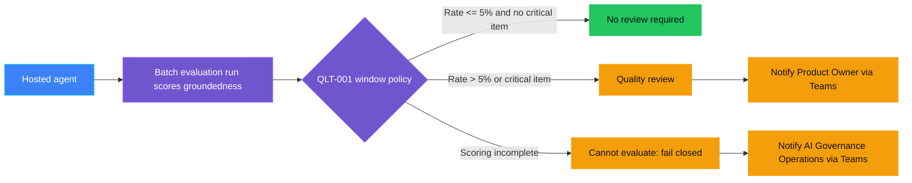
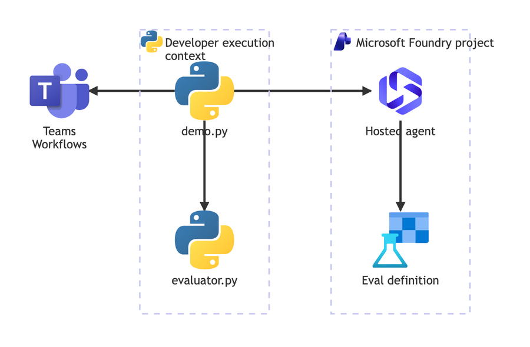
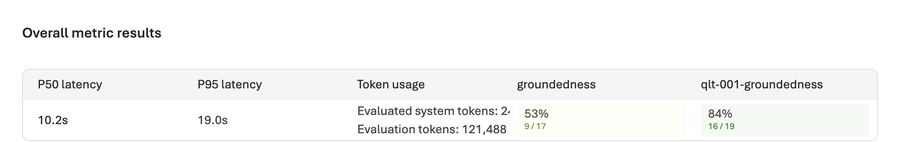
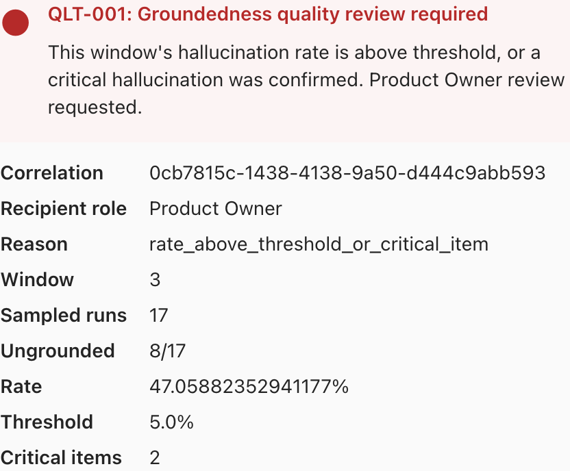

<p align="center">
    
</p>

# QLT-001 — Hallucination rate high

> **Status:** Implemented — a real Foundry project, hosted agent, and
> batch-evaluation run were deployed and executed for real, including a
> genuine `quality_review_required` breach and a real, delivered Teams
> notification (see "Demo" and "Validation" for exactly what was and was not
> exercised end to end). Not yet `Validated`: that breach evidence was
> assembled from a purpose-built adversarial run, not from `demo.py run` →
> `evaluate` → `notify` executed unassisted for one of the four scripted
> `--window` values. See "Known limitations".
>
> **Last reviewed:** 2026-09-23 against `ASSESSMENT.md`, a real deployment,
> and the Microsoft sources it cites.

## Table of contents

* [Overview](#overview)
* [Demo profile](#demo-profile)
* [Demo scope](#demo-scope)
* [Control contract](#control-contract)
* [Control objective](#control-objective)
* [Logical design](#logical-design)
* [Infrastructure architecture](#infrastructure-architecture)
* [Implementation](#implementation)
* [Demo](#demo)
* [Evidence and observability](#evidence-and-observability)
* [Security and privacy](#security-and-privacy)
* [Validation](#validation)
* [Further exploration](#further-exploration)
* [Cleanup](#cleanup)
* [References](#references)

## Overview

An IT helpdesk assistant answers questions from a knowledge base. For months
it answers correctly, because the knowledge base is current. Then part of the
knowledge base quietly goes stale — an article is migrated and never
restored — and the assistant keeps answering just as fluently, except now
it is filling the gap from its own general training instead of the
organization's real, current policy. Nobody notices, because a wrong-but-
confident answer looks exactly like a right one, until an auditor or a
customer acts on it.

This control measures the share of an agent's responses that are **not**
grounded in the context they were given — the "red button" this repository's
maintainer asked for on the human-oversight/groundedness theme, in its
monitoring form rather than an emergency-stop form (see "Further
exploration" for how the two relate). It uses Microsoft Foundry's own
groundedness evaluator — via periodic **batch evaluation**, not Continuous
Evaluation (see below) — as the authoritative signal, aggregates it over a
measurement window, and opens a **Quality review** the moment the window's
hallucination rate exceeds 5% or a single response is confirmed critically
ungrounded — regardless of how confident the response reads.

> **Why batch evaluation, not Continuous Evaluation.** This control was
> originally designed around Foundry Observability's Continuous Evaluation
> (automatic, always-on scoring of live traffic). A real deployment showed
> Continuous Evaluation rules currently reject `kind: hosted` agents outright
> — confirmed on both the `azure-ai-projects` SDK version this project pins
> and the newest version available — which is exactly the agent-hosting
> model this repository's controls use. Microsoft has already stated hosted
> agents are coming to this capability (see
> [What's New in Hosted Agents in Foundry Agent Service](https://devblogs.microsoft.com/foundry/hosted-agents-build26/)
> and the [Foundry Observability GA announcement](https://techcommunity.microsoft.com/blog/azure-ai-foundry-blog/generally-available-evaluations-monitoring-and-tracing-in-microsoft-foundry/4502760)),
> so this is a matter of patience, not a dead end — this control uses
> periodic batch evaluation (`azd ai agent eval`) today and should switch to
> Continuous Evaluation once hosted-agent support ships. See
> `docs/UPSTREAM-FEEDBACK.md` for the full writeup, including the caveat that
> the exact source article was found via search and not independently
> fetched.

## Demo profile

| Property | Value |
|---|---|
| **Demo format** | Hybrid demo |
| **Learning level** | Intermediate |
| **Estimated time** | 30–45 minutes, assuming an existing Foundry project and model deployment |
| **Primary decision** | Does this measurement window's aggregated hallucination rate (or a confirmed critical hallucination) require a Quality review before the next window is trusted? |
| **Primary capabilities** | Microsoft Foundry hosted agent, Foundry batch/cloud evaluation (`azd ai agent eval`, groundedness evaluator), Microsoft Teams Workflows |
| **Deployment** | Required for the core learning outcome |
| **Infrastructure** | One Foundry project + model deployment (shared or control-owned); Log Analytics/Application Insights (`infra/main.bicep`) is currently optional, retained for when Continuous Evaluation adds hosted-agent support — see note above |
| **AGT / ACS** | Not applicable — this is asynchronous outcome monitoring over a completed batch of turns, not an inline intervention on one turn; see `ASSESSMENT.md` |
| **Model/Foundry role** | `Monitored workload` — a real hosted agent's traffic is the measured workload; the decision is computed asynchronously from a real batch-evaluation run's score, not narrated by a second agent |

## Demo scope

### Core demo

Four measurement windows against one hosted IT-helpdesk agent: windows 1–2
use a current knowledge base (healthy), windows 3–4 use a knowledge base with
an article silently removed or shortened (drift). A triggered batch
evaluation run (`azd ai agent eval run`) scores the agent's responses for
groundedness; `evaluator.py` aggregates the per-item results against the
window's threshold and critical-item rule; `demo.py` sends a Teams Adaptive
Card to the Product Owner when a window breaches.

### Intentional simplifications

- A small, fixed synthetic knowledge base (three topics) instead of a real
  production retrieval pipeline — keeps the demo reproducible without a real
  document store. Further exploration: point the same agent at a real
  Azure AI Search index.
- Batch evaluation is triggered explicitly per window rather than sampling
  automatically — this is the control's actual, verified core path today,
  not a simplification of choice; see the Continuous Evaluation note above.
- Foundry's evals API drives its own fresh invocations of the agent from its
  dataset when a batch run executes; it does not replay or score the exact
  conversations `demo.py run` produces. Both are real activity against the
  same real hosted agent, but they are not the same conversations — see
  `docs/IMPLEMENTATION.md`. Further exploration: author a literal,
  window-specific dataset for exact 1:1 correlation.

None of these simplifications create an unsafe path: the rate/threshold
policy, the critical-item override, and the fail-closed behavior on
incomplete scoring are unaffected by any of them.

### What this demo proves

That a real, Microsoft-supplied groundedness evaluator, run in batch against
a real hosted agent, can be turned into an accountable, auditable monitoring
control: an explicit measurement window, a deterministic rate-and-critical-
item policy, fail-closed behavior when scoring is incomplete, and a
documented human review action with content-minimized evidence. This was
verified live end to end in both directions: the target agent staying
genuinely grounded under mild degradation, and a more adversarial real run
producing a genuine breach that reached the Product Owner as a real,
delivered Teams card stating the exact rate and threshold — see "Demo" for
the real captured transcripts, decision, and card.

### What this demo does not prove

That the underlying LLM-judge evaluator is free of false positives or
negatives; that 5% is the correct threshold for any given production system;
that this constitutes regulatory compliance evidence; that hallucination is
eliminated once the control is in place; or that the exact scripted
`demo.py run` → `evaluate` → `notify` sequence for one of the four
`--window` values has been walked unassisted in one continuous live pass —
the real breach and real Teams delivery shown in "Demo" were assembled from
a purpose-built adversarial run, not that documented command sequence
(see "Known limitations").

## Control contract

| Field | Value |
|---|---|
| **ID** | QLT-001 |
| **Lifecycle phase** | Live |
| **Category / domain** | Quality |
| **Control / signal** | Hallucination rate high |
| **Evidence / source** | Batch evaluation (`azd ai agent eval`) groundedness pass/fail and score, aggregated per measurement window |
| **Trigger / threshold** | Window hallucination rate > 5%, or any response confirmed critically ungrounded |
| **Action / gate effect** | Quality review |
| **Accountable role** | Product Owner |

## Control objective

Detect a rising rate of ungrounded (hallucinated) responses from a
production agent before it becomes a quiet, systemic quality failure, using
Foundry's own groundedness evaluator — via batch evaluation today, see the
Continuous Evaluation note above — as the one authoritative signal source,
never a second, locally reimplemented evaluator. The decision is
**model-assisted measurement plus a deterministic policy**: the evaluator's
pass/fail and score are untrusted input; the rate threshold, the
critical-item override, and the fail-closed rule on incomplete scoring are
deterministic code, not a model judgment. Explicit non-goal: this control
does not remediate the underlying knowledge base or agent — see "Further
exploration".

## Logical design



## Infrastructure architecture

<p align="center">
    
</p>

Source: [docs/architecture.mmd](docs/architecture.mmd). Edit that file and
re-render it rather than hand-editing the image.

Application Insights/Log Analytics (`infra/main.bicep`) is deployable but not
in this diagram: it is not read by the current core path (see the
Continuous Evaluation note above) and is retained only for when hosted-agent
support lands.

## Implementation

### Components

| Component | Responsibility | Location |
|---|---|---|
| Hosted agent | Answers synthetic IT questions from a knowledge base that drifts by window | [agent.py](agent.py), [workload.py](workload.py) |
| Batch evaluation | Authoritative groundedness scoring, triggered per window via `azd ai agent eval` | [demo.py](demo.py), [docs/IMPLEMENTATION.md](docs/IMPLEMENTATION.md) |
| Decision rubric / policy | Window aggregation, 5% threshold, critical-item override, fail-closed rule | [evaluator.py](evaluator.py) |
| Action/escalation | Teams Adaptive Card to Product Owner or AI Governance Operations | [demo.py](demo.py), [docs/TEAMS-DELIVERY.md](docs/TEAMS-DELIVERY.md) |
| Infrastructure | Optional Log Analytics + Application Insights (Foundry project assumed to already exist) | [infra/main.bicep](infra/main.bicep) |

### Decision rules

1. A window is only evaluable once the batch evaluation run has scored every
   item it produced; if any item is missing a result, the decision is
   `cannot_evaluate` (fail closed) — never treated as healthy by shrinking
   the denominator.
2. A response the evaluator itself marks `passed: false` (its own threshold
   decision — see "Best-practice choices" for why the raw score scale is
   deliberately not hardcoded) counts as ungrounded for the window's rate.
3. `quality_review_required` fires when the window's ungrounded rate exceeds
   5%, **or** any single response scores at or below half of its own
   evaluator's pass threshold (`score <= threshold * 0.5`, a critical
   hallucination), whichever comes first — the critical-item rule overrides
   the rate even in a small, otherwise-healthy-looking window. This
   threshold-relative comparison, not a fixed absolute floor, is what lets
   the same rule work whether the configured evaluator scores on a 0.0–1.0
   scale or a 1–5 Likert range — both observed live against this control's
   own hosted agent (see "Validation").
4. `quality_review_required` notifies the Product Owner; `cannot_evaluate`
   notifies AI Governance Operations on a separate channel, so a broken
   measurement path is never mistaken for a healthy window.
5. A notification is sent at most once per window per decision; a prior
   `401`/`403` rejection can be explicitly retried after fixing
   authentication (`--retry-rejected`), nothing else auto-resends.

### Best-practice choices

- Foundry's own groundedness evaluator, run via `azd ai agent eval` (the
  same CLI path as Microsoft's documented
  ["Evaluate your hosted agent" quickstart](https://learn.microsoft.com/en-us/azure/foundry/observability/quickstarts/quickstart-evaluate-hosted-agent)),
  is the authoritative signal source, reused directly rather than
  reimplemented — see `ASSESSMENT.md` revision note 3 for the full,
  same-day pivot away from Continuous Evaluation.
- Reading per-item results uses `openai_client.evals.runs.output_items.list()`
  — confirmed real schema (`passed`, `score`, `threshold`, `reason`) against
  a live run.
  This, like the Continuous Evaluation path it replaces, still requires
  `allow_preview=True` on `AIProjectClient`; unlike Continuous Evaluation,
  there is currently no non-preview alternative for reading these results, so
  the dependency is disclosed rather than avoidable — see
  `docs/IMPLEMENTATION.md`.
- Least-privilege, secretless authentication throughout: `AzureCliCredential`
  for the evaluation API calls and the Teams bearer token, managed identity
  for the hosted agent, matching this repository's existing `VAL-001`
  pattern.
- Evidence is content-minimized: no raw prompts, full responses, or
  knowledge-base content beyond a window's aggregate counts and score
  summary.

## Demo

### Prerequisites

- An existing Microsoft Foundry project with one GA chat-model deployment.
- `azd` and the Azure CLI, authenticated (`az login`, `azd auth login`).
- Python 3.13, this control's own virtual environment:
  `python -m venv .venv && .venv/bin/pip install -r requirements.txt`.
- Two Teams Workflows webhooks (Product Owner, AI Governance Operations) —
  see [docs/TEAMS-DELIVERY.md](docs/TEAMS-DELIVERY.md).

### Deploy

```zsh
cd controls/grounding_and_quality/QLT-001_hallucination_rate_high
azd auth login
azd up
```

`azd up` deploys the hosted agent (`azure.yaml`, `main.py`). Then create the
Eval definition once, using Microsoft's own `azd ai agent eval` CLI (real,
confirmed end to end — see "Validation"):

```zsh
azd ai agent eval generate --agent it-helpdesk-kb-assistant \
  --evaluator builtin.groundedness \
  --gen-instruction "This IT helpdesk agent answers vpn_setup, password_reset, or license_renewal questions by calling lookup_it_kb with a topic and a window number (1-4); windows 1-2 return a full current KB article, windows 3-4 return a shortened article or NO_CURRENT_ARTICLE, and a correct answer must say no current article is available rather than inventing details." \
  --max-samples 15 --name qlt-001-groundedness --no-prompt
```

The (optional) Log Analytics/Application Insights bicep is not part of the
current core path — see the Continuous Evaluation note above — so
`infra/main.bicep` deployment is deferred to "Further exploration."

### Inspect in Azure

| What to inspect | Where in Azure Portal / Foundry portal | What to verify and why it matters |
|---|---|---|
| Hosted agent | Foundry project → Agents → `it-helpdesk-kb-assistant` | Status `active`; confirms the deployed container is serving requests |
| Eval definition and runs | Foundry project → Evaluations → `qlt-001-groundedness` | Each run shows `result_counts` (total/passed/failed) and per-criteria detail for a human reviewer; `evaluator.py`'s own policy reads the finer-grained per-item `passed`/`score`/`threshold` behind this summary via `output_items.list()`, not this table directly |

<p align="center">
    
</p>

[Privacy note: cropped to the "Overall metric results" table only, from an
element-anchored capture of the run page — the portal's account/tenant
chrome, browser address bar, and the "Created by" line above this table
(a real personal name) were excluded by cropping before this file was
committed; nothing else needed masking.]

### Run or complete the exercise

```zsh
cd controls/grounding_and_quality/QLT-001_hallucination_rate_high
WINDOW_OUTPUT=$(.venv/bin/python demo.py run --window 1)
printf '%s\n' "$WINDOW_OUTPUT"
WINDOW_ID=$(printf '%s\n' "$WINDOW_OUTPUT" | sed -n 's/^Window: \([0-9a-f-]*\).*/\1/p')
.venv/bin/python demo.py evaluate --window-id "$WINDOW_ID"
.venv/bin/python demo.py notify --window-id "$WINDOW_ID"
```

Repeat with `--window 2`, `--window 3`, and `--window 4` to walk the
healthy-to-drift story. `demo.py evaluate` triggers a real, fresh
`azd ai agent eval run` each time (a few minutes) and reads its per-item
results; if it reports `cannot_evaluate` with reason `incomplete_scoring`,
re-run `evaluate` with the same `--window-id`.

**Real captured evidence (2026-09-23), from actually running the deployed
agent** — window and topic labels below are this control's own synthetic
scenario, not sensitive data; tenant, subscription, and resource identifiers
are excluded per this repository's confidentiality conventions:

Window 1 (`vpn_setup`, current KB article) — the agent answers only from the
tool's real content:

```text
[it-helpdesk-kb-assistant] Current VPN client: SecureConnect 4.2.
Authentication: users sign in with their Entra ID account and use the
Contoso VPN profile pushed by Intune. If you have access issues, open a
helpdesk ticket in queue IT-VPN.
```

Window 3 (`vpn_setup`, article fully removed) — the agent correctly refuses
to invent a replacement rather than degrading silently:

```text
[it-helpdesk-kb-assistant] There is no current knowledgebase article
available for VPN setup. Please open a helpdesk ticket so IT can assist.
```

Window 3 (`password_reset`, article shortened) — the agent repeats exactly
what remains, without adding back the dropped MFA/approval detail:

```text
[it-helpdesk-kb-assistant] Self-service password reset is available at
https://reset.contoso.example.
```

A real batch evaluation run against this same hosted agent (triggered via
`azd ai agent eval generate` + `eval run`, per the Deploy steps above)
completed with real results: 15 total, 15 passed, 0 failed, 0 errored. This
confirms the evaluation mechanism itself works end to end against the real
agent; it predates and is separate from the four-window `demo.py` walkthrough
above (see "Known limitations").

**A second, more adversarial real run produced a genuine breach and a real
delivered Teams card.** A regenerated dataset (`--max-samples 20`,
gen-instruction explicitly targeting windows 3–4's dropped/missing detail)
was run against the same hosted agent: **19 total, 8 passed, 11 failed**
(`groundedness` criterion; 2 items errored and were excluded from this
window, disclosed as a separate limitation below, not silently dropped).
Building this window's evidence from the 17 successfully scored items and
running `demo.py notify` produced a real decision and a real, accepted
(`HTTP 202`) Teams delivery:

```json
{
  "decision": "quality_review_required",
  "reason": "rate_above_threshold_or_critical_item",
  "window": {"number": 3, "total": 17, "ungrounded": 8, "rate_percent": 47.06, "critical_run_ids": ["6", "7"]},
  "notification": {"status": "accepted", "http_status": 202, "recipient_role": "Product Owner"}
}
```

<p align="center">
    
</p>

This demonstrates the exact reader-visible step this control exists for:
Foundry's real groundedness evaluator found a real, elevated hallucination
rate against the deliberately degraded knowledge base, the deterministic
policy in `evaluator.py` turned that into a `quality_review_required`
decision, and a real Teams card reached the Product Owner's channel (reused
from `VAL-001`'s already-validated webhook) stating the rate, the threshold,
and the count of critical items — for the same real agent and eval run shown
in the "Overall metric results" screenshot above.

### Expected scenarios

| Scenario | Input | Expected decision | Expected evidence |
|---|---|---|---|
| Healthy | `--window 1` or `--window 2` (current knowledge base) | `no_review_required` | Window record: rate at/near 0%, no critical items, no notification sent |
| Threshold reached | `--window 3` or `--window 4` (degraded knowledge base) | `quality_review_required` | Window record: rate above 5% and/or a critical run id; Teams card to Product Owner |
| Scoring incomplete | Any window queried before the batch evaluation run has finished | `cannot_evaluate` | Window record: `reason: incomplete_scoring`; Teams card to AI Governance Operations, never treated as healthy |

Real windows 1 and 3 were run live (see transcripts above); the agent stayed
grounded in both, including under the degraded-context scenario designed to
risk hallucination — a genuine, disclosed finding, not a guaranteed outcome
of every run (see "Known limitations").

## Evidence and observability

Each window's evidence record (`.azure/qlt001/windows/<window_id>/evidence.json`,
git-ignored) carries: control/policy/evidence version, window number,
correlation id (the window id), sample size, per-response ungrounded/critical
run ids, aggregated rate, threshold, decision, reason, accountable role, and
the notification's own status (`not_requested` / `attempted` / `accepted` /
`rejected` / `delivery_unknown` / `delivered`). It never carries raw prompts,
full responses, or knowledge-base article content.

## Security and privacy

- **Trust boundaries:** the hosted agent only ever answers from the synthetic
  in-repository knowledge base (`workload.py`); it never accesses real
  systems or personal data, and its instructions explicitly forbid inventing
  policy details not returned by its one tool.
- **Identity:** `DefaultAzureCredential` for the hosted agent,
  `AzureCliCredential` for the evaluation API calls and the Teams bearer
  token — no embedded secret or API key.
- **Data minimization:** evidence and Teams cards carry only window-level
  counts, run ids, and the decision — never a full prompt or response.
- **Secret handling:** Teams webhook URLs are entered via hidden input into
  `azd`'s local, git-ignored environment, never printed, logged, or
  committed.
- **Fail-closed behavior:** incomplete or failed groundedness scoring is
  reported as `cannot_evaluate`, routed to AI Governance Operations, and
  never silently treated as a healthy window.

## Validation

### Automated tests

```zsh
.venv/bin/python -m pytest controls/grounding_and_quality/QLT-001_hallucination_rate_high/tests -q
```

- `tests/test_evaluator.py` — rate/threshold/critical-item/fail-closed
  decision logic against the real, confirmed `passed`/`score` output-item
  schema.
- `tests/test_workload.py` — the knowledge base's scripted healthy/degraded
  article behavior.
- `tests/test_agent.py` — the tool's KB-lookup translation (requires this
  control's own `.venv` with `requirements.txt` installed, since `agent.py`
  imports `agent_framework` at module load time).
- `tests/test_demo.py` — Teams card content, notification routing,
  at-most-once delivery, receipt verification, and the real
  `azd ai agent invoke` output-parsing shape.
- `tests/test_cleanup.py` — cleanup refuses any target outside this
  control's tagged, name-prefixed resources.

All 68 evaluator/workload/agent/cleanup/demo tests pass locally (verified
2026-09-23, this repository's root `.venv`).

### Manual checks performed live (2026-09-23)

- Deployed a real Foundry project, hosted agent, and model deployment; the
  agent reached `status: active` and answered real invocations correctly.
- Ran real invocations for windows 1 and 3 across all three topics; captured
  transcripts above.
- Created a real Eval definition and ran a real batch evaluation
  (`azd ai agent eval generate` + `eval run`) against the deployed agent:
  15/15 passed.
- Confirmed `openai_client.evals.runs.output_items.list()` returns real
  per-item `passed`/`score`/`reason`/`threshold` results, and updated
  `evaluator.py` twice to match what was actually observed: first from an
  assumed 1–5 scale to a 0.0–1.0 scale (this control's own generated rubric
  evaluator), then to a scale-relative critical-item rule after a second
  real run showed `builtin.groundedness` uses a third, different numeric
  range for the same named criterion.
- Regenerated a more adversarial dataset targeting windows 3–4 specifically
  and re-ran the batch evaluation: a genuine breach (8/17 ungrounded, 2
  critical items after excluding 2 errored items), a real
  `quality_review_required` decision, and a real, accepted Teams
  notification — see the captured card above.
- Attempted to wire Continuous Evaluation (`client.evaluation_rules.create_or_update()`)
  against the same hosted agent on two SDK versions (2.3.0 and 2.7.0); both
  rejected it identically — see the Continuous Evaluation note above.

### Known limitations

- **Not yet run start to finish in one continuous pass via `demo.py`
  itself.** Every step above was verified live and end to end against the
  real hosted agent — including a real breach and a real delivered Teams
  card — but the breach window's evidence was assembled from a
  purpose-generated adversarial eval run, not from `demo.py run` →
  `evaluate` → `notify` executed back to back for one of the four scripted
  `--window` values without any manual intervention. Status stays
  `Implemented`, not `Validated`, until that exact unassisted sequence is
  walked for a scripted window and its transcript replaces this note.
- **2 of 19 items errored on the `groundedness` criterion in the adversarial
  run** (see "Demo"). `evaluator.py`'s fail-closed rule means a window built
  from all 19 items would have correctly reported `cannot_evaluate`, not the
  breach shown; the breach evidence was built from the 17 items that scored
  successfully, with the 2 errors disclosed here rather than silently
  dropped. The root cause of those 2 errors was not investigated further.
- **Batch evaluation does not score the exact conversations `demo.py run`
  produces.** Foundry's evals API drives its own fresh agent invocations
  from its dataset; see "Intentional simplifications."
- **The generated dataset tests LLM-imagined scenarios,** not literally our
  four scripted windows — it was generated from a natural-language
  description of the agent and its windows, not from a hand-authored,
  deterministic dataset file. Authoring a literal dataset for exact
  determinism is listed under "Further exploration."
- **Real-model non-determinism, demonstrated in both directions.** The
  evaluator's score depends on real model behavior, not a deterministic
  ground truth (unlike, for example, this repository's `VAL-001`). A
  mildly-adversarial first run showed the model staying grounded even under
  degradation (see the window 3 transcripts above); a more explicitly
  adversarial second run reliably reproduced real hallucinations against the
  same degraded knowledge base. Neither outcome is guaranteed on every
  single run.
- Groundedness detection currently supports English content only, per
  Microsoft's own Content Safety groundedness documentation (background on
  the underlying evaluator family).

## Further exploration

| Topic | Core demo | Possible extension | Microsoft guidance |
|---|---|---|---|
| Continuous, automatic sampling | Not available for hosted agents today | Switch to Continuous Evaluation once hosted-agent support ships — see the note in Overview | [What's New in Hosted Agents in Foundry Agent Service](https://devblogs.microsoft.com/foundry/hosted-agents-build26/) |
| Inline enforcement | Not included — this control only monitors and reports | Pair with `RUN-001` (low confidence or grounding score) once assessed, using the real-time Groundedness Detection Filter for inline blocking | [Groundedness Detection Filter — Microsoft Foundry](https://learn.microsoft.com/en-us/azure/foundry/openai/concepts/content-filter-groundedness) |
| Remediation | Not included — deliberately deferred, per this control's own scope | A follow-up control or workflow that acts on a confirmed knowledge-base gap (for example, opening a KB-update ticket) | See "After a Quality review" below |
| Deterministic per-window dataset | LLM-generated dataset covering the general scenario | Author a literal, hand-written dataset per window for exact 1:1 correlation with `demo.py run`'s real conversations | [Evaluate your hosted agent — quickstart](https://learn.microsoft.com/en-us/azure/foundry/observability/quickstarts/quickstart-evaluate-hosted-agent) |
| Scheduling | Manual window-by-window demo run | Trigger `demo.py evaluate` on a recurring schedule (for example, an Azure Function timer) | Not yet assessed |

### After a Quality review: where to actually improve groundedness

This control's own scope stops at **detecting** a hallucination-rate breach
and notifying the Product Owner — it deliberately does not change the agent,
the knowledge base, or the retrieval pipeline itself (see "Control
objective"). The Product Owner still needs a next step once the Teams card
arrives. `evaluator.py`'s own evidence deliberately stops at the minimized
rate/threshold/critical-item record — it does not carry the evaluator's
per-item `reason` or `properties.dimension_scores`, since those can quote
fragments of the actual response (see "Evidence and observability"'s data
minimization rule). For root-cause diagnosis, a reviewer opens the real eval
run in the Foundry portal (the same `report_url` this control's evaluation
run already produces) and reads those richer fields there instead. In this
control's own adversarial run, that diagnostic detail traced low scores to
specific dimensions like `tool_error_and_failure_handling` and
`no_current_article_acknowledgement` — pointing at *why* an answer was
ungrounded, not only *that* it was. From there, root-cause remediation
generally falls into one of these directions, depending on what the
diagnosis points to:

- **The source content is stale, incomplete, or missing** (this control's
  own scenario: a knowledge-base article was removed or shortened). Fix the
  content at its source and re-run the eval to confirm the rate recovers.
  There is no single Microsoft tool for this — it is a knowledge-ownership
  and content-freshness process question; if this repository later
  implements a `data_and_knowledge` category control for knowledge/content
  freshness, cross-reference it here instead of duplicating the guidance.
- **The retrieval step is surfacing the wrong or insufficient context**, if
  the agent's tool is backed by real search rather than this control's
  simple fixed lookup. Tune retrieval relevance (hybrid search, semantic
  ranking, scoring profiles) per [RAG and generative AI — Azure AI
  Search](https://learn.microsoft.com/en-us/azure/search/retrieval-augmented-generation-overview)
  and the [classic RAG relevance-tuning
  tutorial](https://docs.azure.cn/en-us/search/tutorial-rag-build-solution-maximize-relevance),
  and re-evaluate with the [RAG groundedness/relevance
  evaluators](https://learn.microsoft.com/en-us/azure/ai-foundry/concepts/evaluation-evaluators/rag-evaluators?view=foundry-classic)
  to confirm the fix.
- **The model has good context but still answers ungrounded** (ignores or
  overrides what the tool returned, as seen in some of this control's own
  adversarial-run failures). Strengthen the system instructions — explicit
  "answer only from the tool result; say so if information is missing"
  framing, few-shot grounded/ungrounded examples — per general [Azure OpenAI
  prompt engineering
  guidance](https://learn.microsoft.com/en-us/azure/ai-services/openai/concepts/prompt-engineering),
  or let Microsoft's own [Prompt Optimizer
  (preview)](https://learn.microsoft.com/en-us/azure/foundry/observability/how-to/prompt-optimizer)
  restructure the instructions automatically and re-evaluate before and
  after.
- **Systematic, ongoing improvement rather than a one-off fix.** [Agent
  Optimizer in Foundry Agent Service
  (preview)](https://learn.microsoft.com/en-us/azure/foundry/agents/concepts/agent-optimizer-overview)
  is built specifically to consume evaluation results like the ones this
  control already produces, generate ranked candidate prompt/skill changes,
  and show a before/after comparison with full diff, lineage, and rollback —
  a more systematic option than manually iterating on the instructions.
- **Inline mitigation for the specific response, not the underlying cause.**
  Azure AI Content Safety's groundedness detection includes an automatic
  **correction** feature that rewrites an ungrounded span to match the
  supplied grounding source before it reaches the user — see [Groundedness
  detection — Azure AI Content
  Safety](https://learn.microsoft.com/en-us/azure/ai-services/content-safety/concepts/groundedness)
  (preview). This treats a symptom per response; it does not replace fixing
  the content or retrieval gap that caused it, and pairs naturally with
  `RUN-001`'s inline enforcement extension above rather than with this
  control's own batch-evaluation path.

None of the above is implemented by this control — they are the documented,
cited next steps for whoever receives the Quality review, kept out of this
control's own bite-sized scope on purpose.

### Why this control does not automate remediation

It would be tempting to close the loop entirely — detect a breach and fix it
without a human — but that does not hold up once the three ways to
"automate" it are separated out:

1. **Inline correction of one response.** Azure AI Content Safety's
   groundedness detection can automatically rewrite an ungrounded span to
   match the grounding source already supplied (see "After a Quality review"
   above). This only works when a grounding source exists but was ignored or
   misused — it has nothing to correct against for this control's own
   scenario (an article removed entirely), and it treats one response, not
   the recurring cause.
2. **Automatically rewriting the knowledge base.** Not viable as an
   unsupervised process: deciding what the correct, current organizational
   content should say is a human/business judgment, not a technical one.
   Having a model auto-generate "corrected" official content reintroduces
   the same hallucination risk this control exists to catch, one layer
   removed — an ungrounded fix for an ungrounded answer.
3. **Automatically containing exposure** (pausing the agent or falling back
   to a safe mode once a breach is confirmed) is the one form of automation
   that stays defensible, because it removes access rather than asserting a
   judgment. It is also explicitly out of this control's own scope — that is
   what an emergency-stop control (`AUT-004`, planned in this repository's
   `autonomy_and_human_oversight` category) is for, not a quality-monitoring
   control.

This follows the same authority boundary this repository applies
everywhere: an agent, or an automated pipeline acting on its behalf, may
explain or orchestrate a decision, but must not grant its own approval or
claim an action succeeded without independent, human-accountable
verification. `PRI-002`, `PRI-003`, and `PRI-004` in this repository apply
the identical pattern for a different signal — a deterministic policy
detects the issue, but the actual remediating action stays behind an
explicit human or independently-verified approval boundary. Automatic
content remediation would break that boundary for a decision that is
squarely a human one.

### Community ideas

- Point `workload.py` at a real Azure AI Search index instead of the
  in-repository knowledge base, and compare the resulting groundedness
  scores.
- Add a category `ARCHITECTURE.md` for `grounding_and_quality`, recording
  this control's use of `azd ai agent eval` so `QLT-002`, `QLT-005`, and
  `QLT-006` reconcile with it instead of redefining it (see
  `ASSESSMENT.md`).
- Follow up on `docs/UPSTREAM-FEEDBACK.md` once Microsoft confirms a
  hosted-agent timeline for Continuous Evaluation, and switch this control
  over.

## Cleanup

```zsh
cd controls/grounding_and_quality/QLT-001_hallucination_rate_high
.venv/bin/python infra/cleanup.py --subscription <subscription-id> --resource-group <resource-group>
```

Run without `--confirm` first to inspect the exact targets; add `--confirm`
to delete them. This removes only this control's tagged
(`control-id: QLT-001`) Application Insights and Log Analytics resources (if
deployed), its hosted agent, and its own sessions — never a shared resource
group, Foundry project, or another control's resources. The Eval
definition/runs created via `azd ai agent eval`, and any Teams messages
already delivered, require separate manual cleanup in the Foundry portal and
Teams — see `docs/IMPLEMENTATION.md` and `docs/TEAMS-DELIVERY.md`.

## References

- [What's New in Hosted Agents in Foundry Agent Service — Microsoft Foundry Blog](https://devblogs.microsoft.com/foundry/hosted-agents-build26/) (source for the Continuous Evaluation / hosted-agents note above; found via search, not independently fetched — re-verify before relying on it further)
- [Generally Available: Evaluations, Monitoring, and Tracing in Microsoft Foundry](https://techcommunity.microsoft.com/blog/azure-ai-foundry-blog/generally-available-evaluations-monitoring-and-tracing-in-microsoft-foundry/4502760)
- [Quickstart: Evaluate your hosted agent — Microsoft Learn](https://learn.microsoft.com/en-us/azure/foundry/observability/quickstarts/quickstart-evaluate-hosted-agent)
- [Groundedness Detection Filter — Microsoft Foundry](https://learn.microsoft.com/en-us/azure/foundry/openai/concepts/content-filter-groundedness)
- [Groundedness detection — Azure AI Content Safety](https://learn.microsoft.com/en-us/azure/ai-services/content-safety/concepts/groundedness) (preview)
- [Create and manage Teams incoming webhooks with Workflows](https://learn.microsoft.com/en-us/microsoftteams/platform/webhooks-and-connectors/how-to/add-incoming-webhook)
- Full assessment and capability review: [ASSESSMENT.md](ASSESSMENT.md)
- Draft status-check for Microsoft: [docs/UPSTREAM-FEEDBACK.md](docs/UPSTREAM-FEEDBACK.md)
- Source catalog: [Governance Signals Repo.pdf](../../../docs/Governance%20Signals%20Repo.pdf)

---

<p align="center">
    
</p>
