<p align="center">
    
</p>

# QLT-001 — Hallucination rate high

> **Status:** Implemented — a real Foundry project and a three-agent fleet of
> `kind: prompt` agents run end to end: `demo.py setup` → `run` → `evaluate`
> → `notify`, including a real, accepted Teams delivery (see "Demo").
> Continuous Evaluation's own score was confirmed reachable for the first
> time on 2026-09-25 — "continuous" is doing some heavy lifting in that
> name, since it actually takes about a day. Not yet `Validated`: the one
> real decision produced so far was a clean bill of health for all three
> agents, including the one deliberately built to lie — see "Known
> limitations" for why, and for the retest now in flight.
>
> **Last reviewed:** 2026-09-25 against `ASSESSMENT.md`, a real deployment,
> and the Microsoft sources it cites.

## Table of contents

* [Overview](#overview)
* [Demo profile](#demo-profile)
* [Demo scope](#demo-scope)
* [Control contract](#control-contract)
* [Control objective](#control-objective)
* [Logical design](#logical-design)
* [Demo infrastructure setup (simplified)](#demo-infrastructure-setup-simplified)
* [Implementation](#implementation)
* [Demo](#demo)
* [Evidence and observability](#evidence-and-observability)
* [Security and privacy](#security-and-privacy)
* [Validation](#validation)
* [Further exploration](#further-exploration)
* [Cleanup](#cleanup)
* [References](#references)

## Overview

An IT helpdesk assistant answers questions from a knowledge base. For months
it's right, because the knowledge base is current. Then part of it quietly
goes stale — an article migrates and never comes back — and the assistant
keeps answering just as fluently, now filling the gap from its own general
training instead of the organization's real policy. Nobody notices, because
a wrong-but-confident answer looks exactly like a right one. Scale that
across several teams running the same kind of assistant with very different
levels of discipline, and one agent's clean bill of health tells you nothing
about the other two.

This control measures the share of an agent's responses that are **not**
grounded in the context they were given, across a small **fleet** of three
agents standing in for three teams with deliberately different KB and
instruction rigor, using Microsoft Foundry's **Continuous Evaluation**
(automatic, sampled scoring of real live traffic) as the authoritative
signal. It opens a **Quality review** the moment any single agent's
hallucination rate exceeds 5% or a response is confirmed critically
ungrounded — on purpose, regardless of whether the *fleet average* still
looks fine, since an average is exactly where a single struggling team goes
to hide.

<details>
<summary><strong>Why Continuous Evaluation, and what the self-reported confidence display is (and isn't)</strong> (expand for the short version; full history in <code>ASSESSMENT.md</code> revision note 5 and <code>docs/UPSTREAM-FEEDBACK.md</code>)</summary>

This control originally used periodic batch evaluation because Continuous
Evaluation rejects `kind: hosted`/`kind: external` agents outright. A later
pass found `kind: prompt` agents are accepted — behind a previously
undocumented IAM/telemetry prerequisite chain (see `docs/IMPLEMENTATION.md`)
and one genuine, still-live SDK crash found along the way, distinct from
the closed/fixed issue it was first mistaken for (see "Known limitations").

Every response `demo.py run` displays also carries the agent's own
self-reported groundedness confidence (1–5) and, when low, suggested
follow-up questions. Treat this as a hypothesis about a useful UX pattern,
not a demonstrated one — nothing here measures whether a user acting on a
follow-up actually gets a better-grounded answer next time. It is never a
substitute for Continuous Evaluation's independent score, which is this
control's only authoritative signal.

</details>

## Demo profile

| Property | Value |
|---|---|
| **Demo format** | Hybrid demo |
| **Learning level** | Advanced — five IAM role assignments, an Application Insights connection resource, and a prerequisite chain most controls here don't need (see `docs/IMPLEMENTATION.md`) |
| **Estimated time** | 60–90 minutes for deploy/setup/run, plus roughly a day of waiting you can't speed up — Continuous Evaluation's own score needs time in the oven, and no amount of `--force` changes that |
| **Primary decision** | Does this measurement window's aggregated hallucination rate for any single fleet agent (or a confirmed critical hallucination) require a Quality review before the next window is trusted? |
| **Primary capabilities** | Microsoft Foundry `kind: prompt` agents, Continuous Evaluation (`builtin.groundedness`/`relevance`/`retrieval`), Application Insights/Log Analytics, Microsoft Teams Workflows |
| **Deployment** | Required for the core learning outcome |
| **Infrastructure** | One Foundry project + model deployment (shared or control-owned); Log Analytics + Application Insights (`infra/main.bicep`) is required, not optional, for Continuous Evaluation's trace path |
| **AGT / ACS** | Not applicable — asynchronous outcome monitoring over sampled live traffic, not an inline intervention on one turn; see `ASSESSMENT.md` |
| **Model/Foundry role** | `Monitored workload` — three real `kind: prompt` agents' live traffic is the measured workload; the decision is computed asynchronously from Continuous Evaluation's own score |

## Demo scope

### Core demo

Four measurement windows against a fleet of three IT-helpdesk agents — see
`workload.FLEET` — three teams, three different relationships with the
truth:

| Fleet agent | KB rigor | Instruction rigor | Real, live-observed behavior |
|---|---|---|---|
| Platform Team | Never degrades within the demo's 4 windows | Strict — forbidden from guessing | Stays fully grounded throughout |
| Regional Team | Current through window 2, degrades from window 3 | Strict — forbidden from guessing | Correctly refuses to answer once its KB goes stale |
| Contractor Team | Never had a current article — degraded from window 1 | Permissive — answers confidently, no disclaimer (see "Known limitations" for why this changed) | Real, unscripted fabrication (specific VPN client names, portal URLs, invented steps) stated as fact, from window 1 onward |

Continuous Evaluation scores each agent independently (`evaluator.py`'s
`measure_agent`); `rollup()` reports the fleet average alongside the best-
and worst-performing agent by name — deliberately not only an average,
since that's exactly what would let the Contractor Team's regression hide.
`demo.py` sends a Teams card to the Product Owner when any single agent
breaches.

### Intentional simplifications

- A small, fixed synthetic knowledge base (three topics), not a real
  production retrieval pipeline. Further exploration: point the same
  agents at a real Azure AI Search index.
- Three agents, not a larger fleet — enough to show a real average/best/
  worst rollup and a genuine single-agent regression.
- The Contractor Team's weak instructions are a deliberate, disclosed
  lever to produce a real breach, not advice on how to instruct an agent.

None of these affect safety: the rate/threshold policy, the critical-item
override, and fail-closed behavior on incomplete scoring are unaffected.

### What this demo proves

That `kind: prompt` agents are a real, working path to Continuous
Evaluation, with a fully documented setup recipe; that the full pipeline
(`demo.py setup` → `run` → `evaluate` → `notify`) works end to end against
real Azure resources, including Continuous Evaluation's own score,
confirmed retrievable for the first time on 2026-09-25, and a real,
accepted Teams delivery; and that the Contractor Team's weaker instructions
produce genuine, unscripted fabrication live, not a scripted string.
`evaluator.py`'s fleet-rollup math is now verified against real data, not
only synthetic fixtures — the schema borrowed from batch evaluation turned
out to be exactly right.

### What this demo does not prove

That this control's policy actually fires a real `quality_review_required`
decision on real data — see "Known limitations" for the one real fleet
decision computed to date, and why it wasn't that. Nor does it prove the
underlying LLM-judge evaluator is free of false positives/negatives; that
5% is the right threshold for any given production system; that this is
regulatory compliance evidence; or that hallucination is eliminated once
the control is in place.

## Control contract

| Field | Value |
|---|---|
| **ID** | QLT-001 |
| **Lifecycle phase** | Live |
| **Category / domain** | Quality |
| **Control / signal** | Hallucination rate high |
| **Evidence / source** | Continuous Evaluation (`builtin.groundedness`/`relevance`/`retrieval`), sampled automatically from each fleet agent's real live traffic, read roughly a day later via `openai_client.evals.runs`/`output_items` — both the trace path and the score's own read path are live-confirmed (2026-09-25) |
| **Trigger / threshold** | Any single fleet agent's window hallucination rate > 5%, or any response confirmed critically ungrounded |
| **Action / gate effect** | Quality review |
| **Accountable role** | Product Owner |

## Control objective

Detect a rising rate of ungrounded responses from any agent in a monitored
fleet before it becomes a quiet, systemic quality failure, using Foundry's
own groundedness evaluator via Continuous Evaluation as the one
authoritative signal per agent — never a locally reimplemented evaluator,
and never only a fleet-wide average a single regressed agent could hide
inside. The decision is **model-assisted measurement plus a deterministic
policy**: each evaluator's pass/fail and score are untrusted input; the
rate threshold, the critical-item override, the any-agent-breach rule, and
the fail-closed rule are deterministic code, not a model's opinion of
itself. Explicit non-goal: this control does not remediate the knowledge
base or agent instructions — see "Further exploration".

## Logical design

```mermaid
flowchart LR
    subgraph Fleet["Fleet: kind: prompt agents"]
        F1[Platform Team]
        F2[Regional Team]
        F3[Contractor Team]
    end
    F1 -->|"T+0: real-time"| C[Continuous Evaluation samples live traffic]
    F2 -->|"T+0: real-time"| C
    F3 -->|"T+0: real-time"| C
    C -->|"T+~24h: confirmed live async latency"| R[evaluator.py: per-agent measure, fleet rollup]
    R --> P{QLT-001 fleet policy}
    P -->|Every agent within threshold, no critical item| A[No review required]
    P -->|Any agent breaches rate or critical item| G[Quality review]
    P -->|Scoring retrieval incomplete| B[Cannot evaluate: fail closed]
    G --> O[Notify Product Owner via Teams]
    B --> N[Notify AI Governance Operations via Teams]

    C -->|"accumulated over multiple real T+24h cycles"| H[evaluator.daily_trend:<br/>per-day average score]
    H --> V[demo.py history:<br/>multi-day trend view]

    U[User-facing self-report:<br/>confidence + follow-ups] -.->|T+0, independent, non-authoritative| F1
    U -.-> F2
    U -.-> F3

    classDef governance fill:#6E56CF,stroke:#A855F7,color:#FFFFFF
    classDef platform fill:#3B82F6,stroke:#00D4FF,color:#FFFFFF
    classDef success fill:#22C55E,stroke:#22C55E,color:#0D1117
    classDef attention fill:#F59E0B,stroke:#F59E0B,color:#0D1117
    classDef nudge fill:#94A3B8,stroke:#94A3B8,color:#0D1117
    classDef trend fill:#00D4FF,stroke:#3B82F6,color:#0D1117
    class C,R,P governance
    class F1,F2,F3 platform
    class A success
    class G,B,O,N attention
    class U nudge
    class H,V trend
```



Three time scales, each confirmed live, not assumed: the fleet's traffic
and the self-report display are immediate (`T+0`); Continuous Evaluation's
score — the signal the policy actually decides on — lands roughly a day
later (`T+~24h`), which is why running `evaluate` too soon correctly
reports `cannot_evaluate` rather than a fabricated result; and the teal
branch is a third, longer scale again — real scores accumulated across
*multiple* `T+24h` cycles into a day-bucketed trend, the one thing a single
window's snapshot can't show. Dashed arrows mark the self-report mechanism,
which never feeds into the policy itself. Colors: purple is Continuous
Evaluation and the policy logic, blue is the fleet, green/amber the two
policy outcomes, gray the self-report nudge, teal the trend path.

## Demo infrastructure setup (simplified)

This control's infrastructure is minimal: `demo.py`, run locally and
authenticated via `az`/`azd auth login`, orchestrates every step below
against an already-deployed Foundry project. This is a different view from
"Logical design" above: that shows the decision *branches*; this shows the
building blocks and data flow that produce the score those branches decide
on.

<p align="center">
    
</p>

Three `kind: prompt` agents are registered directly via
`client.agents.create_version()` — no container, no `azd` service.
`demo.py`'s client-side loop executes each tool call locally (a prompt
agent can't execute its own tool) and instruments its own traffic into
Application Insights, where three Continuous Evaluation rules (one per
agent) sample it against a shared `Eval` definition. `evaluator.py`
aggregates results into a fleet rollup, and `demo.py` notifies Teams when
any agent breaches. See `docs/IMPLEMENTATION.md` for the full recipe.

## Implementation

### Components

| Component | Responsibility | Location |
|---|---|---|
| Fleet agents (`kind: prompt`) | Answer synthetic IT questions from each profile's own KB rigor; self-report confidence and follow-ups | [agent.py](agent.py), [workload.py](workload.py) |
| Continuous Evaluation | Authoritative scoring, sampled automatically from real live traffic | [demo.py](demo.py) `setup_fleet`, [docs/IMPLEMENTATION.md](docs/IMPLEMENTATION.md) |
| Telemetry instrumentation | Wires this process's traffic into Application Insights — the prerequisite for anything to sample | [demo.py](demo.py) `instrument` |
| Decision rubric / policy | Per-agent aggregation, fleet rollup, threshold, critical-item override, any-agent-breach rule, fail-closed rule | [evaluator.py](evaluator.py) |
| Action/escalation | Teams Adaptive Card to Product Owner or AI Governance Operations | [demo.py](demo.py), [docs/TEAMS-DELIVERY.md](docs/TEAMS-DELIVERY.md) |
| Infrastructure | Log Analytics + Application Insights, an `AppInsights` Foundry connection, and the IAM roles both mechanisms need | [infra/main.bicep](infra/main.bicep) |

### Decision rules

1. A window is only evaluable once every fleet agent's results are in; any
   agent missing results means `cannot_evaluate` (fail closed) — never
   healthy by shrinking the fleet.
2. A response marked `passed: false` by its evaluator counts as ungrounded
   for that agent's rate (the raw score scale is never hardcoded — see
   `docs/IMPLEMENTATION.md`).
3. `quality_review_required` fires when **any single agent's** rate
   exceeds 5%, **or** any response scores at or below half its own pass
   threshold (a critical hallucination) — per-agent, not fleet average.
4. `quality_review_required` notifies the Product Owner; `cannot_evaluate`
   notifies AI Governance Operations on a separate channel.
5. A notification is sent at most once per window per decision; a prior
   `401`/`403` can be explicitly retried (`--retry-rejected`).
6. Every displayed response also carries a self-reported confidence and,
   when below 4, suggested follow-ups — printed for the user, never
   persisted as evidence and never an input to the rules above.

### Best-practice choices

- Foundry's own groundedness/relevance/retrieval evaluators, sampled by
  Continuous Evaluation, are the authoritative source, reused rather than
  reimplemented — see `ASSESSMENT.md` revision note 5.
- `kind: prompt` is the confirmed-working agent kind today; `kind: hosted`/
  `kind: external` are both confirmed rejected (see `docs/UPSTREAM-FEEDBACK.md`).
- Least-privilege, secretless authentication throughout: `AzureCliCredential`
  for every Azure/Foundry call and the Teams bearer token.
- Evidence is content-minimized: no raw prompts, full responses, or
  knowledge-base content beyond aggregate counts and score summaries.

See `docs/IMPLEMENTATION.md` for the full telemetry/IAM prerequisite chain.

## Demo

### Prerequisites

- An existing Microsoft Foundry project with one GA chat-model deployment.
- `azd` and the Azure CLI, authenticated (`az login`, `azd auth login`).
- Python 3.13, this repository's root virtual environment:
  `python -m venv .venv && .venv/bin/pip install -r requirements.txt`.
- Two Teams Workflows webhooks (Product Owner, AI Governance Operations) —
  see [docs/TEAMS-DELIVERY.md](docs/TEAMS-DELIVERY.md).

### Deploy

```zsh
cd controls/grounding_and_quality/QLT-001_hallucination_rate_high
azd auth login
azd up
```

`azd up` provisions Log Analytics, Application Insights, the Foundry
project's `AppInsights` connection, and the IAM roles `infra/main.bicep`
declares. Then register the fleet and its rules:

```zsh
.venv/bin/python demo.py setup
```

### Inspect in Azure

| What to inspect | Where | What to verify |
|---|---|---|
| Fleet agents | Foundry project → Agents → `it-helpdesk-kb-assistant-platform` / `-regional` / `-contractor` | Each shows `kind: prompt`, `state: enabled` |
| Continuous Evaluation rules | Foundry project → Evaluations → the three `*-rule` entries | Each shows `enabled: true` and its own agent filter |
| Application Insights | Azure Portal → the control's `appi-qlt001-*` resource → Logs | `AppGenAIContent` shows real rows with populated `AgentName`/`InputMessages`/`OutputMessages` after `demo.py run` |

### Run or complete the exercise

```zsh
cd controls/grounding_and_quality/QLT-001_hallucination_rate_high
WINDOW_OUTPUT=$(.venv/bin/python demo.py run --window 1)
printf '%s\n' "$WINDOW_OUTPUT"
WINDOW_ID=$(printf '%s\n' "$WINDOW_OUTPUT" | sed -n 's/^Window: \([0-9a-f-]*\).*/\1/p')
.venv/bin/python demo.py evaluate --window-id "$WINDOW_ID"
.venv/bin/python demo.py notify --window-id "$WINDOW_ID"
```

Repeat with `--window 2`, `--window 3`, and `--window 4` for the
healthy-to-drift story on the Platform and Regional Teams (the Contractor
Team is degraded from window 1 by design). Run `evaluate` again roughly a
day later once Continuous Evaluation's score has actually landed — running
it immediately will faithfully report `cannot_evaluate`, which is correct,
not broken.

The full sequence was run back to back, unassisted, on 2026-09-25 and
produced a real, accepted Teams delivery:

```json
{
  "decision": "cannot_evaluate",
  "reason": "evaluation_retrieval_unavailable_or_partial",
  "notification": {"status": "accepted", "http_status": 202,
                    "recipient_role": "AI Governance Operations"}
}
```

That's the control correctly refusing to call an unmeasured window healthy
— exactly the reader-visible behavior this control exists to guarantee,
even before its first real breach decision.

<details>
<summary><strong>Real captured transcripts (2026-09-25)</strong> — the same absent-KB condition, an honest refusal vs. genuine fabrication</summary>

Platform Team, current KB article — fully grounded, confidence 5/5:

```text
[Platform Team] vpn_setup: Current VPN client: SecureConnect 4.2. Users
authenticate with their Entra ID account and use the Contoso VPN profile
pushed by Intune. For access issues, open a ticket in queue IT-VPN.
  self-reported confidence: 5/5
```

Regional Team, article fully removed — correctly refuses to invent a
replacement:

```text
[Regional Team] vpn_setup: No current knowledge-base article is available
for vpn_setup. Please open a helpdesk ticket so the support team can
assist you.
  self-reported confidence: 5/5
```

Contractor Team, no article ever existed, confident/unlabeled instructions
now live — no disclaimer, a specific invented URL stated as fact:

```text
[Contractor Team] password_reset: Self-service password reset (recommended):
1) Open the password reset portal at https://passwordreset.company.com.
...
  self-reported confidence: 3/5
  suggested follow-ups to improve groundedness:
    - Do you have access to your recovery email or phone for verification?
```

The self-report stays honest (3/5, real follow-ups) even though the answer
itself carries no hedge at all — confirmed live, the model's own
self-assessment and the confidence of its wording are decoupled; it "knows"
it's fabricating regardless of how sure it's told to sound.

Window and topic labels above are this control's own synthetic scenario,
not sensitive data; tenant, subscription, and resource identifiers are
excluded per this repository's confidentiality conventions.

</details>

### Expected scenarios

| Scenario | Input | Expected decision | Expected evidence |
|---|---|---|---|
| Healthy | `--window 1`/`--window 2`, Platform/Regional Teams | `no_review_required` — real, confirmed 2026-09-25 | Per-agent record: rate at/near 0%, no critical items |
| Threshold reached | `--window 3`/`--window 4` (Regional drift), or any window (Contractor, degraded from window 1) | `quality_review_required` — **not yet observed for real**, see "Known limitations" | Fleet record: worst-performing agent named; Teams card to Product Owner |
| Scoring incomplete | A window queried before Continuous Evaluation's ~24h latency has elapsed | `cannot_evaluate` — real, captured above | Fleet record: `reason: evaluation_retrieval_unavailable_or_partial`; Teams card to AI Governance Operations |

## Evidence and observability

Each window's evidence record (`.azure/qlt001/windows/<window_id>/evidence.json`,
git-ignored) carries: control/policy/evidence version, window number,
correlation id, per-agent measurement, fleet average/best/worst, decision,
reason, accountable role, and notification status. It never carries raw
prompts, full responses, or knowledge-base content.

**Historical evidence, pre-refactor (2026-09-23):** `media/foundry-eval-results.png`
and `media/teams-quality-review-required.png` depict this control's
original single-agent, batch-evaluation design, retired in favor of the
fleet/Continuous Evaluation design above — kept as a dated record, not
current architecture.

## Security and privacy

- **Trust boundaries:** every fleet agent only ever answers from its own
  synthetic knowledge base; none touches real systems or personal data.
  Only the Contractor Team's instructions permit confident fabrication when
  its KB returns nothing — a deliberate demo lever, not production advice.
- **Identity:** `AzureCliCredential` throughout — no embedded secret or API
  key.
- **Data minimization:** evidence and Teams cards carry only window-level
  counts, run ids, and the decision.
- **Secret handling:** Teams webhook URLs go in via hidden input into
  `azd`'s local, git-ignored environment, never printed or committed.
- **Fail-closed behavior:** incomplete or unavailable results are reported
  as `cannot_evaluate`, routed to AI Governance Operations, never silently
  treated as healthy — demonstrated live above against a real, currently
  open measurement gap, not a rehearsed one.

## Validation

### Automated tests

```zsh
.venv/bin/python -m pytest controls/grounding_and_quality/QLT-001_hallucination_rate_high/tests -q
```

`test_evaluator.py`, `test_workload.py`, `test_agent.py`, `test_demo.py`,
and `test_cleanup.py` cover per-agent measurement, fleet rollup, each
profile's KB/instruction wording, Teams card content and routing, and
cleanup's ownership checks. All tests pass locally (verified 2026-09-25,
this repository's root `.venv`).

<details>
<summary><strong>Manual checks performed live (2026-09-25)</strong></summary>

- Registered all three real fleet agents against a live Foundry project;
  confirmed each reaches `state: enabled` with its own rule attached.
- Ran `demo.py run` for real across all four windows: live invocations per
  agent, each displaying a real answer alongside real self-reported
  confidence — including genuine, unscripted fabrication from the
  Contractor Team.
- Ran `demo.py evaluate` and `demo.py notify` back to back, unassisted: a
  real `cannot_evaluate` decision and a real, accepted Teams delivery.
- Confirmed real trace content reaches Application Insights within roughly
  1–2 minutes of a real request.
- Confirmed, a day later, that Continuous Evaluation's own score does
  surface — see "Known limitations".

</details>

### Known limitations

- **Continuous Evaluation's score is real and reachable, but this control
  has not yet produced a real breach decision.** The one real fleet
  decision computed to date (2026-09-25) was `no_review_required` for all
  three agents — including the Contractor Team, whose real, unscripted
  fabrication scored a perfect 5/5 on groundedness. The evaluator, it
  turns out, seems to mind less about *being wrong* than about *sounding
  unsure while doing it*: the fabrication was transparently labeled as an
  assumption, and that hedge alone appears to have been enough to pass. A
  retest is in flight: the Contractor Team's instructions were revised to
  drop the hedge entirely (confident, unlabeled fabrication — see
  `agent.py`), fresh real traffic is already sent, and its self-report
  stayed honest even though the answer's own wording didn't. Whether that
  actually trips a real breach is still open as of this writing — Status
  stays `Implemented`, not `Validated`, until it does.
- The Contractor Team's fabrication was only transcribed for one topic
  above; the full four-window walk has been run live but not exhaustively
  captured.
- **Real-model non-determinism.** Every score and every agent's behavior
  depends on real model output, not a deterministic ground truth. What's
  shown above is a real, captured example, not a guaranteed one.
- Groundedness detection currently supports English content only, per
  Microsoft's own Content Safety documentation.
- **A real, still-unfiled SDK crash affects this control's own
  non-streaming request path.** `azure-ai-projects`'s
  `_ResponsesInstrumentorPreview` calls an internal helper with no
  `is_recording()` guard on the non-streaming `responses.create()` path
  this control uses, so it crashes on a sampled-out span with
  `AttributeError: 'NonRecordingSpan' object has no attribute
  'attributes'`. Confirmed by direct reproduction (2026-09-25) — this is a
  different bug from [azure-sdk-for-python#46544](https://github.com/Azure/azure-sdk-for-python/issues/46544),
  which looks identical but is genuinely closed and fixed; this one hasn't
  been filed yet. Full diagnosis in `docs/IMPLEMENTATION.md`.

## Further exploration

| Topic | Core demo | Possible extension | Microsoft guidance |
|---|---|---|---|
| Confirming a real breach decision | Not yet observed — see "Known limitations" | Follow up with the Foundry Observability PG once `docs/UPSTREAM-FEEDBACK.md`'s open questions are answered | See `docs/UPSTREAM-FEEDBACK.md` |
| Inline enforcement | Not included — this control only monitors and reports | Pair with `RUN-001` once assessed, using the real-time Groundedness Detection Filter | [Groundedness Detection Filter — Microsoft Foundry](https://learn.microsoft.com/en-us/azure/foundry/openai/concepts/content-filter-groundedness) |
| Remediation | Not included — deliberately deferred | A follow-up control or workflow acting on a confirmed KB gap | See [docs/REMEDIATION-GUIDANCE.md](docs/REMEDIATION-GUIDANCE.md) |
| Fleet size | Three agents | Extend `workload.FLEET` with more team profiles | Not yet assessed |
| Scheduling | Manual window-by-window run | A bounded, scheduled trigger (cron or a time-boxed GitHub Actions workflow — daily for a week, not forever) to accumulate real data automatically | Not implemented; kept optional, not core |
| Multi-day groundedness trend | `demo.py history --agent <id>` + `evaluator.daily_trend()` | A fleet-wide, multi-agent trend view once more real days accumulate | Implemented 2026-09-25 — not yet demonstrated past one real day |

Where to actually improve groundedness after a Quality review, and why this
control doesn't automate any of it, lives in
[docs/REMEDIATION-GUIDANCE.md](docs/REMEDIATION-GUIDANCE.md) — useful for a
Product Owner acting on a breach, not part of this file's quick read.

### Community ideas

- Point `workload.py` at a real Azure AI Search index and compare the
  resulting scores per fleet agent.
- Add a category `ARCHITECTURE.md` for `grounding_and_quality` recording
  this control's design, so `QLT-002`/`QLT-005`/`QLT-006` reconcile with it.
- Follow up on `docs/UPSTREAM-FEEDBACK.md` once Microsoft confirms where a
  rule's computed score is meant to surface.

## Cleanup

```zsh
cd controls/grounding_and_quality/QLT-001_hallucination_rate_high
.venv/bin/python infra/cleanup.py --subscription <subscription-id> \
  --resource-group <resource-group> --project-endpoint <foundry-project-endpoint>
```

Run without `--confirm` to inspect targets; add it to delete them. This
removes only this control's tagged (`control-id: QLT-001`) Application
Insights/Log Analytics resources and its three verified, name-prefixed
fleet agents — never a shared resource group, project, or another
control's resources. The Eval definition, its rules, and delivered Teams
messages need separate manual cleanup — see `docs/IMPLEMENTATION.md` and
`docs/TEAMS-DELIVERY.md`.

## References

- [azure-sdk-for-python#46544 — ResponsesInstrumentor crashes on NonRecordingSpan](https://github.com/Azure/azure-sdk-for-python/issues/46544) (closed/fixed — cited to show this was checked, not as an open issue; see "Known limitations" for the real, unfiled bug this control actually hit)
- [Quickstart: Continuously evaluate your AI agents — Microsoft Learn](https://learn.microsoft.com/en-us/azure/ai-foundry/how-to/continuous-evaluation-agents?view=foundry&preserve-view=true)
- [Generally Available: Evaluations, Monitoring, and Tracing in Microsoft Foundry](https://techcommunity.microsoft.com/blog/azure-ai-foundry-blog/generally-available-evaluations-monitoring-and-tracing-in-microsoft-foundry/4502760)
- [Groundedness Detection Filter — Microsoft Foundry](https://learn.microsoft.com/en-us/azure/foundry/openai/concepts/content-filter-groundedness)
- [Groundedness detection — Azure AI Content Safety](https://learn.microsoft.com/en-us/azure/ai-services/content-safety/concepts/groundedness) (preview)
- [Create and manage Teams incoming webhooks with Workflows](https://learn.microsoft.com/en-us/microsoftteams/platform/webhooks-and-connectors/how-to/add-incoming-webhook)
- Full assessment and capability review: [ASSESSMENT.md](ASSESSMENT.md)
- Draft status-check for Microsoft: [docs/UPSTREAM-FEEDBACK.md](docs/UPSTREAM-FEEDBACK.md)
- Remediation guidance and scope rationale: [docs/REMEDIATION-GUIDANCE.md](docs/REMEDIATION-GUIDANCE.md)
- Source catalog: [Governance Signals Repo.pdf](../../../docs/Governance%20Signals%20Repo.pdf)

---

<p align="center">
    
</p>
