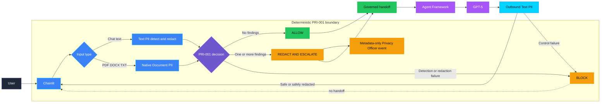
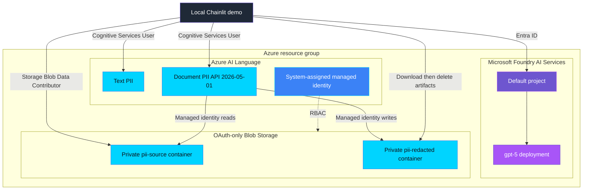

<p align="center">
    
</p>

# PRI-001 — PII exposure

> **Status:** Validated
>
> **Last reviewed:** 2026-08-31 against the Microsoft references below.

## Overview

**Real-life scenario:** An employee pastes a customer's name, phone number,
or a scanned ID into a company chatbot to get help faster. Without a check in
place, that private information could be sent straight into the AI model or
shown back on screen to someone who should never see it.

PRI-001 demonstrates a deterministic PII enforcement boundary around an AI
agent. Chat text uses Azure AI Language Text PII; PDF, DOCX, and TXT uploads use
native Document PII. Raw detected PII never reaches Agent Framework or GPT-5.
The model response passes through the same outbound text control before display.

> **Governance outside the agent; intelligence inside the agent.**

## Demo profile

| Property | Value |
|---|---|
| **Demo format** | Deployable demo |
| **Learning level** | Foundation |
| **Estimated time** | 30–45 minutes after Azure access is available |
| **Primary decision** | Allow safe content, redact and escalate detected PII, or block on control failure |
| **Primary capabilities** | Azure AI Language Text PII, native Document PII, Microsoft Foundry Agent Framework |
| **Deployment** | Required for the core learning outcome |
| **Infrastructure** | Local Chainlit UI, Foundry project/model, Language resource, private Blob containers |
| **AGT / ACS** | Not used in the core demo; the boundary is deliberately visible in host code |

## Demo scope

### Core demo

The runnable path demonstrates one boundary around an agent: inspect inbound
text or native documents, apply a deterministic decision, pass only safe or
redacted content to the agent, and inspect the model response before display.
Microsoft performs native document extraction, PII detection, redaction, and
reconstruction; the demo adds the control decision and safe handoff.

### Intentional simplifications

- The UI runs locally and authenticates with Azure CLI credentials.
- Escalation is a metadata-only local event with an optional webhook, not a
  durable incident-management workflow.
- Public endpoints keep setup approachable; private networking is not deployed.
- The host code shows the boundary directly instead of adding AGT/ACS to this
  foundation-level example.

These choices keep the PII control observable without presenting the demo as a
production privacy platform.

### What this demo proves

- Raw detected PII is not handed to the Foundry agent on the demonstrated path.
- Native PDF, DOCX, and TXT redaction reuses Document PII rather than custom
  extraction and reconstruction.
- Detection, redaction, policy decision, escalation, and handoff are separate,
  testable steps.
- A mandatory detection or redaction failure blocks the agent handoff.

### What this demo does not prove

It does not prove complete PII recall, regulatory compliance, private-network
isolation, durable audit retention, production identity design, or that every
application path outside this demo is mediated.

### Interface preview


## Control contract

| Field | Value |
|---|---|
| **ID** | PRI-001 |
| **Lifecycle phase** | Live |
| **Category / domain** | Privacy |
| **Control / signal** | PII exposure |
| **Evidence / source** | DLP/content safety event |
| **Trigger / threshold** | 1 occurrence |
| **Action / gate effect** | Immediate escalation |
| **Accountable role** | Privacy Officer |

## Control objective

Prevent ungoverned PII from crossing into or out of the AI-agent boundary. The
policy is deterministic: zero findings are allowed, one or more findings require
redaction and immediate metadata-only escalation, and any mandatory enforcement
failure is blocked fail closed.

Detection and redaction are separate outcomes:

| Term | Meaning | Governance consequence |
|---|---|---|
| **Detected** | Azure AI Language returned structured PII findings containing safe metadata such as category and confidence, but no entity value. | Detection drives the PRI-001 decision. One occurrence triggers escalation. |
| **Redacted** | Azure AI Language produced separate transformed text or a native document in which detected values are masked. | Only redacted output—not the original—may cross the enforcement boundary. |

Detection does not prove that redaction succeeded. Agent handoff requires safely
redacted output whenever PII was detected.

## Logical design



## Infrastructure architecture



## Implementation

### Components

| Component | Responsibility | Location |
|---|---|---|
| Chainlit orchestration | Shows Detect → Decide → Redact → Handoff and prevents partial handoff | [src/pri_001/chat.py](src/pri_001/chat.py) |
| Text PII | Detects and redacts inbound chat and outbound model text | [src/pri_001/text_pii.py](src/pri_001/text_pii.py) |
| Native Document PII | Processes PDF, DOCX, and TXT without custom extraction/reconstruction | [src/pri_001/document_pii.py](src/pri_001/document_pii.py) |
| Policy | Applies deterministic `ALLOW`, `REDACT_AND_ESCALATE`, or `BLOCK` decisions | [src/pri_001/policy.py](src/pri_001/policy.py) |
| Escalation | Emits metadata-only Privacy Officer events | [src/pri_001/escalation.py](src/pri_001/escalation.py) |
| Agent adapter | Invokes GPT-5 only with governed content | [src/pri_001/agent.py](src/pri_001/agent.py) |
| Shared infrastructure | Deploys the Foundry project and shared model deployments | [../../../infra/main.bicep](../../../infra/main.bicep) |
| PRI-001 infrastructure | Incrementally deploys Language, Storage, containers, identities, and RBAC | [infra/main.bicep](infra/main.bicep) |

### Decision rules

| Detection | Required redaction | Decision | Handoff |
|---|---|---|---|
| No findings | Not required | `ALLOW` | Original content may continue |
| One or more findings | Succeeded | `REDACT_AND_ESCALATE` | Redacted content only |
| One or more findings | Failed or incomplete | `BLOCK` | None |
| Detection unavailable | Cannot be proven | `BLOCK` | None |

The escalation event contains only the control ID, categories, count, action,
accountable role, source type, timestamp, and event ID. It excludes entity
values, source text, filenames, and document contents.

### Best-practice choices

- Policy enforcement runs outside model reasoning.
- Authentication uses Microsoft Entra ID; local keys and shared-key Blob access
  are disabled.
- Document processing uses a Language managed identity and scoped Storage Blob
  Data Contributor access.
- Uploaded filenames are replaced with UUID-based generic Blob paths.
- Native results and source artifacts are deleted after processing.
- TLS verification remains enabled and uses the operating-system trust store.
- Native Document PII uses the GA `2026-05-01` API instead of a preview version.
- Errors are sanitized and mandatory enforcement fails closed.

### Why native Document PII?

Azure AI Language handles extraction, detection, redaction, and native-file
reconstruction in one asynchronous workflow. It returns both a redacted artifact
and structured JSON results. This avoids a custom PDF/DOCX parsing pipeline,
reduces sensitive intermediate data, and preserves document fidelity.

## Demo

### Prerequisites

- Python 3.10–3.13 and dependencies from this control's requirements file.
- Azure CLI authentication through `az login`.
- Deployed shared infrastructure described in [../../../infra/README.md](../../../infra/README.md).
- A control-local `.env` copied from [.env.example](.env.example).
- Synthetic PII only; do not use real personal data for demonstrations.

### Deploy

From the repository root:

```bash
./infra/deploy.sh
cp controls/privacy/PRI-001_pii_exposure/.env.example controls/privacy/PRI-001_pii_exposure/.env
./controls/privacy/PRI-001_pii_exposure/infra/deploy.sh
```

The first command deploys generic Foundry resources. The control-local script
then adds only PRI-001 resources in incremental mode. Use Bash, not `sh`.

### Inspect in Azure

Open the resource group named by `AZURE_RESOURCE_GROUP` in `infra/.env`. Use
the resource names from the control-local `.env`; do not copy environment-file
contents into issues or screenshots.

| What to inspect | Where in Azure Portal | What to verify and why it matters |
|---|---|---|
| Control deployment | Resource group → **Deployments** → `pri-001-pii-exposure` | Provisioning succeeded and the deployment contains the Language and Storage resources owned by PRI-001. |
| Language identity | Language resource named by `AZURE_LANGUAGE_ACCOUNT_NAME` → **Identity** | A system-assigned managed identity is enabled so native Document PII can access Blob Storage without a stored key. |
| PII containers | Storage account named by `PII_STORAGE_ACCOUNT_NAME` → **Storage browser** → **Blob containers** | The source and redacted containers named by `PII_SOURCE_CONTAINER` and `PII_TARGET_CONTAINER` exist and anonymous access is disabled. |
| Storage authentication | Storage account → **Configuration** | Shared-key access and public Blob access are disabled, OAuth is the default, HTTPS is required, and the minimum TLS version is 1.2. |
| Data-plane access | Storage account and Language resource → **Access control (IAM)** → **Role assignments** | The Language managed identity and the demo operator have **Storage Blob Data Contributor** on Storage; the operator has **Cognitive Services User** on Language. |

Public service endpoints remain enabled in this foundation demo. The controls
above demonstrate identity-based access and private containers, not private
network isolation.

### Run

```bash
cd controls/privacy/PRI-001_pii_exposure
../../../.venv/bin/python -m pip install -r requirements.txt
../../../.venv/bin/chainlit run app.py -w
```

### Expected scenarios

| Scenario | Input | Expected decision | Expected evidence |
|---|---|---|---|
| No PII | A normal governance question | `ALLOW` | `NOT_DETECTED`, redaction not required, governed handoff |
| Synthetic text PII | A synthetic name and email address | `REDACT_AND_ESCALATE` | Redacted preview and metadata-only event reference |
| Synthetic document PII | PDF, DOCX, or TXT up to 10 MB | `REDACT_AND_ESCALATE` | Microsoft-generated redacted file and metadata-only event |
| Language/Storage failure | Unavailable or unauthorized dependency | `BLOCK` | Sanitized fail-closed status and no GPT-5 handoff |
| Model output containing PII | Synthetic model response | Outbound redaction or block | Governed response only |

## Evidence and observability

Safe evidence includes the control ID, action, source type, finding count,
categories, accountable role, timestamp, and correlation/event ID. Logs and
webhook payloads must never contain source text, detected values, uploaded
filenames, original document contents, or model prompts containing PII.

## Security and privacy

- Blob containers are private and shared-key access is disabled.
- Language and local users receive scoped data-plane roles through Azure RBAC.
- Generic source and output names prevent filename disclosure.
- Original and generated Blob artifacts are deleted after download.
- Mixed requests are transactional: an unsupported or failed attachment blocks
  the entire handoff.
- The original document is never sent to GPT-5; non-TXT documents contribute
  metadata only to the agent context.
- The application fails closed when detection, redaction, authorization, polling,
  or artifact retrieval cannot be completed safely.

## Validation

### Automated tests

```bash
../../../.venv/bin/python -m compileall -q src app.py tests
../../../.venv/bin/python -m pytest -q tests
```

Tests cover deterministic policy decisions, fail-closed messaging, generic Blob
names, metadata-only findings, and the user-facing separation of detection from
redaction.

### Manual checks

The implementation has been validated with text and a native PDF workflow,
including asynchronous polling, redacted artifact retrieval, cleanup, GPT-5
handoff, and outbound PII enforcement.

### Known limitations

- The demo supports PDF, DOCX, and TXT files up to 10 MB.
- Local execution uses Azure CLI credentials; a hosted deployment should use its
  workload managed identity.
- Public network access remains enabled in this simple demo architecture.
- RBAC assignments can require propagation time after deployment.
- The metadata webhook is optional and must be configured separately.

## Further exploration

| Topic | Core demo | Possible extension | Microsoft guidance |
|---|---|---|---|
| Identity | Azure CLI for the local host; managed identity between Language and Storage | Use a hosted workload managed identity and least-privilege RBAC | [Managed identities for native documents](https://learn.microsoft.com/azure/ai-services/language-service/native-document-support/managed-identities) |
| Networking | Public service endpoints | Add service firewalls, trusted-resource access, and private networking where supported | [Azure AI services virtual networks](https://learn.microsoft.com/azure/ai-services/cognitive-services-virtual-networks) |
| Audit/evidence | Local metadata event and optional webhook | Send content-safe decisions and cleanup outcomes to a durable governed audit sink | [Azure Monitor overview](https://learn.microsoft.com/azure/azure-monitor/fundamentals/overview) |
| Policy boundary | Explicit host-code boundary | Standardize intervention points and decision telemetry with ACS when multiple agent paths need the same policy | [Agent Control Specification](https://github.com/microsoft/agent-governance-toolkit/tree/main/policy-engine) |
| Operations | Synchronous demo status and best-effort artifact cleanup | Add cleanup monitoring, alerts, retry/recovery, and operational ownership | [Azure Storage monitoring](https://learn.microsoft.com/azure/storage/blobs/monitor-blob-storage) |

These extensions are optional and are not required to complete the core demo.
The links provide follow-up learning paths.

### Community ideas

- Add an optional ACS `input` and `output` adapter without changing the native
  Document PII service boundary.
- Send safe control events to Application Insights with correlation IDs.
- Compare character masking with other supported redaction policies using only
  synthetic documents.

## Cleanup

PRI-001 needs no separate cleanup action: every uploaded document's source blob
and both native-pipeline output artifacts are deleted immediately after each
request completes, including on failure, so no synthetic records persist in
the `pii-source` or `pii-redacted` containers between runs.

Delete the shared demo resource group only when no other control demo depends
on it (this also removes PRI-001's dedicated Storage account and containers):

```bash
az group delete --name <AZURE_RESOURCE_GROUP> --yes --no-wait
```

## References

- [Azure AI Language PII overview](https://learn.microsoft.com/azure/ai-services/language-service/personally-identifiable-information/overview)
- [Text PII quickstart](https://learn.microsoft.com/azure/ai-services/language-service/personally-identifiable-information/quickstart)
- [Document-based PII overview](https://learn.microsoft.com/azure/ai-services/language-service/personally-identifiable-information/document-based-pii-overview)
- [Detect and redact PII in native documents](https://learn.microsoft.com/azure/ai-services/language-service/personally-identifiable-information/how-to/redact-document-pii)
- [Managed identities for native document support](https://learn.microsoft.com/azure/ai-services/language-service/native-document-support/managed-identities)
- [Source governance catalog](../../../docs/Governance%20Signals%20Repo.pdf)

---

<p align="center">
  
</p>
