# Use PRI-001 from Copilot Studio: MCP and A2A

> **Optional.** Nothing in this folder is required to run or understand the
> core [PRI-001 — PII exposure](../../README.md) demo. Skip this folder
> entirely if you only want the core lesson. This is a community-requested
> **extension** of PRI-001, not a separate governance control.

## The community question — and the answer

In the comments of the Forged with Foundry LinkedIn launch post, a community
member asked:

> "I like the PII governance. Can we deploy this and test on a Copilot
> Studio agent via A2A communications?"

**Yes.** This extension demonstrates two integration patterns that let a
Copilot Studio (or any MCP/A2A-capable) agent use the exact same PRI-001
detection and redaction logic already validated in the core demo:

- **MCP** (Model Context Protocol) lets an agent call PII detection and
  redaction as one governed **tool**, alongside its other tools.
- **A2A**, via the official [`a2a-sdk`](https://pypi.org/project/a2a-sdk/),
  lets an agent **delegate an entire task** to a specialized, already-governed
  agent instead of handling it itself.
- Both variants reuse the same PRI-001 policy, detection, and redaction
  code — nothing about the PII decision itself is duplicated.
- A separate **compliance evaluator** checks, for every recorded agent run,
  whether the required control was actually invoked — not just whether the
  MCP/A2A endpoint is reachable.

## What has been validated

| Pattern | Implemented | Locally tested | Live Copilot Studio validation |
|---|---|---|---|
| MCP | Yes | Yes | Yes |
| A2A | Yes | Yes | Yes |
| Per-run compliance evaluation | Yes | Yes | Live cross-system correlation is not yet fully validated |

In plain terms:

- The local demo (below) does not require Copilot Studio, Foundry, or any
  Azure resource — it runs entirely against mocked/synthetic data.
- The **MCP** route has also been exercised against a live, deployed
  Copilot Studio agent — see
  [Live Copilot Studio MCP walkthrough](#live-copilot-studio-mcp-walkthrough).
- The **A2A** route has also been exercised against a second, separate live
  Copilot Studio agent, connected via Copilot Studio's native A2A connector
  — see
  [Live Copilot Studio A2A walkthrough](#live-copilot-studio-a2a-walkthrough).
- Exact, production-grade trace-context propagation across systems (Copilot
  Studio → MCP/A2A tool input) still requires tenant-specific validation;
  this demo passes correlation IDs explicitly instead of relying on
  automatic propagation.

## MCP or A2A?

| | MCP | A2A |
|---|---|---|
| Choose it when | The agent needs PII redaction as one governed capability among its other tools | The agent should delegate an entire task to a specialized, already-governed agent |
| What actually runs | The `redact_text` / `redact_document` MCP tools | A full A2A task handled by the PRI-001-governed Foundry agent |
| What it protects | Only that tool call — and only if the agent chooses to call it | The receiving agent, for whatever delegation actually reaches this endpoint |
| What triggers the gate | The calling agent decides, per turn, whether to invoke the tool | Every inbound A2A task is gated automatically; there is no opt-out inside this adapter |
| Correlation IDs | The caller must supply `agent_id`/`run_id`/`trace_id` as explicit tool arguments | Derived from the A2A task/context IDs when the SDK provides them, or freshly generated otherwise |
| On block or failure | The tool call raises an error back to the calling agent, which decides what happens next | The A2A task itself is marked `FAILED` with an explicit message; the wrapped Foundry agent is never called |
| Who produces the final answer | The calling agent (e.g. Copilot Studio's own model), using the tool's result | This adapter's own governed Foundry agent (`GovernedAgent.run()`), returned as the A2A task result |
| Bypass risk this design cannot close | The calling agent may simply not call the tool for a given turn | The calling agent may choose not to delegate to this endpoint at all |

Copilot Studio can invoke *either* pattern in two ways, and this choice is
symmetric — it is not a difference between MCP and A2A: **dynamically**,
where generative orchestration decides at runtime whether to call the MCP
tool or delegate to the A2A agent, or **deterministically**, by calling the
MCP tool or the A2A agent explicitly from a topic when the routing must be
known in advance. That choice belongs to how the Copilot Studio agent is
authored, not to the protocol itself. What genuinely differs between MCP
and A2A is only what happens *after* Copilot Studio decides to make the
call — summarized in the table above — not whether Copilot Studio is more
or less likely to make it. This repository's live walkthroughs use dynamic
(generative) invocation for both; wiring a topic to call either one
deterministically is a Copilot Studio authoring exercise, not a change to
either server in this folder, and has not been demonstrated here.

Neither protocol, by itself, proves that every agent run used the control —
an agent can always choose not to call an optional tool or not to delegate.
The per-run compliance evidence described below gives **detective**
assurance: it tells you when a required run skipped the control. Turning
that into a **preventive** guarantee requires additionally removing or
blocking every bypass route to the protected action, which this demo does
not attempt.

## What happens during a run

MCP and A2A are two **independent** integration patterns. An integration
uses one of them — not both, and a single request is never routed
dynamically between them at runtime. The diagrams below apply the same
evidence model to each pattern separately.

Two independent sources of evidence make each result trustworthy:

- **Blue nodes** (`agent.run.started`, `agent.run.completed`) prove that a
  run occurred at all — emitted by the demo harness, never by PRI-001.
- **Purple node** (`pii.control.evaluated`) proves that PRI-001 was actually
  evaluated for that run — emitted only by the MCP or A2A adapter.

A run with `agent.run.started`/`agent.run.completed` but no matching
`pii.control.evaluated` event is a **missing** control invocation. It is
never presented as compliant.

### MCP flow

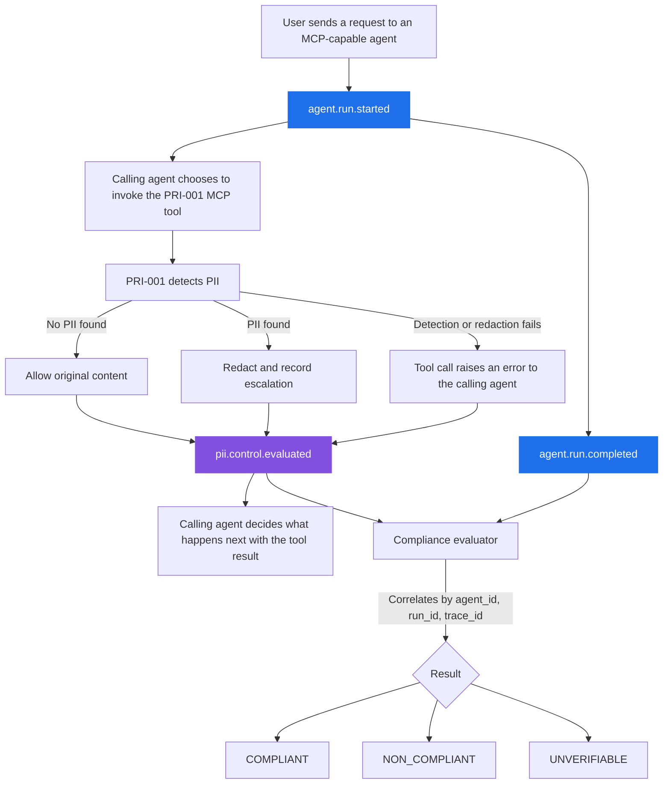
```mermaid
flowchart TB
    U[User sends a request to an MCP-capable agent] --> RS[agent.run.started]
    RS --> MCPN[Calling agent chooses to invoke the PRI-001 MCP tool]
    MCPN --> DET[PRI-001 detects PII]
    DET -->|No PII found| ALLOW[Allow original content]
    DET -->|PII found| REDACT[Redact and record escalation]
    DET -->|Detection or redaction fails| ERR[Tool call raises an error to the calling agent]
    ALLOW --> CE[pii.control.evaluated]
    REDACT --> CE
    ERR --> CE
    CE --> DOWN[Calling agent decides what happens next with the tool result]
    RS --> RC[agent.run.completed]
    RC --> EVAL[Compliance evaluator]
    CE --> EVAL
    EVAL -->|Correlates by agent_id, run_id, trace_id| RESULT{Result}
    RESULT --> COMPLIANT[COMPLIANT]
    RESULT --> NONCOMPLIANT[NON_COMPLIANT]
    RESULT --> UNVERIFIABLE[UNVERIFIABLE]

    classDef runEvidence fill:#1f6feb,stroke:#1f6feb,color:#fff
    classDef controlEvidence fill:#8250df,stroke:#8250df,color:#fff
    class RS,RC runEvidence
    class CE controlEvidence
```

Unlike A2A below, the MCP tool is only ever invoked if the calling agent's
own logic decides to call it — that choice, and everything that happens
after the tool returns or errors, stays with the calling agent.

### A2A flow

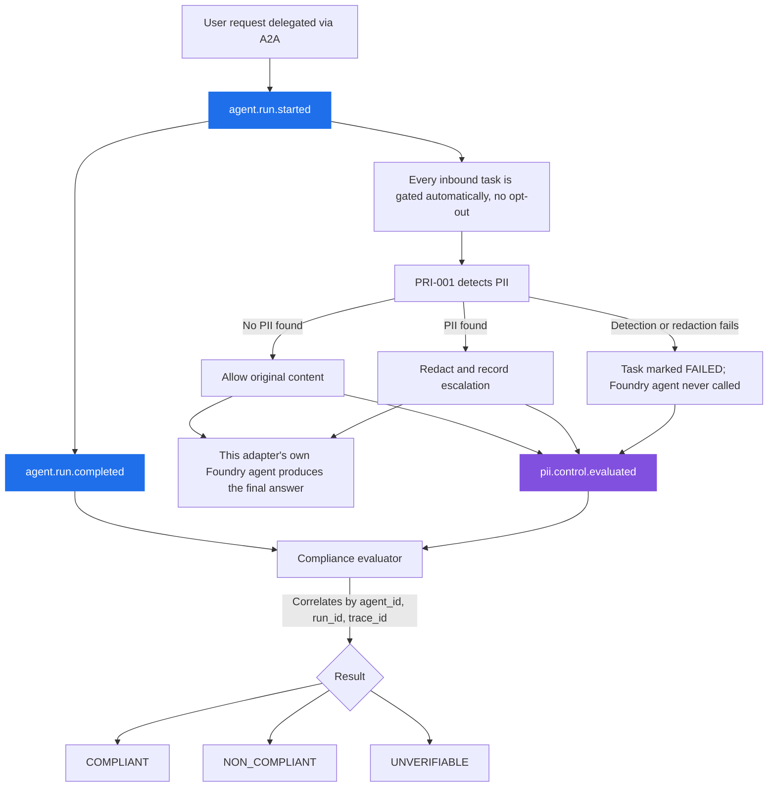
```mermaid
flowchart TB
    U[User request delegated via A2A] --> RS[agent.run.started]
    RS --> A2AN[Every inbound task is gated automatically, no opt-out]
    A2AN --> DET[PRI-001 detects PII]
    DET -->|No PII found| ALLOW[Allow original content]
    DET -->|PII found| REDACT[Redact and record escalation]
    DET -->|Detection or redaction fails| BLOCK[Task marked FAILED; Foundry agent never called]
    ALLOW --> CE[pii.control.evaluated]
    REDACT --> CE
    BLOCK --> CE
    ALLOW --> DOWN[This adapter's own Foundry agent produces the final answer]
    REDACT --> DOWN
    RS --> RC[agent.run.completed]
    RC --> EVAL[Compliance evaluator]
    CE --> EVAL
    EVAL -->|Correlates by agent_id, run_id, trace_id| RESULT{Result}
    RESULT --> COMPLIANT[COMPLIANT]
    RESULT --> NONCOMPLIANT[NON_COMPLIANT]
    RESULT --> UNVERIFIABLE[UNVERIFIABLE]

    classDef runEvidence fill:#1f6feb,stroke:#1f6feb,color:#fff
    classDef controlEvidence fill:#8250df,stroke:#8250df,color:#fff
    class RS,RC runEvidence
    class CE controlEvidence
```

Unlike MCP above, this gate is mandatory for every task this endpoint
receives, and on failure the task ends there — the wrapped Foundry agent is
never invoked, so no answer is produced from ungoverned content.

## Quick local demonstration

The shortest path reproduces the whole measurement loop — including a
deliberately skipped control call — with no server, no Azure resource, and
no Copilot Studio tenant:

```bash
cd controls/privacy/PRI-001_pii_exposure/community/CR-001_copilot_studio_interop
../../../../../.venv/bin/python -m pip install -r requirements.txt
PYTHONPATH="../..:." ../../../../../.venv/bin/python -m src.cr001_interop.demo_runner
PYTHONPATH="../..:." ../../../../../.venv/bin/python -m src.cr001_interop.compliance_evaluator
```

`demo_runner.py` simulates three runs and calls the MCP gate in-process for
two of them, but deliberately skips it for the third — so the evaluator has
a real gap to report, not just a clean pass:

```text
Agent                 Platform        Required  Valid   Missing  Failed  Coverage  Status
-----------------------------------------------------------------------------------------
copilot-pii-demo      copilot_studio  2         1       1        0       50%       NON_COMPLIANT
foundry-pii-demo      foundry         0         0       0        0       0%        NO_ACTIVITY
```

`copilot-pii-demo` shows `NON_COMPLIANT` because one of its two required
runs has no matching control attestation. `foundry-pii-demo` shows
`NO_ACTIVITY` because no runs were recorded for it in this simulation — a
distinct status from being compliant, since nothing was actually observed.

<details>
<summary>Run the MCP or A2A server standalone</summary>

Use these if you want to connect a real MCP or A2A client (including a live
Copilot Studio agent) to a running server, instead of the in-process demo
above.

**MCP server:**

```bash
cd controls/privacy/PRI-001_pii_exposure/community/CR-001_copilot_studio_interop
../../../../../.venv/bin/python -m pip install -r requirements.txt
PYTHONPATH="../..:." ../../../../../.venv/bin/uvicorn src.cr001_interop.mcp_server:create_app --factory --port 8001
```

**A2A server:**

```bash
cd controls/privacy/PRI-001_pii_exposure/community/CR-001_copilot_studio_interop
PYTHONPATH="../..:." ../../../../../.venv/bin/uvicorn src.cr001_interop.a2a_server:create_app --factory --port 9999
```

Both run with no authentication by default — see
[Security and production considerations](#security-and-production-considerations).

</details>

## Live Copilot Studio MCP walkthrough

> [!WARNING]
> The deployed endpoint below is a **demonstration artifact with no
> production-grade authentication** (see
> [Security and production considerations](#security-and-production-considerations)).
> Only send synthetic data to it — never real personal data.

The MCP server in this folder is deployed to Azure App Service and was
wired into a real Copilot Studio agent to prove the MCP route end to end.
Sending a message with synthetic PII in the agent's **Preview** pane
triggers `redact_text`, and the agent answers using only the redacted
content:

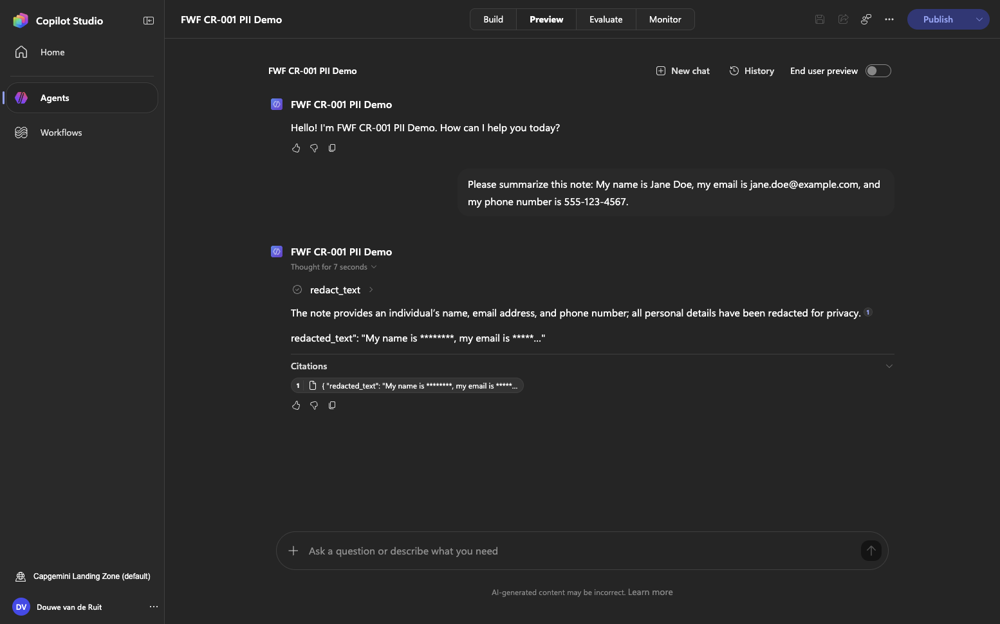

Expanding the tool call in the Preview trace shows the real MCP response —
`redacted_text` with the PII spans masked, `pii_count: 3`,
`categories: ["Email", "Person", "PhoneNumber"]`,
`action: "redact_and_escalate"` — confirming the deployed MCP server, the
Copilot Studio tool wiring, and the Azure AI Language redaction all work
end to end.

**Prerequisites** for wiring a live agent this way:

- A Power Platform Sandbox or Production environment (Developer
  environments don't support pay-as-you-go billing).
- Either prepaid Copilot Studio message capacity, or an Azure subscription
  linked to the environment through a Power Platform billing policy with
  the Copilot Studio message meter enabled — see
  [Pay-as-you-go plan overview](https://learn.microsoft.com/power-platform/admin/pay-as-you-go-overview).

<details>
<summary>Full setup screenshot sequence</summary>

1. Build a new agent and give it instructions that require the PII tool
   before forwarding any user-supplied text.

   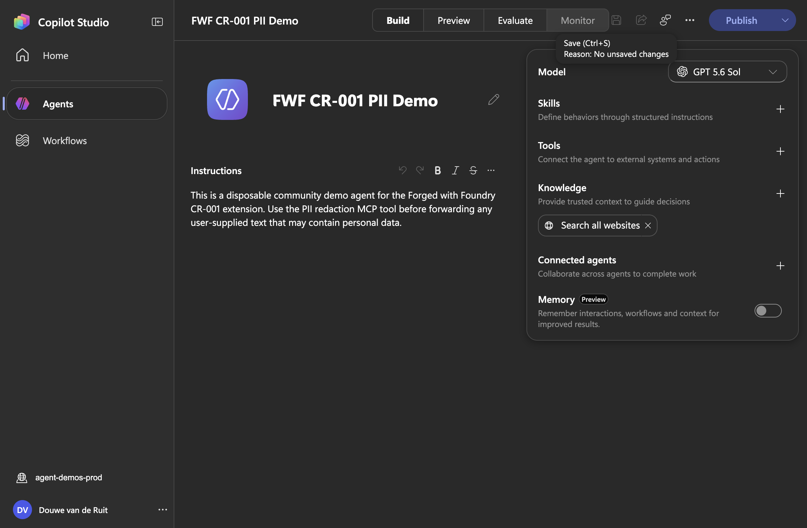

2. **Add a tool** — the built-in **Model Context Protocol (MCP)** tab only
   lists curated first-party MCP servers (Dataverse, SharePoint, Fabric,
   and similar); there's no entry for an arbitrary MCP endpoint here.

   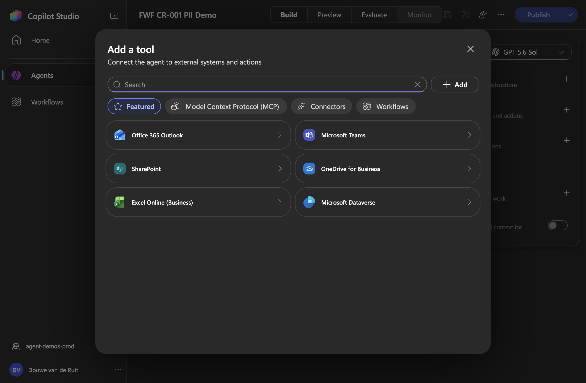
   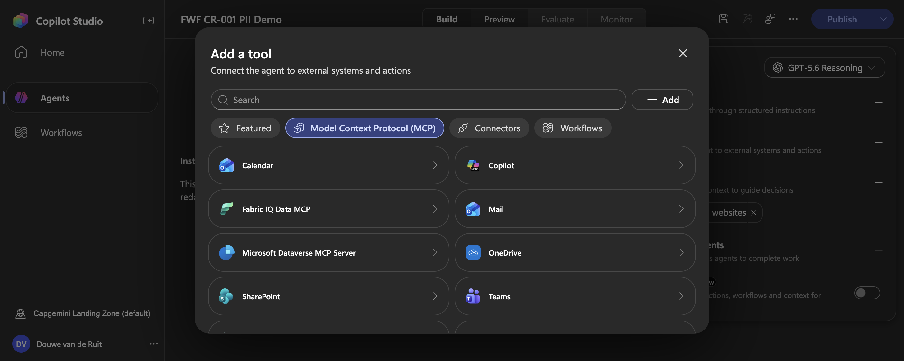

3. Use **Add → Model Context Protocol (MCP)** instead, which registers a
   custom MCP server pointed at the deployed endpoint's `/mcp` route. This
   is the native way to register a custom MCP server as of this pass.

   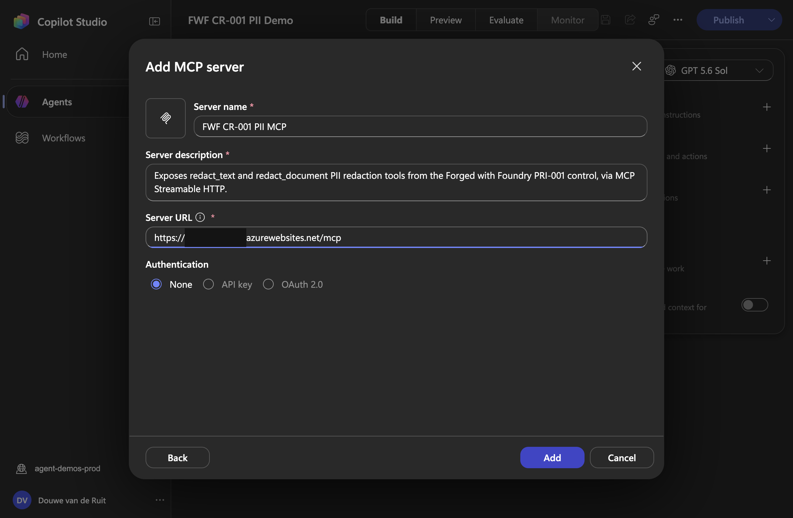

4. Select and create a connection for the new server; the tool then
   appears attached to the agent.

   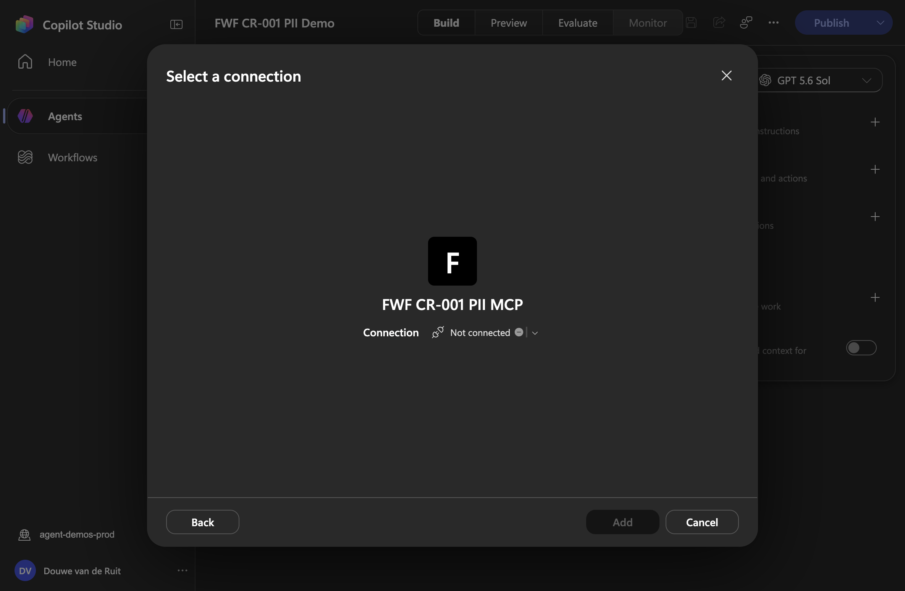
   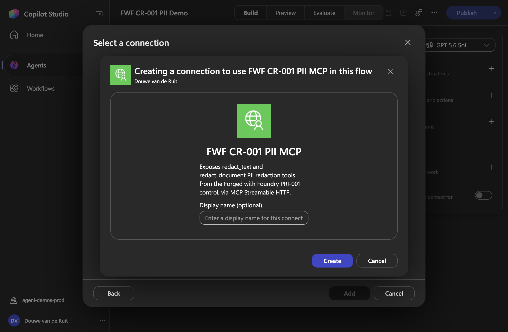
   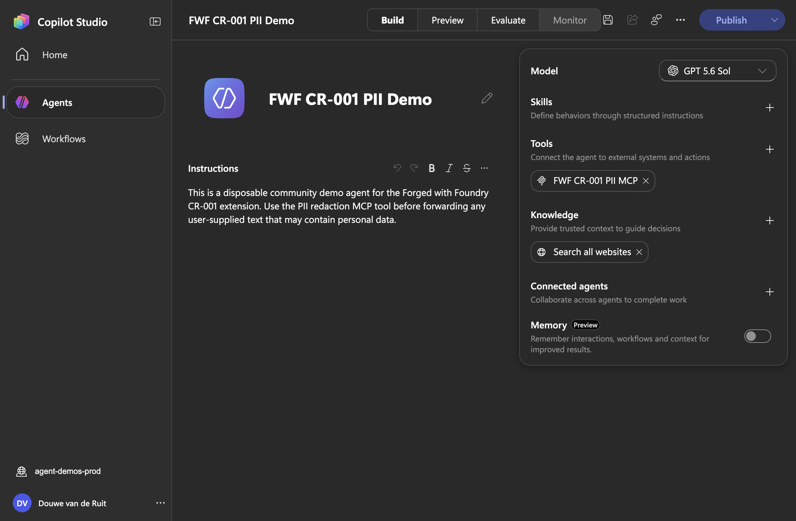

5. In **Preview**, send a message containing synthetic PII and **Allow**
   the tool-permission prompt. Expanding the tool call shows the full,
   real MCP response.

   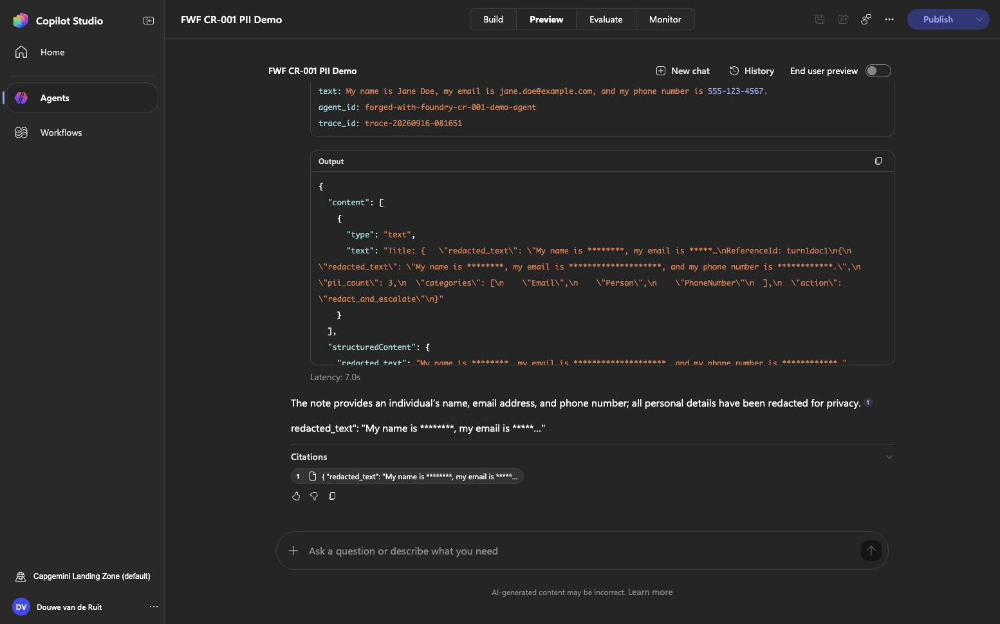

</details>

<details>
<summary>Deployment troubleshooting</summary>

The deployed MCP server's zip package must include the `policy/` folder
(`acs_interop_manifest.yaml`) alongside `src/`. An earlier version of
`infra/deploy.sh` omitted it, which made every live tool call fail with a
missing-manifest error even though the server itself started successfully.
`infra/deploy.sh` now copies `policy/` into the deployment package — if you
see `No such file or directory: '.../policy/acs_interop_manifest.yaml'` in a
tool call trace, check that your deploy script still does this.

</details>

## Live Copilot Studio A2A walkthrough

> [!WARNING]
> The deployed endpoint below is a **demonstration artifact with no
> production-grade authentication** (see
> [Security and production considerations](#security-and-production-considerations)).
> Only send synthetic data to it — never real personal data.

The A2A server in this folder is deployed to its own Azure App Service
(sharing the MCP variant's App Service Plan) and was connected to a
**second, separate** Copilot Studio agent to prove the A2A route end to
end, independent of the MCP demo agent. Sending a message with synthetic
PII in the agent's **Test** pane delegates the task to the connected A2A
agent, which answers using only redacted content:

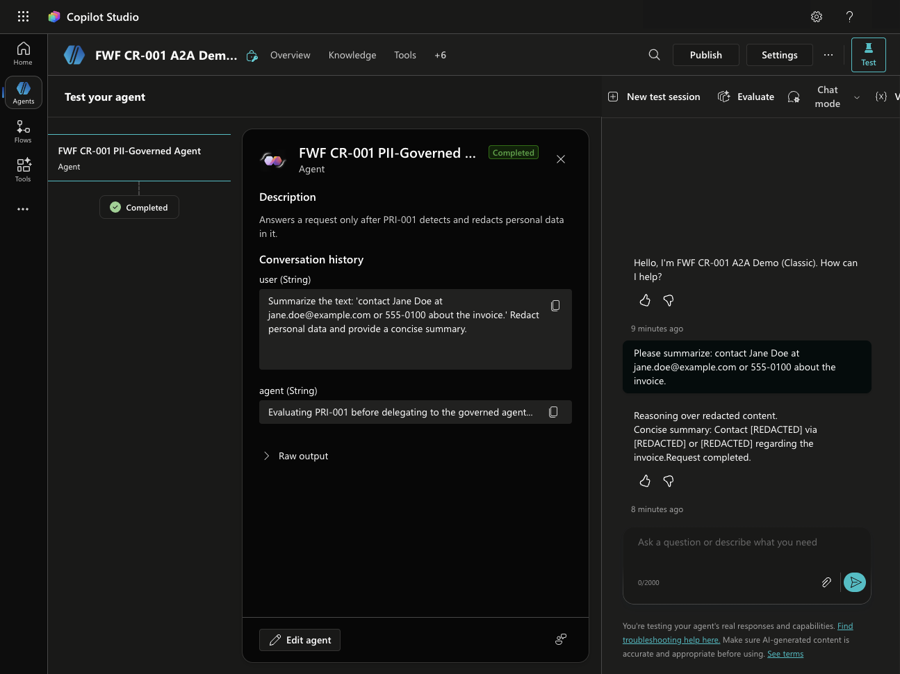

The connected agent's own trace shows the exact same result: the user
message is delegated, PRI-001 evaluates it (`"Evaluating PRI-001 before
delegating to the governed agent..."`), and the Foundry agent's completed
answer — `"Reasoning over redacted content. Concise summary: Contact
[REDACTED] via [REDACTED] or [REDACTED] regarding the invoice."` — never
contains the original name, email, or phone number, confirming the deployed
A2A server, the Copilot Studio A2A connection, and the shared Foundry
project all work end to end.

**Prerequisites** are the same as the MCP walkthrough: a Power Platform
Sandbox or Production environment, plus either prepaid Copilot Studio
message capacity or a linked Azure subscription with the Copilot Studio
message meter enabled.

<details>
<summary>Full setup screenshot sequence</summary>

1. Build a second agent, separate from the MCP demo agent, to host the A2A
   connection. On its **Agents** tab, select **Add an agent**.

   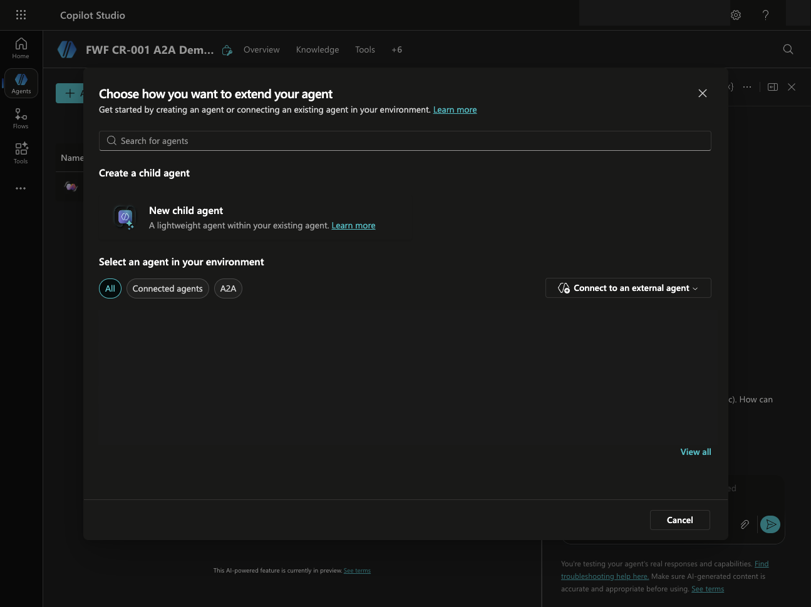

2. Select **Connect to an external agent → Agent2Agent** — Copilot Studio's
   native A2A connector, alongside Microsoft Fabric, Microsoft Foundry, and
   Microsoft 365 Agents SDK connectors.

   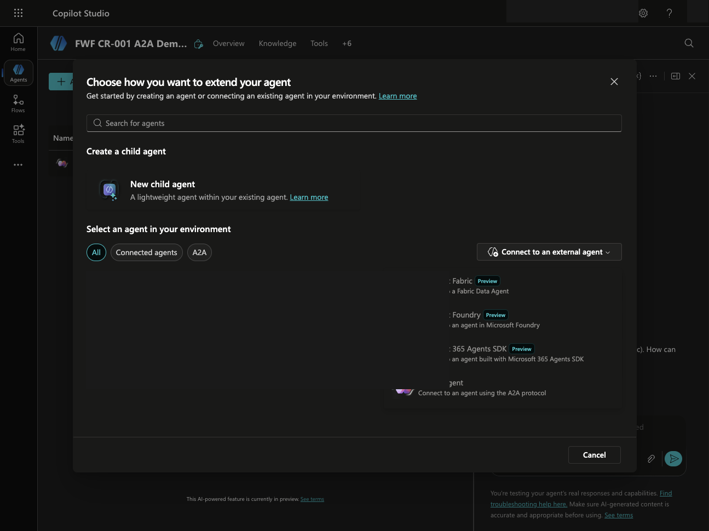

3. Enter the deployed A2A server's base URL as the **Agent endpoint URL**
   (not the agent-card URL), then **Name** and **Description**, and leave
   **Authentication** set to **None** (matching the MCP walkthrough's NoAuth
   demo stance).

   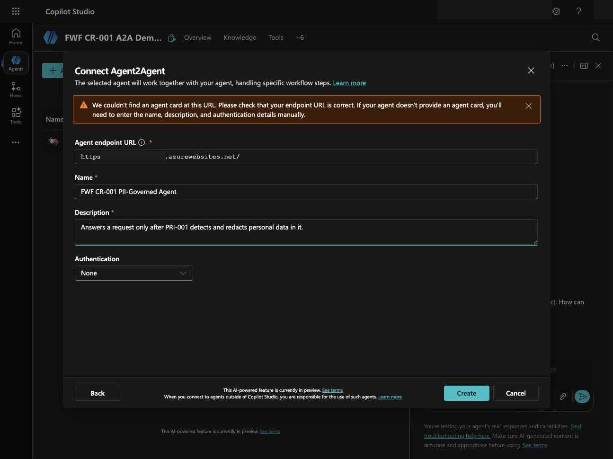

4. Once connected, the agent appears on the **Agents** tab as `Connected`,
   triggered `By agent` — Copilot Studio's generative orchestration decides
   per turn whether to delegate to it (see
   [What happens during a run](#what-happens-during-a-run) for how this
   compares to a topic-driven, deterministic invocation).

   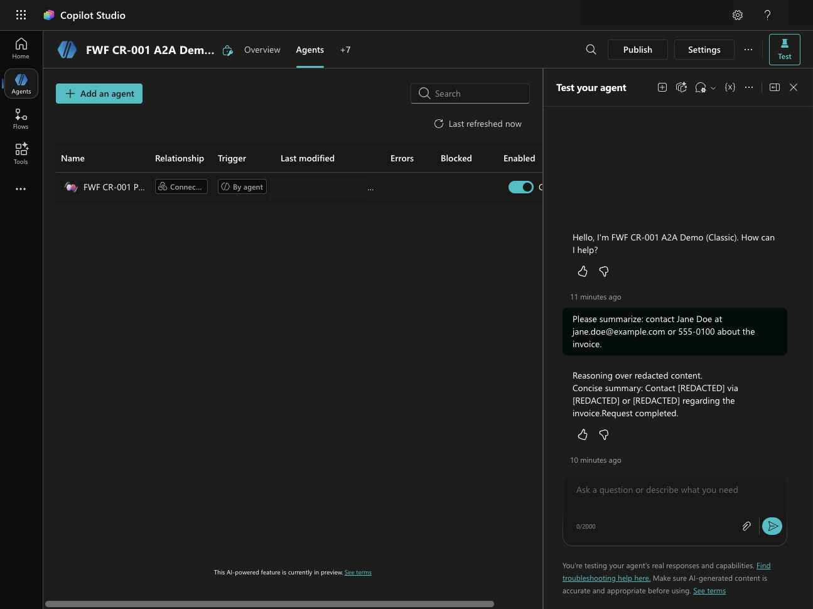

5. The connected agent's own details page confirms **Agent may use this
   tool at any time** (the dynamic/generative invocation mode) and shows
   the same live, redacted test result in the Test pane.

   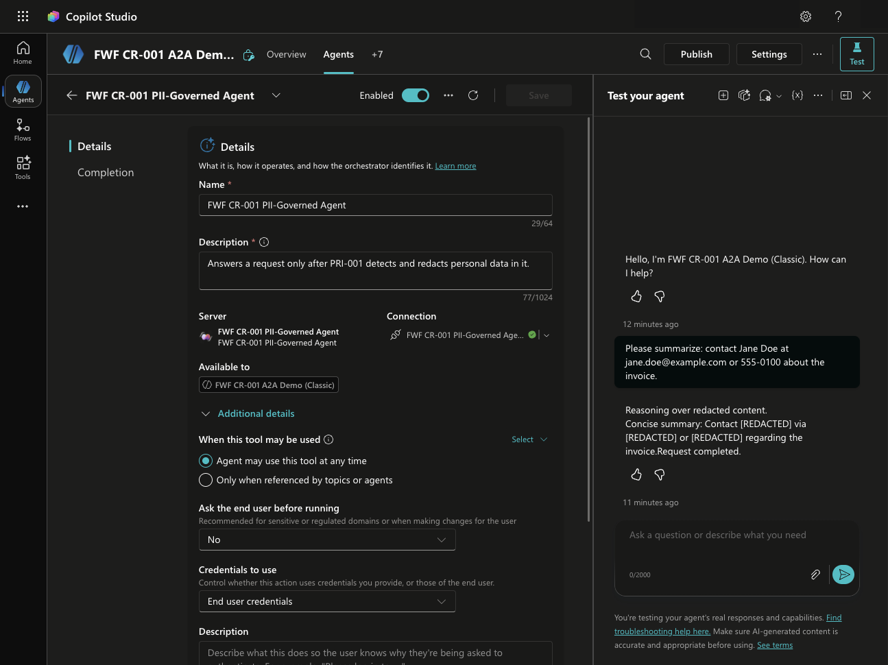

</details>

<details>
<summary>Deployment troubleshooting</summary>

**Agent-card auto-discovery fails over CORS, not a real outage.** When
entering the endpoint URL, Copilot Studio's browser-side auto-discovery
tries to fetch the agent card directly from the browser and shows *"We
couldn't find an agent card at this URL"* — confirmed (via browser console)
to be a CORS rejection (`a2a-sdk`'s Starlette app sends no
`Access-Control-Allow-Origin` header), not a reachability problem: the same
card resolves correctly over a direct, non-browser request to
`/.well-known/agent-card.json`. Enter **Name** and **Description**
manually when this happens; the connection itself works normally once
created.

**A second App Service is required, not a second route on the same one.**
The MCP and A2A servers run different ASGI apps (`mcp_server:create_app` vs
`a2a_server:create_app`), so each needs its own `az webapp deploy` target —
see `infra/main.bicep`'s `a2aAppService` resource — even though both share
the same App Service Plan and the same deployed code package.

</details>

## How per-run compliance evidence works

[`evidence.py`](src/cr001_interop/evidence.py) defines one event schema
shared by both adapters and the evaluator. It has **no field for prompts,
messages, detected PII values, redacted text, or tool arguments** — that is
a structural guarantee (there is no place to put that data), not a
redaction step applied afterward. Events are written, unsampled, to a local
JSONL file (`interop_evidence.jsonl`, gitignored).

[`compliance_evaluator.py`](src/cr001_interop/compliance_evaluator.py)
compares two independently emitted event streams per agent:

1. `agent.run.started` / `agent.run.completed` — the run inventory, emitted
   only by the demo harness (`demo_runner.py`), never by PRI-001 itself.
2. `pii.control.evaluated` — the control attestation, emitted only by the
   MCP or A2A adapter when PRI-001 actually ran.

A run counts as covered only if it has both a start/completion pair **and**
a matching, valid attestation for the same `run_id`. This is why counting
MCP/A2A endpoint calls alone is not enough: without the independent run
inventory there is nothing to compare the call count against, so a skipped
call is invisible.

<details>
<summary>Attestation validation rules and status definitions</summary>

A `pii.control.evaluated` event only counts as a **valid** attestation if it
matches the run's `agent_id`, references `PRI-001` as `control_id`, uses a
protocol allowed for that agent in `policy/agent_scope.yaml`, carries the
shared `policy_version`, has `decision` in `{allow, redact, deny}` (never
`error`), and falls between the run's start and completion timestamps.
`deny` counts as a **successful** control execution, not a failure — the
control ran and produced a decision.

Duplicate events (matched by `event_id`) never inflate coverage. Coverage is
`valid attestations / distinct required runs` — never derived from raw
endpoint-call counts.

Statuses:

- `COMPLIANT` — every required run has a valid attestation.
- `NON_COMPLIANT` — at least one required run has no valid attestation.
- `CONTROL_FAILED` — an attestation exists but the control itself errored.
- `UNVERIFIABLE` — evidence is incomplete or cannot be correlated, and
  coverage is neither 100% nor missing outright.
- `NO_ACTIVITY` — no runs were recorded for this agent at all; this is not
  the same as compliant.

[`policy/agent_scope.yaml`](policy/agent_scope.yaml) declares which agents
require PRI-001, on which platform, and over which protocols. It is
validated at load time by
[`policy_scope.py`](src/cr001_interop/policy_scope.py): a duplicate
`agent_id`, an unsupported protocol, or a missing required field all raise
rather than silently skipping an agent.

</details>

## Technical reference

**MCP variant** — [`mcp_server.py`](src/cr001_interop/mcp_server.py) exposes
`redact_text` and `redact_document` as MCP tools over Streamable HTTP,
reusing core PRI-001's detection/redaction/escalation code unchanged. Both
tools accept `agent_id`/`run_id`/`trace_id` as explicit arguments for
correlation, and are routed through the same ACS
`pre_tool_call`/`post_tool_call` gate PRI-001 already uses
([`acs_gate.py`](src/cr001_interop/acs_gate.py)).

**A2A variant** — [`a2a_server.py`](src/cr001_interop/a2a_server.py) uses
the official `a2a-sdk` to expose the existing PII-governed Foundry agent
(core `agent.py`, unchanged) as an A2A server. It derives `run_id`/
`trace_id` from the A2A task/context IDs where the SDK provides them, and
otherwise generates a fresh ID rather than guessing — this demo never
claims trace propagation it cannot actually observe.

<details>
<summary>Copilot Studio and Foundry telemetry guidance</summary>

**Copilot Studio:** agent-level Application Insights/OpenTelemetry telemetry
would provide an independent run inventory in a live tenant; the MCP/A2A
calls above provide the matching control evidence. Distributed trace
correlation is preferred, but exact per-run trace-context propagation from a
live Copilot Studio tenant into MCP/A2A tool inputs has not been validated
in this pass. If reliable correlation cannot be established, the evaluator
must return `UNVERIFIABLE`, never a false compliant result. Where automatic
propagation isn't available, pass a correlation value explicitly through
configured tool inputs or the A2A `messageId`/`contextId`, as this demo does.

**Foundry:** instrument the demo application (`demo_runner.py`) so every run
emits `agent.run.started`/`agent.run.completed` independently of the
MCP/A2A call, sharing the same `run_id` and trace context — kept outside
the PII policy logic itself.

An optional OpenTelemetry/Application Insights exporter in
[`evidence.py`](src/cr001_interop/evidence.py) activates only when
`APPLICATIONINSIGHTS_CONNECTION_STRING` is set; the local JSONL sink stays
the authoritative source either way.

</details>

## What this proves

- Measurement is a **detective** control: it reports whether the required
  control ran, and does not by itself force tool or agent selection.
- A policy owner can measure control coverage for every observed run.
- Both MCP and A2A reuse the exact same PRI-001 policy, detection, and
  redaction logic — the decision is not reimplemented per protocol.
- Both the MCP and A2A routes work end to end against real, deployed,
  separate Copilot Studio agents, not only in local tests.

## What this does not prove

- 100% endpoint coverage demonstrates execution of PRI-001 within this
  technical scope, not general GDPR or legal compliance.
- When Copilot Studio is the entry point, the original prompt has already
  reached Copilot Studio before MCP or A2A selection happens. This demo
  proves protection *before* the external Foundry agent or downstream
  action — not before Copilot Studio itself.
- Missing telemetry is never interpreted as compliant.
- Neither live walkthrough demonstrates deterministic, topic-driven
  invocation (see [What happens during a run](#what-happens-during-a-run))
  — both use Copilot Studio's default generative/dynamic orchestration.
- This demo does not claim production-grade or tenant-wide enforcement.

## Security and production considerations

**Both deployed endpoints in the live walkthroughs run with no
authentication.** The custom Copilot Studio MCP connector and the A2A
connection both use `NoAuth`/**None**, and `mcp_server.py`'s optional
`BearerAuthMiddleware` (`CR001_ENTRA_TENANT_ID`/`CR001_ENTRA_AUDIENCE`) is
left disabled, so the walkthroughs stay reproducible without a second
Entra app registration and OAuth connection. This is an intentional demo
simplification, kept approachable — not a production posture.

A production deployment should, at minimum:

- Set `CR001_ENTRA_TENANT_ID` and `CR001_ENTRA_AUDIENCE` to enable the
  built-in bearer-token boundary, and register the Copilot Studio connector
  with a matching Entra ID OAuth 2.0 connection instead of `NoAuth`, so only
  the intended Copilot Studio agent — and nothing else on the public
  internet — can call `redact_text`/`redact_document`.
- Add an equivalent authentication boundary in front of the A2A server
  (its `Authentication: None` setting has no built-in bearer-token option
  in this repo yet — treat this as a genuine gap to close before any
  non-demo use, not just a config toggle to flip).
- Add authorization (not just authentication) scoped to the calling agent.
- Add monitoring, alerting, and rate limiting in front of the endpoint.
- Deploy behind an appropriate network boundary (private endpoint, API
  Management, or equivalent) instead of a fully public App Service URL.
- Never send real personal data to a demo or test deployment of this
  extension.

## Cleanup

Running the MCP/A2A servers and the compliance evaluator locally creates no
Azure resources — only the local `interop_evidence.jsonl` file (gitignored):

```bash
rm -f interop_evidence.jsonl
```

If you also deployed the MCP and/or A2A servers via
[`infra/deploy.sh`](infra/), remove them directly (they do not share a
resource group with, or require deleting, any other control's resources):

```bash
az webapp delete --name "${CR001_APP_SERVICE_NAME:-fwf-cr001-mcp}" --resource-group "${AZURE_RESOURCE_GROUP}"
az webapp delete --name "${CR001_A2A_APP_SERVICE_NAME:-fwf-cr001-a2a}" --resource-group "${AZURE_RESOURCE_GROUP}"
az appservice plan delete --name "${CR001_APP_SERVICE_PLAN_NAME:-fwf-cr001-plan}" --resource-group "${AZURE_RESOURCE_GROUP}" --yes
```
