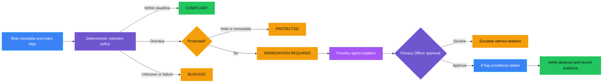
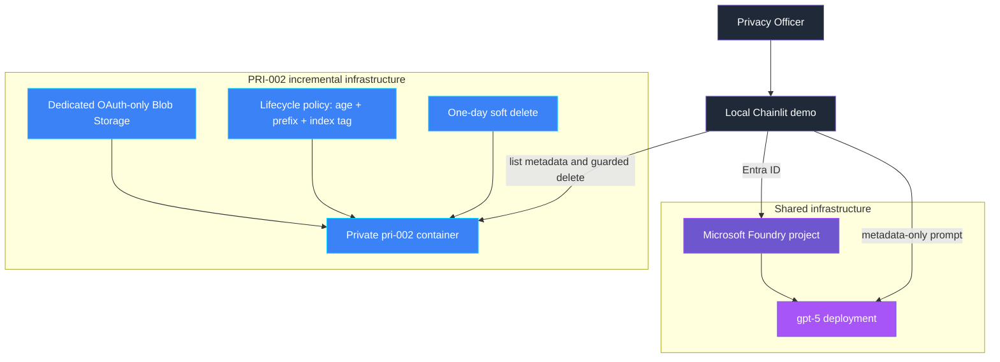

<p align="center">
  
</p>

# PRI-002 — Retention violation

> **Status:** Implemented
>
> **Last reviewed:** 2026-08-31 against the Microsoft references below.

## Overview

PRI-002 demonstrates a retention exception in Azure Blob Storage and a guarded
response. Azure Blob Lifecycle Management is the primary platform control. A
deterministic scanner independently finds records that remain active after
their retention deadline, while a Microsoft Foundry agent explains the result.
Deletion requires explicit human approval and an unchanged Blob ETag.

> **The control decides; the agent explains and orchestrates.**

### Purview and Azure Lifecycle Management

Microsoft Purview retention labels govern supported Microsoft 365 content such
as documents, email, and records. Azure Blob Storage uses Lifecycle Management
policies based on object age, path prefixes, and optional Blob index tags.
Organizations can map business retention classes from a policy catalog to
those tags and rules. **This demo shows the Azure Blob Lifecycle Management
scenario, not a Purview retention-label implementation.**

## Control contract

| Field | Value |
|---|---|
| **ID** | PRI-002 |
| **Lifecycle phase** | Live |
| **Category / domain** | Privacy |
| **Control / signal** | Retention violation |
| **Evidence / source** | Retention checks |
| **Trigger / threshold** | 1 exception |
| **Action / gate effect** | Remediate/delete |
| **Accountable role** | Privacy Officer |

## Control objective

Detect records that remain active beyond their retention period and grace
period, then make remediation controlled, reviewable, and verifiable. Missing
policy metadata, unavailable dependencies, stale object state, legal holds,
and immutability fail closed or prohibit deletion.

## Logical design



## Infrastructure architecture



## Implementation

### Components

| Component | Responsibility | Location |
|---|---|---|
| Chainlit orchestration | Guided seed, scan, explain, approve, remediate, and cleanup flow | [src/pri_002/chat.py](src/pri_002/chat.py) |
| Deterministic policy | Calculates deadlines and returns compliant, actionable, protected, or blocked | [src/pri_002/policy.py](src/pri_002/policy.py) |
| Blob adapter | Lists metadata/tags, enforces scope, conditionally deletes, and verifies | [src/pri_002/storage.py](src/pri_002/storage.py) |
| Approval registry | Issues one-time approvals bound to decision, Blob path, ETag, and expiry | [src/pri_002/approval.py](src/pri_002/approval.py) |
| Foundry agent | Explains only metadata-safe deterministic decisions | [src/pri_002/agent.py](src/pri_002/agent.py) |
| Evidence | Emits metadata-only remediation evidence | [src/pri_002/evidence.py](src/pri_002/evidence.py) |
| Infrastructure | Owns Storage, lifecycle policy, soft delete, container, and RBAC | [infra/main.bicep](infra/main.bicep) |

### Agent role and authority

The agent receives `RetentionDecision.safe_dict()` values only. It may explain
outcomes and required approval. It may not inspect payloads, alter a decision,
grant approval, remove a hold or immutability policy, or claim deletion. The
guarded Blob adapter is the only destructive tool path.

### Decision rules

| Condition | Decision | Action |
|---|---|---|
| Within retention plus grace period | `COMPLIANT` | No deletion |
| Deadline passed and no protection | `REMEDIATION_REQUIRED` | Human review and guarded deletion |
| Legal hold or immutability exists | `PROTECTED` | Deletion prohibited |
| Policy metadata is unknown or scanning fails | `BLOCKED` | Fail closed and investigate |

Azure does not let the demo backdate a Blob's service-managed `last_modified`
value, and lifecycle evaluation is asynchronous. Synthetic records therefore
use `DemoAgeDays` to project an evaluation time for immediate teaching
feedback. Production code must use authoritative dates instead.

## Demo

### Prerequisites

- Python 3.10–3.13 and this control's dependencies.
- Azure CLI authentication through `az login`.
- Shared infrastructure deployed first.
- A PRI-002 `.env` copied from [.env.example](.env.example).
- Synthetic data only.

### Deploy

From the repository root:

```bash
./infra/deploy.sh
cp controls/privacy/PRI-002_retention_violation/.env.example controls/privacy/PRI-002_retention_violation/.env
./controls/privacy/PRI-002_retention_violation/infra/deploy.sh
```

The first deployment owns generic Foundry resources. The second incrementally
adds only PRI-002 resources and writes its Blob endpoint to the control-local
`.env`.

### Run

```bash
cd controls/privacy/PRI-002_retention_violation
../../../.venv/bin/python -m pip install -r requirements.txt
../../../.venv/bin/chainlit run app.py -w
```

Use the buttons in order: create synthetic records, scan, review the agent
explanation, and approve or decline the one actionable deletion.

### Expected scenarios

| Synthetic scenario | Expected decision | Expected response |
|---|---|---|
| 10-day correctly tagged record | `COMPLIANT` | No action |
| 45-day record missing lifecycle tag | `REMEDIATION_REQUIRED` | Explicit approval, conditional deletion, verification |
| 45-day record with simulated legal hold | `PROTECTED` | Deletion prohibited and escalation |
| Missing metadata or unavailable Storage | `BLOCKED` | Fail closed; no destructive action |

## Evidence and observability

Evidence contains the control and decision IDs, a hash of the record reference,
retention class, age and policy days, lifecycle coverage, decision,
human-approval flag, remediation status, verification result, timestamp, and
accountable role. It excludes Blob content, Blob path, ETag, and approval token.

## Security and privacy

- The dedicated account disables Blob public access and shared-key access.
- Microsoft Entra ID and scoped Azure RBAC provide data-plane access.
- Scans list metadata and tags only; no Blob payload is downloaded.
- The adapter only operates in a `pri-002-*` container and `records/` prefix.
- Approval tokens expire, are single-use, and bind to the exact ETag.
- Deletion uses `IfNotModified` and verifies active absence.
- One-day soft delete provides recovery; active absence is not physical erasure.
- Legal holds and immutability are never removed by the demo.

## Validation

```bash
../../../.venv/bin/python -m compileall -q src app.py tests
../../../.venv/bin/python -m pytest -q tests
```

Tests cover deadline decisions, lifecycle coverage, protected and blocked
records, metadata-safe agent payloads, approval expiry, ETag binding, and
single-use approval.

### Known limitations

- `DemoAgeDays` and `DemoLegalHold` are teaching projections, not production
  authorities.
- Azure Lifecycle Management runs asynchronously and does not guarantee an
  exact deletion time.
- Public network access remains enabled for this local demo.
- Evidence is logged locally rather than sent to an immutable audit store.
- In-memory approvals are suitable for a single-process demo only.

## Cleanup

Use **Cleanup demo records** in the UI to remove only synthetic `records/`
Blobs. Keep the dedicated account if the control will be rerun. Deleting the
shared resource group also removes other demos and must only be done when the
whole environment is no longer needed.

## References

- [Microsoft Purview retention](https://learn.microsoft.com/purview/retention)
- [Learn about retention policies and retention labels](https://learn.microsoft.com/purview/retention-learn-about-retention)
- [Azure Blob Storage lifecycle management overview](https://learn.microsoft.com/azure/storage/blobs/lifecycle-management-overview)
- [Configure a lifecycle management policy](https://learn.microsoft.com/azure/storage/blobs/lifecycle-management-policy-configure)
- [Manage and find data with Blob index tags](https://learn.microsoft.com/azure/storage/blobs/storage-manage-find-blobs)
- [Authorize Blob access with Microsoft Entra ID](https://learn.microsoft.com/azure/storage/blobs/authorize-access-azure-active-directory)
- [Delete and restore Azure Blobs with Python](https://learn.microsoft.com/azure/storage/blobs/storage-blob-delete-python)
- [Conditional Blob operations](https://learn.microsoft.com/rest/api/storageservices/specifying-conditional-headers-for-blob-service-operations)
- [Source governance catalog](../../../docs/Governance%20Signals%20Repo.pdf)

---

<p align="center">
  
</p>
