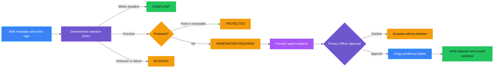
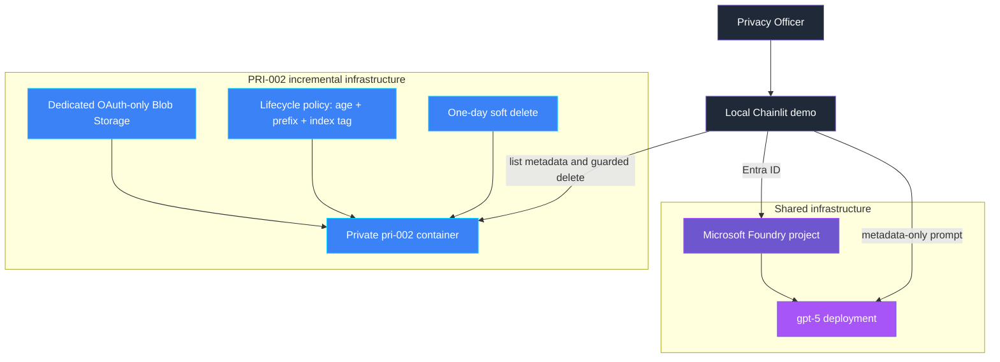

<p align="center">
  
</p>

# PRI-002 — Retention violation

> **Status:** Implemented
>
> **Last reviewed:** 2026-08-31 against the Microsoft references below.

## Overview

**Real-life scenario:** A company promises customers it deletes chat records
after 30 days. One record gets the wrong label by mistake and quietly stays
around long after it should be gone — nobody notices because the automated
cleanup only looks at records with the correct label.

PRI-002 demonstrates a retention exception in Azure Blob Storage and a guarded
response. Azure Blob Lifecycle Management is the primary platform control. A
deterministic scanner independently finds records that remain active after
their retention deadline, while a Microsoft Foundry agent explains the result.
Deletion requires explicit human approval and an unchanged Blob ETag.

> **The control decides; the agent explains and orchestrates.**

## Demo profile

| Property | Value |
|---|---|
| **Demo format** | Deployable demo |
| **Learning level** | Foundation / Intermediate |
| **Estimated time** | 30–45 minutes after Azure access is available |
| **Primary decision** | Keep, protect, block, or request guarded remediation for an overdue Blob record |
| **Primary capabilities** | Azure Blob Lifecycle Management, Blob index tags, ETag conditions, Microsoft Foundry Agent Framework |
| **Deployment** | Required for the core learning outcome |
| **Infrastructure** | Local Chainlit UI, Foundry project/model, dedicated Storage account and container |
| **AGT / ACS** | Not used in the core demo; fuller action-bound approval is linked for further exploration |

> Estimated time covers running the guided demo after infrastructure is deployed;
> it excludes initial Azure deployment, RBAC propagation, and reading this README.

## Demo scope

### Core demo

The runnable path creates three synthetic records, evaluates metadata without
downloading payloads, lets a Foundry agent explain the authoritative decisions,
and requires an explicit local UI action before an ETag-conditional deletion.
Azure Lifecycle Management remains the primary retention mechanism; the scanner
demonstrates how a mistagged record can miss that platform rule.

### Intentional simplifications

- `DemoAgeDays` and `DemoLegalHold` make the scenarios observable immediately:
  Azure does not let the demo backdate a Blob's service-managed `last_modified`
  value, and Lifecycle Management evaluates asynchronously, so synthetic records
  project an evaluation time instead. Production code must use authoritative dates.
- Approval is an in-memory, single-process teaching approximation bound to the
  decision, Blob path, ETag, and expiry; it is not an authenticated enterprise
  approval service.
- Evidence is written locally rather than to a durable audit system.
- Public endpoints keep the setup small, and platform-run monitoring is linked
  as optional further exploration rather than deployed.

### What this demo proves

- Only the deterministic policy determines retention status or authorizes
  deletion — the model never does.
- Missing or invalid policy metadata blocks automatic remediation.
- A protected, changed, stale, or unapproved Blob is not deleted on the
  demonstrated guarded path.
- Successful deletion is checked against the active namespace and is not
  described as physical erasure while soft delete remains active.

### What this demo does not prove

It does not prove legal retention compliance, authenticated approver identity,
durable approval after restart, exact Lifecycle Management execution timing,
physical erasure, or organization-wide discovery of retention exceptions.

### Purview and Azure Lifecycle Management

Microsoft Purview retention labels govern supported Microsoft 365 content such
as documents, email, and records. Azure Blob Storage uses Lifecycle Management
policies based on object age, path prefixes, and optional Blob index tags.
Organizations can map business retention classes from a policy catalog to
those tags and rules. **This demo shows the Azure Blob Lifecycle Management
scenario, not a Purview retention-label implementation.**

## Control contract

| Field | Value |
|---|---|
| **ID** | PRI-002 |
| **Lifecycle phase** | Live |
| **Category / domain** | Privacy |
| **Control / signal** | Retention violation |
| **Evidence / source** | Retention checks |
| **Trigger / threshold** | 1 exception |
| **Action / gate effect** | Remediate/delete |
| **Accountable role** | Privacy Officer |

## Control objective

Detect records that remain active beyond their retention period and grace
period, then make remediation controlled, reviewable, and verifiable. Missing
policy metadata, unavailable dependencies, stale object state, legal holds,
and immutability fail closed or prohibit deletion.

## Logical design



> Diagram color key: purple = governance decision, blue = platform/data operation,
> light purple = agent, green = allowed outcome, amber = blocked or escalation
> outcome, dark gray = human actor. The same key applies to the infrastructure
> diagram below.

## Infrastructure architecture



## Implementation

### Components

| Component | Responsibility | Location |
|---|---|---|
| Chainlit orchestration | Guided seed, scan, explain, approve, remediate, and cleanup flow | [src/pri_002/chat.py](src/pri_002/chat.py) |
| Deterministic policy | Calculates deadlines and returns compliant, actionable, protected, or blocked | [src/pri_002/policy.py](src/pri_002/policy.py) |
| Blob adapter | Lists metadata/tags, enforces scope, conditionally deletes, and verifies | [src/pri_002/storage.py](src/pri_002/storage.py) |
| Approval registry | Issues one-time approvals bound to decision, Blob path, ETag, and expiry | [src/pri_002/approval.py](src/pri_002/approval.py) |
| Foundry agent | Explains only metadata-safe deterministic decisions | [src/pri_002/agent.py](src/pri_002/agent.py) |
| Evidence | Emits metadata-only remediation evidence | [src/pri_002/evidence.py](src/pri_002/evidence.py) |
| Infrastructure | Owns Storage, lifecycle policy, soft delete, container, and RBAC | [infra/main.bicep](infra/main.bicep) |

### Agent role and authority

The agent receives `RetentionDecision.safe_dict()` values only. It may explain
outcomes and required approval. It may not inspect payloads, alter a decision,
grant approval, remove a hold or immutability policy, or claim deletion. The
guarded Blob adapter is the only destructive tool path. The agent's only value
is explaining that decision in natural language for the Privacy Officer; it
adds no authority the deterministic policy does not already have.

### Decision rules

| Condition | Decision | Action |
|---|---|---|
| Within retention plus grace period | `COMPLIANT` | No deletion |
| Deadline passed and no protection | `REMEDIATION_REQUIRED` | Human review and guarded deletion |
| Legal hold or immutability exists | `PROTECTED` | Deletion prohibited |
| Policy metadata is unknown or scanning fails | `BLOCKED` | Fail closed and investigate |

See [Intentional simplifications](#intentional-simplifications) for why
synthetic records use `DemoAgeDays` instead of a Blob's actual `last_modified`
value.

## Demo

### Prerequisites

- Python 3.10–3.13 and this control's dependencies.
- Azure CLI authentication through `az login`.
- Shared infrastructure deployed first.
- A PRI-002 `.env` copied from [.env.example](.env.example).
- Synthetic data only.

### Deploy

From the repository root:

```bash
./infra/deploy.sh
cp controls/privacy/PRI-002_retention_violation/.env.example controls/privacy/PRI-002_retention_violation/.env
./controls/privacy/PRI-002_retention_violation/infra/deploy.sh
```

The first deployment owns generic Foundry resources. The second incrementally
adds only PRI-002 resources and writes its Blob endpoint to the control-local
`.env`.

### Inspect in Azure

Open the resource group named by `AZURE_RESOURCE_GROUP` in `infra/.env`. The
Storage account and container names are recorded in the control-local `.env`.

| What to inspect | Where in Azure Portal | What to verify and why it matters |
|---|---|---|
| Control deployment | Resource group → **Deployments** → `pri-002-retention-violation` | Provisioning succeeded and the deployment owns the PRI-002 Storage resources and lifecycle policy. |
| Demo container | Storage account named by `PRI002_STORAGE_ACCOUNT_NAME` → **Storage browser** → **Blob containers** | The container named by `PRI002_CONTAINER` exists and anonymous access is disabled. Synthetic records appear below `records/` after they are created in the UI. |
| Lifecycle rule | Storage account → **Data management** → **Lifecycle management** | `delete-expired-pri-002-records` is enabled, targets block Blobs under the demo container's `records/` prefix, and requires the configured `LifecycleClass` Blob index tag. |
| Authentication and protection | Storage account → **Configuration** and **Data protection** | Shared-key and public Blob access are disabled, OAuth is the default, HTTPS/TLS 1.2 are required, and one-day soft delete is enabled. |
| Demo operator access | Storage account → **Access control (IAM)** → **Role assignments** | The signed-in deployment identity has **Storage Blob Data Contributor**, which allows the local demo to seed, inspect, and conditionally delete synthetic records. |

Public network access remains enabled for this small demo. The portal lifecycle
rule is the platform control; `DemoAgeDays` is only synthetic metadata used to
make the exception scenario immediately observable.

### Run

```bash
cd controls/privacy/PRI-002_retention_violation
../../../.venv/bin/python -m pip install -r requirements.txt
../../../.venv/bin/chainlit run app.py -w
```

Use the buttons in order: create synthetic records, scan, review the agent
explanation, and approve or decline the one actionable deletion.

### Expected scenarios

| Synthetic scenario | Expected decision | Expected response |
|---|---|---|
| 10-day correctly tagged record | `COMPLIANT` | No action |
| 45-day record missing lifecycle tag | `REMEDIATION_REQUIRED` | Explicit approval, conditional deletion, verification |
| 45-day record with simulated legal hold | `PROTECTED` | Deletion prohibited and escalation |
| Missing metadata or unavailable Storage | `BLOCKED` | Fail closed; no destructive action |

## Evidence and observability

Evidence contains the control and decision IDs, a hash of the record reference,
retention class, age and policy days, lifecycle coverage, decision,
human-approval flag, remediation status, verification result, timestamp, and
accountable role. It excludes Blob content, Blob path, ETag, and approval token.

### Example evidence record

Illustrative only — actual IDs and hashes vary per run:

```json
{
  "evidence_id": "a6e1f0c4-2b3d-4a71-9c9d-1e6f8b2a4d55",
  "timestamp": "2026-09-04T14:05:33+00:00",
  "control_id": "PRI-002",
  "decision_id": "9d2c...",
  "record_reference": "b94c1a...sha256",
  "retention_class": "chat-transcript",
  "age_days": 45,
  "retention_days": 30,
  "grace_days": 7,
  "lifecycle_covered": false,
  "decision": "REMEDIATION_REQUIRED",
  "human_approved": true,
  "remediation_status": "deleted",
  "verified_absent": true,
  "accountable_role": "Privacy Officer"
}
```

## Security and privacy

- The dedicated account disables Blob public access and shared-key access.
- Microsoft Entra ID and scoped Azure RBAC provide data-plane access.
- Scans list metadata and tags only; no Blob payload is downloaded.
- The adapter only operates in a `pri-002-*` container and `records/` prefix.
- Approval tokens expire, are single-use, and bind to the exact ETag.
- Deletion uses `IfNotModified` and verifies active absence.
- One-day soft delete provides recovery; active absence is not physical erasure.
- Legal holds and immutability are never removed by the demo.

## Validation

```bash
../../../.venv/bin/python -m compileall -q src app.py tests
../../../.venv/bin/python -m pytest -q tests
```

Tests cover deadline decisions, lifecycle coverage, protected and blocked
records, metadata-safe agent payloads, approval expiry, ETag binding, and
single-use approval.

### Known limitations

- `DemoAgeDays` and `DemoLegalHold` are teaching projections, not production
  authorities.
- Azure Lifecycle Management runs asynchronously and does not guarantee an
  exact deletion time.
- Public network access remains enabled for this local demo.
- Evidence is logged locally rather than sent to an immutable audit store.
- In-memory approvals are suitable for a single-process demo only.

## Further exploration

| Topic | Core demo | Possible extension | Microsoft guidance |
|---|---|---|---|
| Approval | Local one-time token after an explicit UI action | Use AGT action-bound approval with actor, action digest, policy version, expiry, resolution, and audit linkage | [AGT action-bound approval protocol](https://github.com/microsoft/agent-governance-toolkit/blob/main/docs/adr/0030-action-bound-approval-protocol.md) |
| Policy boundary | Direct deterministic host call | Use an ACS `pre_tool_call` intervention point if deletion becomes an agent tool | [Agent Control Specification](https://github.com/microsoft/agent-governance-toolkit/tree/main/policy-engine) |
| Evidence | Local metadata log | Store policy, approval, execution, and verification events in a durable governed audit sink | [ACS evidence and telemetry](https://github.com/microsoft/agent-governance-toolkit/blob/main/policy-engine/spec/SPECIFICATION.md) |
| Monitoring | On-demand metadata scan | Subscribe to lifecycle completion events and diagnose runs with metrics and logs | [Monitor lifecycle policy runs](https://learn.microsoft.com/azure/storage/blobs/lifecycle-management-policy-monitor) |
| Networking and identity | Local credential and public endpoint | Use workload identity, least-privilege scopes, firewalls, and private connectivity appropriate to the deployment | [Authorize Blob access with Entra ID](https://learn.microsoft.com/azure/storage/blobs/authorize-access-azure-active-directory) |

These extensions are optional and are not required to complete the core demo.
The local approval registry demonstrates a few binding principles; the AGT link
shows how interested readers can explore a fuller approval protocol.

### Community ideas

- Replace the local approval registry with an AGT approval backend while
  preserving the existing ETag revalidation.
- Add `LifecyclePolicyCompleted` events as a second evidence source.
- Persist content-safe evidence and correlate policy, approval, deletion, and
  verification events.

## Cleanup

Use **Cleanup demo records** in the UI to remove only synthetic `records/`
Blobs. Keep the dedicated account if the control will be rerun. Deleting the
shared resource group also removes other demos and must only be done when the
whole environment is no longer needed.

## References

- [Microsoft Purview retention](https://learn.microsoft.com/purview/retention)
- [Learn about retention policies and retention labels](https://learn.microsoft.com/purview/retention-learn-about-retention)
- [Azure Blob Storage lifecycle management overview](https://learn.microsoft.com/azure/storage/blobs/lifecycle-management-overview)
- [Configure a lifecycle management policy](https://learn.microsoft.com/azure/storage/blobs/lifecycle-management-policy-configure)
- [Manage and find data with Blob index tags](https://learn.microsoft.com/azure/storage/blobs/storage-manage-find-blobs)
- [Authorize Blob access with Microsoft Entra ID](https://learn.microsoft.com/azure/storage/blobs/authorize-access-azure-active-directory)
- [Delete and restore Azure Blobs with Python](https://learn.microsoft.com/azure/storage/blobs/storage-blob-delete-python)
- [Conditional Blob operations](https://learn.microsoft.com/rest/api/storageservices/specifying-conditional-headers-for-blob-service-operations)
- [Monitor lifecycle management policy runs](https://learn.microsoft.com/azure/storage/blobs/lifecycle-management-policy-monitor)
- [AGT action-bound approval protocol](https://github.com/microsoft/agent-governance-toolkit/blob/main/docs/adr/0030-action-bound-approval-protocol.md)
- [Source governance catalog](../../../docs/Governance%20Signals%20Repo.pdf)

---

<p align="center">
  
</p>
