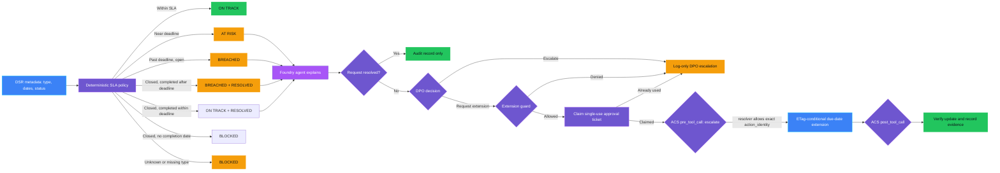
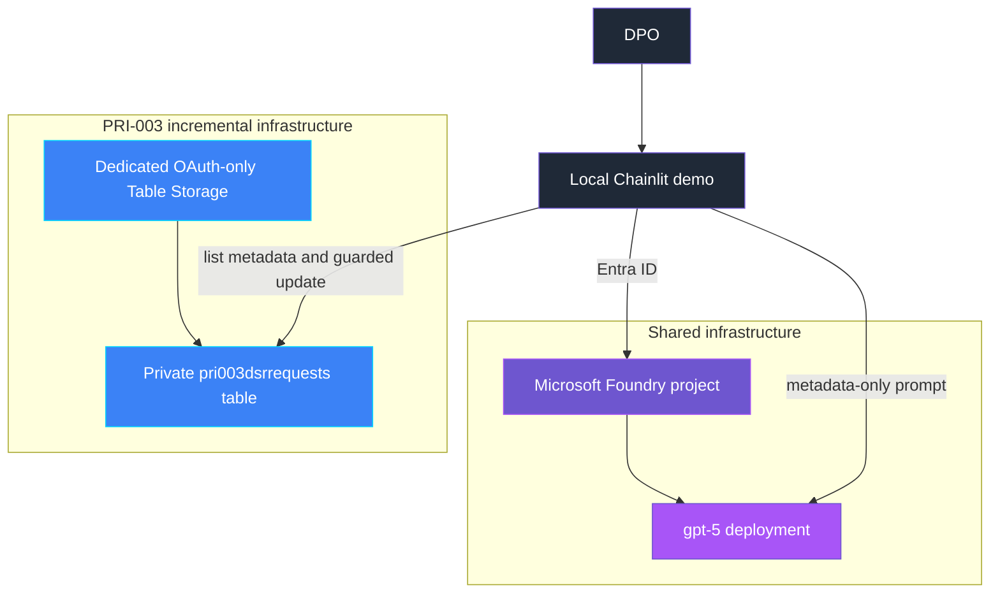

<p align="center">
  
</p>

# PRI-003 — Data subject request SLA breach

> **Status:** Implemented
>
> **Last reviewed:** 2026-09-04 against the Microsoft references below.

## Overview

**Real-life scenario:** Someone emails a company asking "please delete
everything you have about me" or "send me a copy of my data." Applicable
privacy law and organizational policy can impose a response deadline. If a
case sits in someone's inbox too long, that deadline can quietly pass
unnoticed — until a regulator or auditor asks why the request was never
answered.

PRI-003 demonstrates a missed data subject request (DSR) deadline and a safe
response. A deterministic scanner evaluates a synthetic DSR register against
a per-request-type SLA (access, rectification, erasure), classifies each
request as on track, at risk, breached, or blocked, and a Microsoft Foundry
agent explains the result. A due-date extension requires explicit DPO
approval, an unchanged Table Storage ETag, and a request type for which the
illustrative demo policy permits an extension.

> **The control decides; the agent explains and orchestrates.**

## Demo profile

| Property | Value |
|---|---|
| **Demo format** | Deployable demo |
| **Learning level** | Foundation / Intermediate |
| **Estimated time** | 30–45 minutes after Azure access is available |
| **Primary decision** | On track, at risk, breached, or blocked for each DSR record; separately, whether a due-date extension may be granted |
| **Primary capabilities** | Azure Table Storage, ETag optimistic concurrency, Microsoft Foundry Agent Framework, Agent Control Specification |
| **Deployment** | Required for the core learning outcome |
| **Infrastructure** | Local Chainlit UI, Foundry project/model, dedicated Table Storage account |
| **Model/Foundry role** | Active — governed subject: ACS `pre_tool_call`/`post_tool_call` gates the guarded extension tool |
| **AGT / ACS** | Reused as the real approval/enforcement mechanism (native Python policy dispatcher, no OPA/Rego bundle) |

> Estimated time covers running the guided demo after infrastructure is deployed;
> it excludes initial Azure deployment, RBAC propagation, and reading this README.

## Demo scope

### Core demo

The runnable path creates five synthetic DSR records, evaluates SLA status
from metadata only, lets a Foundry agent explain the authoritative decisions,
and lets a DPO escalate unresolved at-risk or breached requests or request one
guarded, ETag-conditional due-date extension for an eligible unresolved request
type. Closed requests remain audit records only.

### Intentional simplifications

- A synthetic Table Storage register replaces Microsoft Purview eDiscovery
  (Premium) Subject Rights Requests, which requires M365 E5/eDiscovery Premium
  licensing and tenant-wide setup.
- Escalation is a metadata-only local event with no destructive action.
- Agent Control Specification runs with a native Python policy dispatcher
  (`policy/acs_manifest.yaml` + `acs_gate.py`) rather than an OPA/Rego bundle,
  bound to the decision's request id and ETag — it is not an authenticated
  enterprise approval service.
- Evidence is written locally rather than to a durable audit system.
- Public endpoints keep setup small, and scanning is on-demand rather than
  scheduled.
- The rule that erasure requests can never receive a due-date extension is an
  illustrative demo policy choice, not a direct legal citation — real GDPR
  Article 12(3) extension eligibility does not turn solely on request type.

### What this demo proves

- Only the deterministic policy determines SLA status or authorizes an
  escalation or an extension — the model never does.
- A missing or unknown DSR request type blocks automatic SLA evaluation
  instead of silently defaulting to compliant.
- Only one extension is permitted per request, and only when the illustrative
  demo policy permits one; erasure requests are always refused by that demo
  policy.
- Closed requests remain available as audit evidence but cannot be escalated
  or extended through the demonstrated path.
- A changed or stale DSR record is not extended on the demonstrated guarded
  path.

### What this demo does not prove

It does not prove regulatory compliance, complete DSR process coverage,
requester identity verification, durable audit retention, production identity
design, or that every DSR intake path outside this demo is mediated.

### Microsoft Purview eDiscovery (Premium) Subject Rights Requests

Microsoft Purview eDiscovery (Premium) Subject Rights Requests
(Graph API `/security/subjectRightsRequests`) is the authoritative, tenant-wide
capability for DSR intake, case management, and SLA tracking in Microsoft 365,
scoped to Exchange, SharePoint, Teams, and OneDrive content search. Microsoft
retired the standalone Priva Subject Rights Requests SKU and its
`/privacy/subjectRightsRequests` API path (stopped serving data 2025-03-30);
the capability now ships as part of Purview eDiscovery (Premium)/E5 licensing.
**This demo does not use Purview eDiscovery.** It teaches the SLA-breach
decision and the guarded-extension pattern for an arbitrary case queue with a
lightweight, dependency-free register so the concepts remain approachable
without an M365 E5/eDiscovery Premium tenant, and because the real API searches
content for a named subject rather than modeling a general due-date/extension
queue. See [Further exploration](#further-exploration).

## Control contract

| Field | Value |
|---|---|
| **ID** | PRI-003 |
| **Lifecycle phase** | Live |
| **Category / domain** | Privacy |
| **Control / signal** | Data subject request SLA breach |
| **Evidence / source** | DSR SLA tracking |
| **Trigger / threshold** | Missed SLA |
| **Action / gate effect** | Escalate |
| **Accountable role** | DPO |

> This control uses "DPO" as the accountable role name; other PRI-* controls in
> this repository use "Privacy Officer" for the equivalent role. Both terms refer
> to the same fictional accountable role across this demo series.

## Control objective

Detect DSR records that are approaching or have passed their SLA deadline and
make escalation and any due-date change controlled, reviewable, and verifiable.
Closed requests are audit-only and cannot receive a new escalation or extension;
their outcome is judged against their recorded completion date, not against
whenever a scan happens to run, so a closed request's outcome never changes on
rescan. A closed request with no recorded completion date fails closed rather
than guessing. Missing or unknown request-type metadata, an ineligible
extension attempt, and a stale record version all fail closed or prohibit the
extension.

## Logical design



> Diagram color key: purple = governance decision, blue = platform/data operation,
> light purple = agent, green = allowed outcome, amber = blocked or escalation
> outcome, dark gray = human actor. The same key applies to the infrastructure
> diagram below.

## Infrastructure architecture



## Implementation

### Components

| Component | Responsibility | Location |
|---|---|---|
| Chainlit orchestration | Guided seed, scan, explain, escalate, and extend flow | [src/pri_003/chat.py](src/pri_003/chat.py) |
| Deterministic policy | Calculates SLA due dates and returns on-track, at-risk, breached, or blocked | [src/pri_003/policy.py](src/pri_003/policy.py) |
| Table Storage adapter | Lists metadata, scopes to the demo partition, conditionally updates, and verifies | [src/pri_003/storage.py](src/pri_003/storage.py) |
| ACS enforcement boundary | Escalates the guarded extension at `pre_tool_call`/`post_tool_call`; the UI click resolves the approval | [src/pri_003/acs_gate.py](src/pri_003/acs_gate.py), [policy/acs_manifest.yaml](policy/acs_manifest.yaml) |
| Foundry agent | Explains only metadata-safe deterministic decisions | [src/pri_003/agent.py](src/pri_003/agent.py) |
| Evidence | Emits metadata-only escalation and extension evidence | [src/pri_003/evidence.py](src/pri_003/evidence.py) |
| Infrastructure | Owns the Table Storage account, table, and RBAC | [infra/main.bicep](infra/main.bicep) |

### Agent role and authority

The agent receives `DSRDecision.safe_dict()` values only. It may explain
outcomes and the escalation/extension path. It may not inspect requester
identity or content, alter a decision, grant an extension, or claim an
escalation happened. The guarded Table Storage adapter is the only
state-changing tool path. The agent's only value is explaining that decision
in natural language for the DPO; it adds no authority the deterministic
policy does not already have.

### Decision rules

| Condition | Decision | Action |
|---|---|---|
| Within SLA and outside the warning window | `ON_TRACK` | No action |
| Within the warning window, still open | `AT_RISK` | Proactive DPO escalation |
| Deadline passed, still open | `BREACHED` | Mandatory DPO escalation |
| Closed, completed after its deadline | `BREACHED` (`resolved=True`) | Audit record only; anchored to completion time, not scan time |
| Closed, completed within its deadline | `ON_TRACK` (`resolved=True`) | Audit record only |
| Closed with no recorded completion date | `BLOCKED` | Fail closed; completion evidence is required to judge the outcome |
| Request type is unknown or missing | `BLOCKED` | Fail closed and investigate |

| Extension eligibility | Result |
|---|---|
| Request is already closed | Refused |
| Erasure request type | Always refused |
| An extension was already granted | Refused |
| Access or rectification, no prior extension | Permitted (+60 days) |

## Demo

### Prerequisites

- Python 3.10–3.13 and this control's dependencies.
- Azure CLI authentication through `az login`.
- Shared infrastructure deployed first.
- A PRI-003 `.env` copied from [.env.example](.env.example).
- Synthetic data only.

### Deploy

From the repository root:

```bash
./infra/deploy.sh
cp controls/privacy/PRI-003_data_subject_request_sla_breach/.env.example controls/privacy/PRI-003_data_subject_request_sla_breach/.env
./controls/privacy/PRI-003_data_subject_request_sla_breach/infra/deploy.sh
```

The first deployment owns generic Foundry resources. The second incrementally
adds only PRI-003 resources and writes its table endpoint back to the
control-local `.env`.

### Inspect in Azure

Open the resource group named by `AZURE_RESOURCE_GROUP` in `infra/.env`. The
Storage account and table names are recorded in the control-local `.env`.

| What to inspect | Where in Azure Portal | What to verify and why it matters |
|---|---|---|
| Control deployment | Resource group → **Deployments** → `pri-003-dsr-sla-breach` | Provisioning succeeded and the deployment owns the PRI-003 Storage account, Table service, table, and role assignment. |
| DSR table | Storage account named by `PRI003_STORAGE_ACCOUNT_NAME` → **Storage browser** → **Tables** | The table named by `PRI003_TABLE_NAME` exists. Synthetic metadata-only DSR records appear after **Create demo records** is used in the UI. |
| Storage authentication | Storage account → **Configuration** | Shared-key and public Blob access are disabled, OAuth is the default, and HTTPS with TLS 1.2 is required. |
| Demo operator access | Storage account → **Access control (IAM)** → **Role assignments** | The signed-in deployment identity has **Storage Table Data Contributor**, allowing the demo to read and update only through Entra-authenticated Table operations. |

Public network access remains enabled and scanning remains on demand in this
demo. The visible Table entities are synthetic case metadata; requester names,
email addresses, and request content are intentionally absent.

### Run

```bash
cd controls/privacy/PRI-003_data_subject_request_sla_breach
../../../.venv/bin/python -m pip install -c ../../../constraints.txt -r requirements.txt
../../../.venv/bin/chainlit run app.py -w
```

Use the buttons in order: create synthetic records, scan, review the agent
explanation, and escalate or request an extension for flagged unresolved
requests. Closed requests show their historical outcome without action buttons.

### Expected scenarios

| Synthetic scenario | Expected decision | Expected response |
|---|---|---|
| Access request received 5 days ago | `ON_TRACK` | No action |
| Rectification request received 25 days ago | `AT_RISK` | Escalation offered; extension permitted |
| Open erasure request received 40 days ago | `BREACHED` | Escalation offered; extension refused |
| Closed access request, completed 15 days after its deadline | `BREACHED`, `resolved=True` | Audit record only; the outcome is fixed at completion time and does not change on rescan |
| Closed access request, completed 5 days before its deadline | `ON_TRACK`, `resolved=True` | Audit record only; no escalation action needed |
| Closed access request with no recorded completion date | `BLOCKED` | Fail closed; completion evidence is required to judge a closed request |
| Request with an unknown type | `BLOCKED` | Fail closed; no SLA computed |

## Evidence and observability

Evidence contains the control and decision IDs, a hash of the request-id
reference, request type, action, due date, days until due, resolved flag,
escalated flag, extension-granted flag, timestamp, and accountable role. It
excludes requester name, email, request content, and the Table Storage ETag.

### Example evidence record

Illustrative only — actual IDs and hashes vary per run:

```json
{
  "evidence_id": "7c1a2e9b-4f0d-4c8a-9b2e-5a6d8c1f3e70",
  "timestamp": "2026-09-04T14:08:47+00:00",
  "control_id": "PRI-003",
  "decision_id": "4b7e...",
  "request_reference": "e21a...sha256",
  "request_type": "rectification",
  "action": "AT_RISK",
  "due_date": "2026-09-10",
  "days_until_due": 5,
  "resolved": false,
  "escalated": true,
  "extension_granted": false,
  "accountable_role": "DPO"
}
```

## Security and privacy

- The dedicated account disables shared-key access; Microsoft Entra ID and
  scoped Azure RBAC provide data-plane access.
- Scans read request type, dates, and status only; no requester content is
  ever stored or read.
- The adapter only operates within the `pri003-demo` partition key.
- ACS binds each approval to the exact tool_call `action_identity` (request
  id and ETag); a changed record invalidates the binding even after a UI
  click.
- The approval resolver never assumes approval happened just because it was
  called: a missing, rejected, expired (5-minute TTL), or already-used
  approval ticket fails closed before any Table call is made.
- Extension updates use `If-Match` and are re-validated against eligibility
  immediately before the write.
- Escalation never mutates the DSR record; it only emits evidence.

## Validation

```bash
../../../.venv/bin/python -m compileall -q src app.py tests
../../../.venv/bin/python -m pytest -q tests
```

Tests cover SLA classification (on-track, at-risk, breached-open,
breached-and-resolved, blocked), extension eligibility (allowed, denied for
erasure, denied when already granted, denied when already closed),
metadata-safe agent payloads, and the ACS escalate/approve/fail-closed gate
around the guarded extension.

### Known limitations

- Public network access remains enabled for this local demo.
- Evidence is logged locally rather than sent to an immutable audit store.
- The ACS policy dispatcher is a native Python implementation, suitable for a
  single-process demo; an OPA/Rego bundle is the production extension.
- Scanning is on-demand; production use would run on a schedule or event
  trigger.

## Further exploration

| Concern | Core demo | Possible extension | Authoritative guidance |
|---|---|---|---|
| DSR intake and SLA tracking | Synthetic Table Storage register | Use Microsoft Purview eDiscovery (Premium) Subject Rights Requests for real DSR case management and SLA tracking | [Use the Microsoft Graph subject rights request API](https://learn.microsoft.com/en-us/graph/api/resources/subjectrightsrequest-subjectrightsrequestapioverview?view=graph-rest-1.0) |
| Policy dispatcher | Native Python `PolicyDispatcher` (`acs_gate.py`) | Move to an OPA/Rego bundle for teams standardizing decision logic across agent paths | [Agent Control Specification](https://github.com/microsoft/agent-governance-toolkit/tree/main/policy-engine) |
| Evidence | Local metadata log | Store escalation, approval, and extension events in a durable governed audit sink | [ACS evidence and telemetry](https://github.com/microsoft/agent-governance-toolkit/blob/main/policy-engine/spec/SPECIFICATION.md) |
| Monitoring | On-demand metadata scan | Run the scan on a schedule or event trigger and alert on breach | [Azure Table Storage overview](https://learn.microsoft.com/en-us/azure/storage/tables/table-storage-overview) |
| Networking and identity | Local credential and public endpoint | Use workload identity, least-privilege scopes, firewalls, and private connectivity appropriate to the deployment | [Authorize access to tables with Microsoft Entra ID](https://learn.microsoft.com/en-us/azure/storage/tables/authorize-access-azure-active-directory) |

These extensions are not implemented in the core demo.

### Community ideas

- Replace the native Python ACS policy dispatcher with an OPA/Rego bundle.
- Add a scheduled trigger (for example, an Azure Functions timer) instead of
  on-demand scanning.
- Persist content-safe evidence and correlate scan, escalation, approval, and
  extension events.

## Cleanup

Use **Cleanup demo records** in the UI to remove only synthetic
`pri003-demo` partition entities. Keep the dedicated account if the control
will be rerun. Deleting the shared resource group also removes other demos
and must only be done when the whole environment is no longer needed.

## References

- [Use the Microsoft Graph subject rights request API](https://learn.microsoft.com/en-us/graph/api/resources/subjectrightsrequest-subjectrightsrequestapioverview?view=graph-rest-1.0)
- [Azure Table Storage overview](https://learn.microsoft.com/en-us/azure/storage/tables/table-storage-overview)
- [Authorize access to tables with Microsoft Entra ID](https://learn.microsoft.com/en-us/azure/storage/tables/authorize-access-azure-active-directory)
- [Update Entity and optimistic concurrency in Table Storage](https://learn.microsoft.com/en-us/rest/api/storageservices/update-entity2)
- [Agent Control Specification](https://github.com/microsoft/agent-governance-toolkit/tree/main/policy-engine)
- [Agent Control Specification](https://github.com/microsoft/agent-governance-toolkit/tree/main/policy-engine)
- [Source governance catalog](../../../docs/Governance%20Signals%20Repo.pdf)

---

<p align="center">
  
</p>
