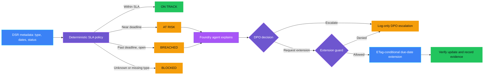
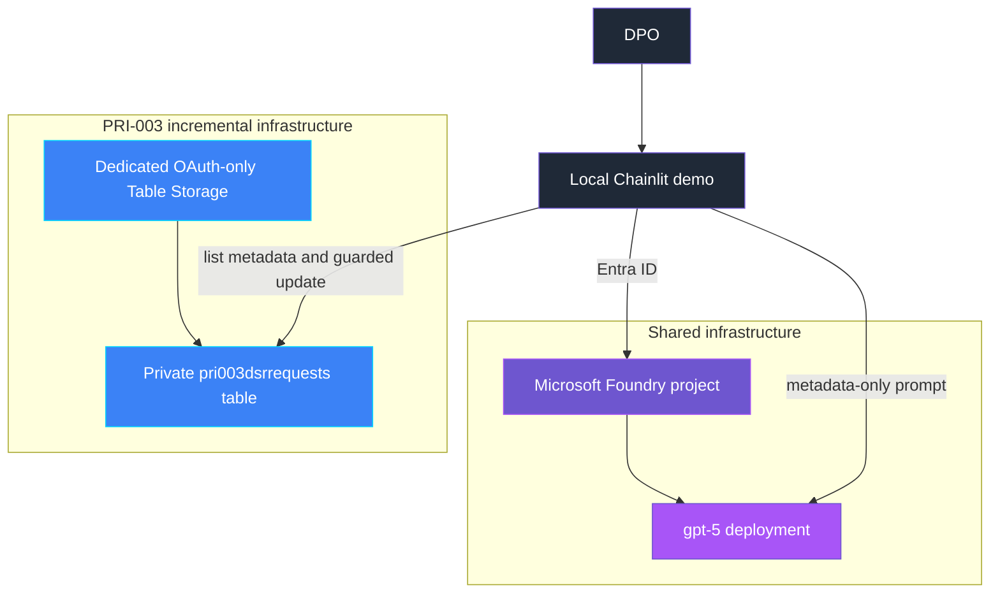

<p align="center">
  
</p>

# PRI-003 — Data subject request SLA breach

> **Status:** Implemented
>
> **Last reviewed:** 2026-09-03 against the Microsoft references below.

## Overview

**Real-life scenario:** Someone emails a company asking "please delete
everything you have about me" or "send me a copy of my data." By law the
company has a strict deadline to respond. If a case sits in someone's inbox
too long, that deadline can quietly pass unnoticed — until a regulator asks
why the request was never answered.

PRI-003 demonstrates a missed data subject request (DSR) deadline and a safe
response. A deterministic scanner evaluates a synthetic DSR register against
a per-request-type SLA (access, rectification, erasure), classifies each
request as on track, at risk, breached, or blocked, and a Microsoft Foundry
agent explains the result. A due-date extension requires explicit DPO
approval, an unchanged Table Storage ETag, and a request type that legally
permits an extension.

> **The control decides; the agent explains and orchestrates.**

## Demo profile

| Property | Value |
|---|---|
| **Learning level** | Foundation / Intermediate |
| **Estimated time** | 30–45 minutes after Azure access is available |
| **Primary decision** | On track, at risk, breached, or blocked for each DSR record; separately, whether a due-date extension may be granted |
| **Primary capabilities** | Azure Table Storage, ETag optimistic concurrency, Microsoft Foundry Agent Framework |
| **Infrastructure** | Local Chainlit UI, Foundry project/model, dedicated Table Storage account |
| **AGT / ACS** | Not used in the core demo; production action-bound approval is a documented extension |
| **Production complete** | No — see [Production extensions](#production-extensions) |

## Demo scope

### Core demo

The runnable path creates five synthetic DSR records, evaluates SLA status
from metadata only, lets a Foundry agent explain the authoritative decisions,
and lets a DPO escalate at-risk or breached requests or request one guarded,
ETag-conditional due-date extension for an eligible request type.

### Intentional simplifications

- A synthetic Table Storage register replaces Microsoft Priva Subject Rights
  Requests, which requires M365 E5/Priva licensing and tenant-wide setup.
- Escalation is a metadata-only local event with no destructive action.
- The extension approval registry is an in-memory, single-process teaching
  approximation bound to the decision, request id, and ETag; it is not an
  authenticated enterprise approval service.
- Evidence is written locally rather than to a durable audit system.
- Public endpoints keep setup small, and scanning is on-demand rather than
  scheduled.

### What this demo proves

- The model does not determine SLA status or authorize an escalation or an
  extension.
- A missing or unknown DSR request type blocks automatic SLA evaluation
  instead of silently defaulting to compliant.
- Only one extension is permitted per request, and only for request types
  that legally allow one; erasure requests are always refused.
- A changed or stale DSR record is not extended on the demonstrated guarded
  path.

### What this demo does not prove

It does not prove regulatory compliance, complete DSR process coverage,
requester identity verification, durable audit retention, production identity
design, or that every DSR intake path outside this demo is mediated.

### Microsoft Priva Subject Rights Requests

Microsoft Priva Subject Rights Requests is the authoritative, tenant-wide
capability for DSR intake, case management, and SLA tracking in Microsoft 365.
**This demo does not use Priva.** It teaches the SLA-breach decision and the
guarded-extension pattern with a lightweight, dependency-free register so the
concepts remain approachable without an M365 E5/Priva tenant. See
[Production extensions](#production-extensions).

## Control contract

| Field | Value |
|---|---|
| **ID** | PRI-003 |
| **Lifecycle phase** | Live |
| **Category / domain** | Privacy |
| **Control / signal** | Data subject request SLA breach |
| **Evidence / source** | DSR SLA tracking |
| **Trigger / threshold** | Missed SLA |
| **Action / gate effect** | Escalate |
| **Accountable role** | DPO |

## Control objective

Detect DSR records that are approaching or have passed their SLA deadline and
make escalation and any due-date change controlled, reviewable, and
verifiable. Missing or unknown request-type metadata, an ineligible extension
attempt, and a stale record version all fail closed or prohibit the extension.

## Logical design



## Infrastructure architecture



## Implementation

### Components

| Component | Responsibility | Location |
|---|---|---|
| Chainlit orchestration | Guided seed, scan, explain, escalate, and extend flow | [src/pri_003/chat.py](src/pri_003/chat.py) |
| Deterministic policy | Calculates SLA due dates and returns on-track, at-risk, breached, or blocked | [src/pri_003/policy.py](src/pri_003/policy.py) |
| Table Storage adapter | Lists metadata, scopes to the demo partition, conditionally updates, and verifies | [src/pri_003/storage.py](src/pri_003/storage.py) |
| Extension approval registry | Issues one-time approvals bound to decision, request id, and ETag | [src/pri_003/approval.py](src/pri_003/approval.py) |
| Foundry agent | Explains only metadata-safe deterministic decisions | [src/pri_003/agent.py](src/pri_003/agent.py) |
| Evidence | Emits metadata-only escalation and extension evidence | [src/pri_003/evidence.py](src/pri_003/evidence.py) |
| Infrastructure | Owns the Table Storage account, table, and RBAC | [infra/main.bicep](infra/main.bicep) |

### Agent role and authority

The agent receives `DSRDecision.safe_dict()` values only. It may explain
outcomes and the escalation/extension path. It may not inspect requester
identity or content, alter a decision, grant an extension, or claim an
escalation happened. The guarded Table Storage adapter is the only
state-changing tool path.

### Decision rules

| Condition | Decision | Action |
|---|---|---|
| Within SLA and outside the warning window | `ON_TRACK` | No action |
| Within the warning window, still open | `AT_RISK` | Proactive DPO escalation |
| Deadline passed, still open | `BREACHED` | Mandatory DPO escalation |
| Closed after its deadline | `BREACHED` (`resolved=True`) | Audit record only |
| Request type is unknown or missing | `BLOCKED` | Fail closed and investigate |

| Extension eligibility | Result |
|---|---|
| Erasure request type | Always refused |
| An extension was already granted | Refused |
| Access or rectification, no prior extension | Permitted (+60 days) |

## Demo

### Prerequisites

- Python 3.10–3.13 and this control's dependencies.
- Azure CLI authentication through `az login`.
- Shared infrastructure deployed first.
- A PRI-003 `.env` copied from [.env.example](.env.example).
- Synthetic data only.

### Deploy

From the repository root:

```bash
./infra/deploy.sh
cp controls/privacy/PRI-003_data_subject_request_sla_breach/.env.example controls/privacy/PRI-003_data_subject_request_sla_breach/.env
./controls/privacy/PRI-003_data_subject_request_sla_breach/infra/deploy.sh
```

The first deployment owns generic Foundry resources. The second incrementally
adds only PRI-003 resources and writes its table endpoint back to the
control-local `.env`.

### Run

```bash
cd controls/privacy/PRI-003_data_subject_request_sla_breach
../../../.venv/bin/python -m pip install -r requirements.txt
../../../.venv/bin/chainlit run app.py -w
```

Use the buttons in order: create synthetic records, scan, review the agent
explanation, and escalate or request an extension for the flagged requests.

### Expected scenarios

| Synthetic scenario | Expected decision | Expected response |
|---|---|---|
| Access request received 5 days ago | `ON_TRACK` | No action |
| Rectification request received 25 days ago | `AT_RISK` | Escalation offered; extension permitted |
| Open erasure request received 40 days ago | `BREACHED` | Escalation offered; extension refused |
| Access request received 50 days ago, closed | `BREACHED`, `resolved=True` | Audit record only; no escalation action needed |
| Request with an unknown type | `BLOCKED` | Fail closed; no SLA computed |

## Evidence and observability

Evidence contains the control and decision IDs, a hash of the request-id
reference, request type, action, due date, days until due, resolved flag,
escalated flag, extension-granted flag, timestamp, and accountable role. It
excludes requester name, email, request content, and the Table Storage ETag.

## Security and privacy

- The dedicated account disables shared-key access; Microsoft Entra ID and
  scoped Azure RBAC provide data-plane access.
- Scans read request type, dates, and status only; no requester content is
  ever stored or read.
- The adapter only operates within the `pri003-demo` partition key.
- Extension approval tokens expire, are single-use, and bind to the exact
  ETag.
- Extension updates use `If-Match` and are re-validated against eligibility
  immediately before the write.
- Escalation never mutates the DSR record; it only emits evidence.

## Validation

```bash
../../../.venv/bin/python -m compileall -q src app.py tests
../../../.venv/bin/python -m pytest -q tests
```

Tests cover SLA classification (on-track, at-risk, breached-open,
breached-and-resolved, blocked), extension eligibility (allowed, denied for
erasure, denied when already granted), metadata-safe agent payloads, approval
expiry, ETag binding, and single-use approval.

### Known limitations

- Public network access remains enabled for this local demo.
- Evidence is logged locally rather than sent to an immutable audit store.
- In-memory approvals are suitable for a single-process demo only.
- Scanning is on-demand; production use would run on a schedule or event
  trigger.

## Production extensions

| Concern | Core demo | Production extension | Authoritative guidance |
|---|---|---|---|
| DSR intake and SLA tracking | Synthetic Table Storage register | Use Microsoft Priva Subject Rights Requests for real DSR case management and SLA tracking | [Microsoft Priva Subject Rights Requests](https://learn.microsoft.com/en-us/purview/privacy-priva-subject-rights-requests) |
| Approval | Local one-time token after an explicit UI action | Use AGT action-bound approval with actor, action digest, policy version, expiry, resolution, and audit linkage | [AGT action-bound approval protocol](https://github.com/microsoft/agent-governance-toolkit/blob/main/docs/adr/0030-action-bound-approval-protocol.md) |
| Policy boundary | Direct deterministic host call | Use an ACS `pre_tool_call` intervention point if extension granting becomes an agent tool | [Agent Control Specification](https://github.com/microsoft/agent-governance-toolkit/tree/main/policy-engine) |
| Evidence | Local metadata log | Store escalation, approval, and extension events in a durable governed audit sink | [ACS evidence and telemetry](https://github.com/microsoft/agent-governance-toolkit/blob/main/policy-engine/spec/SPECIFICATION.md) |
| Monitoring | On-demand metadata scan | Run the scan on a schedule or event trigger and alert on breach | [Azure Table Storage overview](https://learn.microsoft.com/en-us/azure/storage/tables/table-storage-overview) |
| Networking and identity | Local credential and public endpoint | Use workload identity, least-privilege scopes, firewalls, and private connectivity appropriate to the deployment | [Authorize access to tables with Microsoft Entra ID](https://learn.microsoft.com/en-us/azure/storage/tables/authorize-access-azure-active-directory) |

These extensions are not implemented in the core demo. The local extension
approval registry demonstrates a few binding principles, but it must not be
presented as a replacement for AGT's production approval protocol.

## Optional exploration

- Replace the local extension approval registry with an AGT approval backend
  while preserving the existing ETag revalidation.
- Add a scheduled trigger (for example, an Azure Functions timer) instead of
  on-demand scanning.
- Persist content-safe evidence and correlate scan, escalation, approval, and
  extension events.

## Cleanup

Use **Cleanup demo records** in the UI to remove only synthetic
`pri003-demo` partition entities. Keep the dedicated account if the control
will be rerun. Deleting the shared resource group also removes other demos
and must only be done when the whole environment is no longer needed.

## References

- [Microsoft Priva Subject Rights Requests](https://learn.microsoft.com/en-us/purview/privacy-priva-subject-rights-requests)
- [Azure Table Storage overview](https://learn.microsoft.com/en-us/azure/storage/tables/table-storage-overview)
- [Authorize access to tables with Microsoft Entra ID](https://learn.microsoft.com/en-us/azure/storage/tables/authorize-access-azure-active-directory)
- [Manage concurrency in Table Storage](https://learn.microsoft.com/en-us/rest/api/storageservices/managing-concurrency-in-microsoft-azure-storage)
- [AGT action-bound approval protocol](https://github.com/microsoft/agent-governance-toolkit/blob/main/docs/adr/0030-action-bound-approval-protocol.md)
- [Agent Control Specification](https://github.com/microsoft/agent-governance-toolkit/tree/main/policy-engine)
- [Source governance catalog](../../../docs/Governance%20Signals%20Repo.pdf)

---

<p align="center">
  
</p>
