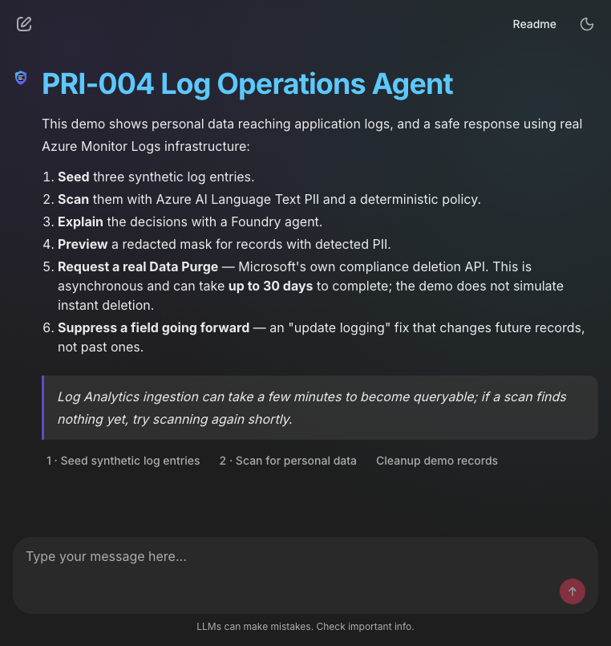
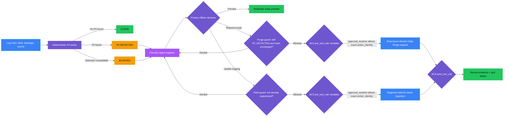
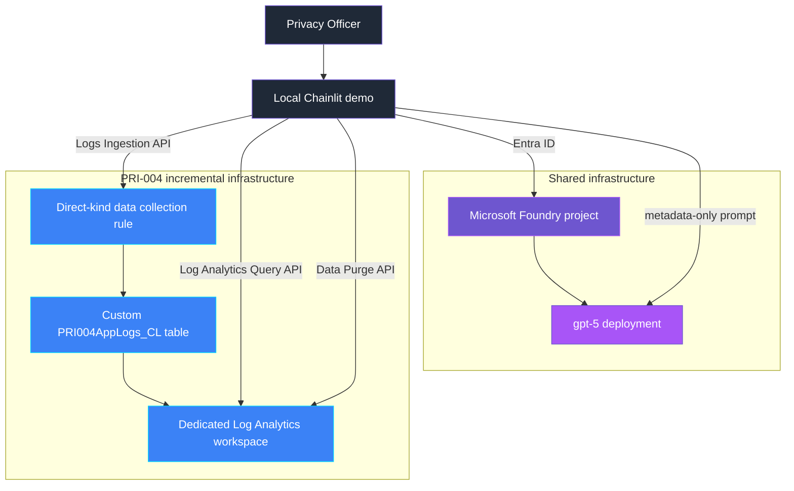

<p align="center">
  
</p>

# PRI-004 — Personal data in logs

> **Status:** Implemented
>
> **Last reviewed:** 2026-09-04 against the Microsoft references below.

## Overview

**Real-life scenario:** A support engineer is debugging a failed checkout and
opens the application logs. Sitting in plain text inside an error message is
another customer's email address and phone number — logged automatically by
code that never meant to capture it. Now every engineer, contractor, and
support agent with log access can see it, far beyond anyone that customer
ever agreed to share their details with.

PRI-004 demonstrates personal data reaching real Azure Monitor Logs and a
safe response. A deterministic policy classifies scanned log entries as
clean, PII detected, or blocked using Azure AI Language Text PII, and a
Microsoft Foundry agent explains the metadata-only result. Remediation is
three separate guarded actions: a non-destructive redacted preview, a real
Azure Monitor **Data Purge** request (Microsoft's own GDPR-compliance
deletion mechanism — asynchronous, rate-limited, and disclosed as such
rather than simulated as instant), and an "update logging" field-suppression
policy that fixes future records without rewriting past ones (in this demo,
an in-memory policy affecting only newly seeded records, not a production
logging-configuration change).

> **The control decides; the agent explains and orchestrates.**

## Demo profile

| Property | Value |
|---|---|
| **Demo format** | Deployable demo |
| **Learning level** | Intermediate |
| **Estimated time** | 45–60 minutes after Azure access is available |
| **Primary decision** | Clean, PII detected, or blocked for each scanned log record; separately, whether a purge request or a field-suppression policy change may proceed |
| **Primary capabilities** | Azure Monitor Logs (Logs Ingestion API, Log Analytics Query API, Data Purge API), Azure AI Language Text PII, Microsoft Foundry Agent Framework, Agent Control Specification |
| **Deployment** | Required for the core learning outcome |
| **Infrastructure** | Local Chainlit UI, dedicated Log Analytics workspace with a `kind: Direct` data collection rule (accepts custom-table ingestion without a separate Data Collection Endpoint); shared Foundry project/model only if the optional explanation step is used |
| **Model/Foundry role** | Active — governed subject: ACS `pre_tool_call`/`post_tool_call` gates both the guarded purge and field-policy tools |
| **AGT / ACS** | Reused as the real approval/enforcement mechanism (native Python policy dispatcher, no OPA/Rego bundle). Pinned pre-release `0.3.1b1`; not yet GA. |

> Estimated time covers running the guided demo after infrastructure is deployed;
> it excludes initial Azure deployment, RBAC propagation, and reading this README.

## Demo scope

### Core demo

The runnable path ingests three synthetic log entries via the real Logs
Ingestion API, scans them with Azure AI Language Text PII, lets a Foundry
agent explain the authoritative decisions, and lets a Privacy Officer preview
a redacted mask, submit a real guarded Data Purge request, check its status,
and suppress a field for future ingestion.

### Intentional simplifications

- Synthetic log entries only, prefixed `pri004-demo-` so cleanup can never
  touch unrelated data.
- A content-hash guard substitutes for a native optimistic-concurrency
  token, since Log Analytics has no ETag equivalent for ingested rows.
- Agent Control Specification runs with a native Python policy dispatcher
  (`policy/acs_manifest.yaml` + `acs_gate.py`) rather than an OPA/Rego
  bundle, not an authenticated enterprise approval service.
- Field suppression is an in-memory policy affecting only newly seeded demo
  records, not a real logging-configuration change in a production
  application.
- Evidence is written locally rather than to a durable audit system.
- Public endpoints keep setup small, and scanning is on-demand rather than
  scheduled.
- The Foundry agent only paraphrases the deterministic decision in plain
  language; it adds no decision authority. It is optional: if shared Foundry
  infrastructure is not deployed, the demo still runs the real scan, purge
  request, and field suppression and only skips the explanation step.

### What this demo proves

- Only the deterministic policy determines whether a log entry contains
  personal data or authorizes a mask, a purge, or a field-suppression policy
  change — the model never does.
- Detection failure blocks a record from automatic clearance instead of
  silently defaulting to clean.
- A purge is only permitted for a record with detected personal data whose
  content still matches what was evaluated; a changed or already-clean
  record is refused.
- A field-suppression policy change is refused once already applied.
- Submitting a purge correctly calls the real Azure Monitor Data Purge API
  and discloses its documented asynchronous, rate-limited nature rather
  than claiming instant deletion.

### What this demo does not prove

It does not prove that a purge has completed (Microsoft states up to 30
days), regulatory compliance, complete PII recall, durable audit retention,
production identity design, or that every logging path in a real
application is covered.

### Interface preview



## Demo

### Prerequisites

- Python 3.11–3.13 and this control's dependencies.
- Azure CLI authentication through `az login`.
- Shared infrastructure deployed first.
- A PRI-004 `.env` copied from [.env.example](.env.example).
- Synthetic data only.

### Deploy

From the repository root:

```bash
./infra/deploy.sh
cp controls/privacy/PRI-004_personal_data_in_logs/.env.example controls/privacy/PRI-004_personal_data_in_logs/.env
./controls/privacy/PRI-004_personal_data_in_logs/infra/deploy.sh
```

The first deployment owns generic Foundry resources. The second incrementally
adds only PRI-004 resources and writes the workspace, table, and data
collection rule details back to the control-local `.env`.

### Inspect in Azure

Open the resource group named by `AZURE_RESOURCE_GROUP` in `infra/.env`. The
workspace, table, and data collection rule names are recorded in the
control-local `.env`.

| What to inspect | Where in Azure Portal | What to verify and why it matters |
|---|---|---|
| Control deployment | Resource group → **Deployments** → `pri-004-personal-data-in-logs` | Provisioning succeeded and the deployment owns the PRI-004 Log Analytics workspace, custom table, data collection rule, and role assignments. |
| Custom table | Log Analytics workspace named by `PRI004_WORKSPACE_NAME` → **Tables** | The table named by `PRI004_TABLE_NAME` (`PRI004AppLogs_CL` by default) exists with the expected columns. Synthetic entries appear a few minutes after **Seed synthetic log entries** is used in the UI. |
| Data collection rule | Resource group → data collection rule named by `PRI004_DCR_NAME` → **JSON View** | `kind` is `Direct` and a `logsIngestion` endpoint and immutable ID are present — no separate Data Collection Endpoint was deployed. |
| Demo operator access | Log Analytics workspace / data collection rule → **Access control (IAM)** → **Role assignments** | The signed-in deployment identity has **Data Purger** and **Log Analytics Data Reader** on the workspace, and **Monitoring Metrics Publisher** on the data collection rule — least privilege for purge, query, and ingestion respectively. |

Public network access remains enabled and scanning remains on demand in this
demo. The visible log rows are synthetic case content; no real customer data
is ever ingested.

### Run

```bash
cd controls/privacy/PRI-004_personal_data_in_logs
../../../.venv/bin/python -m pip install -c ../../../constraints.txt -r requirements.txt
../../../.venv/bin/chainlit run app.py -w
```

Use the buttons in order: seed synthetic log entries, scan (retrying briefly
for ingestion latency), review the agent explanation, and preview, purge, or
suppress a field for records with detected personal data.

### Expected scenarios

| Synthetic scenario | Expected decision | Expected response |
|---|---|---|
| "background job completed successfully" | `CLEAN` | No action |
| "order confirmation sent to jane.doe@example.com" | `PII_DETECTED` | Preview, purge, and suppress-field offered |
| Simulated detector-outage marker | `BLOCKED` | Fail closed; no purge or suppress offered |

## Control contract

| Field | Value |
|---|---|
| **ID** | PRI-004 |
| **Lifecycle phase** | Live |
| **Category / domain** | Privacy |
| **Control / signal** | Personal data in logs |
| **Evidence / source** | Log inspection/DLP |
| **Trigger / threshold** | Unexpected personal data in logs |
| **Action / gate effect** | Mask/delete; update logging |
| **Accountable role** | Privacy Officer |

## Control objective

Detect personal data that reached a log store and make masking, deletion,
and logging-configuration fixes controlled, reviewable, and verifiable.
Detection failure fails closed rather than clearing a record by default. A
purge only proceeds against the exact, unchanged content that was evaluated,
and a field-suppression change cannot be reapplied once already active.

## Logical design



> Diagram color key: purple = governance decision, blue = platform/data operation,
> light purple = agent, green = allowed outcome, amber = blocked outcome, dark
> gray = human actor. The same key applies to the infrastructure diagram below.

## Infrastructure architecture



## Implementation

### Components

| Component | Responsibility | Location |
|---|---|---|
| Chainlit orchestration | Guided seed, scan, explain, mask, purge, and field-policy flow | [src/pri_004/chat.py](src/pri_004/chat.py) |
| Deterministic policy | Classifies clean/pii_detected/blocked and guards purge/field-policy eligibility | [src/pri_004/policy.py](src/pri_004/policy.py) |
| Azure Monitor adapter | Ingests, queries, and submits guarded real Data Purge requests | [src/pri_004/monitor_store.py](src/pri_004/monitor_store.py) |
| Text PII wrapper | Detects PII categories and produces a redacted preview in one Language API call | [src/pri_004/text_pii.py](src/pri_004/text_pii.py) |
| ACS enforcement boundary | Escalates both guarded actions at `pre_tool_call`/`post_tool_call`; the UI click resolves the approval | [src/pri_004/acs_gate.py](src/pri_004/acs_gate.py), [policy/acs_manifest.yaml](policy/acs_manifest.yaml) |
| Foundry agent | Explains only metadata-safe deterministic decisions | [src/pri_004/agent.py](src/pri_004/agent.py) |
| Evidence | Emits metadata-only mask/purge/field-policy evidence | [src/pri_004/evidence.py](src/pri_004/evidence.py) |
| Infrastructure | Owns the Log Analytics workspace, custom table, DCR, and RBAC | [infra/main.bicep](infra/main.bicep) |

### Agent role and authority

The agent receives `LogDecision.safe_dict()` values only — a decision id,
field name, and PII category names. It never sees the raw log message. It
may explain outcomes and the mask/purge/field-policy path. It may not alter
a decision, generate a preview, submit a purge, or change a logging policy.
The guarded Azure Monitor adapter is the only state-changing tool path. The
agent's only value is explaining that decision in natural language for the
Privacy Officer; it adds no authority the deterministic policy does not
already have.

### Decision rules

| Condition | Decision | Action |
|---|---|---|
| No PII categories found | `CLEAN` | No action |
| One or more PII categories found | `PII_DETECTED` | Preview, purge, or suppress offered |
| Detection unavailable or categories missing | `BLOCKED` | Fail closed and investigate |

| Purge eligibility | Result |
|---|---|
| Decision action is not `PII_DETECTED` | Refused |
| Current message content hash differs from the evaluated decision | Refused; rescan first |
| `PII_DETECTED` and content unchanged | Permitted |

| Field-policy eligibility | Result |
|---|---|
| Field already suppressed | Refused |
| Field not yet suppressed | Permitted |

## Evidence and observability

Evidence contains the control and decision IDs, field name, PII category
names (never values), the action taken, the Data Purge operation id when
applicable, timestamp, and accountable role. It excludes the raw log
message and its content hash.

### Example evidence record

Illustrative only — actual IDs vary per run:

```json
{
  "evidence_id": "1d4f7a9c-8e2b-4a6d-9c1f-2b5e7a9d3f60",
  "timestamp": "2026-09-04T14:11:02+00:00",
  "control_id": "PRI-004",
  "decision_id": "6a3d...",
  "field_name": "message",
  "action": "PII_DETECTED",
  "pii_categories": ["Email"],
  "action_taken": "purge_requested",
  "operation_id": "f9c2...",
  "accountable_role": "Privacy Officer"
}
```

## Security and privacy

- Azure AI Language Text PII detection reads only the synthetic message
  field; category names are recorded, never entity values.
- The demo identity holds least-privilege, scoped roles: **Data Purger**
  and **Log Analytics Data Reader** on the workspace, **Monitoring Metrics
  Publisher** on the data collection rule.
- Log Analytics local-key authentication is disabled; ingestion, query, and
  purge operations use Microsoft Entra tokens.
- Purge approval is bound by ACS's `action_identity` to the exact decision
  and a freshly recomputed content hash immediately before the real Data
  Purge call — a changed record is refused, not purged.
- Cleanup first queries for existing `pri004-demo-` record ids (the Purge
  API supports `==`, `=~`, `in`, `in~`, `>`, `>=`, `<`, `<=`, and `between`,
  not a prefix match) and then purges exactly those ids with `in`; a
  per-record purge uses `==` on the exact synthetic record id. Neither can
  affect unrelated Log Analytics data.
- Mask preview is strictly non-destructive: Log Analytics does not support
  mutating an already-ingested row in place, so "mask" only ever returns a
  redacted preview for review.

## Validation

```bash
../../../.venv/bin/python -m compileall -q src app.py tests
../../../.venv/bin/python -m pytest -q tests
```

Tests cover PII classification (clean, PII detected, blocked via a detector
outage marker and via missing categories), purge eligibility (allowed,
denied for a non-`PII_DETECTED` decision, denied on a content-hash
mismatch), field-policy eligibility (allowed, denied once already
suppressed), metadata-safe agent payloads excluding the raw message, and
the ACS escalate/approve/fail-closed gate around both guarded actions.

### Known limitations

- Public network access remains enabled for this local demo.
- Evidence is logged locally rather than sent to an immutable audit store.
- The ACS policy dispatcher is a native Python implementation and the
  suppressed-fields set is in-memory, suitable for a single-process demo;
  an OPA/Rego bundle and durable storage are the production extensions.
- Scanning is on-demand; production use would run on a schedule.
- Purge completion cannot be demonstrated within a demo session; Microsoft's
  documented SLA allows up to 30 days, and the demo can only show
  `pending`.

## Further exploration

| Concern | Core demo | Possible extension | Authoritative guidance |
|---|---|---|---|
| Leak prevention | Detect-then-remediate after ingestion | Add a data collection rule transformation that redacts known-risky fields at ingestion time, before they ever reach the workspace | [Manage personal data in Azure Monitor Logs](https://learn.microsoft.com/en-us/azure/azure-monitor/logs/personal-data-mgmt) |
| Policy dispatcher | Native Python `PolicyDispatcher` (`acs_gate.py`) | Move to an OPA/Rego bundle for teams standardizing decision logic across agent paths | [Agent Control Specification](https://github.com/microsoft/agent-governance-toolkit/tree/main/policy-engine) |
| Evidence | Local metadata log | Store mask, purge, and field-policy events in a durable governed audit sink | [ACS evidence and telemetry](https://github.com/microsoft/agent-governance-toolkit/blob/main/policy-engine/spec/SPECIFICATION.md) |
| Monitoring | On-demand metadata scan | Run the scan on a schedule and alert on `PII_DETECTED` or `BLOCKED` results | [Logs Ingestion API overview](https://learn.microsoft.com/en-us/azure/azure-monitor/logs/logs-ingestion-api-overview) |
| Networking and identity | Local credential and public endpoint | Use workload identity, least-privilege scopes, firewalls, and private connectivity appropriate to the deployment | [Azure built-in roles — Monitor category](https://learn.microsoft.com/en-us/azure/role-based-access-control/built-in-roles/monitor) |

These extensions are not implemented in the core demo.

### Community ideas

- Replace the native Python ACS policy dispatcher with an OPA/Rego bundle.
- Add an ingestion-time transformation that redacts a known-risky field
  before it reaches the workspace at all.
- Persist content-safe evidence and correlate scan, mask, purge, and
  field-policy events, including polled purge completion.

## Cleanup

Use **Cleanup demo records** in the UI to submit a real, guarded Data Purge
request for every ingested `pri004-demo-` record id. This request is
asynchronous per Microsoft's documented SLA (up to 30 days); it will not
appear to remove data immediately. Keep the dedicated workspace if the
control will be rerun. Deleting the shared resource group also removes
other demos and must only be done when the whole environment is no longer
needed.

## References

- [Glossary](../../../docs/glossary.md) — definitions for ACS, AGT, and other terms used above.
- [Manage personal data in Azure Monitor Logs](https://learn.microsoft.com/en-us/azure/azure-monitor/logs/personal-data-mgmt)
- [Workspace Purge API](https://learn.microsoft.com/en-us/rest/api/loganalytics/workspace-purge/purge)
- [Logs Ingestion API overview](https://learn.microsoft.com/en-us/azure/azure-monitor/logs/logs-ingestion-api-overview)
- [Create a custom table](https://learn.microsoft.com/en-us/azure/azure-monitor/logs/create-custom-table)
- [Azure built-in roles — Monitor category](https://learn.microsoft.com/en-us/azure/role-based-access-control/built-in-roles/monitor)
- [Azure AI Language Text PII overview](https://learn.microsoft.com/azure/ai-services/language-service/personally-identifiable-information/overview)
- [Agent Control Specification](https://github.com/microsoft/agent-governance-toolkit/tree/main/policy-engine)
- [Source governance catalog](../../../docs/Governance%20Signals%20Repo.pdf)

---

<p align="center">
  
</p>
