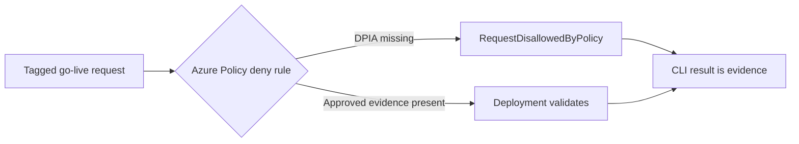

<p align="center">
  
</p>

# PRI-PRE-001 — DPIA required but missing

> **Status:** Implemented
>
> **Last reviewed:** 2026-09-04

## Overview

A team is ready to launch a high-risk AI system, but nobody can show that its
required Data Protection Impact Assessment (DPIA) was approved. Without a gate,
the deployment can continue and the missing privacy review may be discovered
only after harm or an audit.

This bite-sized demo uses an **Azure Policy `deny` assignment** to reject that
go-live request. It then validates the same request with approved DPIA evidence
and shows that Azure accepts it. Both paths use `az deployment group validate`,
so no demo workload is created.

> **Azure Policy decides. The first request is denied; the remediated request validates.**

## Demo profile

| Property | Value |
|---|---|
| **Demo format** | `DEPLOYABLE_DEMO` |
| **Learning level** | Foundation |
| **Estimated time** | 15–20 minutes, including policy propagation |
| **Primary decision** | Deny a tagged high-risk go-live request when approved DPIA evidence is missing |
| **Primary capability** | Azure Policy with the `deny` effect |
| **Deployment** | Required for the core learning outcome |
| **Infrastructure** | One custom policy definition and one resource-group-scoped assignment |
| **AGT / ACS / Foundry** | Not used: this is Azure resource admission, not an agent-runtime decision |

## Demo scope

### Core demo

The core demo runs two validations against the same harmless Azure Action Group
template:

1. `goLiveRequested=true`, `aiSystemHighRisk=true`, and no approved DPIA
   evidence: Azure Policy returns `RequestDisallowedByPolicy`.
2. The same request with `dpiaStatus=approved` and a non-empty
   `dpiaEvidenceId`: Azure validates the deployment.

### Intentional simplifications

- The demo starts after a system has already been classified as high risk. It
  does not calculate whether a DPIA is legally required.
- Tags stand in for an authoritative privacy register or DPIA workflow.
- The evidence identifier proves that a value is present, not that the DPIA is
  adequate or genuinely approved.
- The placeholder is validated only; it is never deployed.

### What this demo proves

- A Microsoft-native policy can technically deny the demonstrated go-live
  request when mandatory DPIA metadata is absent.
- Remediating the exact request changes the authoritative Azure result from
  denied to validated.
- No model or custom policy engine participates in the decision.

### What this demo does not prove

It does not prove GDPR compliance, perform DPIA screening, validate the content
or signer of a DPIA, or ensure that every organizational deployment supplies the
trigger tags. Production use requires a trusted inventory or release process
that supplies those values and protects who may change them.

## Control contract

| Field | Value |
|---|---|
| **ID** | PRI-PRE-001 |
| **Lifecycle phase** | Pre-Live |
| **Category / domain** | Privacy |
| **Signal** | A known high-risk AI system requests go-live without approved DPIA evidence |
| **Decision** | Allow or deny the deployment validation |
| **Governance action** | Block go-live and require DPIA remediation |
| **Accountable role** | Data Protection Officer (DPO) |
| **Evidence** | Azure Policy result, policy identifiers, deployment correlation name, and timestamp |

## How it works



The policy is deliberately narrow. It evaluates a resource only when both
`goLiveRequested=true` and `aiSystemHighRisk=true` are present. For that request,
`dpiaStatus` must equal `approved` and `dpiaEvidenceId` must be present and
non-empty.

## Demo

### Prerequisites

- Azure CLI authenticated with `az login`.
- An existing Azure resource group in which you have permission to validate a
  deployment and create a policy assignment.
- Permission to create a custom policy definition at subscription scope, such
  as **Resource Policy Contributor**.

### Configure

From the repository root:

```bash
cp controls/privacy/PRI-PRE-001_dpia_required_but_missing/.env.example \
  controls/privacy/PRI-PRE-001_dpia_required_but_missing/.env
```

Set `AZURE_SUBSCRIPTION_ID` and `AZURE_RESOURCE_GROUP` in the copied file. If
they already exist in `infra/.env`, the control reuses those values.

### Deploy the policy

```bash
./controls/privacy/PRI-PRE-001_dpia_required_but_missing/infra/deploy.sh
```

Azure Policy assignments can take several minutes to propagate.

### Run the two-scenario demo

```bash
./controls/privacy/PRI-PRE-001_dpia_required_but_missing/demo.sh
```

Expected output:

- `BLOCKED as expected` for the missing-DPIA request;
- `VALIDATED as expected` for the approved-DPIA request;
- a small JSON evidence record printed to the terminal.

The command fails if either result differs from the expectation. It never uses
`az deployment group create` for the placeholder workload.

## Inspect in Azure

| What to inspect | Azure Portal path | What to verify |
|---|---|---|
| Policy definition | **Policy** → **Definitions** → `pri-pre-001-dpia-gate` | The effect is `deny`; the rule requires approved DPIA metadata for the demonstrated tagged request. |
| Policy assignment | **Policy** → **Assignments** → select the resource group | The assignment is scoped only to the chosen demo resource group. |
| Activity evidence | Resource group → **Activity log** | The blocked validation is attributed to the custom policy. No placeholder Action Group appears in the resource list. |

## Evidence

The terminal record contains the control and policy version, both authoritative
Azure results, the deployment correlation names, a UTC timestamp, the action,
and accountable role. It contains no DPIA document, approver identity, personal
data, prompt, or model output.

Example:

```json
{
  "control_id": "PRI-PRE-001",
  "policy_version": "1.0.0",
  "missing_dpia_result": "denied",
  "approved_dpia_result": "validated",
  "resource_created": false,
  "action": "block go-live until approved DPIA evidence is present",
  "accountable_role": "Data Protection Officer"
}
```

## Validation

Run the local, read-only checks:

```bash
./controls/privacy/PRI-PRE-001_dpia_required_but_missing/validate.sh
```

This compiles both Bicep templates and checks the shell scripts. The deployed
behavior is validated by running the core demo itself.

## Cleanup

The core demo creates no workload, so it has no demo-resource cleanup. Remove
only this control's policy assignment and definition with:

```bash
./controls/privacy/PRI-PRE-001_dpia_required_but_missing/infra/cleanup.sh
```

The script does not delete the resource group or shared infrastructure.

## Further exploration

- Connect the trigger metadata to a trusted AI inventory or required CI/CD
  stage so teams cannot silently omit it.
- Use Microsoft Agent Governance Toolkit approval workflows when DPIA approval
  becomes an agent-mediated action rather than an Azure deployment gate.
- Store approved DPIA records in the organization's authoritative privacy or
  records-management system and expose only an opaque evidence reference to
  the deployment policy.
- Group this rule with other pre-live controls in an Azure Policy initiative.

## References

- [Azure Policy `deny` effect](https://learn.microsoft.com/en-us/azure/governance/policy/concepts/effect-deny)
- [Azure Policy definition structure](https://learn.microsoft.com/en-us/azure/governance/policy/concepts/definition-structure-policy-rule)
- [Microsoft Agent Governance Toolkit approval workflows](https://github.com/microsoft/agent-governance-toolkit/blob/main/docs/tutorials/38-approval-workflows.md)
- GDPR Article 35 and your applicable regulator's DPIA guidance; the demo is
  illustrative and is not legal advice.

---

<p align="center">
  
</p>
