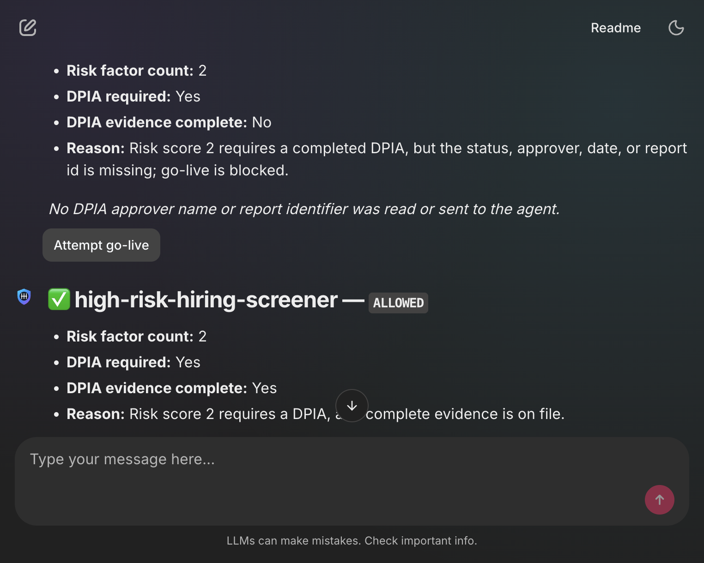
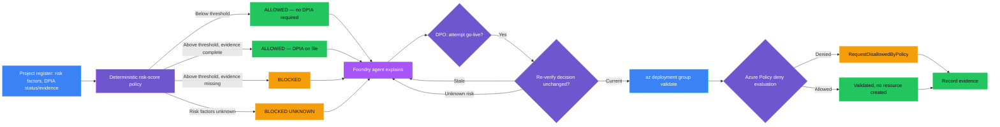
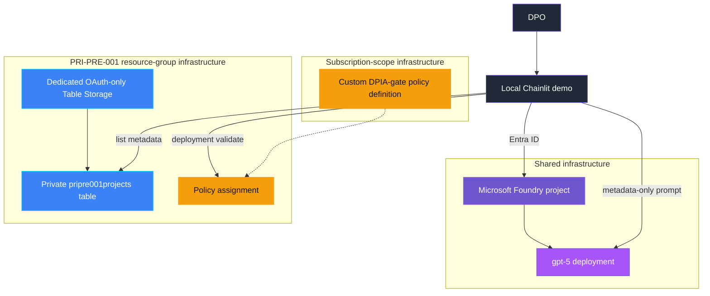

<p align="center">
  
</p>

# PRI-PRE-001 — DPIA required but missing

> **Status:** Implemented
>
> **Last reviewed:** 2026-09-04 against the Microsoft references below.

## Overview

**Real-life scenario:** A product team ships a new AI-powered
hiring-screening feature that automatically scores job candidates —
exactly the kind of automated, significant-effect decision GDPR Article
35 requires a Data Protection Impact Assessment for. Nobody ever completes
one. The feature quietly goes live, and the gap isn't discovered until a
regulator, auditor, or a rejected candidate's complaint forces the
question months later.

PRI-PRE-001 demonstrates that gap and a safe response. A deterministic
policy computes a multi-factor risk score for a synthetic AI-system
register entry, decides whether a DPIA is required, and checks whether
complete DPIA evidence (status, approver, date, report id) is on file. A
Microsoft Foundry agent explains the metadata-only result. Go-live itself
is blocked by a real **Azure Policy `deny` assignment** — the demo never
creates a billable resource; it calls `az deployment group validate`,
which genuinely triggers Azure's own policy engine.

> **The control decides; the agent explains and orchestrates; Azure Policy is the actual backstop.**

## Demo profile

| Property | Value |
|---|---|
| **Demo format** | Deployable demo |
| **Learning level** | Advanced |
| **Estimated time** | 45–60 minutes after Azure access is available |
| **Primary decision** | Allowed, blocked, or blocked-unknown for each project's go-live attempt |
| **Primary capabilities** | Azure Policy (`deny` effect, tag conditions, validate-time evaluation), Azure Table Storage, Microsoft Foundry Agent Framework |
| **Deployment** | Required for the core learning outcome |
| **Infrastructure** | Local Chainlit UI, Foundry project/model, dedicated Table Storage account, a subscription-scope custom Azure Policy definition, and a resource-group-scope policy assignment |
| **AGT / ACS** | Not used in the core demo; fuller action-bound approval is linked for further exploration |

## Demo scope

### Core demo

The runnable path creates four synthetic AI-system/project records,
evaluates a multi-factor risk score and DPIA-evidence completeness from
metadata only, lets a Foundry agent explain the authoritative decisions,
and lets a DPO attempt a real go-live check for any project — genuinely
asking Azure Policy whether it would allow the request, without ever
creating a resource.

### Intentional simplifications

- A synthetic Table Storage register replaces a real AI-system inventory
  or Microsoft Priva/Purview Compliance Manager assessment tracking.
- The risk-factor threshold (`RISK_THRESHOLD = 2`) is illustrative, citing
  EDPB/WP29 and ICO DPIA-screening guidance — not a legal determination;
  real organizations must use their own DPO-approved criteria.
- DPIA evidence is represented as resource tags rather than a real
  document-management or e-signature system.
- The go-live attempt uses a trivial, free placeholder resource type
  (`Microsoft.Insights/actionGroups`) purely to exercise Azure Policy's
  real evaluation via `validate` — nothing is ever actually created.
- Evidence is written locally rather than to a durable audit system.

### What this demo proves

- The model does not compute the risk score, decide whether a DPIA is
  required, or authorize a go-live attempt.
- A project whose risk factors are missing or unrecognized is blocked
  from automatic clearance instead of defaulting to low-risk.
- A high-risk project with incomplete DPIA evidence is blocked, and a
  stale or changed record is refused before any real Azure call is made.
- Azure's own policy engine — not just this demo's code — independently
  agrees with the deterministic decision at `validate` time.

### What this demo does not prove

It does not prove regulatory compliance, that the risk-factor list is
legally complete, that every real deployment path in an organization is
mediated by this same policy, or that DPIA content itself is adequate.

### Interface preview



## Control contract

| Field | Value |
|---|---|
| **ID** | PRI-PRE-001 |
| **Lifecycle phase** | Pre-Live |
| **Category / domain** | Privacy |
| **Control / signal** | DPIA required but missing |
| **Evidence / source** | DPIA decision, processing register |
| **Trigger / threshold** | DPIA required and absent |
| **Action / gate effect** | Block go-live |
| **Accountable role** | DPO |

## Control objective

Detect AI systems or projects that meet GDPR Article 35 high-risk criteria
and make go-live technically impossible without complete DPIA evidence —
using a real, independent enforcement mechanism (Azure Policy) rather than
a check the application itself could bypass. Missing or unrecognized risk
factors fail closed rather than defaulting to low-risk.

## Logical design



## Infrastructure architecture



## Implementation

### Components

| Component | Responsibility | Location |
|---|---|---|
| Chainlit orchestration | Guided seed, scan, explain, and go-live flow | [src/pri_pre_001/chat.py](src/pri_pre_001/chat.py) |
| Deterministic policy | Computes risk score, DPIA-required flag, and evidence completeness | [src/pri_pre_001/policy.py](src/pri_pre_001/policy.py) |
| Table Storage adapter | Lists metadata, scopes to the demo partition, fetches records | [src/pri_pre_001/storage.py](src/pri_pre_001/storage.py) |
| Azure Policy gate | Re-verifies, then calls `az deployment group validate` for a real answer | [src/pri_pre_001/azure_policy_gate.py](src/pri_pre_001/azure_policy_gate.py) |
| Foundry agent | Explains only metadata-safe deterministic decisions | [src/pri_pre_001/agent.py](src/pri_pre_001/agent.py) |
| Evidence | Emits metadata-only decision and go-live evidence | [src/pri_pre_001/evidence.py](src/pri_pre_001/evidence.py) |
| Infrastructure | Owns the subscription-scope policy definition, resource-group Table Storage, policy assignment, and RBAC | [infra/policy-definition.bicep](infra/policy-definition.bicep), [infra/main.bicep](infra/main.bicep) |

### Agent role and authority

The agent receives `GateDecision.safe_dict()` values only — risk factor
count, DPIA-required flag, evidence-complete flag, and reason. It never
sees the DPIA approver's name or report identifier. It may explain
outcomes and the go-live path. It may not alter a decision or trigger a
go-live attempt. The guarded Azure Policy gate is the only state-changing
tool path, and Azure Policy itself — not this code — is the final
authority on whether a request is disallowed.

### Decision rules

| Condition | Decision | Action |
|---|---|---|
| Risk score below threshold | `ALLOWED` | No DPIA required |
| Risk score at/above threshold, complete DPIA evidence | `ALLOWED` | Go-live may proceed |
| Risk score at/above threshold, incomplete DPIA evidence | `BLOCKED` | Go-live refused |
| Risk factors missing or unrecognized | `BLOCKED_UNKNOWN` | Fail closed; risk cannot be assessed |

| Go-live eligibility | Result |
|---|---|
| Record changed since the decision was evaluated | Refused; rescan first |
| Risk factors unknown | Refused locally; Azure is never even called |
| Otherwise | A real `az deployment group validate` call is made |

## Demo

### Prerequisites

- Python 3.10–3.13 and this control's dependencies.
- Azure CLI authentication through `az login`.
- Shared infrastructure deployed first.
- **Resource Policy Contributor (or equivalent) at subscription scope** —
  a one-time, more elevated prerequisite than PRI-001–004 required, needed
  only to deploy the custom policy definition. Running the demo
  afterward only needs the narrower resource-group-scoped roles.
- A PRI-PRE-001 `.env` copied from [.env.example](.env.example).
- Synthetic data only.

### Deploy

From the repository root:

```bash
./infra/deploy.sh
cp controls/privacy/PRI-PRE-001_dpia_required_but_missing/.env.example controls/privacy/PRI-PRE-001_dpia_required_but_missing/.env
./controls/privacy/PRI-PRE-001_dpia_required_but_missing/infra/deploy.sh
```

The first deployment owns generic Foundry resources. The second deploys
in two stages — a subscription-scope policy definition, then the usual
resource-group-scope Table Storage, policy assignment, and RBAC — writing
the resulting IDs and table endpoint back to the control-local `.env`.

### Inspect in Azure

Open the resource group named by `AZURE_RESOURCE_GROUP` in `infra/.env`.
The storage account, table, and policy names are recorded in the
control-local `.env`.

| What to inspect | Where in Azure Portal | What to verify and why it matters |
|---|---|---|
| Policy definition | **Policy** → **Definitions** → search `pri-pre-001-dpia-gate` | The rule denies resources tagged `aiSystemHighRisk=true` unless `dpiaStatus=completed` and the approver/date/report id tags are all present. |
| Policy assignment | **Policy** → **Assignments**, scoped to the resource group | The assignment binds the subscription-scope definition to only this resource group — not the whole subscription. |
| Project register | Storage account named by `PRIPRE001_STORAGE_ACCOUNT_NAME` → **Storage browser** → **Tables** | The table named by `PRIPRE001_TABLE_NAME` exists. Synthetic project metadata appears after **Seed synthetic project records** is used in the UI. |
| Demo operator access | Storage account / resource group → **Access control (IAM)** → **Role assignments** | The signed-in deployment identity has **Storage Table Data Contributor** on the storage account and **Monitoring Contributor** on the resource group — the latter only because `validate` requires write permission on the placeholder resource type, even though nothing is ever created. |

### Run

```bash
cd controls/privacy/PRI-PRE-001_dpia_required_but_missing
../../../.venv/bin/python -m pip install -r requirements.txt
../../../.venv/bin/chainlit run app.py -w
```

Use the buttons in order: create synthetic records, scan, review the
agent explanation, and attempt go-live for any project.

### Expected scenarios

| Synthetic scenario | Expected decision | Expected go-live result |
|---|---|---|
| Low-risk marketing chatbot (no risk factors) | `ALLOWED` | Azure Policy validates without objection |
| High-risk hiring screener, DPIA complete | `ALLOWED` | Azure Policy validates without objection |
| High-risk fraud detection, DPIA missing | `BLOCKED` | Azure Policy denies (`RequestDisallowedByPolicy`) |
| Unknown-risk legacy system | `BLOCKED_UNKNOWN` | Refused locally; Azure is never called |

## Evidence and observability

Evidence contains the control and decision IDs, a hash of the project-id
reference, risk factor count, DPIA-required flag, evidence-complete flag,
whether Azure's own policy evaluation agreed, timestamp, and accountable
role. It excludes the DPIA approver's name and the report identifier.

## Security and privacy

- The demo identity holds least-privilege, scoped roles: **Storage Table
  Data Contributor** on the dedicated storage account and **Monitoring
  Contributor** on the resource group.
- The **Monitoring Contributor** role at resource-group scope is
  deliberately broader than other controls' single-resource RBAC pattern
  — a documented, unavoidable exception: `validate` requires write
  permission on the placeholder resource type, and a role cannot be
  assigned to a resource that is never actually created.
- Deploying the custom policy **definition** requires subscription-scope
  Resource Policy Contributor — a platform constraint (policy definitions
  cannot exist at resource-group scope), not a scope-creep choice.
- Scans read risk factors and DPIA status/evidence-presence flags only;
  the approver's name and report identifier are read internally for the
  tag-based `validate` call but never sent to the agent or included in
  evidence.
- The go-live attempt re-verifies the decision against a freshly fetched
  record immediately before calling Azure, and never calls Azure at all
  for unknown-risk records.

## Validation

```bash
../../../.venv/bin/python -m compileall -q src app.py tests
../../../.venv/bin/python -m pytest -q tests
```

Tests cover risk-score computation and deduplication, gate classification
(allowed below threshold, allowed with complete evidence, blocked with
incomplete evidence, blocked-unknown for missing risk factors), naive
datetime rejection, and metadata-safe agent payloads excluding the DPIA
approver and report id.

### Known limitations

- Public network access remains enabled for this local demo's storage
  account.
- Evidence is logged locally rather than sent to an immutable audit store.
- The risk-factor threshold is illustrative, not a legal determination.
- Scanning is on-demand; production use would evaluate at CI/CD or
  resource-admission time.

## Further exploration

| Concern | Core demo | Possible extension | Authoritative guidance |
|---|---|---|---|
| DPIA tracking | Synthetic Table Storage register | Use Microsoft Priva or Purview Compliance Manager for real assessment tracking | [Microsoft Priva Subject Rights Requests](https://learn.microsoft.com/en-us/purview/privacy-priva-subject-rights-requests) |
| Approval | Evidence tags representing pre-existing DPIA sign-off | Use AGT action-bound approval for a real DPIA sign-off workflow | [AGT action-bound approval protocol](https://github.com/microsoft/agent-governance-toolkit/blob/main/docs/adr/0030-action-bound-approval-protocol.md) |
| Policy boundary | Direct deterministic host call | Use an ACS `pre_tool_call` intervention point if go-live requests become an agent tool | [Agent Control Specification](https://github.com/microsoft/agent-governance-toolkit/tree/main/policy-engine) |
| Enforcement scope | One resource-group-scoped policy assignment | Extend to a policy initiative covering multiple Pre-Live gates (DPIA, lawful basis, retention design) | [Azure Policy definitions effect basics](https://learn.microsoft.com/en-us/azure/governance/policy/concepts/effect-basics) |
| Pipeline integration | Manual "Attempt go-live" button | Wire the same `validate` call into a GitHub Actions or Azure DevOps required check | [Azure Policy definition structure](https://learn.microsoft.com/en-us/azure/governance/policy/concepts/definition-structure-policy-rule) |

These extensions are not implemented in the core demo.

### Community ideas

- Replace the evidence tags with a real AGT action-bound approval record
  for the DPIA sign-off itself.
- Extend the policy rule to a full initiative covering the other planned
  `PRI-PRE-*` controls (lawful basis, retention design).
- Wire the go-live check into an actual CI/CD pipeline gate instead of a
  manual button.

## Cleanup

Use **Cleanup demo records** in the UI to remove only synthetic
`pripre001-demo` partition entities from Table Storage. This does not
remove the policy definition or assignment (they cost nothing to keep and
affect no other resource). Deleting the shared resource group also
removes other demos and must only be done when the whole environment is
no longer needed; the subscription-scope policy definition and any
stray Cognitive Services soft-deletes are unaffected by resource-group
deletion and can be removed separately if desired.

## References

- [Azure Policy definition structure — policy rules](https://learn.microsoft.com/en-us/azure/governance/policy/concepts/definition-structure-policy-rule)
- [Azure Policy definitions effect basics](https://learn.microsoft.com/en-us/azure/governance/policy/concepts/effect-basics)
- [Microsoft.Authorization/policyDefinitions template reference](https://learn.microsoft.com/en-us/azure/templates/microsoft.authorization/policydefinitions)
- [Article 35 GDPR — Data protection impact assessment](https://gdpr-info.eu/art-35-gdpr/)
- [EDPB / WP29 Guidelines on DPIA (wp248rev.01)](https://ec.europa.eu/newsroom/article29/items/611236)
- [ICO — When do we need to do a DPIA?](https://ico.org.uk/for-organisations/uk-gdpr-guidance-and-resources/data-protection-impact-assessments-dpias/data-protection-impact-assessments/)
- [AGT action-bound approval protocol](https://github.com/microsoft/agent-governance-toolkit/blob/main/docs/adr/0030-action-bound-approval-protocol.md)
- [Agent Control Specification](https://github.com/microsoft/agent-governance-toolkit/tree/main/policy-engine)
- [Source governance catalog](../../../docs/Governance%20Signals%20Repo.pdf)

---

<p align="center">
  
</p>

