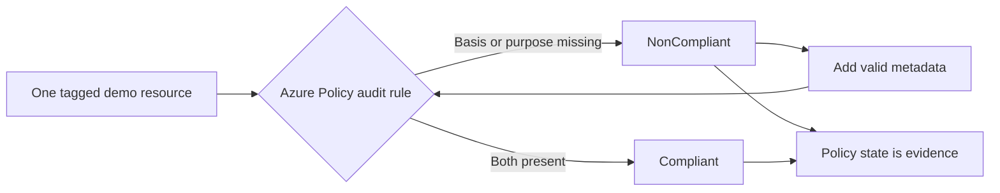

<p align="center">
  
</p>

# PRI-PRE-002 — Lawful basis or purpose missing

> **Status:** Implemented
>
> **Last reviewed:** 2026-09-04

## Overview

A team is preparing an AI system that processes personal data, but cannot show
the declared lawful basis and documented purpose. The gap should be visible to
the privacy team before go-live, without pretending that a tag alone proves
legal compliance.

This bite-sized demo uses an **Azure Policy `audit` assignment**. It deploys one
disabled Azure Action Group with deliberately incomplete metadata, shows the
non-compliant policy result, and then remediates the same resource so it becomes
compliant. The Action Group has no receivers and sends no notifications.

> **Azure Policy detects. The privacy team remediates. Nothing is blocked.**

## Demo profile

| Property | Value |
|---|---|
| **Demo format** | `DEPLOYABLE_DEMO` |
| **Learning level** | Foundation |
| **Estimated time** | 20–30 minutes; Azure Policy evaluation is asynchronous |
| **Primary decision** | Compliant or non-compliant for the demonstrated personal-data go-live request |
| **Primary capability** | Azure Policy with the `audit` effect and compliance state |
| **Deployment** | Required for the core learning outcome |
| **Infrastructure** | One custom policy definition, one assignment, and one temporary disabled Action Group |
| **AGT / ACS / Foundry** | Not used: this is an Azure configuration assessment, not an agent-runtime decision |

## Demo scope

### Core demo

The core demo uses one resource as the single source of truth:

1. Deploy it with `goLiveRequested=true` and
   `personalDataProcessing=true`, but without a valid `lawfulBasis` or
   non-empty `purposeId`.
2. Trigger Azure Policy evaluation and observe `NonCompliant`.
3. Add `lawfulBasis=contract` and `purposeId=PURPOSE-DEMO-001`.
4. Trigger evaluation again and observe `Compliant`.

### Intentional simplifications

- Tags replace an authoritative record of processing activities.
- The six GDPR Article 6(1) categories are used as a small illustrative enum,
  not as legal advice or a complete organizational decision method.
- Azure Policy checks whether declarations are present and recognized; it
  cannot establish whether they are truthful or legally appropriate.
- The Action Group is only a safe, taggable demonstration target. It is not an
  AI workload and remains disabled with no receivers.

### What this demo proves

- Azure Policy can detect the demonstrated missing or invalid metadata without
  custom decision code.
- `audit` records non-compliance but does not block deployment or remediation.
- The compliant and non-compliant outcomes come from the same Azure resource
  and policy rule, not from disconnected application data.

### What this demo does not prove

It does not prove GDPR compliance, determine the correct lawful basis, validate
the purpose description, or guarantee that every deployment supplies the
trigger tags. Production use requires a trusted inventory or release process
and an authoritative privacy workflow.

## Control contract

| Field | Value |
|---|---|
| **ID** | PRI-PRE-002 |
| **Lifecycle phase** | Pre-Live |
| **Category / domain** | Privacy |
| **Signal** | A personal-data go-live request lacks a recognized lawful basis or purpose reference |
| **Decision** | Azure Policy compliant or non-compliant |
| **Governance action** | Flag for design remediation; do not block |
| **Accountable role** | Privacy Officer |
| **Evidence** | Azure Policy compliance state, policy/resource identifiers, and evaluation timestamp |

## How it works



The policy is evaluated only for a demonstrated go-live request that explicitly
declares personal-data processing. It treats a missing, empty, or unrecognized
`lawfulBasis` and a missing or empty `purposeId` as non-compliant.

## Demo

### Prerequisites

- Azure CLI authenticated with `az login`.
- An existing Azure resource group in which you may deploy the temporary Action
  Group and create a policy assignment.
- Permission to create a custom policy definition at subscription scope, such
  as **Resource Policy Contributor**.

### Configure

From the repository root:

```bash
cp controls/privacy/PRI-PRE-002_lawful_basis_or_purpose_missing/.env.example \
  controls/privacy/PRI-PRE-002_lawful_basis_or_purpose_missing/.env
```

Set `AZURE_SUBSCRIPTION_ID` and `AZURE_RESOURCE_GROUP` in the copied file. If
they already exist in `infra/.env`, the control reuses those values.

### Deploy the policy

```bash
./controls/privacy/PRI-PRE-002_lawful_basis_or_purpose_missing/infra/deploy.sh
```

### Run the non-compliant scenario

```bash
./controls/privacy/PRI-PRE-002_lawful_basis_or_purpose_missing/demo.sh start
```

The resource deployment succeeds because `audit` never blocks. The script
triggers an Azure Policy scan. Evaluation can take several minutes; check until
a state is available:

```bash
./controls/privacy/PRI-PRE-002_lawful_basis_or_purpose_missing/demo.sh status
```

Expected state: `NonCompliant`.

### Remediate the same resource

```bash
./controls/privacy/PRI-PRE-002_lawful_basis_or_purpose_missing/demo.sh remediate
./controls/privacy/PRI-PRE-002_lawful_basis_or_purpose_missing/demo.sh status
```

After Azure reevaluates the resource, the expected state is `Compliant`. The
`status` output is the real Azure Policy evidence and can be saved directly:

```bash
./controls/privacy/PRI-PRE-002_lawful_basis_or_purpose_missing/demo.sh status > evidence.json
```

## Inspect in Azure

| What to inspect | Azure Portal path | What to verify |
|---|---|---|
| Policy definition | **Policy** → **Definitions** → `pri-pre-002-lawful-basis-gate` | The effect is `audit`; missing, empty, or unknown metadata is included in the rule. |
| Policy assignment | **Policy** → **Assignments** → select the resource group | The definition is assigned only to the selected demo resource group. |
| Demo target | Resource group → `pripre002-demo` → **Tags** | It starts without valid basis/purpose metadata and is later updated in place. The Action Group is disabled and has no receivers. |
| Compliance evidence | **Policy** → **Compliance** → select the assignment | The same resource changes from `NonCompliant` to `Compliant` after remediation and reevaluation. |

## Evidence

`demo.sh status` returns a compact projection of Azure Policy state containing:

- compliance state;
- policy definition and assignment identifiers;
- evaluated resource identifier and type;
- policy evaluation timestamp.

Those fields are the authoritative evidence for this demo. No model output,
personal data, lawful-basis rationale, or free-text purpose is collected.

## Validation

Run the local, read-only checks:

```bash
./controls/privacy/PRI-PRE-002_lawful_basis_or_purpose_missing/validate.sh
```

This compiles all Bicep templates and checks the shell scripts. The deployed
behavior is validated by completing the non-compliant and remediated paths.

## Cleanup

Delete the temporary Action Group:

```bash
./controls/privacy/PRI-PRE-002_lawful_basis_or_purpose_missing/demo.sh cleanup
```

Then remove only this control's policy assignment and definition:

```bash
./controls/privacy/PRI-PRE-002_lawful_basis_or_purpose_missing/infra/cleanup.sh
```

Neither command deletes the resource group or shared infrastructure.

## Further exploration

- Connect the metadata to the organization's authoritative record of processing
  activities rather than treating Azure tags as the source of truth.
- Use Microsoft Agent Governance Toolkit approval workflows if a future agent
  initiates or records the lawful-basis approval action.
- Automate policy scans and evidence collection in CI/CD or a governance
  reporting workflow.
- Group this rule with related pre-live controls in an Azure Policy initiative.

## References

- [Azure Policy `audit` effect](https://learn.microsoft.com/en-us/azure/governance/policy/concepts/effect-audit)
- [Get Azure Policy compliance data](https://learn.microsoft.com/en-us/azure/governance/policy/how-to/get-compliance-data)
- [Microsoft Agent Governance Toolkit approval workflows](https://github.com/microsoft/agent-governance-toolkit/blob/main/docs/tutorials/38-approval-workflows.md)
- GDPR Article 6(1) and Article 5(1)(b); the demo is illustrative and is not
  legal advice.

---

<p align="center">
  
</p>
