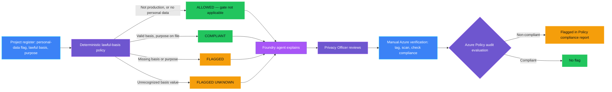
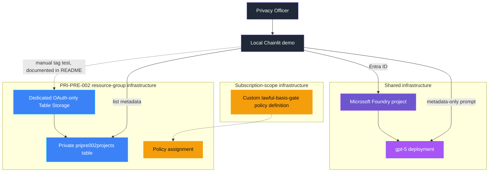

<p align="center">
  
</p>

# PRI-PRE-002 — Lawful basis or purpose missing

> **Status:** Implemented
>
> **Last reviewed:** 2026-09-04 against the Microsoft references below.

## Overview

**Real-life scenario:** A recommendation engine has quietly been scoring
customers using behavioral data for over a year. When a privacy audit
finally asks "what's the lawful basis for this processing, and what's the
documented purpose?", nobody can answer — no GDPR Article 6(1) basis was
ever recorded, and no purpose was ever written down. The gap isn't
malicious; it's just never been checked.

PRI-PRE-002 demonstrates that gap and a safe response. A deterministic
policy checks whether a synthetic AI-system register entry processes
personal data, whether it has a valid lawful basis, and whether a purpose
is documented. A Microsoft Foundry agent explains the metadata-only
result. The real backstop is a **Azure Policy `audit` assignment** — it
flags a non-compliant resource in Azure's own compliance report without
blocking it, which fits "remediate design" better than a hard block.

> **The control decides; the agent explains; Azure Policy flags for remediation — it does not block.**

### Intentional simplifications

- A synthetic Table Storage register replaces a real
  record-of-processing-activities system.
- The `lawfulBasis` value is restricted to the six GDPR Article 6(1)
  categories (illustrative screening only, not a legal determination):
  consent, contract, legal obligation, vital interests, public task, and
  legitimate interests.
- Lawful basis and purpose are represented as tags rather than a real
  documentation system.
- Evidence is written locally rather than to a durable audit system.

### What this demo proves

- The model does not decide whether personal data is processed, whether a
  lawful basis is valid, or whether a purpose is documented.
- A project whose declared lawful basis doesn't match a recognized
  category is flagged as unknown instead of assumed compliant.
- Azure's own policy engine — not just this demo's code — independently
  agrees with the deterministic decision, evaluated asynchronously.

### What this demo does not prove

It does not prove regulatory compliance, that the six-category list is
the organization's complete legal methodology, or that a declared purpose
is itself adequate or accurate. It also does not detect a fabricated
lawful basis or purpose id — the same trust boundary documented in
PRI-PRE-001 applies here: this control makes a *missing* declaration
impossible to overlook, not a *false* one detectable.

## Control contract

| Field | Value |
|---|---|
| **ID** | PRI-PRE-002 |
| **Lifecycle phase** | Pre-Live |
| **Category / domain** | Privacy |
| **Control / signal** | Lawful basis or purpose missing |
| **Evidence / source** | Privacy assessment, processing register |
| **Trigger / threshold** | Personal data use without basis/purpose |
| **Action / gate effect** | Remediate design |
| **Accountable role** | Privacy Officer |

## Control objective

Detect projects that process personal data without a documented GDPR
Article 6(1) lawful basis or Article 5(1)(b) processing purpose, and flag
the gap for design remediation — using a real, independent Azure
mechanism rather than a check the application itself could bypass.
Missing or unrecognized lawful-basis values fail closed rather than
defaulting to compliant.

## Logical design



## Infrastructure architecture



## Implementation

### Components

| Component | Responsibility | Location |
|---|---|---|
| Chainlit orchestration | Guided seed, scan, and explain flow | [src/pri_pre_002/chat.py](src/pri_pre_002/chat.py) |
| Deterministic policy | Computes personal-data, lawful-basis, and purpose flags | [src/pri_pre_002/policy.py](src/pri_pre_002/policy.py) |
| Table Storage adapter | Lists metadata, scopes to the demo partition | [src/pri_pre_002/storage.py](src/pri_pre_002/storage.py) |
| Foundry agent | Explains only metadata-safe deterministic decisions | [src/pri_pre_002/agent.py](src/pri_pre_002/agent.py) |
| Evidence | Emits metadata-only decision evidence | [src/pri_pre_002/evidence.py](src/pri_pre_002/evidence.py) |
| Infrastructure | Owns the subscription-scope policy definition, resource-group Table Storage, policy assignment, and RBAC | [infra/policy-definition.bicep](infra/policy-definition.bicep), [infra/main.bicep](infra/main.bicep) |

### Agent role and authority

The agent receives `GateDecision.safe_dict()` values only — whether the
project processes personal data, whether its lawful basis is valid,
whether a purpose is documented, and the reason. It never sees the raw
lawful-basis string or purpose id. It may explain outcomes. It may not
alter a decision. Azure Policy's `audit` evaluation — not this code — is
the real compliance signal, and it never blocks a deployment.

### Decision rules

| Condition | Decision | Action |
|---|---|---|
| Environment is not `production` | `ALLOWED` | Gate does not apply outside production |
| Project does not process personal data | `ALLOWED` | Gate does not apply |
| Lawful basis missing | `FLAGGED` | Remediate design |
| Lawful basis present but not a recognized GDPR Article 6(1) category | `FLAGGED_UNKNOWN` | Fail closed; cannot assess |
| Valid lawful basis, purpose missing | `FLAGGED` | Remediate design |
| Valid lawful basis and purpose documented | `COMPLIANT` | No action needed |

Azure's own policy rule does not distinguish `FLAGGED` from
`FLAGGED_UNKNOWN` — both surface as a single **Non-compliant** result in
the compliance report. That distinction is a deterministic-code-level
refinement for a clearer agent explanation, not a difference Azure itself
enforces.

## Demo

### Prerequisites

- Python 3.10–3.13 and this control's dependencies.
- Azure CLI authentication through `az login`.
- Shared infrastructure deployed first.
- **Resource Policy Contributor (or equivalent) at subscription scope** —
  needed only to deploy the custom policy definition, same as
  PRI-PRE-001.
- A PRI-PRE-002 `.env` copied from [.env.example](.env.example).
- Synthetic data only.

### Deploy

From the repository root:

```bash
./infra/deploy.sh
cp controls/privacy/PRI-PRE-002_lawful_basis_or_purpose_missing/.env.example controls/privacy/PRI-PRE-002_lawful_basis_or_purpose_missing/.env
./controls/privacy/PRI-PRE-002_lawful_basis_or_purpose_missing/infra/deploy.sh
```

The first deployment owns generic Foundry resources. The second deploys
in two stages — a subscription-scope policy definition, then the usual
resource-group-scope Table Storage, policy assignment, and RBAC — writing
the resulting IDs and table endpoint back to the control-local `.env`.

### Inspect in Azure

Open the resource group named by `AZURE_RESOURCE_GROUP` in `infra/.env`.
The storage account, table, and policy names are recorded in the
control-local `.env`.

| What to inspect | Where in Azure Portal | What to verify and why it matters |
|---|---|---|
| Policy definition | **Policy** → **Definitions** → search `pri-pre-002-lawful-basis-gate` | In production, the rule flags (does not block) resources tagged `personalDataProcessing=true` unless `lawfulBasis` is one of the six recognized categories and `purposeId` is present. |
| Policy assignment | **Policy** → **Assignments**, scoped to the resource group | The assignment binds the subscription-scope definition to only this resource group — not the whole subscription. |
| Project register | Storage account named by `PRIPRE002_STORAGE_ACCOUNT_NAME` → **Storage browser** → **Tables** | Columns `Environment`, `ProcessesPersonalData`, `LawfulBasis`, `PurposeId` are the exact fields the policy checks, spelled as tags below. |
| Demo operator access | Storage account → **Access control (IAM)** → **Role assignments** | The signed-in deployment identity has only **Storage Table Data Contributor** — no extra RBAC exception is needed, unlike PRI-PRE-001, because `audit` never validates a placeholder resource. |

Beyond clicking through the demo app, verify the policy directly — and
see the key difference from PRI-PRE-001's instant `deny` proof. Open the
storage account named by `PRIPRE002_STORAGE_ACCOUNT_NAME` → **Tags**, and
add `environment=production` and `personalDataProcessing=true` without
`lawfulBasis`/`purposeId`. Unlike PRI-PRE-001, **the tag update succeeds
immediately** — `audit` never blocks a request. To see the flag itself,
trigger an on-demand compliance scan and check the result:

```bash
az policy state trigger-scan --resource-group "$AZURE_RESOURCE_GROUP"
# wait a few minutes, then:
az policy state list --resource-group "$AZURE_RESOURCE_GROUP" \
  --filter "PolicyDefinitionName eq 'pri-pre-002-lawful-basis-gate'"
```

The resource shows **NonCompliant**. Compliance results can take up to
about 15 minutes to appear even after a triggered scan — this is a real,
documented Azure Policy characteristic, not a bug in this demo. Add
`lawfulBasis=contract` and `purposeId=PURPOSE-TEST-001`, trigger the scan
again, and confirm it becomes **Compliant**. Revert the tags afterward so
the shared storage account isn't left flagged non-compliant.

### Run

```bash
cd controls/privacy/PRI-PRE-002_lawful_basis_or_purpose_missing
../../../.venv/bin/python -m pip install -r requirements.txt
../../../.venv/bin/chainlit run app.py -w
```

Use the buttons in order: create synthetic records, scan, and review the
agent explanation.

### Expected scenarios

| Synthetic scenario | Expected decision |
|---|---|
| No personal data processed | `ALLOWED` |
| Valid lawful basis and purpose on file | `COMPLIANT` |
| Missing lawful basis | `FLAGGED` |
| Unrecognized lawful-basis value | `FLAGGED_UNKNOWN` |

## Evidence and observability

Evidence contains the control and decision IDs, a hash of the project-id
reference, whether personal data is processed, whether the lawful basis
is valid, whether a purpose is documented, timestamp, and accountable
role. It excludes the raw lawful-basis string and purpose id.

## Security and privacy

- The demo identity holds one least-privilege, scoped role: **Storage
  Table Data Contributor** on the dedicated storage account.
- Deploying the custom policy **definition** requires subscription-scope
  Resource Policy Contributor — a platform constraint (policy definitions
  cannot exist at resource-group scope), not a scope-creep choice.
- Scans read the personal-data flag and lawful-basis/purpose
  evidence-presence flags only; the raw lawful-basis string and purpose
  id are never sent to the agent or included in evidence.
- `audit` never blocks, creates, or modifies any resource — the manual
  Azure verification walkthrough above tags the control's own existing
  storage account and reverts the tags afterward.

## Validation

```bash
../../../.venv/bin/python -m compileall -q src app.py tests
../../../.venv/bin/python -m pytest -q tests
```

Tests cover the personal-data bypass, environment scoping, missing-basis
flagging, unrecognized-basis fail-closed behavior, purpose-missing
flagging, the compliant path, naive datetime rejection, and metadata-safe
agent payloads excluding the raw lawful-basis string and purpose id.

### Known limitations

- Public network access remains enabled for this local demo's storage
  account.
- Evidence is logged locally rather than sent to an immutable audit
  store.
- The six-category enum is illustrative screening, not a legal
  determination.
- `audit` is advisory only — it never blocks a deployment, unlike
  PRI-PRE-001's `deny` gate.
- Azure Policy compliance results are asynchronous (up to ~15 minutes, or
  an on-demand scan of unspecified duration) — this control cannot show
  an instant real-time proof the way PRI-PRE-001's `validate` call does.

## Cleanup

Use the **Cleanup demo records** button in the Chainlit UI to delete only
PRI-PRE-002's synthetic Table Storage entities. If you ran the manual
Azure verification walkthrough, revert the storage account's tags as
described above. To remove the Azure infrastructure entirely, delete the
resource-group-scope policy assignment and Table Storage account, then
the subscription-scope policy definition — do not delete the shared
resource group unless tearing down every control in it.

## Further exploration

| Concern | Core demo | Possible extension | Authoritative guidance |
|---|---|---|---|
| Lawful-basis tracking | Synthetic Table Storage register | Use Microsoft Priva or Purview Compliance Manager for a real record-of-processing-activities system | [Microsoft Priva](https://learn.microsoft.com/en-us/purview/priva-privacy-risk-management) |
| Approval | Evidence tags representing pre-existing lawful-basis sign-off | Use AGT's action-bound approval design (proposed, not yet implemented in AGT) for a real lawful-basis determination workflow | [AGT action-bound approval protocol](https://github.com/microsoft/agent-governance-toolkit/blob/main/docs/adr/0030-action-bound-approval-protocol.md) |
| Enforcement scope | One resource-group-scoped policy assignment | Extend to a policy initiative covering multiple Pre-Live gates (DPIA, lawful basis, retention design) | [Azure Policy definitions effect basics](https://learn.microsoft.com/en-us/azure/governance/policy/concepts/effect-basics) |
| Compliance visibility | Manual on-demand scan | Wire the same scan into a scheduled GitHub Actions/Azure DevOps job | [Azure Policy Compliance Scan GitHub Action](https://github.com/marketplace/actions/azure-policy-compliance-scan) |

These extensions are not implemented in the core demo.

### Community ideas

- Replace the evidence tags with a real AGT action-bound approval record
  for the lawful-basis determination itself.
- Extend the policy rule to a full initiative covering the other planned
  `PRI-PRE-*` controls.
- Add a scheduled compliance-scan workflow instead of a manual, on-demand
  check.

## References

- [Azure Policy definitions audit effect](https://learn.microsoft.com/en-us/azure/governance/policy/concepts/effect-audit)
- [Get policy compliance data — evaluation triggers and timing](https://learn.microsoft.com/en-us/azure/governance/policy/how-to/get-compliance-data)
- GDPR Article 6(1) lawful bases for processing and Article 5(1)(b)
  purpose limitation (EU General Data Protection Regulation) — cited for
  illustrative screening criteria only, not legal advice.
- Source catalog: [Governance Signals Repo.pdf](../../../docs/Governance%20Signals%20Repo.pdf)

---

<p align="center">
  
</p>

