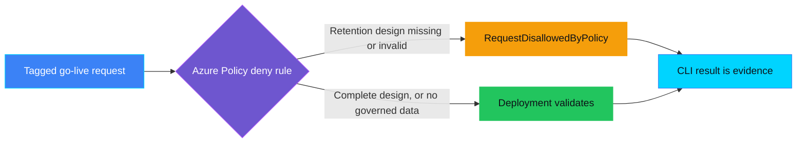
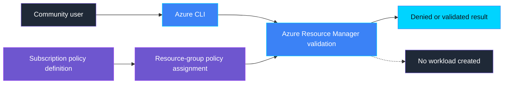

<p align="center">
  
</p>

# PRI-PRE-003 — Retention design missing

> **Status:** Validated
>
> **Last reviewed:** 2026-09-04

## Overview

A product team is about to switch on a new AI feature that will start logging
conversations and usage traces. Nobody has decided how long that data will be
kept, where it lives, or who deletes it once the retention period ends — the
plan is to "figure it out later," after launch. If go-live proceeds anyway,
sensitive data can accumulate indefinitely with no one accountable for
disposing of it, and the gap is usually discovered only during an audit or a
data-subject request.

This bite-sized demo uses an **Azure Policy `deny` assignment** to reject a
go-live request that carries governed data but has never had its retention
design declared. It then validates four more requests — a complete design, a
request with an invalid retention period, a request with an invalid
disposition, and a request that carries no governed data at all — and shows
that Azure's own admission decision changes with the facts. All five paths use
`az deployment group validate`, so no demo workload is ever created.

> **Azure Policy decides. A go-live request is blocked until its retention
> design — category, storage system, period, disposition, and owner — is
> complete.**

## Demo profile

| Property | Value |
|---|---|
| **Demo format** | `DEPLOYABLE_DEMO` |
| **Learning level** | Foundation |
| **Estimated time** | 15–20 minutes, including policy propagation |
| **Primary decision** | Deny a tagged go-live request that carries governed data when its retention design is missing or invalid |
| **Primary capabilities** | Azure Policy with the `deny` effect |
| **Deployment** | Required for the core learning outcome |
| **Infrastructure** | One custom policy definition and one resource-group-scoped assignment |
| **AGT / ACS** | Not applicable: this is Azure resource admission, not an agent-runtime decision |
| **Model/Foundry role** | `Not used — not applicable to the core path` — Foundry trace data is named only as an example of governed data this retention design would cover; no Foundry agent or model participates in the decision |

## Demo scope

### Core demo

The core demo runs five validations against the same harmless Azure Action
Group template:

1. **Complete design** (`healthy`): `governedDataPresent=true` and all five
   retention tags present and valid. Azure validates the deployment.
2. **Tags missing** (`missing`): `governedDataPresent=true` and no retention
   tags at all. Azure Policy returns `RequestDisallowedByPolicy`.
3. **Invalid retention period** (`invalid-period`): every tag matches the
   complete design except `retentionPeriodDays=-5`, isolating the period
   format check. Azure Policy returns `RequestDisallowedByPolicy`.
4. **Invalid disposition** (`invalid-disposition`): every tag matches the
   complete design except an unrecognized `retentionDisposition`, isolating
   the disposition check. Azure Policy returns `RequestDisallowedByPolicy`.
5. **Not applicable** (`not-applicable`): `governedDataPresent=false` and no
   retention tags. Azure validates the deployment, because the gate does not
   apply when no governed data is declared.

### Intentional simplifications

- The demo starts after a system has already declared whether it holds
  governed data. It does not detect or classify governed data itself.
- Tags stand in for an authoritative retention register, data-mapping tool, or
  real Log Analytics table configuration.
- A declared `retentionPeriodDays` value must be an unsigned integer of 1-5
  digits (1-99999 days, roughly 274 years); the policy denies non-numeric,
  negative, decimal, or zero values, but does not verify the number against
  any real Log Analytics or storage retention setting, or that it is legally
  sufficient.
- The placeholder resource is validated only; it is never deployed.

### What this demo proves

- A Microsoft-native policy can technically deny the demonstrated go-live
  request when any part of its retention design is missing or invalid.
- Remediating the exact request, or correctly declaring that no governed data
  is present, changes the authoritative Azure result from denied to validated.
- No model or custom policy engine participates in the decision.

### What this demo does not prove

It does not prove regulatory retention compliance, does not verify that a
declared retention period matches an actual Log Analytics workspace or table
setting, does not classify which systems hold governed data, and does not
ensure every organizational deployment supplies the trigger tags. Production
use requires a trusted inventory or release process that supplies those values
and protects who may change them.

## Demo

### Prerequisites

- Azure CLI authenticated with `az login`.
- An existing Azure resource group in which you have permission to validate a
  deployment and create a policy assignment.
- Permission to create a custom policy definition at subscription scope, such
  as **Resource Policy Contributor**.

### Configure

From the repository root:

```bash
cp controls/privacy/PRI-PRE-003_retention_design_missing/.env.example \
  controls/privacy/PRI-PRE-003_retention_design_missing/.env
```

Set `AZURE_SUBSCRIPTION_ID` and `AZURE_RESOURCE_GROUP` in the copied file. If
they already exist in `infra/.env`, the control reuses those values.

### Deploy the policy

```bash
./controls/privacy/PRI-PRE-003_retention_design_missing/infra/deploy.sh
```

Azure Policy assignments can take several minutes to propagate.

### Run the five-scenario demo

```bash
./controls/privacy/PRI-PRE-003_retention_design_missing/demo.sh
```

Expected output:

- `VALIDATED as expected (healthy)` for the complete retention design;
- `BLOCKED as expected (missing)` for the request with no retention tags;
- `BLOCKED as expected (invalid-period)` for the request with an invalid
  `retentionPeriodDays` and every other tag valid;
- `BLOCKED as expected (invalid-disposition)` for the request with an invalid
  `retentionDisposition` and every other tag valid;
- `VALIDATED as expected (not-applicable)` for the request with no governed
  data;
- a small JSON evidence record printed to the terminal.

The command fails if any result differs from the expectation. It never uses
`az deployment group create` for the placeholder workload.

### Inspect in Azure

| What to inspect | Azure Portal path | What to verify |
|---|---|---|
| Policy definition | **Policy** → **Definitions** → `pri-pre-003-retention-gate` | The effect is `deny`; the rule requires all five retention-design tags for a governed-data go-live request. |
| Policy assignment | **Policy** → **Assignments** → select the resource group | The assignment is scoped only to the chosen demo resource group. |
| Activity evidence | Resource group → **Activity log** | The blocked validations are attributed to the custom policy. No placeholder Action Group appears in the resource list. |

### Expected scenarios

| Scenario | Input | Expected decision | Expected evidence |
|---|---|---|---|
| Complete design | Governed data, all five retention tags valid | Validate | Successful Azure validation |
| Missing design | Governed data, no retention tags | Deny | `RequestDisallowedByPolicy` |
| Invalid retention period | Governed data, every tag valid except `retentionPeriodDays=-5` | Deny | `RequestDisallowedByPolicy` |
| Invalid disposition | Governed data, every tag valid except an unrecognized `retentionDisposition` | Deny | `RequestDisallowedByPolicy` |
| No governed data | `governedDataPresent=false`, no retention tags | Validate | Successful Azure validation (gate does not apply) |
| Policy unavailable or not propagated | Azure cannot produce the expected result | Fail the demo | Safe error; no success claim |

## Control contract

| Field | Value |
|---|---|
| **ID** | PRI-PRE-003 |
| **Lifecycle phase** | Pre-Live |
| **Category / domain** | Privacy |
| **Signal** | A go-live request declares governed data but has no complete retention design |
| **Decision** | Allow or deny the deployment validation |
| **Governance action** | Block go-live until the retention design is complete |
| **Accountable role** | Privacy Officer |
| **Evidence** | Azure Policy result, policy identifiers, deployment correlation name, and timestamp |

## Control objective

Deny the demonstrated go-live request when a system declares it holds governed
data but its retention design — data category, storage system, retention
period, disposition, and owner — is incomplete or invalid. The decision is
deterministic and belongs to Azure Policy. Whether data is actually governed,
and whether a declared retention period is adequate, remain explicit upstream
trust boundaries rather than hidden model decisions.

## Logical design



The policy is deliberately narrow. It evaluates a resource only when both
`goLiveRequested=true` and `governedDataPresent=true` are present. For that
request, `retentionDataCategory`, `retentionStorageSystem`,
`retentionPeriodDays`, `retentionDisposition`, and `retentionOwner` must all be
present and individually valid (`retentionPeriodDays` a 1-5 digit unsigned
integer, so not zero, negative, decimal, or non-numeric; `retentionDisposition`
in `delete`/`archive`).

## Infrastructure architecture



## Implementation

| Component | Responsibility | Location |
|---|---|---|
| Azure Policy definition | Expresses the authoritative `deny` rule | [infra/policy-definition.bicep](infra/policy-definition.bicep) |
| Policy assignment | Limits the demo policy to one resource group | [infra/main.bicep](infra/main.bicep) |
| Validation target | Supplies the five scenario tag sets | [infra/demo-target.bicep](infra/demo-target.bicep) |
| Demo runner | Executes all five validations and prints evidence | [demo.sh](demo.sh) |

### Decision rules

- The rule applies only when `goLiveRequested=true` and
  `governedDataPresent=true`.
- It denies when `retentionDataCategory`, `retentionStorageSystem`,
  `retentionDisposition`, or `retentionOwner` is absent or empty, or when
  `retentionDisposition` is not `delete`/`archive`, or when
  `retentionPeriodDays` is absent, empty, `0`, or not an unsigned integer of
  1-5 digits (so a negative number, a decimal, or non-numeric text is denied
  the same as a missing value).
- A request with `governedDataPresent=false` always validates: the gate never
  evaluates retention tags when no governed data is declared.
- The shell runner fails if Azure does not deny the missing/invalid requests or
  validate the healthy/not-applicable requests.

### Best-practice choices

The demo uses the supported Azure Policy engine directly, scopes its
assignment to one resource group, authenticates through the Azure CLI, stores
no secrets or PII, and validates rather than creates the placeholder workload.

## Evidence and observability

The terminal record contains the control and policy version, all five
authoritative Azure results, the deployment correlation names, a UTC
timestamp, the action, and accountable role. It contains no retention
document, prompt, personal data, or model output.

Example:

```json
{
  "control_id": "PRI-PRE-003",
  "policy_version": "1.0.0",
  "healthy_result": "validated",
  "missing_result": "denied",
  "invalid_period_result": "denied",
  "invalid_disposition_result": "denied",
  "not_applicable_result": "validated",
  "resource_created": false,
  "action": "block go-live until a complete retention design is documented",
  "accountable_role": "Privacy Officer"
}
```

## Security and privacy

- Azure CLI authentication uses the current Entra identity; credentials are
  not stored in the control.
- Only synthetic, non-personal tags are sent to Azure.
- The policy assignment is resource-group scoped; creating the reusable custom
  definition still requires subscription-scope permission.
- Validation errors are inspected only for the authoritative Azure Policy
  error code, and a non-policy failure is surfaced rather than treated as a
  deny.
- The demo creates no workload or retention record.

## Validation

Run the local, read-only checks:

```bash
./controls/privacy/PRI-PRE-003_retention_design_missing/validate.sh
```

This compiles all three Bicep templates and checks the shell scripts. The
deployed behavior is validated by running the core demo itself.

## Cleanup

The core demo creates no workload, so it has no demo-resource cleanup. Remove
only this control's policy assignment and definition with:

```bash
./controls/privacy/PRI-PRE-003_retention_design_missing/infra/cleanup.sh
```

The script does not delete the resource group or shared infrastructure.

## Further exploration

- Compare the declared `retentionPeriodDays` tag against the real
  `retentionInDays`/`totalRetentionInDays` on an actual Log Analytics table
  using `az monitor log-analytics workspace table show`. No Azure Policy
  built-in currently audits or enforces those settings, so this remains a
  read-only comparison rather than a built-in enforcement gate.
- Connect the trigger metadata to a trusted AI inventory or required CI/CD
  stage so teams cannot silently omit it.
- Group this rule with PRI-PRE-001 and PRI-PRE-002 in an Azure Policy
  initiative.
- Store the authoritative retention design in the organization's records-
  management or data-mapping system and expose only the declared values used
  here to the deployment policy.

## References

- [Azure Policy `deny` effect](https://learn.microsoft.com/en-us/azure/governance/policy/concepts/effect-deny)
- [Azure Policy definition structure](https://learn.microsoft.com/en-us/azure/governance/policy/concepts/definition-structure-policy-rule)
- [Manage Data Retention in a Log Analytics Workspace](https://learn.microsoft.com/en-us/azure/azure-monitor/logs/data-retention-configure)
- [Foundry tracing and data handling](https://learn.microsoft.com/azure/foundry/observability/concepts/trace-data)
- [Purview retention policies for Copilot and AI apps](https://learn.microsoft.com/en-us/purview/retention-policies-copilot)

---

<p align="center">
    
</p>
