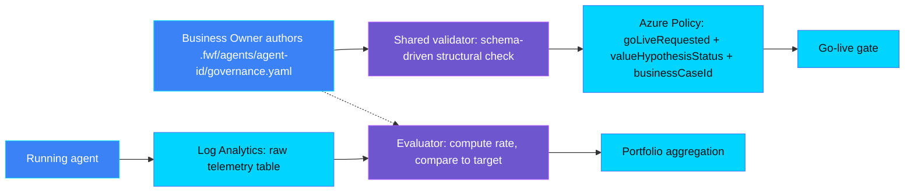
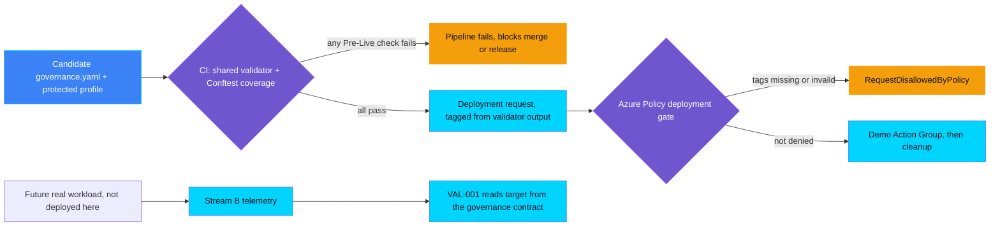

## Status

This is a living design note, not a governance requirement and not a
substitute for any control's own `ASSESSMENT.md` or `README.md`.
VAL-PRE-001 and VAL-PRE-002 have executable implementations. VAL-PRE-002's
new candidate CI gate and cleanup are locally tested; its current OIDC route
has not been live-validated. Every other control referenced here is a
scaffolded placeholder from `scripts/scaffold_controls.py`. Sections that
describe those controls state current design intent, not a finished
specification, and this file is corrected each time a new control in this
category is actually built.

## Why this file exists

Value, Adoption, and FinOps controls share three underlying data sources
rather than each inventing its own. Without a single reference, a future
session designing VAL-PRE-003 could quietly redefine the telemetry event
shape that VAL-001 already depends on, or a session designing VAL-PORT-002
could duplicate territory VAL-002 already claims. This file exists to catch
that drift early, by naming the shared sources once and pointing every
control's `ASSESSMENT.md` at this file instead of re-deriving the
architecture.

## Running example

Every demo in this category uses the same fictional agent so a reader can
follow one story across Value, Adoption, and FinOps controls:
`helpdesk-tier1-triage`, an IT Helpdesk Tier-1 Triage Agent that auto-resolves
password reset, account unlock, and software install tickets, and escalates
everything else. It naturally produces a Value signal (deflection rate), an
Adoption signal (bypass rate), and a FinOps signal (cost per ticket).

## The three streams

### Stream A: value hypothesis

A static, human-authored declaration in the agent's Forged with Foundry
governance contract (`.fwf/agents/<agent-id>/governance.yaml`, see
[`docs/governance-contract.md`](../../docs/governance-contract.md)): the
metric name, target value, target direction, baseline status, business
owner, and linked business case, declared as one control entry inside
`spec.controls[]`. A Business Owner writes and revises it. It never changes
because of runtime telemetry.

### Stream B: live telemetry

Raw, per-event facts the running agent emits, one record per ticket:
`{agent_id, metric_name, ticket_id, outcome, timestamp}`. The agent never
computes a rate. Rates and comparisons against Stream A's target are computed
on read by whichever control evaluates them, reusing the Log Analytics
custom-table ingestion pattern already proven in
`controls/privacy/PRI-003_data_subject_request_sla_breach` and
`controls/privacy/PRI-004_personal_data_in_logs`.

### Stream C: cost attribution

Direct and indirect cost, attributed to the agent through Azure Cost
Management tag grouping for direct costs, and an explicit documented
allocation formula for shared platform costs. Deferred until the FinOps
section of this category is designed.

## The governance contract's three roles

The FwF governance contract (`.fwf/agents/<agent-id>/governance.yaml`) is
not just a tag-reduction input for one control. Because it is a single
static file checked into source control, it plays three distinct roles
across this category, and future controls should reuse the existing
contract structure and shared validator (`scripts/validate_governance_contract.py`)
rather than inventing a parallel one for each role:

1. **Manifest, or definition.** It declares what must be true and what must
   be measured for an agent to be considered value-governed: today a
   `VAL-PRE-001` control entry (metric name, target, baseline, owner,
  business case), plus a `VAL-PRE-002` entry (baseline value/date).
  A Business Owner authors and revises this
   file; nothing else in this category redeclares that information.
2. **CI check input.** Because it is a file, not a runtime tag, a
   pipeline can validate it structurally before any Azure deployment is
   attempted, reusing `scripts/validate_governance_contract.py --enforce` as
   a CI check step. One CI check stage can validate every control entry the
   contract declares in one pass; see Broader gate design below.
3. **Live-tracking source.** VAL-001, and later VAL-002/003/004/005, read
   the same `metric`/`target` fields to know what Stream B telemetry to
   compare against, so a value declared once by the Business Owner is reused
   for tracking rather than redeclared in a second place.

## Data flow



## Broader gate design: CI check and Azure Policy deployment gate

Two independent enforcement layers are implemented. CI reads the governance
contract and checks required-control coverage; Azure Policy reads only
reduced request tags. It never reads the contract. They are complementary,
with different guarantees.



VAL-PRE-001 supplies the original OIDC/Action Group pattern. VAL-PRE-002's
[workflow](../../.github/workflows/val-pre-002-baseline-gate-demo.yml)
uses the shared `deployment_gate.sh` and existing `val-pre-002-only` profile
in a credential-free candidate job. Its release job requires success, then
deploys using the candidate's derived tag. Regression fixtures are not the
release candidate. The independently selected Policy denial experiment has
no authority to release a workload.

Both Azure policies require `goLiveRequested=true` plus their own
`control-id` selector. Missing selectors escape this illustrative rule;
forged complete-status tags can pass. Azure Policy does not prove CI ran or
protect every agent publication API. The
[VAL-PRE-002 walkthrough](VAL-PRE-002_kpi_baseline_missing/docs/DEPLOYMENT-DEMO.md)
documents CI-only, Policy-only and combined execution, OIDC prerequisites,
verified run-scoped cleanup and current validation boundaries.

## Control-to-stream mapping

| Control | Reads | Status |
|---|---|---|
| VAL-PRE-001 value hypothesis missing | Stream A (structural presence) | Implemented |
| VAL-PRE-002 KPI baseline missing | Stream A (baseline field) | Implemented |
| VAL-PRE-003 benefit attribution model missing | Stream A (attribution field) | Planned |
| VAL-PRE-004 value owner not assigned | Stream A (owner field) | Planned |
| VAL-001 KPI underperformance (value tracking and reporting) | Stream A target vs Stream B rate | Planned |
| VAL-002 benefits realisation gap | Stream A vs Stream B, aggregated | Planned |
| VAL-003 ROI degradation | Stream B vs Stream C | Planned |
| VAL-004 value leakage | Stream B anomaly detection | Planned |
| VAL-005 adoption to value conversion gap | Stream B joined with ADP-* signals | Planned |
| VAL-PORT-001..004 portfolio controls | Aggregated Stream A and Stream B across agents | Planned |
| ADP-* adoption controls | Stream B usage and bypass events | Planned |
| FIN-* FinOps controls | Stream C | Planned |

Update the Status column the same change a control becomes `Implemented`, the
same way the root `README.md` community demo table is required to reflect
that change.

`VAL-001_kpi_underperformance` is the one control reserved for value tracking
and reporting in this category: it is the point where a VAL-PRE-001
target in the governance contract (Stream A) is turned into an actual
tracked metric against measured outcomes (Stream B). It already exists as a
scaffold. Do not create a second control for tracking or reporting a KPI
against its target; extend VAL-001 when it is built instead.

## Canonical governance contract schema

As introduced by VAL-PRE-001. The full architecture, schema location, and
contribution checklist live in
[`docs/governance-contract.md`](../../docs/governance-contract.md) and
[`schemas/governance-contract/`](../../schemas/governance-contract/); extend
the relevant control's own schema file in place when a later Pre-Live
control adds a field, rather than inventing a parallel structure.

```yaml
apiVersion: forgedwithfoundry.dev/v1alpha1
kind: AgentGovernanceContract
metadata:
  agentId: helpdesk-tier1-triage
  description: Governance contract for the helpdesk triage agent
  source: https://github.com/doruit/forged-with-foundry
  license: MIT
spec:
  agentRef:
    definition: ./agent.yaml
  controls:
    - id: VAL-PRE-001
      version: "1.0.0"
      evidence:
        owner: business-owner@example.com
        businessCaseId: BC-2026-014
        expectedOutcome: Deflect Tier-1 tickets that do not need a human agent
        metric:
          name: deflection_rate
          direction: increase
          target: 0.6
        baseline:
          status: measured
```

## Known duplication risks to check during future assessments

* VAL-002 benefits realisation gap versus VAL-PORT-001 aggregate value below
  plan: confirm one is single-agent and the other is portfolio-aggregated
  before either is designed. **Resolved as expected/by-design** (2026-09-22):
  this is the standard single-agent-to-portfolio-rollup shape already used by
  VAL-PRE-001/002; not a duplication problem as long as VAL-PORT-001, when
  built, aggregates VAL-002's own evidence records rather than re-deriving a
  parallel signal.
* VAL-004 value leakage versus VAL-002 benefits realisation gap: confirm the
  trigger conditions are distinct (anomaly versus sustained gap). **Still
  open** (2026-09-22): the catalog's contract fields for the two controls
  (`Realised vs planned value, <50% after 6 months, Reassess hypothesis,
  Business Owner` vs `Planned vs captured benefit, >30% gap, Root-cause
  review, Business Owner`) show no mechanistic distinction yet — same role,
  same "planned vs. actual benefit" shape. Decision: build VAL-002 first,
  scoped as a point-in-time milestone checkpoint against the business case's
  declared review date (distinct from VAL-001's continuous rolling-window
  monitoring). Do not implement VAL-004 from its skeleton alone — its future
  `ASSESSMENT.md` must re-check the overlap against VAL-002's finished
  `README.md`/`ASSESSMENT.md`, not against this abstract description.
* VAL-005 adoption to value conversion gap versus VAL-PORT-004 high usage low
  value agent: confirm one is a rate and the other is a portfolio outlier
  detector, not the same signal expressed twice. **Still open** (2026-09-22):
  same single-vs-portfolio pattern as the VAL-002/VAL-PORT-001 risk above: the
  catalog text is near-identical ("Usage vs KPI impact" / "high usage, no
  measurable outcome"). Likely resolves the same way once one of them has a
  real implementation to check the other against, but not yet confirmed.

## Revision log

| Date | Control | Change |
|---|---|---|
| 2026-09-17 | (none yet) | File created alongside VAL-PRE-001; no control has read this file for its own implementation yet. |
| 2026-09-17 | VAL-PRE-001 | Added the optional, real CI check + OIDC/Entra-authenticated CD deployment extension (GitHub Actions), reusing the existing validator and Azure Policy gate rather than a parallel schema, script, or policy. |
| 2026-09-18 | VAL-PRE-001 | Migrated from the synthetic `agent.yaml` fixture (a naming collision with the real Microsoft Foundry/Agent Framework hosted-agent manifest) to the repo-wide Forged with Foundry Agent Governance Contract architecture: `.fwf/agents/<agent-id>/governance.yaml`, validated against `schemas/governance-contract/v1alpha1/` by the shared `scripts/validate_governance_contract.py`. Azure Policy tags, the policy rule, and the two-scenario demo are unchanged. See [`docs/governance-contract.md`](../../docs/governance-contract.md). |
| 2026-09-18 | VAL-PRE-002 | Implemented directly against the FwF governance contract architecture: own control schema (`schemas/governance-contract/v1alpha1/controls/VAL-PRE-002.schema.json`), own Azure Policy definition/assignment (`kpiBaselineStatus` tag), fully self-contained evidence (no dependency on a VAL-PRE-001 entry existing in the same contract). No optional CI/CD extension built yet. |
| 2026-09-21 | VAL-PRE-002 | Completed the previously deferred candidate CI gate and OIDC release wiring, plus a separate Policy-only denial experiment and ownership-checked cleanup. Reuses the existing shared gate and profile. Local validation complete; no current live OIDC claim. |
