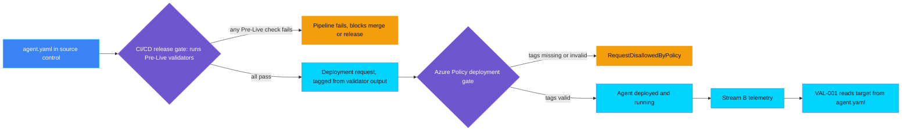

## Status

This is a living design note, not a governance requirement and not a
substitute for any control's own `ASSESSMENT.md` or `README.md`. Only
VAL-PRE-001 is `Implemented` today. Every other control referenced here is a
scaffolded placeholder from `scripts/scaffold_controls.py`. Sections that
describe those controls state current design intent, not a finished
specification, and this file is corrected each time a new control in this
category is actually built.

## Why this file exists

Value, Adoption, and FinOps controls share three underlying data sources
rather than each inventing its own. Without a single reference, a future
session designing VAL-PRE-003 could quietly redefine the telemetry event
shape that VAL-001 already depends on, or a session designing VAL-PORT-002
could duplicate territory VAL-002 already claims. This file exists to catch
that drift early, by naming the shared sources once and pointing every
control's `ASSESSMENT.md` at this file instead of re-deriving the
architecture.

## Running example

Every demo in this category uses the same fictional agent so a reader can
follow one story across Value, Adoption, and FinOps controls:
`helpdesk-tier1-triage`, an IT Helpdesk Tier-1 Triage Agent that auto-resolves
password reset, account unlock, and software install tickets, and escalates
everything else. It naturally produces a Value signal (deflection rate), an
Adoption signal (bypass rate), and a FinOps signal (cost per ticket).

## The three streams

### Stream A: value hypothesis

A static, human-authored declaration in the agent's `agent.yaml`: the metric
name, target value, target direction, baseline status, business owner, and
linked business case. A Business Owner writes and revises it. It never
changes because of runtime telemetry.

### Stream B: live telemetry

Raw, per-event facts the running agent emits, one record per ticket:
`{agent_id, metric_name, ticket_id, outcome, timestamp}`. The agent never
computes a rate. Rates and comparisons against Stream A's target are computed
on read by whichever control evaluates them, reusing the Log Analytics
custom-table ingestion pattern already proven in
`controls/privacy/PRI-003_data_subject_request_sla_breach` and
`controls/privacy/PRI-004_personal_data_in_logs`.

### Stream C: cost attribution

Direct and indirect cost, attributed to the agent through Azure Cost
Management tag grouping for direct costs, and an explicit documented
allocation formula for shared platform costs. Deferred until the FinOps
section of this category is designed.

## agent.yaml's three roles

`agent.yaml` is not just a tag-reduction input for one control. Because it
is a single static file checked into source control, it plays three distinct
roles across this category, and future controls should reuse the existing
file and validator pattern rather than inventing a parallel one for each
role:

1. **Manifest, or definition.** It declares what must be true and what must
   be measured for an agent to be considered value-governed: the metric
   name, target, baseline, owner, and business case today, plus KPI baseline
   value/date, an attribution rule, and owner RACI once VAL-PRE-002/003/004
   extend it. A Business Owner authors and revises this file; nothing else
   in this category redeclares that information.
2. **CI/CD release-gate input.** Because it is a file, not a runtime tag, a
   pipeline can validate it structurally before any Azure deployment is
   attempted, reusing `scripts/validate_value_hypothesis.py` as a pipeline
   step. One release-gate stage can check all four Pre-Live signals against
   the same file in one pass; see Broader gate design below.
3. **Live-tracking source.** VAL-001, and later VAL-002/003/004/005, read
   the same `metric`/`target` fields to know what Stream B telemetry to
   compare against, so a value declared once by the Business Owner is reused
   for tracking rather than redeclared in a second place.

## Data flow


## Broader gate design: CI/CD release gate and Azure Policy deployment gate

Two independent enforcement layers can both read `agent.yaml`, and they are
complementary rather than duplicative. This category currently builds only
the second one.



* **CI/CD release gate (optional, built by VAL-PRE-001).** A pipeline stage
  that runs before any deployment, invoking `scripts/validate_value_hypothesis.py`
  (and its VAL-PRE-002/003/004 siblings once they exist) against the same
  `agent.yaml`. It gives fast feedback without touching Azure for the
  blocked case, and can check all four Pre-Live signals in one stage since
  they all read one file. VAL-PRE-001 provides a real, optional,
  manually-triggered example
  (`.github/workflows/val-pre-001-value-gate-demo.yml`, authenticating via
  Microsoft Entra Workload Identity Federation) alongside the always-on core
  demo; it is not required for the core learning outcome because this
  repository has no CI/CD platform of its own to demonstrate against by
  default, and Azure Policy alone already proves the governance decision end
  to end for the core demo.
* **Azure Policy deployment gate (built by VAL-PRE-001).** The final,
  authoritative gate at deployment time, evaluated independently of any
  pipeline. It still denies a request that bypasses CI/CD entirely, such as a
  manual `az deployment` call or a break-glass change, so the control stays
  fail-closed even if a release gate is skipped or misconfigured upstream.

If a future session builds the CI/CD release gate, it should call the
existing validator scripts directly as pipeline steps rather than
reimplementing the structural checks a second time.

## Control-to-stream mapping

| Control | Reads | Status |
|---|---|---|
| VAL-PRE-001 value hypothesis missing | Stream A (structural presence) | Implemented |
| VAL-PRE-002 KPI baseline missing | Stream A (baseline field) | Planned |
| VAL-PRE-003 benefit attribution model missing | Stream A (attribution field) | Planned |
| VAL-PRE-004 value owner not assigned | Stream A (owner field) | Planned |
| VAL-001 KPI underperformance (value tracking and reporting) | Stream A target vs Stream B rate | Planned |
| VAL-002 benefits realisation gap | Stream A vs Stream B, aggregated | Planned |
| VAL-003 ROI degradation | Stream B vs Stream C | Planned |
| VAL-004 value leakage | Stream B anomaly detection | Planned |
| VAL-005 adoption to value conversion gap | Stream B joined with ADP-* signals | Planned |
| VAL-PORT-001..004 portfolio controls | Aggregated Stream A and Stream B across agents | Planned |
| ADP-* adoption controls | Stream B usage and bypass events | Planned |
| FIN-* FinOps controls | Stream C | Planned |

Update the Status column the same change a control becomes `Implemented`, the
same way the root `README.md` community demo table is required to reflect
that change.

`VAL-001_kpi_underperformance` is the one control reserved for value tracking
and reporting in this category: it is the point where a `value_hypothesis`
target in `agent.yaml` (Stream A) is turned into an actual tracked metric
against measured outcomes (Stream B). It already exists as a scaffold. Do not
create a second control for tracking or reporting a KPI against its target;
extend VAL-001 when it is built instead.

## Canonical agent.yaml schema

As introduced by VAL-PRE-001. Extend this in place when a later Pre-Live
control adds a field, rather than inventing a parallel structure.

```yaml
value_hypothesis:
  metric: deflection_rate
  target:
    value: 0.6
    direction: increase
  baseline:
    status: measured # measured | net_new
  owner: business-owner@example.com
  business_case_id: BC-2026-014
```

## Known duplication risks to check during future assessments

* VAL-002 benefits realisation gap versus VAL-PORT-001 aggregate value below
  plan: confirm one is single-agent and the other is portfolio-aggregated
  before either is designed.
* VAL-004 value leakage versus VAL-002 benefits realisation gap: confirm the
  trigger conditions are distinct (anomaly versus sustained gap).
* VAL-005 adoption to value conversion gap versus VAL-PORT-004 high usage low
  value agent: confirm one is a rate and the other is a portfolio outlier
  detector, not the same signal expressed twice.

## Revision log

| Date | Control | Change |
|---|---|---|
| 2026-09-17 | (none yet) | File created alongside VAL-PRE-001; no control has read this file for its own implementation yet. |
| 2026-09-17 | VAL-PRE-001 | Added the optional, real CI/CD release-gate extension (GitHub Actions + Microsoft Entra Workload Identity Federation), reusing the existing validator and Azure Policy gate rather than a parallel schema, script, or policy. |
