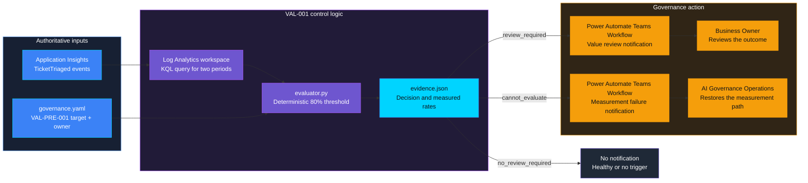
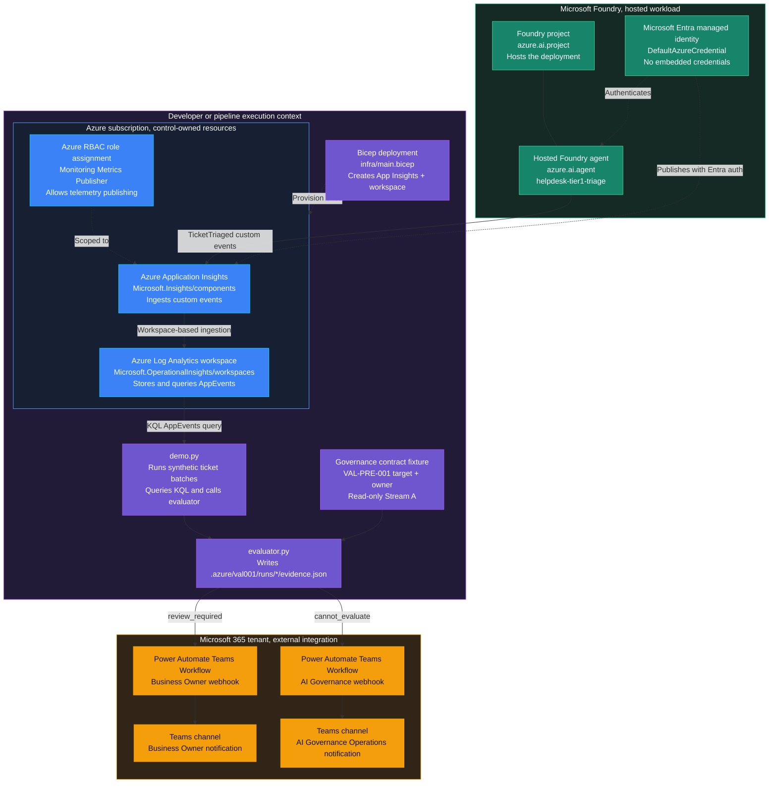
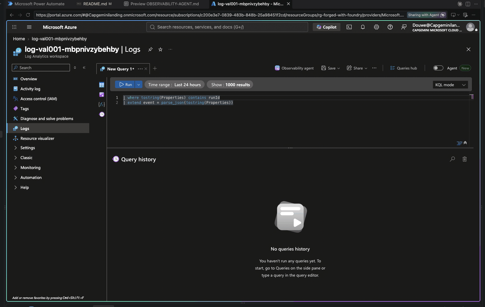
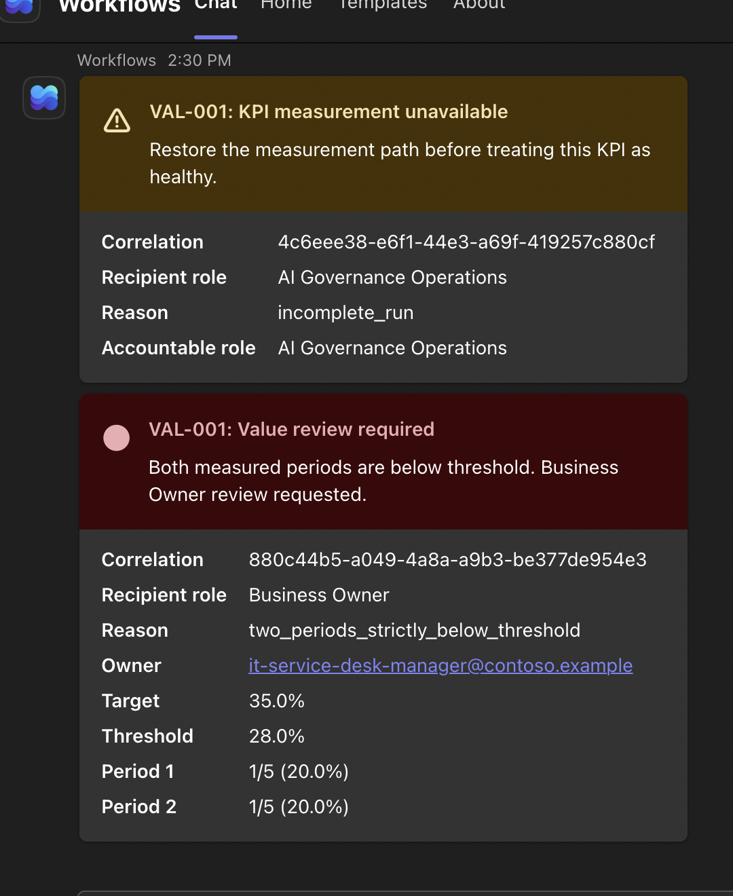

<p align="center">
    
</p>

# VAL-001 — KPI underperformance

> **Status:** Planned. The live value-review path is proven; complete data cleanup, the additional measurement-failure notification route, and clean-checkout onboarding remain release blockers.
>
> **Last reviewed:** 2026-09-21.

## Table of contents

- [Overview](#overview)
- [Control contract](#control-contract)
- [Control objective](#control-objective)
- [Logical design](#logical-design)
- [Infrastructure architecture](#infrastructure-architecture)
- [Implementation](#implementation)
- [Demo](#demo)
- [Evidence and observability](#evidence-and-observability)
- [Security and privacy](#security-and-privacy)
- [Validation](#validation)
- [Cleanup](#cleanup)
- [References](#references)

## Overview

A helpdesk manager expects an assistant to resolve routine tickets without
human handling. If that stops happening, staff inherit the work while the
manager may still believe the assistant is meeting its target. This control
requests a value review when verified outcomes remain below the agreed limit.

The approved design is in [ASSESSMENT.md](ASSESSMENT.md). Target 35 means an
absolute 35% deflection rate. A review requires both consecutive periods to
be strictly below 28%; equality does not trigger a review. The agent is a
Monitored workload, without an inline ACS gate.

| Demo profile | Value |
|---|---|
| Format / level | DEPLOYABLE_DEMO / Intermediate |
| Estimated time | 45-60 minutes after access setup |
| Primary decision | Request a review after two periods below 80% of the absolute target |
| Capabilities | Agent Framework, Foundry, Application Insights, Log Analytics, Teams Workflows |
| Deployment / infrastructure | Required; existing Foundry project/model, isolated Monitor resources |
| AGT / ACS | Not used for this asynchronous monitored workload |

> [!IMPORTANT]
> To implement the control, start with the numbered
> [implementation path](#implementation-path), then run the
> [demo](#demo). To understand the design first, read the
> [logical design](#logical-design). To review proof from the completed test,
> go directly to [captured validation evidence](#captured-validation-evidence).

## Control contract

| Field | Value |
|---|---|
| **ID** | VAL-001 |
| **Lifecycle phase** | Live |
| **Category / domain** | Value |
| **Control / signal** | KPI underperformance |
| **Evidence / source** | KPI vs target dashboard |
| **Trigger / threshold** | <80% target for 2 periods |
| **Action / gate effect** | Value review |
| **Accountable role** | Business Owner |

## Control objective

Connect the declared value hypothesis to verified outcomes. The agent performs
synthetic work; the deterministic evaluator reads target and owner through the
shared contract validator. Missing or ambiguous data yields `cannot_evaluate`,
never a healthy result. See [deployment and validation details](docs/IMPLEMENTATION.md).

## Logical design



## Infrastructure architecture



The control-owned Azure resources are the Log Analytics workspace,
Application Insights component, and its scoped publisher role assignment.
The Foundry project and hosted agent are the measured workload, not the
decision maker. The local evaluator owns the deterministic decision and its
evidence record. The two Teams Workflows are external notification
dependencies, not a second policy engine. The Business Owner receives a
proven value-review signal; AI Governance Operations receives a measurement
failure that requires control remediation.

| Resource or component | Type | Role in VAL-001 | Ownership |
|---|---|---|---|
| `log-val001-*` | `Microsoft.OperationalInsights/workspaces` | Stores `AppEvents` and answers the two-period KQL query | Control-owned Azure resource |
| `appi-val001-*` | `Microsoft.Insights/components` | Receives minimized `TicketTriaged` telemetry from the hosted agent | Control-owned Azure resource |
| `metrics-publisher` | `Microsoft.Authorization/roleAssignments` | Grants the publishing identity permission scoped to Application Insights | Control-owned Azure resource |
| `helpdesk-tier1-triage` | Foundry hosted `azure.ai.agent` | Performs synthetic Tier-1 triage whose verified outcomes are measured | Foundry workload |
| `evaluator.py` and `demo.py` | Local Python components | Apply the deterministic threshold, write evidence, and invoke notification | Control implementation |
| `governance.yaml` | FwF governance contract fixture | Supplies the read-only target and Business Owner from VAL-PRE-001 | Existing contract source |
| Business Owner Teams Workflow | Power Automate flow with HTTP trigger | Delivers `review_required` to the Business Owner | External Microsoft 365 dependency |
| AI Governance Teams Workflow | Power Automate flow with HTTP trigger | Delivers `cannot_evaluate` to AI Governance Operations | External Microsoft 365 dependency |

### Notification routing

The notification recipient depends on what the decision means:

* `review_required` is sent to the declared Business Owner through
  `VAL001_TEAMS_WEBHOOK_URL`. This means the measured KPI is below the
  threshold and a value review is needed.
* `cannot_evaluate` is sent to **AI Governance Operations**, also called the
  **Control Operator**, through `VAL001_GOVERNANCE_TEAMS_WEBHOOK_URL`. This
  means the measurement path or its evidence is unavailable, invalid, or
  incomplete. It must not be presented as evidence of business
  underperformance.

AI Governance Operations is the best accountable role for the second route
because it owns control execution, telemetry availability, evidence quality,
and remediation of monitoring failures. The Business Owner can be added as a
secondary escalation after the governance team confirms that the measurement
failure affects a business review, but is not the primary recipient.

### Positive performance reporting

The demo records healthy measurements as `no_review_required`, but does not
send a notification for every healthy run. A production implementation could
publish a positive performance summary once per month to the Business Owner,
AI Governance Operations, or both. Developers could build that reporting view
in Power BI from the retained Log Analytics data and control evidence.

That reporting cadence, monthly aggregation, Power BI workspace, and dashboard
design are intentionally outside this demo. VAL-001 focuses on the
deterministic underperformance decision and on fail-closed handling when the
measurement path is unavailable.

## Implementation

### Components

| Component | Responsibility |
|---|---|
| [agent.py](agent.py) and [workload.py](workload.py) | Execute synthetic ticket work and independently read back the result |
| [main.py](main.py) | Host the Foundry agent and export minimized events with Entra authentication |
| [evaluator.py](evaluator.py) | Validate the contract and telemetry, then apply the exact threshold |
| [demo.py](demo.py) | Run scenarios, query telemetry, write evidence, and request notifications |
| [infra/main.bicep](infra/main.bicep) | Create the control-owned Application Insights and Log Analytics resources |
| [infra/cleanup.py](infra/cleanup.py) | Verify ownership before deleting control-owned Azure resources |

### Implementation path

Complete these steps in order. The control is still `Planned`: the path has
been exercised during development, but clean-checkout onboarding and the live
`cannot_evaluate` notification route remain release gates.

1. Confirm the control inputs. Use a governance contract with a validated
  VAL-PRE-001 value target and Business Owner. The included fixture declares
  a 35% target, which produces a strict 28% review threshold. VAL-001 reads
  these values and never creates a second target or owner declaration.
2. Prepare the local and cloud prerequisites. Use Python 3.13, Azure CLI,
  Azure Developer CLI, an Azure subscription, an existing Foundry project and
  model deployment, and a Microsoft 365 tenant with Teams and Power Automate.
  Sign in with `az login` and `azd auth login`, then install
  [requirements.txt](requirements.txt) in the repository virtual environment.
3. Configure the local azd environment. Set the subscription, tenant,
  resource group, location, Foundry project endpoints, project resource ID,
  and model deployment name. Use the exact variable table in
  [Deployment configuration](docs/IMPLEMENTATION.md#deployment-configuration).
  Keep `.azure/` local and ignored.
4. Deploy the monitoring resources and hosted agent. Deploy
  [infra/main.bicep](infra/main.bicep), store its Application Insights and
  workspace outputs in the local azd environment, deploy
  `helpdesk-tier1-triage`, and assign its instance identity the scoped
  Monitoring Metrics Publisher role. Follow the command sequence in
  [Deployment configuration](docs/IMPLEMENTATION.md#deployment-configuration),
  including the required second Bicep deployment after the agent identity is
  known.
5. Configure the two notification routes. Create separate
  tenant-authenticated Teams Workflows for `review_required` and
  `cannot_evaluate`. Store their generated endpoints as
  `VAL001_TEAMS_WEBHOOK_URL` and
  `VAL001_GOVERNANCE_TEAMS_WEBHOOK_URL`. The
  [Teams delivery walkthrough](docs/TEAMS-DELIVERY.md#find-and-configure-the-webhook-url)
  shows how to enter them without exposing the URLs.
6. Run and evaluate the scenarios. Follow [Run](#run) for the
  underperforming and unavailable-measurement paths. Use
  [Expected scenarios](#expected-scenarios) to compare the decisions with the
  policy contract.
7. Verify evidence and delivery. Inspect the generated `evidence.json`,
  the exact `AppEvents` query results, and the relevant Power Automate run.
  A webhook `202` response is only acceptance. Record delivery only after the
  Teams posting action returns `201` and its correlation matches the run.
8. Validate and clean up. Run the [tests](#validation), then execute the
  ownership-checking [cleanup](#cleanup). Do not delete the shared Foundry
  project or resource group.

### Implementation checkpoints

| After step | Check before continuing |
|---|---|
| Contract inputs | Target and Business Owner resolve through the shared validator |
| Monitor deployment | `appi-val001-*` is workspace-based, local authentication is disabled, and ownership tags are present |
| Agent deployment | `helpdesk-tier1-triage` is available and its instance identity has the resource-scoped publisher role |
| Scenario execution | The exact run ID appears in two complete `AppEvents` periods |
| Evaluation | One authoritative evidence record contains the expected decision, rates, threshold, and reason |
| Notification | The correct role receives the matching card and the inspected posting action returns `201` |

The focused Azure Portal checks and screenshots are in
[Inspect in Azure](docs/IMPLEMENTATION.md#inspect-in-azure).

### Demo scope

The demo proves a synthetic workload-to-measurement-to-review-request chain,
not production ticket resolution, statistical confidence from five tickets,
target adequacy, or completion of a human review. Periods are compressed and
explicitly tagged. The private test recipient stands in for the fictional owner.
There are no production actions, agent shutdowns, schedulers, portfolio services,
or new VAL-001 declaration schemas. Inline ACS tool governance remains further
exploration. The added measurement-failure route has not been live validated.

### Best-practice requirements

- Keep policy enforcement outside model reasoning when a deterministic control
  is possible.
- Use least-privilege identity and secretless authentication where supported.
- Minimize retained data and exclude sensitive values from logs and alerts.
- Fail closed when a mandatory control cannot complete safely.
- Pin or document API/model versions and review them during repository updates.

## Demo

### Prerequisites

Complete steps 1 through 5 of the [implementation path](#implementation-path)
before running the demo. Confirm that both webhook values are configured
without printing them. Never paste an endpoint into chat, source control, a
screenshot, or an ordinary shell command line.

### Run

Run the underperformance scenario against the hosted Foundry agent. The command prints a `Run:` identifier.

```zsh
cd controls/value_adoption_and_finops/VAL-001_kpi_underperformance
RUN_OUTPUT=$(../../../.venv/bin/python demo.py run --scenario underperforming)
printf '%s\n' "$RUN_OUTPUT"
RUN_ID=$(printf '%s\n' "$RUN_OUTPUT" | sed -n 's/^Run: //p')
../../../.venv/bin/python demo.py evaluate --run-id "$RUN_ID"
../../../.venv/bin/python demo.py notify --run-id "$RUN_ID"
```

Expect `review_required`. The Business Owner Teams Workflow receives the red
attention card after the evaluator writes the evidence record. Configure the
endpoint in the ignored local `azd` environment as
`VAL001_TEAMS_WEBHOOK_URL`.

To reproduce the fail-closed `cannot_evaluate` card, run a separate healthy
workload and evaluate it against a deliberately missing contract path:

```zsh
RUN_OUTPUT=$(../../../.venv/bin/python demo.py run --scenario healthy)
printf '%s\n' "$RUN_OUTPUT"
RUN_ID=$(printf '%s\n' "$RUN_OUTPUT" | sed -n 's/^Run: //p')
../../../.venv/bin/python demo.py evaluate --run-id "$RUN_ID" --contract /tmp/val001-missing-governance.yaml
../../../.venv/bin/python demo.py notify --run-id "$RUN_ID"
```

Expect `cannot_evaluate`. Configure the separate governance endpoint as
`VAL001_GOVERNANCE_TEAMS_WEBHOOK_URL`. Never put a real webhook URL in this
README, shell history, or chat.

### Capture the Teams card

Use the Teams desktop app or the headed browser started by Playwright. Do not
use the VS Code Simple Browser, because it cannot render the current Teams web
client in this environment. Open the Workflows chat, locate the new VAL-001
card, and use macOS `Cmd+Shift+4` to select only the card.

Exclude or mask personal names, email addresses, tenant details, webhook URLs,
and unnecessary service identifiers before adding a capture to the repository.

| Decision | Visual state | Captured in the repository |
|---|---|---|
| `review_required` | Red attention dot and Business Owner review text | Left card in [`media/teams-cards-both-decisions.png`](media/teams-cards-both-decisions.png) |
| `cannot_evaluate` | Amber warning icon and measurement remediation text | Right card in the same capture |
| `no_review_required` | Green positive-performance card, optional future report | Not captured by the core demo |

Both governance outcomes share one capture on purpose: a single Workflows chat
shows the routing difference more clearly than two separate crops, and it keeps
one image in the repository instead of three.

The screenshot proves Teams delivery and visual rendering only. The JSON
evidence record remains the authoritative proof of the control decision.

### Expected scenarios

| Scenario | Expected result |
|---|---|
| Both periods strictly below 28% | `review_required`, separately track notification status. |
| Either period at or above 28% | `no_review_required`, evidence recorded; no notification in this demo. |
| Missing, invalid, incomplete, or ambiguous inputs | `cannot_evaluate`, never a healthy result, and notify AI Governance Operations. |

### Captured validation evidence

The [integrated live test](docs/IMPLEMENTATION.md#live-validation) used real
queried outcomes: both periods at `1/5 (20%)` produced `review_required`,
followed by a matching Teams `201` posting receipt. A separate run at
`2/5 (40%)` in both periods produced `no_review_required` without notification.
Interrupted runs produced `cannot_evaluate`.



The Log Analytics results show two consecutive periods at 20%, below the 28%
threshold, and the resulting `review_required` decision.

<p align="center">
  
</p>

The Teams capture shows two separate governance paths. The red card is the
`review_required` notification for the confirmed KPI underperformance shown in
the Log Analytics results. The amber **Measurement unavailable** card shows the
separate `cannot_evaluate` path and asks AI Governance Operations to restore the
measurement path. The [Teams walkthrough](docs/TEAMS-DELIVERY.md) provides the
delivery and workflow details.

The evaluator's JSON evidence record remains authoritative for the control
decision. The screenshots demonstrate the queried measurements and the
resulting human-facing notifications.

## Evidence and observability

Each run has one authoritative `.azure/val001/runs/<run-id>/evidence.json`
binding versions, correlation, contract hash/reference, owner, counts, rates,
target, threshold, decision, reason, and notification verification/history.
Raw prompts, model responses, tokens, and webhook URLs are excluded. For a
developer-focused investigation example, see the [Observability Agent
walkthrough](docs/OBSERVABILITY-AGENT.md). It shows how to explore the
telemetry behind a `cannot_evaluate` result without making the exploratory
agent authoritative for the control decision.

## Security and privacy

Only isolated synthetic state is modified. The agent instance receives
Monitoring Metrics Publisher on its own Application Insights resource, with
local auth disabled. Operators use Entra auth for queries and Teams requests.
Local evidence assumes trusted filesystem access and is not tamper-proof.

## Validation

From the repository root, run:

```bash
.venv/bin/python -m pytest controls/value_adoption_and_finops/VAL-001_kpi_underperformance/tests -q
```

Tests cover exact boundaries, mixed periods, incomplete/sampled telemetry,
duplicates, contract validity, verified execution, notification failures and
retries, minimization, and cleanup ownership. See the
[implementation guide](docs/IMPLEMENTATION.md) for live results and release gates.

The [prerelease review](docs/REVIEW.md) records open findings on complete cleanup,
community onboarding, notification validation, and readability. It is not a final
release approval.

## Cleanup

Synthetic in-memory ticket state is destroyed when its context exits, including
on failure. The retained Teams test flow and message have separate cleanup
steps in the [delivery walkthrough](docs/TEAMS-DELIVERY.md#cleanup).
Azure cleanup was executed and independently checked: nine session
filesystems, the agent, two Monitor resources, and the linked automatic alert
were deleted; the shared group remained. From the control directory:

```bash
../../../.venv/bin/python infra/cleanup.py --subscription <subscription-id> --resource-group <resource-group>
../../../.venv/bin/python infra/cleanup.py --subscription <subscription-id> --resource-group <resource-group> --confirm
```

The first command inspects; the second deletes only verified targets. It does
not delete platform conversation history, Teams messages/flow, or retained
local audit evidence. Full data cleanup remains incomplete. Do not delete the
shared Foundry project or resource group to work around that limitation.

## References

- [Create and configure workspace-based Application Insights resources](https://learn.microsoft.com/en-us/azure/azure-monitor/app/create-workspace-resource)
  — the ingestion target for the `TicketTriaged` events this control measures.
- [Overview of Log Analytics in Azure Monitor](https://learn.microsoft.com/en-us/azure/azure-monitor/logs/log-analytics-overview)
  — the workspace and KQL surface behind the two-period query.
- [Azure built-in roles for Monitor](https://learn.microsoft.com/en-us/azure/role-based-access-control/built-in-roles/monitor)
  — the `Monitoring Metrics Publisher` assignment scoped to the control's own
  Application Insights resource.
- [Observability Agent in Azure Monitor](https://learn.microsoft.com/en-us/azure/azure-monitor/aiops/observability-agent-overview)
  — the exploratory agent used in the [observability walkthrough](docs/OBSERVABILITY-AGENT.md),
  which is never authoritative for the control decision.
- [Agent identity concepts in Microsoft Foundry](https://learn.microsoft.com/en-us/azure/foundry/agents/concepts/agent-identity)
  and [Manage hosted agents](https://learn.microsoft.com/en-us/azure/foundry/agents/how-to/manage-hosted-agent)
  — the hosted `helpdesk-tier1-triage` workload and the instance identity that
  cleanup verifies before deletion.
- [Configure keyless authentication with Microsoft Entra ID](https://learn.microsoft.com/en-us/azure/foundry/foundry-models/how-to/configure-entra-id)
  — the secretless authentication path used instead of connection strings.
- Teams Workflows webhook and Adaptive Card references are listed in the
  [delivery walkthrough](docs/TEAMS-DELIVERY.md#references).
- Source catalog: [Governance Signals Repo.pdf](../../../docs/Governance%20Signals%20Repo.pdf)

---

<p align="center">
    
</p>
