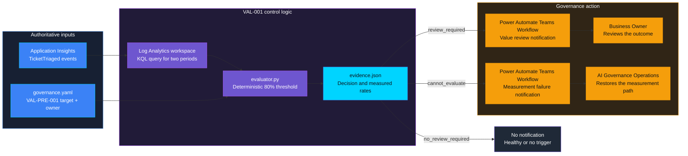
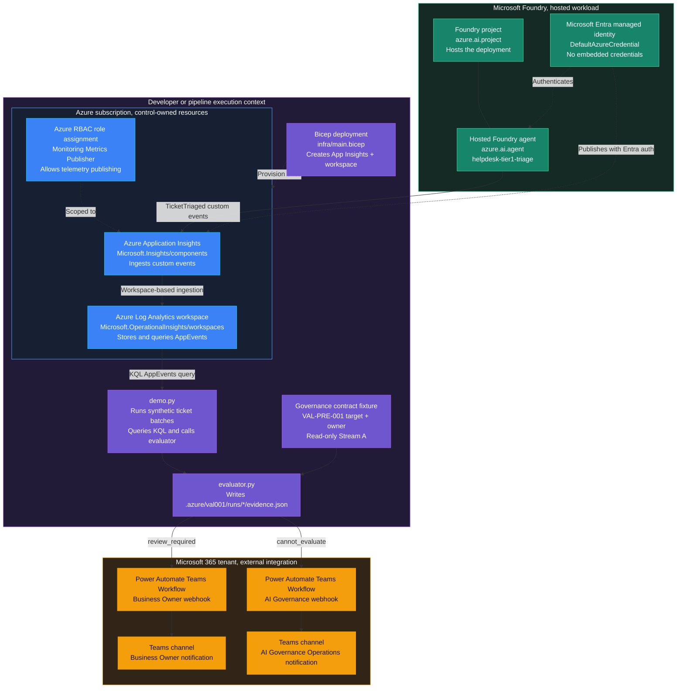

    

# VAL-001 — KPI underperformance

> **Status:** Planned. Implementation in progress; the complete live chain is not validated.
>
> **Last reviewed:** 2026-09-21.

## Overview

A helpdesk manager expects an assistant to resolve routine tickets without
human handling. If that stops happening, staff inherit the work while the
manager may still believe the assistant is meeting its target. This control
requests a value review when verified outcomes remain below the agreed limit.

The approved design is in [ASSESSMENT.md](ASSESSMENT.md). Target 35 means an
absolute 35% deflection rate. A review requires both consecutive periods to
be strictly below 28%; equality does not trigger a review. The agent is a
Monitored workload, without an inline ACS gate.

## Control contract

| Field | Value |
|---|---|
| **ID** | VAL-001 |
| **Lifecycle phase** | Live |
| **Category / domain** | Value |
| **Control / signal** | KPI underperformance |
| **Evidence / source** | KPI vs target dashboard |
| **Trigger / threshold** | <80% target for 2 periods |
| **Action / gate effect** | Value review |
| **Accountable role** | Business Owner |

## Control objective

Document the risk addressed by this control, the expected outcome, and why the
control must remain deterministic and independently enforceable where relevant.

## Logical design

## Infrastructure architecture

The control-owned Azure resources are the Log Analytics workspace,
Application Insights component, and its scoped publisher role assignment.
The Foundry project and hosted agent are the measured workload, not the
decision maker. The local evaluator owns the deterministic decision and its
evidence record. The two Teams Workflows are external notification
dependencies, not a second policy engine. The Business Owner receives a
proven value-review signal; AI Governance Operations receives a measurement
failure that requires control remediation.

| Resource or component | Type | Role in VAL-001 | Ownership |
|---|---|---|---|
| `log-val001-*` | `Microsoft.OperationalInsights/workspaces` | Stores `AppEvents` and answers the two-period KQL query | Control-owned Azure resource |
| `appi-val001-*` | `Microsoft.Insights/components` | Receives minimized `TicketTriaged` telemetry from the hosted agent | Control-owned Azure resource |
| `metrics-publisher` | `Microsoft.Authorization/roleAssignments` | Grants the publishing identity permission scoped to Application Insights | Control-owned Azure resource |
| `helpdesk-tier1-triage` | Foundry hosted `azure.ai.agent` | Performs synthetic Tier-1 triage whose verified outcomes are measured | Foundry workload |
| `evaluator.py` and `demo.py` | Local Python components | Apply the deterministic threshold, write evidence, and invoke notification | Control implementation |
| `governance.yaml` | FwF governance contract fixture | Supplies the read-only target and Business Owner from VAL-PRE-001 | Existing contract source |
| Business Owner Teams Workflow | Power Automate flow with HTTP trigger | Delivers `review_required` to the Business Owner | External Microsoft 365 dependency |
| AI Governance Teams Workflow | Power Automate flow with HTTP trigger | Delivers `cannot_evaluate` to AI Governance Operations | External Microsoft 365 dependency |

### Notification routing

The notification recipient depends on what the decision means:

* `review_required` is sent to the declared Business Owner through
  `VAL001_TEAMS_WEBHOOK_URL`. This means the measured KPI is below the
  threshold and a value review is needed.
* `cannot_evaluate` is sent to **AI Governance Operations**, also called the
  **Control Operator**, through `VAL001_GOVERNANCE_TEAMS_WEBHOOK_URL`. This
  means the measurement path or its evidence is unavailable, invalid, or
  incomplete. It must not be presented as evidence of business
  underperformance.

AI Governance Operations is the best accountable role for the second route
because it owns control execution, telemetry availability, evidence quality,
and remediation of monitoring failures. The Business Owner can be added as a
secondary escalation after the governance team confirms that the measurement
failure affects a business review, but is not the primary recipient.

### Positive performance reporting

The demo records healthy measurements as `no_review_required`, but does not
send a notification for every healthy run. A production implementation could
publish a positive performance summary once per month to the Business Owner,
AI Governance Operations, or both. Developers could build that reporting view
in Power BI from the retained Log Analytics data and control evidence.

That reporting cadence, monthly aggregation, Power BI workspace, and dashboard
design are intentionally outside this demo. VAL-001 focuses on the
deterministic underperformance decision and on fail-closed handling when the
measurement path is unavailable.

## Implementation

### Components

- **Detector/evaluator:** To be implemented.
- **Policy decision:** To be implemented from the control contract above.
- **Action or gate:** To be implemented.
- **Audit evidence:** To be implemented without exposing sensitive payloads.

### Best-practice requirements

- Keep policy enforcement outside model reasoning when a deterministic control
  is possible.
- Use least-privilege identity and secretless authentication where supported.
- Minimize retained data and exclude sensitive values from logs and alerts.
- Fail closed when a mandatory control cannot complete safely.
- Pin or document API/model versions and review them during repository updates.

## Demo

### Captured progress evidence

The [Teams delivery walkthrough](docs/TEAMS-DELIVERY.md) contains eight real,
privacy-masked captures of configuration and a successful delivery test.
The test message uses explicitly synthetic percentages; it does not prove the
KPI evaluator ran or that hosted-agent telemetry was queried.

The local workload tests passed (19 tests), and one real `gpt-5-mini` call
executed and verified a synthetic account unlock. Hosting initialization is
blocked by `azd ai agent init` reporting `not logged in`. The full telemetry,
evaluator, evidence, and cleanup path is not yet validated.

### Prerequisites

Follow [Find and configure the webhook URL](docs/TEAMS-DELIVERY.md#find-and-configure-the-webhook-url)
for the screenshot-guided Power Automate navigation and hidden terminal input.
Never paste the endpoint into chat or source control. Other prerequisites
remain to be completed with end-to-end validation.

### Run

To be documented with the implementation.

### Expected scenarios

| Scenario | Expected result |
|---|---|
| Both periods strictly below 28% | `review_required`, separately track notification status. |
| Either period at or above 28% | `no_review_required`, evidence recorded; no notification in this demo. |
| Missing, invalid, incomplete, or ambiguous inputs | `cannot_evaluate`, never a healthy result, and notify AI Governance Operations. |

## Evidence and observability

Document emitted metrics, traces, audit records, alert payloads, retention, and
the evidence required to prove that the control operated as designed.

## Security and privacy

Document threat boundaries, RBAC, managed identities, network/data flows,
sensitive-data handling, cleanup, and failure behavior.

## Validation

Document automated tests, manual demo checks, expected results, and known
limitations.

## Cleanup

Synthetic in-memory ticket state is destroyed when its context exits, including
on failure. The retained Teams test flow and message have separate cleanup
steps in the [delivery walkthrough](docs/TEAMS-DELIVERY.md#cleanup).
Cloud cleanup is not yet implemented or validated. Do not delete the shared
Foundry project or resource group.

## References

- Add links to the latest authoritative Microsoft Learn documentation used by
  the implementation.
- Source catalog: [Governance Signals Repo.pdf](../../../docs/Governance%20Signals%20Repo.pdf)

---

    

