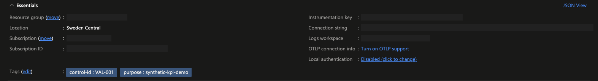
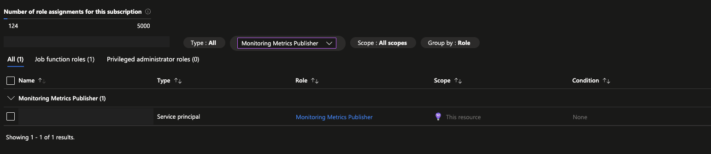
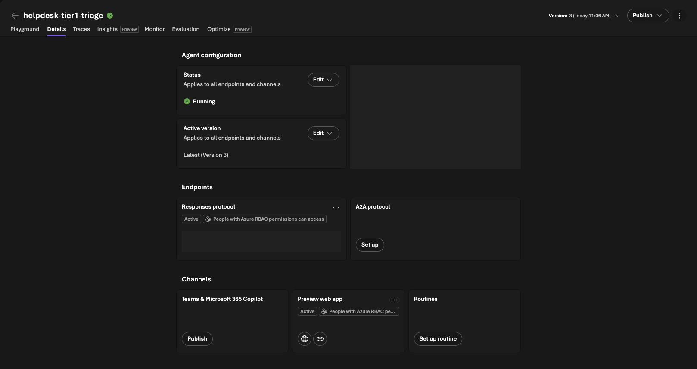
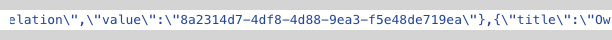
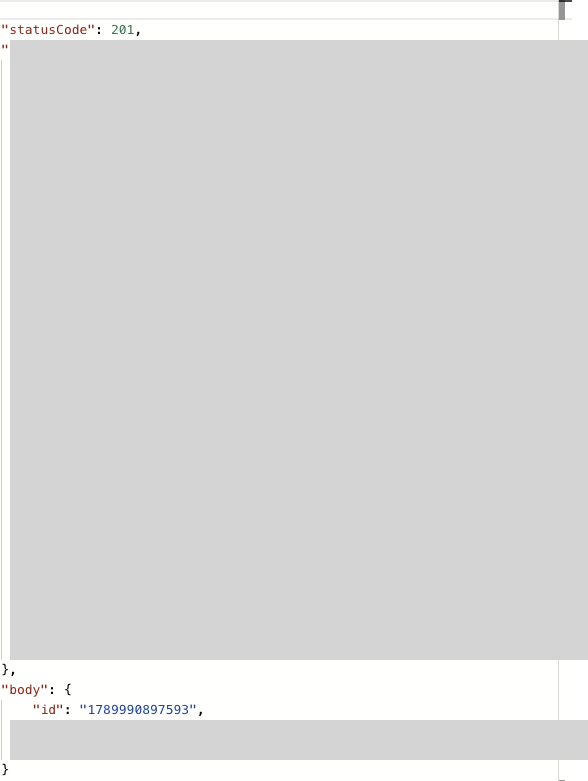

## Release boundary

The hosted workload, telemetry query, deterministic value-review decision,
and Teams posting receipt were exercised against real services. This is not
yet a completed community release. Platform conversation history and Teams
test state remain, the added measurement-failure notification destination is
not live-tested, and clean-checkout onboarding has not been replayed.

Python 3.13, Agent Framework Foundry 1.11.0, hosting 1.0.0b260821, Monitor
exporter 1.0.0b57, and azd 1.34.1 were used. Hosting and exporter preview
dependencies require organizational support review. Runtime dependencies are
pinned in [requirements.txt](../requirements.txt).

## Deployment configuration

Reuse an existing Foundry project and deployed model. The live test used
`gpt-5-mini`; it did not create a shared project, model, or container registry.
Required access includes hosted-agent deployment/invocation, creation of
Monitor resources and scoped role assignments, and Log Analytics queries.
For Teams, verify the exact flow owner/caller entitlement and tenant policies.
The Teams connector is Standard; E5 does not cover every possible connector.

Sign in with `az login` and `azd auth login`. Install the control's requirements
and the existing governance-contract validator requirements in the repository
Python environment. Never commit `.env` or `.azure/`.

The control already contains [azure.yaml](../azure.yaml). Do not blindly run
`azd ai agent init` against an existing service: it can create duplicate
entries. Select/create a local azd environment in this control directory and
configure the following with `azd env set`:

| Variable | Value |
|---|---|
| `AZURE_SUBSCRIPTION_ID`, `AZURE_TENANT_ID` | Selected subscription and tenant |
| `AZURE_RESOURCE_GROUP`, `AZURE_LOCATION` | Permitted existing group and location |
| `AZURE_AI_PROJECT_ID` | Existing Foundry project ARM resource ID |
| `FOUNDRY_PROJECT_ENDPOINT`, `AZURE_AI_PROJECT_ENDPOINT` | Existing project endpoint |
| `AZURE_AI_MODEL_DEPLOYMENT_NAME` | Existing model deployment name |

The live validation used an environment initialized during development. This
fresh-environment procedure must still be replayed from a clean checkout.

Deploy [infra/main.bicep](../infra/main.bicep) from the control directory:

```bash
az deployment group create --subscription <subscription-id> --resource-group <resource-group> --name val001-monitor --template-file infra/main.bicep --parameters location=<location> --query properties.provisioningState -o tsv
```

Read `applicationInsightsId` and `workspaceId` from the deployment outputs.
Transfer the component's `properties.ConnectionString` directly into the local
azd variable `APPLICATIONINSIGHTS_CONNECTION_STRING`, without printing it.
Store the workspace customer ID in `VAL001_WORKSPACE_ID`.

Deploy with `azd deploy helpdesk-tier1-triage --no-prompt`. Then read
`instance_identity.principal_id` from `azd ai agent show helpdesk-tier1-triage
--output json` and reapply the Monitor template with
`publisherPrincipalId=<agent-instance-principal-id>`. Grant the role to the
agent instance, not the shared project identity. Allow RBAC propagation.
The final optional-publisher bootstrap template compiles locally; replaying
this exact corrected deployment sequence remains a release gate.

Follow the [webhook setup walkthrough](TEAMS-DELIVERY.md#find-and-configure-the-webhook-url).
`VAL001_TEAMS_WEBHOOK_URL` routes value reviews. The separately added
`VAL001_GOVERNANCE_TEAMS_WEBHOOK_URL` routes measurement failures and still
requires live configuration and verification.

## Inspect in Azure

Locate `appi-val001-*` and `log-val001-*` in the selected resource group using
`control-id=VAL-001` and `purpose=synthetic-kpi-demo`. Application Insights
**Properties** must show local authentication disabled and the matching
control-owned workspace.



Under **Access control (IAM)**, verify **Monitoring Metrics Publisher** for
the agent instance, scoped to this resource.



In Foundry, inspect **Build > Agents > helpdesk-tier1-triage**. This development
capture shows version 3's configuration; successful repeated-ticket validation
used version 4.



In the workspace's **Logs**, query `AppEvents` for `Name == 'TicketTriaged'`
and the exact `Properties.run_id`. The runner reads every matching event and
checks sampling, expected tickets, duplicate consistency, timestamp order,
verification flags, and human handling. It does not discard invalid outcomes
to manufacture a passing result. Ingestion took several minutes in the test.

## Evidence and delivery

The run manifest is written before ticket invocation. Interrupted runs remain
incomplete. The evaluator reads target and owner through the shared validator
from the existing VAL-PRE-001 fixture. Use `evaluate --contract <path>` for
your own compatible contract; telemetry never modifies the declaration.

Each run has one authoritative `evidence.json` under its ignored local
`.azure/val001/runs/<run-id>/` directory. It binds versions, correlation,
contract hash/reference, owner, counts, rates, target, threshold, decision,
reason, and action verification. No raw prompts, model responses, tokens, or
webhook URLs belong in that record. The filesystem is trusted; evidence is
not signed or tamper-proof.

Repeat `evaluate` while telemetry is incomplete, without rerunning tickets.
Conclusive decisions are retained. Notifications remain separate and their
attempt history survives measurement retries. A new run represents a new
measurement, not a retry of an unknown delivery.

Webhook `202` means accepted, not delivered. Inspect the flow input correlation
and the successful Teams posting action, including its `201` receipt and
message ID. After that check, record the receipt from the control directory:

```bash
../../../.venv/bin/python demo.py record-delivery --run-id <run-id> --flow-run-id <checked-flow-run-id> --message-id <checked-teams-message-id>
```

This records an operator-inspected service receipt. It does not independently
query Teams or authenticate the supplied identifiers; the evidence labels the
verification method explicitly. Never run it solely because ingress returned
`202`. The test recipient privately stood in for the fictional Business Owner;
the actual owner/destination mapping must be reviewed in an organization.

Attempted, accepted, and unknown deliveries cannot be blindly resent. Use
`notify --retry-rejected` only after correcting a recorded `401` or `403`.
Earlier attempts remain in the same record. The Flow audience requires its
trailing slash: `AzureCliCredential` uses scope
`https://service.flow.microsoft.com//.default`. The single-slash scope caused
a real `403`; the corrected audience succeeded.

## Live validation

| Scenario | Observed rates | Observed result |
|---|---|---|
| Underperforming | 1/5 (20%) in both periods | `review_required`; matching flow input and Teams message creation inspected |
| Healthy | 2/5 (40%) in both periods | `no_review_required`; no notification |
| Interrupted run | Incomplete coverage | `cannot_evaluate`; no false healthy conclusion |



The input contains the actual evaluated run's correlation and measured rates,
not the earlier manually assembled delivery-test values.



The inspected posting action returned `201` at 2026-09-21T11:41:36Z. The
corresponding evidence records operator-verified delivery and preserves the
previous rejected attempt.

Two earlier runner attempts stopped with a generic error before completion.
The operation later succeeded via the ordinary CLI, but the original failure
was not conclusively diagnosed. Better minimized diagnostics remain follow-up,
not a claimed fix.

## Cleanup results

[infra/cleanup.py](../infra/cleanup.py) validates resource type, group, name,
ownership tags, workspace linkage, and alert scope before deletion. Nine
session filesystems were deleted; Foundry retained metadata marked `deleted`.
The hosted agent, both Monitor resources, and the linked automatic alert were
then removed. Independent live checks returned no matching Azure resources,
an agent `404 not_found`, and a still-existing shared resource group. The
deployment inventory returned zero new resources remaining.

This is not complete data cleanup. The runner did not retain the IDs of
platform-managed conversations, and deleting session filesystems does not
prove conversation deletion. Teams test messages/flow also remain; follow
the [Teams cleanup section](TEAMS-DELIVERY.md#cleanup). Local governance evidence
is retained for inspection. Never delete the shared project, group, or entire
Teams chat to compensate for missing precise cleanup.

Before community release: retain precise conversation/message handles,
exercise their supported deletion paths, validate the measurement-failure
destination, and replay onboarding from a clean checkout.