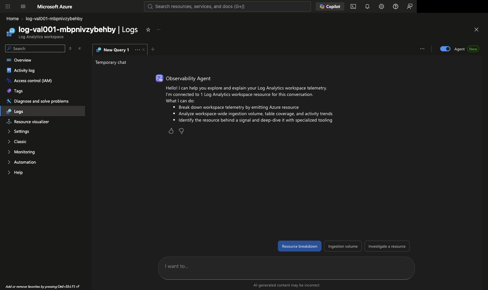

## Purpose

This walkthrough shows how to investigate whether the VAL-001 KPI is performing
above or below its configured threshold in the Azure portal. The Observability
Agent helps a developer understand the Log Analytics result using
plain-language questions. It is an investigation aid, not the authoritative
VAL-001 decision surface.



The capture shows the `log-val001-*` Log Analytics workspace with the
Observability Agent available from the Logs experience. The account control was
masked before saving the image. The capture proves that the investigation
surface was available; it does not prove that a KPI query or control decision
has run.

## Live validation record

On 2026-09-21, the control resources were redeployed and the hosted agent
produced a complete synthetic run with ID
`880c44b5-a049-4a8a-a9b3-be377de954e3`. The corrected KPI query was executed
against the redeployed `AppEvents` table in the VAL-001 workspace and returned:

| Period | Total | Deflected | Rate | Threshold | Result |
|---|---:|---:|---:|---:|---|
| 1 | 5 | 1 | 20% | 28% | `below_threshold` |
| 2 | 5 | 1 | 20% | 28% | `below_threshold` |

The query verdict was `review_required`. The completeness query returned five
events and five sampled items for each period. The integrity query returned no
duplicate or conflicting ticket-period pairs. The authoritative
`demo.py evaluate` command returned the same verdict and reason,
`two_periods_strictly_below_threshold`.


This capture was taken from the existing Azure Logs browser tab after running
the live KPI query. It shows the query editor and the result row with two
below-threshold periods and the `review_required` decision. The account area is
outside the captured viewport.

The configured Business Owner Teams Workflow accepted the corresponding
notification with HTTP `202`. This confirms webhook acceptance only; Teams
delivery still requires the documented operator inspection and receipt step.

The live query was executed through the Azure Monitor workspace query surface.
The browser subagent's Azure Portal Logs blade then failed to render its React
content, so the existing screenshot proves the Observability Agent surface but
not the query result itself. Do not describe it as a query-result screenshot
until the Logs blade renders the query and result table successfully.

## Prerequisites

* Access to the VAL-001 Log Analytics workspace
* Permission to query the workspace and inspect `AppEvents`
* A VAL-001 `RUN_ID` from the documented demo run
* The control's minimized telemetry contract, including `control_id`,
  `metric_name`, `agent_id`, `period`, `ticket_id`, `outcome`, `verified`, and
  `human_handled`

Do not paste prompts, ticket text, access tokens, webhook URLs, or personal
identifiers into the Observability Agent. Use the synthetic `RUN_ID` and the
control-owned identifiers only.

## Example KPI investigation

Use the following sequence for a completed synthetic run. The query below uses
the VAL-PRE-001 target of 35%, so the VAL-001 threshold is 28%.

### 1. Run the KPI query

Open the `log-val001-*` workspace and select **Logs**. Run this query in the
Logs query editor, replacing `<RUN_ID>` with the identifier printed by
`demo.py run`:

```kusto
let runId = "<RUN_ID>";
let targetPercent = 35.0;
let thresholdPercent = targetPercent * 0.8;
let perPeriod =
   AppEvents
   | where Name == "TicketTriaged"
   | where tostring(Properties) contains runId
   | extend event = parse_json(tostring(Properties))
   | where tostring(event.run_id) == runId
   | where tostring(event.control_id) == "VAL-001"
   | where tostring(event.metric_name) == "tier1_ticket_deflection_rate"
   | extend period = toint(event.period),
          outcome = tostring(event.outcome),
          verified = tostring(event.verified),
          item_count = toint(ItemCount)
   | where verified in ("True", "true")
   | summarize total = count(),
            deflected = countif(outcome == "deflected"),
            items = sum(item_count)
      by period
   | extend ratePercent = round(100.0 * todouble(deflected) / todouble(total), 2),
          thresholdPercent = thresholdPercent
   | extend periodResult = iff(ratePercent < thresholdPercent,
                        "below_threshold", "at_or_above_threshold")
   | project period, total, deflected, items, ratePercent,
           thresholdPercent, periodResult;
perPeriod
| summarize periodCount = count(),
         belowThresholdPeriods = countif(periodResult == "below_threshold"),
         periods = make_list(pack("period", period,
                            "ratePercent", ratePercent,
                            "periodResult", periodResult))
| extend decision = iff(periodCount == 2 and belowThresholdPeriods == 2,
                  "review_required", "no_review_required")
```

For the `underperforming` scenario, the expected result is two periods below
28% and `review_required`. For the `healthy` scenario, the result is
`no_review_required`. A missing period, invalid event, sampled `ItemCount`, or
conflicting duplicate must not be interpreted as healthy. Those conditions
remain the evaluator's `cannot_evaluate` path.

### 2. Ask the Observability Agent to explain the KPI result

Open the Observability Agent beside the Logs view and ask:

> Explain the KPI result for VAL-001 run `<RUN_ID>`. Use the query result already visible in Logs. State the deflection rate for each period, the 28% threshold, whether both periods are below threshold, and whether the result suggests `review_required` or `no_review_required`. Do not include ticket content.

The answer should explain the KPI outcome, not invent a target or claim that a
notification was delivered. If the agent cannot explain the result, use the
query output and evaluator evidence directly.

### 3. Check period completeness

Run this supporting query when the KPI query returns fewer than two periods:

```kusto
let runId = "<RUN_ID>";
AppEvents
| where Name == "TicketTriaged"
| where tostring(Properties) contains runId
| extend event = parse_json(tostring(Properties))
| where tostring(event.run_id) == runId
| summarize observedEvents = count(), sampledItems = sum(toint(ItemCount))
   by period = toint(event.period)
| order by period asc
```

The useful observations are whether periods 1 and 2 exist and whether
`sampledItems` differs from `observedEvents`.

### 4. Check measurement integrity

Run this supporting query to find duplicate ticket-period pairs:

```kusto
let runId = "<RUN_ID>";
AppEvents
| where Name == "TicketTriaged"
| where tostring(Properties) contains runId
| extend event = parse_json(tostring(Properties))
| where tostring(event.run_id) == runId
| summarize observed = count(),
         outcomes = make_set(tostring(event.outcome)),
         verification = make_set(tostring(event.verified))
   by period = toint(event.period), ticketId = tostring(event.ticket_id)
| where observed > 1 or array_length(outcomes) > 1 or array_length(verification) > 1
| project period, ticketId, observed, outcomes, verification
```

A result showing duplicates, conflicting rows, invalid verification, or sampled
rows explains why the deterministic evaluator may return `cannot_evaluate`.

### 5. Compare the measured KPI with the evidence record

Open `.azure/val001/runs/<RUN_ID>/evidence.json` and compare it with the query
result. The evidence record is authoritative for the final decision because it
also binds the governance contract digest, policy version, completeness checks,
and notification state.

The Observability Agent may help a developer understand the KPI result, but it
must not replace the evaluator, read a second target, or claim that a Teams
notification was delivered.

## Close the investigation

1. Compare the Observability Agent's findings with the evaluator reason and
   `evidence.json` for the same `RUN_ID`.
2. Use the deterministic evaluator result as the control decision.
3. Route `review_required` to the Business Owner and `cannot_evaluate` to AI
   Governance Operations.
4. Record only minimized, synthetic evidence in the control run directory.
5. Do not copy the Observability Agent's free-form explanation into the
   authoritative evidence record.

## What this proves and does not prove

The walkthrough proves that a developer can use Azure's observability surface
to investigate the telemetry behind a VAL-001 outcome. It does not prove that
the Observability Agent queried every event correctly, that its narrative is
complete, or that it can replace the deterministic evaluator. A Power BI
report, scheduled positive-performance summary, or custom observability agent
remains an optional extension outside the core demo.
