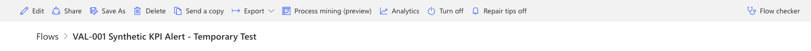
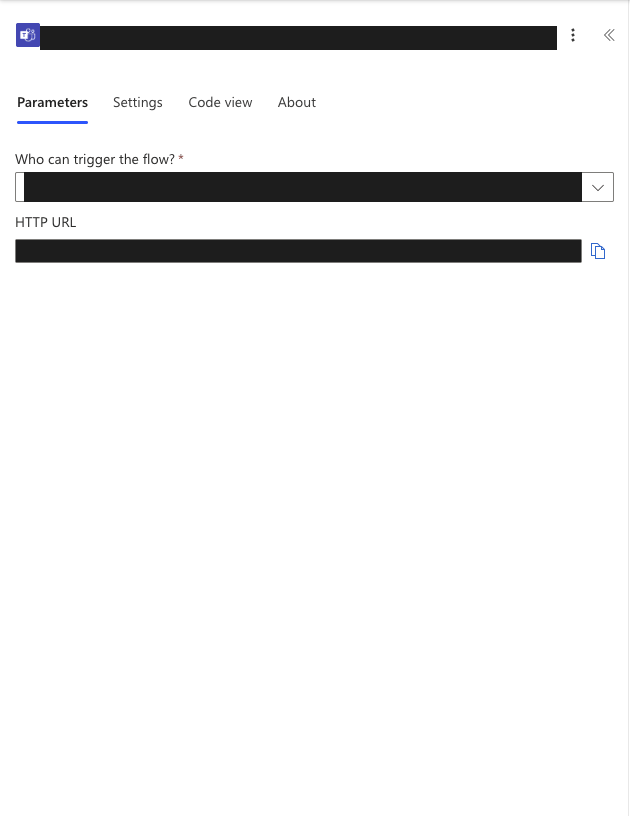
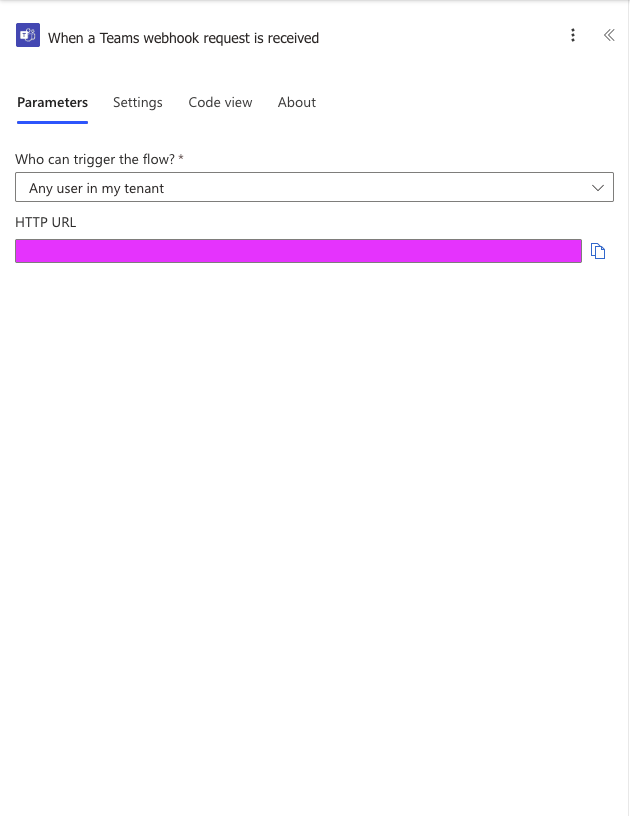
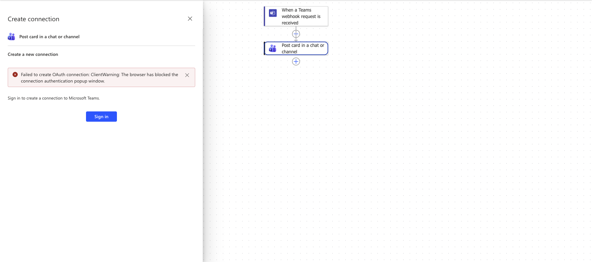
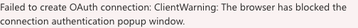
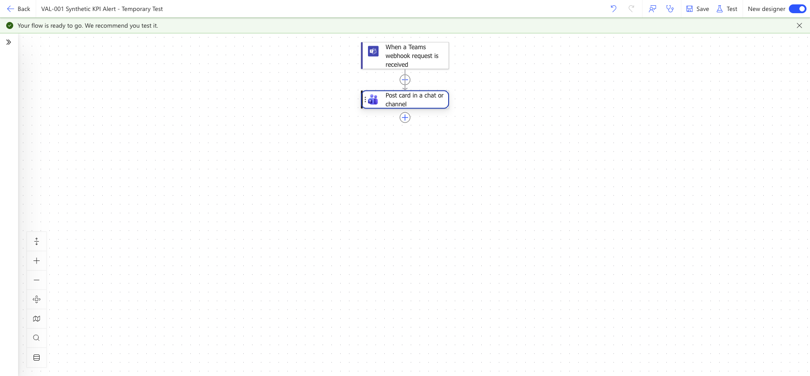
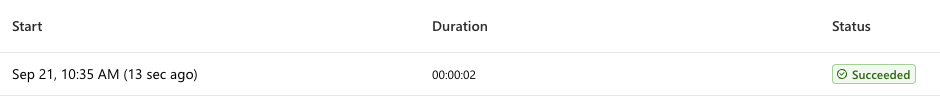
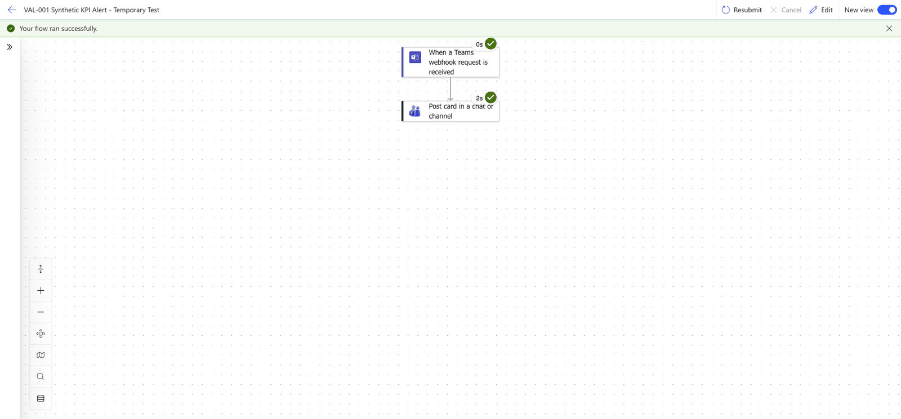

## Verified scope

On 2026-09-21, the temporary VAL-001 flow accepted an authenticated webhook
request and its Teams action returned `201 Created`. The operator confirmed
the card was visible in their private Workflows chat. The test used correlation
`val001-teams-20260921-01` and explicitly synthetic rates of 20% and 25%.

This proves notification delivery for that test only. It does not prove a
running hosted agent, complete Log Analytics telemetry, a KPI evaluation,
delivery to the contract's actual Business Owner, or completion of a review.
The private test recipient is a stand-in, not a replacement owner declaration.
HTTP `202` acceptance alone is not evidence of Teams delivery.

## Find and configure the webhook URL

The notification sender needs the trigger's generated endpoint, not the URL
in your browser's address bar. Keep this endpoint private even though this
flow also requires tenant authentication.

### 1. Open the saved flow in the editor

In Power Automate, select **My flows**, open
**VAL-001 Synthetic KPI Alert - Temporary Test**, and select **Edit** in the
top toolbar. Do not select the separate Edit link for owners or connections.



This capture shows the correct flow and editor entry point. The account
banner, primary owner, and connection details are outside the crop.

[Privacy note: account and connection details were cropped because they are
not needed to reproduce the webhook setup and could identify a person or
tenant.]

### 2. Select the webhook trigger

On the workflow canvas, select **When a Teams webhook request is received**,
the first block. Do not select **Post card in a chat or channel**: that action
defines the destination but does not provide the incoming webhook URL.


The two-block canvas identifies the incoming trigger above the Teams posting
action. Opening the trigger does not change the workflow.

### 3. Copy the generated HTTP URL

In the trigger's **Parameters** tab, locate **HTTP URL** and select the
clipboard icon on its right, labeled **Copy URL** when hovered. Some designer
versions label the field **HTTP POST URL**. The screenshot below captures the
actual **HTTP URL** label in the tested designer.



[Privacy note: the black mask hides the live webhook endpoint because it is a
secret-bearing integration address. The black color is a deliberate visual
redaction, not part of the Power Automate configuration.]

The dark mask hides the real endpoint; it is not a value to enter. The copy
icon still copies the complete endpoint from your live flow. Leave
**Who can trigger the flow?** set to **Any user in my tenant**; do not switch
to anonymous access to make the demo work.

For a newly created flow, the field can say **URL will be generated after
save**. Finish the required action configuration, save the flow, and reopen
the trigger. An existing saved flow should already have its generated URL.

### 4. Enter it locally without displaying it

In VS Code, select the terminal waiting for the webhook URL, paste the copied
value, and press Enter. Hidden input may show no characters or asterisks;
that is expected. Do not paste the URL into chat, source code, an ordinary
shell command line, or a screenshot.

If that temporary prompt is no longer available, run the following in a
macOS zsh terminal from the repository root. The first command disables shell
tracing; `read` then accepts the value without echoing it or placing it in
command history.

```zsh
set +x
read -rs 'VAL001_TEAMS_WEBHOOK_URL?Paste the Teams HTTP URL (hidden): '
printf '\n'
AZURE_DEV_USER_AGENT=microsoft_foundry_skill azd env set VAL001_TEAMS_WEBHOOK_URL "$VAL001_TEAMS_WEBHOOK_URL" --cwd controls/value_adoption_and_finops/VAL-001_kpi_underperformance
unset VAL001_TEAMS_WEBHOOK_URL
printf '' | pbcopy
```

The value belongs only in the control's ignored local azd environment under
`.azure/`. Never commit that directory. Clipboard clearing above removes the
copied endpoint after entry.

Check configuration without printing the endpoint:

```zsh
AZURE_DEV_USER_AGENT=microsoft_foundry_skill azd env get-values --output json --cwd controls/value_adoption_and_finops/VAL-001_kpi_underperformance | jq '{webhookConfigured: ((.VAL001_TEAMS_WEBHOOK_URL // "") | startswith("https://"))}'
```

`webhookConfigured: true` confirms an HTTPS value is stored, not that it is
the correct endpoint, authentication works, or a card was delivered. Verify
the subsequent flow run and Teams message separately as described below.

## Recipient routing

Configure two tenant-authenticated Teams Workflows when running the complete
control path:

* `VAL001_TEAMS_WEBHOOK_URL` posts `review_required` cards to the Business
   Owner's channel.
* `VAL001_GOVERNANCE_TEAMS_WEBHOOK_URL` posts `cannot_evaluate` cards to the
   AI Governance Operations or Control Operator channel.

The second route is intentionally separate. A missing or invalid measurement
must not look like a business KPI failure, and a Business Owner should not be
asked to review an outcome that the control could not establish.

## Reproduce and capture the cards

Run the commands from the control directory. The first command prints the
`RUN_ID` needed by the evaluator and notification steps.

```zsh
cd controls/value_adoption_and_finops/VAL-001_kpi_underperformance
RUN_OUTPUT=$(/Users/doruit/forged-with-foundry/.venv/bin/python demo.py run --scenario underperforming)
printf '%s\n' "$RUN_OUTPUT"
RUN_ID=$(printf '%s\n' "$RUN_OUTPUT" | sed -n 's/^Run: //p')
/Users/doruit/forged-with-foundry/.venv/bin/python demo.py evaluate --run-id "$RUN_ID"
/Users/doruit/forged-with-foundry/.venv/bin/python demo.py notify --run-id "$RUN_ID"
```

Check for `review_required`, then open the Teams desktop app or headed
Playwright browser and find the new card in the Workflows chat. Use macOS
`Cmd+Shift+4` and capture only the card. Save it as
`../media/teams-card-review-required.png` from this documentation directory.

For the fail-closed card, use a separate healthy run and pass the missing
contract path on the first evaluation:

```zsh
RUN_OUTPUT=$(/Users/doruit/forged-with-foundry/.venv/bin/python demo.py run --scenario healthy)
printf '%s\n' "$RUN_OUTPUT"
RUN_ID=$(printf '%s\n' "$RUN_OUTPUT" | sed -n 's/^Run: //p')
/Users/doruit/forged-with-foundry/.venv/bin/python demo.py evaluate --run-id "$RUN_ID" --contract /tmp/val001-missing-governance.yaml
/Users/doruit/forged-with-foundry/.venv/bin/python demo.py notify --run-id "$RUN_ID"
```

Check for `cannot_evaluate`, then capture the amber warning card as
`../media/teams-card-cannot-evaluate.png`. This missing path is a deliberate
test input. It does not replace or modify the checked-in governance contract.

Do not capture browser tabs, tenant identifiers, profile names, webhook URLs,
access tokens, or other personal or environment-specific values. Crop the
image to the card while capturing it. A green `no_review_required` card is
reserved for the optional monthly positive-performance report and is not sent
by the core demo.

### Screenshot redaction legend

[Privacy legend: black redaction covers secrets, webhook endpoints, response
headers, and correlation or environment identifiers. Purple or magenta
redaction covers personal recipients, profile fields, or tenant destinations.
Cropping removes unrelated browser and navigation chrome. These treatments
protect the environment while leaving the workflow, card content, and delivery
result understandable.]

## Configuration captures



The trigger uses `Any user in my tenant`; it is not an anonymous webhook.



The workflow receives one webhook request and posts one card. KPI decisions
remain outside this flow.


This capture shows both governance outcomes in the Workflows chat. The amber
card routes `cannot_evaluate` to AI Governance Operations and asks for
measurement-path remediation. The red card routes `review_required` to the
Business Owner and shows the two measured periods, target, and threshold.
Personal Teams navigation and browser chrome were cropped from the repository
asset.



The connector initially encountered a blocked sign-in popup. This was resolved
before the successful test; the image is troubleshooting evidence only.

The Teams action reads `string(triggerBody()?['attachments'][0]?['content'])`.
The combined card capture above shows the resulting content and recipient role;
the private recipient mapping is intentionally not reproduced as a heavily
masked image.



The workflow was saved before testing. Saving alone does not prove delivery.

## Delivery captures



The real run appears as successful in Power Automate.



Both the trigger and posting action completed for this test.

The posting action returned `201 Created`; the run-history and combined-card
captures above provide the useful delivery context. Raw response headers and
private message identifiers are intentionally omitted because they do not help
the community reproduce the control.

## Sender requirements

Send one Adaptive Card per request in a Teams webhook message envelope:
`type: message`, with one `attachments` item containing
`contentType: application/vnd.microsoft.card.adaptive`, `contentUrl: null`,
and the card object under `content`.

The card uses semantic attention states that remain understandable without
relying on color alone:

* A red attention dot marks `review_required` and the card names the Business
   Owner review action.
* An amber warning icon marks `cannot_evaluate` and tells AI Governance
   Operations to restore the measurement path.
* A green dot is reserved for `no_review_required` cards used by a future
   positive-performance report; healthy runs are not notified in the core demo.

Use `Content-Type: application/json` and a Bearer token for the flow's tenant.
The tested token audience was `https://service.flow.microsoft.com/`.
Keep webhook URLs and access tokens out of source control, screenshots,
terminal output, and evidence records. Do not silently fall back to anonymous
authentication.

This walkthrough focuses on the webhook request, Adaptive Card payload, and
verified Teams action result. Licensing and tenant entitlement decisions are
environment-specific and are outside this community demo.

## Cleanup

The test flow is currently retained for integration, not cleaned up or
certified as reusable across other controls. To remove this test state:

1. In Power Automate, open **My flows** and locate
   **VAL-001 Synthetic KPI Alert - Temporary Test**.
2. Turn off and delete only that flow. Verify it is absent from My flows.
3. Separately remove the test card with correlation
   `val001-teams-20260921-01` if the tenant and Teams UI permit deletion.
   Deleting the flow does not delete previously delivered messages. If message
   deletion is unavailable, record retained test data and its retention policy;
   do not claim complete cleanup.
4. Do not delete a shared Teams connection, team, tenant, or Azure resource
   group. A connection may serve other workflows.

These cleanup steps have not yet been executed. End-to-end VAL-001 validation
remains incomplete.

## References

- [Microsoft Teams connector and webhook authentication](https://learn.microsoft.com/en-us/connectors/teams/)
- [Power Automate Microsoft 365 licensing questions](https://learn.microsoft.com/en-us/power-platform/admin/power-automate-licensing/faqs#office-365-license-questions)
- [Create and manage Teams incoming webhooks with Workflows](https://learn.microsoft.com/en-us/microsoftteams/platform/webhooks-and-connectors/how-to/add-incoming-webhook)