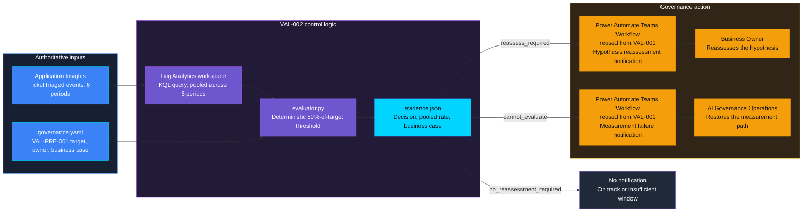
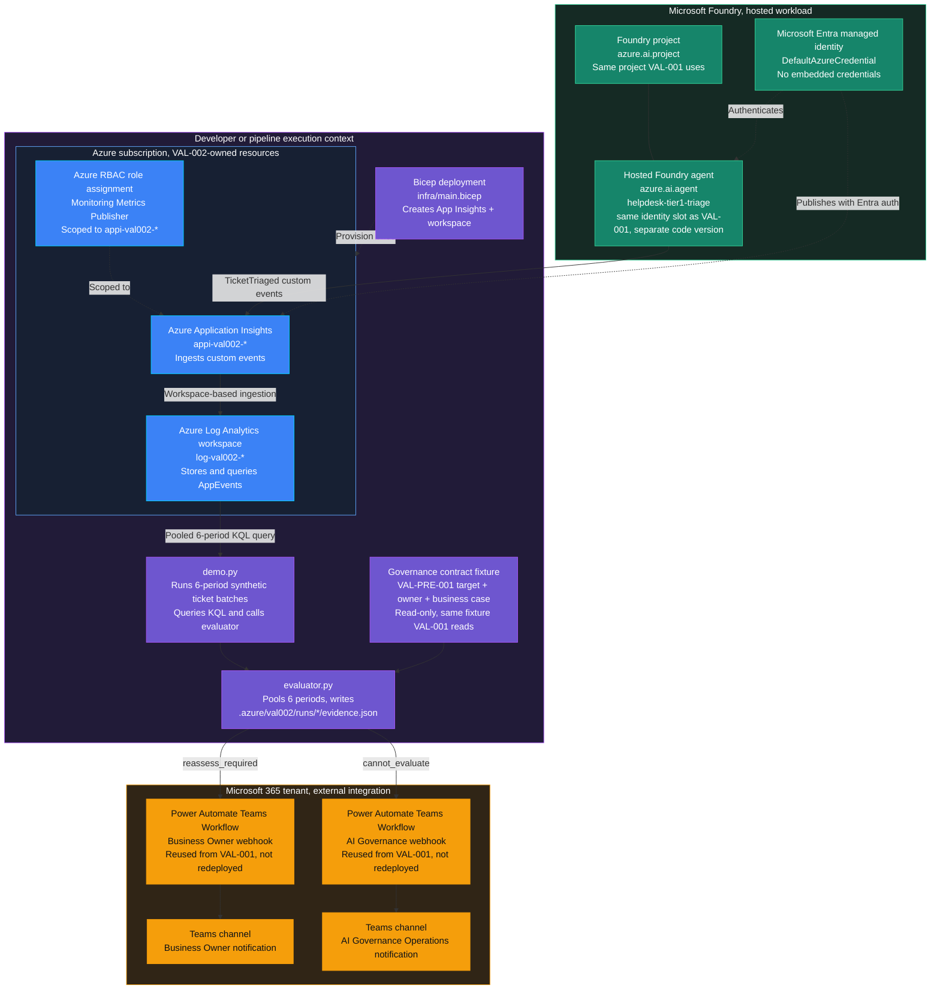

<p align="center">
    
</p>

# VAL-002 — Benefits realisation gap

> **Status:** In progress. Evaluator, demo runner, infrastructure, and tests
> are implemented and pass locally (84/84); live deployment, telemetry, Teams
> delivery, and screenshot proof are not yet captured. See
> [ASSESSMENT.md](ASSESSMENT.md) for the completed design decision.
>
> **Last reviewed:** Not yet reviewed against a live run.

## Table of contents

- [Overview](#overview)
- [Demo profile](#demo-profile)
- [Demo scope](#demo-scope)
- [Control contract](#control-contract)
- [Control objective](#control-objective)
- [Logical design](#logical-design)
- [Infrastructure architecture](#infrastructure-architecture)
- [Implementation](#implementation)
- [Demo](#demo)
- [Evidence and observability](#evidence-and-observability)
- [Security and privacy](#security-and-privacy)
- [Validation](#validation)
- [Cleanup](#cleanup)
- [References](#references)

## Overview

A business case promises that an AI assistant will resolve a third of routine
helpdesk tickets without a human. [VAL-001](../VAL-001_kpi_underperformance/README.md)
already watches month to month for a short bad patch. But an assistant can
clear that check every single month — never two bad months in a row — and
still, six months later, have delivered nowhere near what the business case
promised, with nobody ever asking whether the plan itself was realistic.

This control answers a different question than VAL-001's: not "did
performance dip recently?" but "looking at the whole declared milestone
window, did this ever actually work?" It pools every measured outcome across
six periods and compares that single cumulative rate against half of the
original target. Falling short triggers a Business Owner **reassessment of
the value hypothesis itself**, not a routine review.

## Demo profile

| Property | Value |
|---|---|
| **Demo format** | Deployable demo |
| **Learning level** | Intermediate |
| **Estimated time** | 45-60 minutes after access setup |
| **Primary decision** | Request a hypothesis reassessment when cumulative results stay below half the declared target across a full 6-period window |
| **Primary capabilities** | Agent Framework, Foundry, Application Insights, Log Analytics, Teams Workflows |
| **Deployment** | Required; existing Foundry project/model, isolated Monitor resources |
| **Infrastructure** | Own Application Insights + Log Analytics workspace, same shape as VAL-001's |
| **AGT / ACS** | Not used for this asynchronous monitored workload |
| **Model/Foundry role** | Monitored workload |

## Demo scope

### Core demo

Run the hosted helpdesk agent for six periods, pool its verified
`TicketTriaged` telemetry across the whole window, compare the cumulative
rate to half the declared target, write evidence, and notify the correct
role.

### Intentional simplifications

Six demo periods stand in for "six months," the same explicit-tag convention
VAL-001 uses for its two periods — no calendar time is involved. This control
reuses VAL-001's already-configured Teams Workflows
(`VAL001_TEAMS_WEBHOOK_URL` / `VAL001_GOVERNANCE_TEAMS_WEBHOOK_URL`) rather
than authoring new ones: both controls post to the same private test chat,
for the same fictional Business Owner and AI Governance Operations roles.

### What this demo proves

It proves that a business case's declared target can be checked against real,
cumulative, verified agent outcomes at the milestone the business case itself
implied, and that a sustained shortfall produces a traceable
hypothesis-reassessment notification distinct from a routine performance
review.

### What this demo does not prove

It does not prove that 50%-of-target or a 6-period window is the right
milestone for any real organization, that the reassessment actually happens,
that 6 demo-compressed periods are equivalent to 6 real reporting periods in
production, or that this control's scope stays free of overlap with a future
VAL-004 (value leakage) — that overlap question is explicitly deferred, not
resolved, in [ASSESSMENT.md](ASSESSMENT.md).

> [!IMPORTANT]
> To implement the control, start with the numbered
> [implementation path](#implementation-path), then run the
> [demo](#demo). Setup steps identical to VAL-001's are linked, not
> repeated — see [VAL-001's implementation path](../VAL-001_kpi_underperformance/README.md#implementation-path)
> for the underlying Azure/azd/Teams mechanics.

## Control contract

| Field | Value |
|---|---|
| **ID** | VAL-002 |
| **Lifecycle phase** | Live |
| **Category / domain** | Value |
| **Control / signal** | Benefits realisation gap |
| **Evidence / source** | Realised vs planned value |
| **Trigger / threshold** | <50% realised after 6 periods |
| **Action / gate effect** | Reassess hypothesis |
| **Accountable role** | Business Owner |

## Control objective

Connect the declared value hypothesis to a cumulative, milestone-anchored
outcome check. The agent performs synthetic work; the deterministic evaluator
reads target, owner, and business case through the shared contract
validator — the same read-only source VAL-001 uses. Missing or ambiguous
data yields `cannot_evaluate`, never a healthy result. See
[deployment and validation details](docs/IMPLEMENTATION.md).

## Logical design



> [!NOTE]
> **Relationship to VAL-001:** VAL-001 asks whether either of the last two
> periods dipped; VAL-002 asks whether the whole declared milestone window
> ever added up to enough. An agent can pass VAL-001's rolling check every
> month while still failing VAL-002's cumulative one, and vice versa — they
> read the same two streams but make genuinely different decisions at
> different thresholds. See [ASSESSMENT.md](ASSESSMENT.md) for the full
> comparison and the still-open VAL-004 overlap question.

## Infrastructure architecture



The Azure resources shown are VAL-002's own — a separate Log Analytics
workspace, Application Insights component, and scoped publisher role
assignment, deployed independently of VAL-001's (which were already cleaned
up). The Foundry project and hosted agent are the measured workload, same
shape as VAL-001's — deployed with VAL-002's own code, but reusing the same
`helpdesk-tier1-triage` name slot and its underlying managed identity
(confirmed live: `instance_identity.principal_id` is unchanged from VAL-001's
deployment). Only the RBAC grant and telemetry destination are control-owned
and separate; the identity itself is shared, same as the fictional agent
concept it represents. The two
Power Automate Teams Workflows in the external tenant are **not**
redeployed: this control posts to VAL-001's existing flows, an explicit
architectural choice recorded in [ASSESSMENT.md](ASSESSMENT.md), so those
two boxes represent reuse, not new infrastructure.

| Resource or component | Type | Role in VAL-002 | Ownership |
|---|---|---|---|
| `log-val002-*` | `Microsoft.OperationalInsights/workspaces` | Stores `AppEvents` and answers the pooled 6-period KQL query | Control-owned Azure resource |
| `appi-val002-*` | `Microsoft.Insights/components` | Receives minimized `TicketTriaged` telemetry from this control's hosted agent | Control-owned Azure resource |
| `metrics-publisher` | `Microsoft.Authorization/roleAssignments` | Grants the publishing identity permission scoped to this Application Insights resource | Control-owned Azure resource |
| `helpdesk-tier1-triage` | Foundry hosted `azure.ai.agent` | Performs synthetic Tier-1 triage whose verified outcomes are measured; a separate deployed instance from VAL-001's | Foundry workload |
| `evaluator.py` and `demo.py` | Local Python components | Apply the pooled 50%-of-target threshold, write evidence, invoke notification | Control implementation |
| `governance.yaml` | FwF governance contract fixture | Supplies the read-only target, owner, and business case from VAL-PRE-001 | Existing contract source, shared with VAL-001 |
| Business Owner Teams Workflow | Power Automate flow, **reused from VAL-001** | Delivers `reassess_required` to the Business Owner | External Microsoft 365 dependency, not owned by this control |
| AI Governance Teams Workflow | Power Automate flow, **reused from VAL-001** | Delivers `cannot_evaluate` to AI Governance Operations | External Microsoft 365 dependency, not owned by this control |

## Implementation

### Components

| Component | Responsibility |
|---|---|
| [agent.py](agent.py) and [workload.py](workload.py) | Execute synthetic ticket work and independently read back the result (unchanged from VAL-001's workload logic) |
| [main.py](main.py) | Host the Foundry agent and export minimized events with Entra authentication |
| [evaluator.py](evaluator.py) | Validate the contract and telemetry, then apply the pooled 50%-of-target threshold across 6 periods |
| [demo.py](demo.py) | Run scenarios, query telemetry, write evidence, and request notifications through VAL-001's reused Teams routes |
| [infra/main.bicep](infra/main.bicep) | Create this control's own Application Insights and Log Analytics resources |
| [infra/cleanup.py](infra/cleanup.py) | Verify ownership before deleting this control's Azure resources |

### Implementation path

Steps 1-5 (dependencies, `azd` environment, Monitor deployment, hosted agent
+ RBAC, Teams webhook configuration) are mechanically identical to VAL-001's
own [implementation path](../VAL-001_kpi_underperformance/README.md#implementation-path) —
follow that walkthrough directly, substituting this control's directory and
the `VAL002_*`-prefixed Application Insights variable named below. This
section documents only what is different for VAL-002.

#### 1-5. Follow VAL-001's implementation path

From this control's directory
(`controls/value_adoption_and_finops/VAL-002_benefits_realisation_gap`),
repeat [VAL-001's steps 1-5](../VAL-001_kpi_underperformance/README.md#implementation-path)
with these VAL-002-specific substitutions:

- `azd env new val-002-benefits-realisation-gap-dev` instead of VAL-001's
  environment name.
- The Monitor deployment name is `val002-monitor`; store its outputs as
  `VAL002_WORKSPACE_ID` and `APPLICATIONINSIGHTS_CONNECTION_STRING` (read by
  `azure.yaml` into `VAL002_APPLICATIONINSIGHTS_CONNECTION_STRING`).
- **Skip step 5 (Teams webhooks) entirely if VAL-001's `VAL001_TEAMS_WEBHOOK_URL`
  and `VAL001_GOVERNANCE_TEAMS_WEBHOOK_URL` are still configured in a
  reachable `azd` environment** — copy those two values into this control's
  `azd env` instead of creating new Power Automate flows. Only follow the
  [Teams delivery walkthrough](../VAL-001_kpi_underperformance/docs/TEAMS-DELIVERY.md)
  again if that flow or its private test chat no longer exists.

#### 6. Run both governance scenarios

Run both command blocks in [Run](#run). Confirm that the shortfall run
returns `reassess_required` and the missing-contract run returns
`cannot_evaluate`. For each run, open
`.azure/val002/runs/<run-id>/evidence.json` and verify the decision, reason,
target, threshold, pooled rate, business case, and all six period rates.

#### 7. Verify Teams delivery and record the receipt

Identical to [VAL-001's step 7](../VAL-001_kpi_underperformance/README.md#implementation-path):
open the Power Automate run, match its input correlation to the VAL-002 run,
confirm the Teams posting action returned `201`, then record only the
inspected receipt with `demo.py record-delivery`.

#### 8. Run the tests and clean up

Run the [validation command](#validation). If it passes, run the inspection
command and then the confirmed deletion command in [Cleanup](#cleanup).
Verify that this control's own agent and Monitor resources are gone while
the shared Foundry project, resource group, and VAL-001's reused Teams
Workflows still exist.

### Demo scope

The demo proves a synthetic workload-to-milestone-to-reassessment-request
chain, not production ticket resolution, statistical confidence from small
synthetic batches, target adequacy, or completion of a human reassessment.
Periods are compressed and explicitly tagged, same convention as VAL-001.
The measurement-failure route is the same fail-closed mechanism VAL-001
already live-validated; this control re-exercises it against its own
deployment rather than re-designing it.

### Best-practice choices

- Keep policy enforcement outside model reasoning: the pooled threshold
  comparison is plain Python, not a model judgment.
- Use least-privilege identity and secretless authentication, same as
  VAL-001 (Entra managed identity, no embedded credentials).
- Minimize retained data and exclude sensitive values from logs and alerts.
- Fail closed when a mandatory control cannot complete safely.
- Pin API/model versions (see [requirements.txt](requirements.txt)) and
  review them during repository updates.

## Demo

### Prerequisites

Complete the [implementation path](#implementation-path) above before
running the demo. Confirm that both reused webhook values are configured
without printing them. Never paste an endpoint into chat, source control, a
screenshot, or an ordinary shell command line.

### Run

Run the shortfall scenario against the hosted Foundry agent. The command
prints a `Run:` identifier.

```zsh
cd controls/value_adoption_and_finops/VAL-002_benefits_realisation_gap
RUN_OUTPUT=$(../../../.venv/bin/python demo.py run --scenario milestone_shortfall)
printf '%s\n' "$RUN_OUTPUT"
RUN_ID=$(printf '%s\n' "$RUN_OUTPUT" | sed -n 's/^Run: //p')
../../../.venv/bin/python demo.py evaluate --run-id "$RUN_ID"
../../../.venv/bin/python demo.py notify --run-id "$RUN_ID"
```

Expect `reassess_required`. The Business Owner Teams Workflow (VAL-001's
reused flow) receives the red attention card after the evaluator writes the
evidence record.

To reproduce the fail-closed `cannot_evaluate` card, run a separate healthy
milestone and evaluate it against a deliberately missing contract path:

```zsh
RUN_OUTPUT=$(../../../.venv/bin/python demo.py run --scenario milestone_met)
printf '%s\n' "$RUN_OUTPUT"
RUN_ID=$(printf '%s\n' "$RUN_OUTPUT" | sed -n 's/^Run: //p')
../../../.venv/bin/python demo.py evaluate --run-id "$RUN_ID" --contract /tmp/val002-missing-governance.yaml
../../../.venv/bin/python demo.py notify --run-id "$RUN_ID"
```

Expect `cannot_evaluate`.

### Capture the Teams card

Use `scripts/capture_teams_card.py` (Playwright, headed browser) from the
repository root — see [Screenshot capture](docs/IMPLEMENTATION.md#screenshot-capture)
for the one-time setup and usage. It launches a visible Chromium window,
waits for interactive sign-in (never automated — Entra login is not
credential-stored), then screenshots the specific new card element directly
to `media/`, avoiding manual cropping. The alternative manual method
(Teams desktop app or headed Playwright browser, `Cmd+Shift+4`) documented
in [VAL-001's walkthrough](../VAL-001_kpi_underperformance/docs/TEAMS-DELIVERY.md)
still applies if preferred.

Exclude or mask personal names, email addresses, tenant details, webhook
URLs, and unnecessary service identifiers before adding a capture to the
repository.

| Decision | Visual state | Captured in the repository |
|---|---|---|
| `reassess_required` | Red attention dot and hypothesis-reassessment text | Delivered live (HTTP 202); screenshot not yet captured — see [docs/IMPLEMENTATION.md](docs/IMPLEMENTATION.md#live-validation) |
| `cannot_evaluate` | Amber warning icon and measurement remediation text | Delivered live (HTTP 202); screenshot not yet captured |
| `no_reassessment_required` | Green on-track card | Not captured by the core demo |

### Expected scenarios

| Scenario | Input | Expected decision | Expected evidence |
|---|---|---|---|
| Pooled rate at or above 50% of target across 6 periods | `milestone_met` | `no_reassessment_required`, evidence recorded; no notification in this demo | Pooled rate, all 6 period rates |
| Pooled rate strictly below 50% of target across 6 periods | `milestone_shortfall` | `reassess_required`, evidence + Teams notification | Pooled rate, business case, owner |
| Missing, invalid, incomplete, or ambiguous inputs | Missing contract | `cannot_evaluate`, never a healthy result, notifies AI Governance Operations | Reason code only |

### Captured validation evidence

The [live validation](docs/IMPLEMENTATION.md#live-validation) run on
2026-09-22 measured all six periods at `1/6 (16.67%)`, pooling to `6/36
(16.67%)` — strictly below the 17.5% threshold (50% of the declared 35%
target) — producing `reassess_required` with a real Teams posting accepted
(HTTP 202) to the Business Owner route. A separate run evaluated against a
deliberately missing contract path produced `cannot_evaluate`, with a real
Teams posting accepted (HTTP 202) to the AI Governance Operations route.
Both `evidence.json` records are the authoritative proof of these decisions.

The operator-checked delivery receipt (matching each Teams posting's `201`
and message ID) and the Teams card screenshots are not yet captured — see
[docs/IMPLEMENTATION.md](docs/IMPLEMENTATION.md#live-validation) for what
remains and why.

## Evidence and observability

Each run has one authoritative `.azure/val002/runs/<run-id>/evidence.json`
binding versions, correlation, contract hash/reference, owner, business
case, all six periods' counts and rates, the pooled rate, target, threshold,
decision, reason, and notification verification/history. Raw prompts, model
responses, tokens, and webhook URLs are excluded.

## Security and privacy

Only isolated synthetic state is modified. The agent instance receives
Monitoring Metrics Publisher on its own Application Insights resource, with
local auth disabled. Operators use Entra auth for queries and Teams
requests. Local evidence assumes trusted filesystem access and is not
tamper-proof.

## Validation

From the repository root, run:

```bash
.venv/bin/python -m pytest controls/value_adoption_and_finops/VAL-002_benefits_realisation_gap/tests -q
```

Tests cover the pooled-rate threshold rule (including that pooling sums
events rather than averaging period percentages), exact boundaries, window
completeness (exactly six consecutive periods), incomplete/sampled
telemetry, duplicates, contract validity, business case propagation,
notification failures and retries, minimization, and cleanup ownership. See
the [implementation guide](docs/IMPLEMENTATION.md) for live results once
captured.

## Cleanup

Synthetic in-memory ticket state is destroyed when its context exits,
including on failure. Because this control reuses VAL-001's Teams flows
rather than creating its own, there is no separate Teams flow to clean up
for VAL-002 specifically — only its own Azure Monitor resources and hosted
agent. From the control directory:

```bash
../../../.venv/bin/python infra/cleanup.py --subscription <subscription-id> --resource-group <resource-group>
../../../.venv/bin/python infra/cleanup.py --subscription <subscription-id> --resource-group <resource-group> --confirm
```

The first command inspects; the second deletes only verified targets. It
does not delete platform conversation history, the reused Teams flow/messages
(those remain VAL-001's responsibility), or retained local audit evidence.
Do not delete the shared Foundry project or resource group to work around
that.

## References

- [Create and configure workspace-based Application Insights resources](https://learn.microsoft.com/en-us/azure/azure-monitor/app/create-workspace-resource)
- [Overview of Log Analytics in Azure Monitor](https://learn.microsoft.com/en-us/azure/azure-monitor/logs/log-analytics-overview)
- [Azure built-in roles for Monitor](https://learn.microsoft.com/en-us/azure/role-based-access-control/built-in-roles/monitor)
- [Agent identity concepts in Microsoft Foundry](https://learn.microsoft.com/en-us/azure/foundry/agents/concepts/agent-identity)
- [Configure keyless authentication with Microsoft Entra ID](https://learn.microsoft.com/en-us/azure/foundry/foundry-models/how-to/configure-entra-id)
- VAL-001's [README](../VAL-001_kpi_underperformance/README.md) and
  [Teams delivery walkthrough](../VAL-001_kpi_underperformance/docs/TEAMS-DELIVERY.md)
  for the setup mechanics this control reuses.
- Source catalog: [Governance Signals Repo.pdf](../../../docs/Governance%20Signals%20Repo.pdf)

---

<p align="center">
    
</p>
