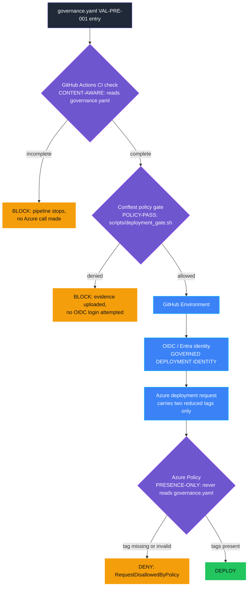

<p align="center">
  
</p>

# VAL-PRE-001 — Value hypothesis missing

> **Status:** Validated
>
> **Last reviewed:** 2026-09-18

## Table of contents

* [Overview](#overview)
* [Demo profile](#demo-profile)
* [Demo scope](#demo-scope)
* [Control contract](#control-contract)
* [Control objective](#control-objective)
* [Logical design](#logical-design)
* [Demo infrastructure setup (simplified)](#demo-infrastructure-setup-simplified)
* [Implementation](#implementation)
* [Demo](#demo)
* [Evidence and observability](#evidence-and-observability)
* [Security and privacy](#security-and-privacy)
* [Validation](#validation)
* [Cleanup](#cleanup)
* [References](#references)

## Overview

A team launches an AI agent, but nobody can say what business outcome it is
supposed to move, or by how much. Months later nobody can answer "is this
thing working?" because there was never a target to compare against. Agent
ideas without a value hypothesis stay in dev.

This control requires a `VAL-PRE-001` control entry in the agent's Forged
with Foundry governance contract (`.fwf/agents/<agent-id>/governance.yaml`
-- metric, numeric target + direction, baseline, owner, business case id;
see [`docs/governance-contract.md`](../../../docs/governance-contract.md))
and enforces it across three responsibilities: GitHub Actions checks it is
structurally *complete*, OIDC/Entra governs which trusted
repository/environment context may obtain the deployment identity, and Azure
Policy checks the required tags are *present* at the platform boundary.
**Validate the intent. Protect the identity. Enforce the platform.**

```yaml
controls:
  - id: VAL-PRE-001
    version: "1.0.0"
    evidence:
      owner: it-service-desk-manager@contoso.example
      businessCaseId: BIZ-CASE-HELPDESK-001
      expectedOutcome: Reduce Tier-1 tickets that need a human agent
      metric:
        name: tier1_ticket_deflection_rate
        direction: increase
        target: 35
      baseline:
        status: net_new
```

> **Governance before enforcement.** The value hypothesis should be agreed
> before the technical gate runs. An organisation should have an upstream
> intake or approval process where the business or workload team states the
> expected value, metric, target, and accountable owner — and where that
> hypothesis is reviewed and challenged before go-live. This demo assumes
> that process has happened and `governance.yaml` records the agreed result;
> the control only enforces structural completeness and the governed
> deployment path.

## Demo profile

| Property | Value |
|---|---|
| **Demo format** | `DEPLOYABLE_DEMO` |
| **Learning level** | Foundation |
| **Estimated time** | 15–20 minutes, including policy propagation |
| **Primary decision** | Deny a tagged go-live request when it lacks a structurally complete value hypothesis |
| **Primary capabilities** | Forged with Foundry governance contract (`.fwf/agents/<agent-id>/governance.yaml`) + shared schema validator; Conftest/Rego policy-pass gate (`scripts/deployment_gate.sh`); Azure Policy `deny` effect (deployed and validated); optional real GitHub Actions CI check + OIDC/Entra-authenticated CD deployment (see [Production hardening](#production-hardening)) |
| **Deployment** | Required for the core learning outcome |
| **Infrastructure** | One custom policy definition + one resource-group assignment; the optional extension adds one managed identity, one federated credential, one scoped role assignment |
| **AGT / ACS** | Not used: this is Azure resource admission, not an agent-runtime decision |
| **Model/Foundry role** | `Not used — not applicable to the core path` |

## Demo scope

### Core demo

Two validations against the same harmless Azure resource template, tagged as
an IT Helpdesk Tier-1 Triage Agent go-live request:
`fixtures/incomplete-workload/.fwf/agents/helpdesk-tier1-triage/governance.yaml`
(missing `owner`/`businessCaseId`) is denied;
`fixtures/complete-workload/.fwf/agents/helpdesk-tier1-triage/governance.yaml`
(structurally complete) validates. Both use `az deployment group validate`,
so no workload is created.

### Intentional simplifications

- Checks *structural* completeness only, not target realism, owner identity,
  or metric quality.
- One metric per hypothesis; tags stand in for a real intake system.
- The separate [Live KPI monitoring control](../VAL-001_kpi_underperformance/README.md)
  reads this target and owner, combines them with measured telemetry, and
  determines whether a value review is required. Passing this pre-live gate
  does not predict that runtime result.

### What this demo proves

- Azure Policy denies the demonstrated go-live request when the required
  tags are absent, and validates it once they are present.
- The optional CI check + CD deployment path (its original two stages: the
  CI check and the OIDC-authenticated Azure deployment) has itself been run
  live, end to end, against a real GitHub repository and Azure subscription.
  The newer Conftest policy-pass gate step added to that same CD job has
  been verified locally, reproducing the exact command the workflow runs
  against the real `fixtures/complete-workload` fixture, but has not yet
  been re-run live through GitHub Actions with real Azure credentials in
  this session -- see
  [docs/OIDC-DEMO.md](docs/OIDC-DEMO.md) for what has and has not been
  re-validated live after that change.
- No model or custom policy engine participates in either decision.

### What this demo does not prove

- **Automated validation proves structural completeness, not strategic
  quality.** The shared schema validator proves the declaration exists and
  is structurally valid (named metric, numeric target, direction, baseline
  status, owner, business case id), and rejects an exact placeholder token
  (for example `TODO`, `TBD`, `N/A`) in `owner`, `businessCaseId`,
  `expectedOutcome`, or the metric name, and rejects any `version` other
  than the one currently implemented (`"1.0.0"`) — see
  [`tests/test_governance_contract_hardening.py`](../../../tests/test_governance_contract_hardening.py)
  for the tests proving this. It cannot judge whether the hypothesis is
  strategically credible or ambitious enough — that adequacy judgment
  belongs to the organisation's own governance intake and approval process,
  upstream of this control. `businessCaseId` is the traceability link to
  that process, not a substitute for it. This is **schema-valid**, one of
  three distinct guarantees this architecture makes; see
  [`docs/governance-contract.md`](../../../docs/governance-contract.md#where-enforcement-happens)
  for how it differs from **policy-pass** and **deployment-allowed**.
- That the named owner agreed to be accountable.
- That the agent later achieves the target (VAL-001's job, from a separate
  Live telemetry source). **A passing schema validation never proves the
  agent will create value.**
- **Azure Policy cannot distinguish genuine metadata from forged metadata.**
  A caller who supplies trusted-looking tags without ever running the
  validator gets the same platform decision as one who did; only the
  governed CD deployment identity narrows who can plausibly make that call.

## Control contract

| Field | Value |
|---|---|
| **ID** | VAL-PRE-001 |
| **Lifecycle phase** | Pre-Live |
| **Category / domain** | Value |
| **Control / signal** | Value hypothesis missing |
| **Evidence / source** | The agent's Forged with Foundry governance contract, reduced to two deployment tags |
| **Trigger / threshold** | No measurable business hypothesis |
| **Action / gate effect** | Block approval to proceed |
| **Accountable role** | Business Owner |

## Control objective

Deny the demonstrated go-live request when it lacks a structurally complete
value hypothesis. The decision is deterministic and belongs to Azure Policy.
Whether the hypothesis is a *good* one, and genuine Business Owner sign-off,
remain explicit upstream trust boundaries rather than hidden model decisions.

## Logical design



Four distinct responsibilities, never merged: GitHub Actions validates the
*intent* (does the governance contract structurally declare a measurable
hypothesis? -- **schema-valid**); the Conftest policy gate confirms
*coverage* (does the expected agent have every control the protected
`val-pre-001-only` profile requires? -- **policy-pass**, and it runs before
any OIDC login is attempted); OIDC/Entra protects the *identity* (may this
trusted repository/environment context obtain the deployment identity?);
Azure Policy enforces the *platform* (are the two required tags present on
the request? -- **deployment-allowed**). Azure Policy never reads
`governance.yaml` and cannot prove the CI check or the policy gate ran —
see What this demo does not prove, above, and
[docs/governance-contract.md](../../../docs/governance-contract.md#where-enforcement-happens)
for how these three terms differ.

## Demo infrastructure setup (simplified)

The diagram above already shows every building block this control uses; this
section names the two pieces that run at different times. Bicep provisions
the policy definition and resource-group assignment once, ahead of any demo
run (`infra/deploy.sh`); the Azure CLI then calls `az deployment group
validate` (core demo) or `az deployment group create` (optional CD path) on
every run afterward, against whichever policy state Bicep left in place.
Azure Resource Manager is the only authoritative decision point in both
paths.

## Implementation

### Components

| Component | Responsibility | Location |
|---|---|---|
| Governance contract fixtures | Structured value hypothesis, one complete-workload and one incomplete-workload | [fixtures/](fixtures/) |
| Shared schema validator | Reduces the governance contract to the two tags Azure Policy checks | [../../../scripts/validate_governance_contract.py](../../../scripts/validate_governance_contract.py), schema: [../../../schemas/governance-contract/v1alpha1/controls/VAL-PRE-001.schema.json](../../../schemas/governance-contract/v1alpha1/controls/VAL-PRE-001.schema.json) |
| Azure Policy definition + assignment | Expresses and scopes the authoritative `deny` rule | [infra/policy-definition.bicep](infra/policy-definition.bicep), [infra/main.bicep](infra/main.bicep) |
| Demo runner | Runs the assessment then both validations, printing evidence | [demo.sh](demo.sh) |
| OIDC identity (optional) | Managed identity + federated credential for the real CD extension | [infra/oidc-identity.bicep](infra/oidc-identity.bicep) |
| Conftest policy gate (optional) | Evaluates the protected `val-pre-001-only` manifest/profile against this workload before any deployment step runs; uploads its evidence artifact | [../../../scripts/deployment_gate.sh](../../../scripts/deployment_gate.sh), manifest: [../../../examples/deployment-manifests/val-pre-001-only.yaml](../../../examples/deployment-manifests/val-pre-001-only.yaml) |
| Real CI check + policy gate + CD deploy (optional) | Runs all three stages for real via GitHub OIDC | [.github/workflows/val-pre-001-value-gate-demo.yml](../../../.github/workflows/val-pre-001-value-gate-demo.yml) |

Full component table, decision rules, and best-practice rationale:
[docs/IMPLEMENTATION.md](docs/IMPLEMENTATION.md). Architecture-wide reference
for the governance contract itself: [docs/governance-contract.md](../../../docs/governance-contract.md).

### Decision rules

The shared validator's JSON Schema marks this control's evidence `complete`
only when `metric.name`, `metric.target` (numeric), `metric.direction`
(`increase`/`decrease`), `baseline.status` (`measured`/`net_new`), `owner`,
`businessCaseId`, and `expectedOutcome` are all present and non-blank;
otherwise `incomplete`. Azure Policy denies whenever
`valueHypothesisStatus != complete` or `businessCaseId` is empty, reading
only those two tags. Full rules and edge cases:
[docs/IMPLEMENTATION.md](docs/IMPLEMENTATION.md#decision-rules).

### Production hardening

The optional real path (real CI check job, then a Conftest policy gate that
must pass before an OIDC login is even attempted, then the OIDC-authenticated
CD deployment step -- `needs:`-dependent so the CD job never runs if the CI
check fails) is verified live end to end, including a deliberate bypass
scenario (in a separate job that never runs either gate) proving Azure Policy
alone still denies a request that skipped both of them. Setup,
screenshots, the identity trust diagram, the current GitHub OIDC subject
format, and GitHub Environment protection-rule hardening (required
reviewers, branch restrictions) that this demo intentionally leaves as
manual, documented steps: [docs/OIDC-DEMO.md](docs/OIDC-DEMO.md).

## Demo

### Prerequisites

- Azure CLI authenticated (`az login`); Python 3 with `pip install -r requirements.txt`.
- An Azure resource group, with permission to validate a deployment and
  create a policy assignment (subscription-scope for the definition, e.g.
  **Resource Policy Contributor**).

### Deploy

```bash
cp controls/value_adoption_and_finops/VAL-PRE-001_value_hypothesis_missing/.env.example \
  controls/value_adoption_and_finops/VAL-PRE-001_value_hypothesis_missing/.env
# set AZURE_SUBSCRIPTION_ID and AZURE_RESOURCE_GROUP in the copied file
./controls/value_adoption_and_finops/VAL-PRE-001_value_hypothesis_missing/infra/deploy.sh
```

Azure Policy assignments can take several minutes to propagate.

### Inspect in Azure

| What to inspect | Azure Portal path | What to verify |
|---|---|---|
| Policy definition | **Policy** → **Definitions** → `val-pre-001-value-hypothesis-gate` | Effect is `deny`; requires `valueHypothesisStatus=complete` and a non-empty `businessCaseId`. |
| Policy assignment | **Policy** → **Assignments** → resource group | Scoped only to the chosen demo resource group. |

### Run

```bash
./controls/value_adoption_and_finops/VAL-PRE-001_value_hypothesis_missing/demo.sh
```

### Demo walkthrough

Captured terminal output from actually running the command above against the
live deployed policy:

```text
1/2 Assessing a workload with an incomplete value hypothesis...
Validating a go-live request with valueHypothesisStatus=incomplete...
BLOCKED as expected by Azure Policy.
2/2 Assessing a workload with a complete, measurable value hypothesis...
Validating the same request with valueHypothesisStatus=complete...
VALIDATED as expected by Azure Policy.
{
  "control_id": "VAL-PRE-001",
  "policy_version": "2.0.0",
  "incomplete_hypothesis_result": "denied",
  "complete_hypothesis_result": "validated",
  "resource_created": false,
  "action": "block go-live until a measurable value hypothesis is present",
  "accountable_role": "Business Owner"
}
```

### Expected scenarios

| Input | Expected decision |
|---|---|
| `fixtures/incomplete-workload/.fwf/agents/helpdesk-tier1-triage/governance.yaml` | Deny (`RequestDisallowedByPolicy`) |
| `fixtures/complete-workload/.fwf/agents/helpdesk-tier1-triage/governance.yaml` | Validate |

## Evidence and observability

The terminal record contains the control and policy version, both
authoritative Azure results, a UTC timestamp, the action, and accountable
role — no real business case, personal data, prompt, or model output. The
optional GitHub Actions extension produces the same class of evidence as a
real workflow run: three green job results, inspectable in the Actions tab.

## Security and privacy

- Azure CLI/OIDC authentication only; no credentials stored in the control.
- Only synthetic, non-personal tags are sent to Azure.
- The optional CD identity holds only **Monitoring Contributor** on the demo
  resource group, never `Contributor`. Detail: [docs/IMPLEMENTATION.md](docs/IMPLEMENTATION.md#best-practice-choices).

## Validation

### Automated tests

`validate.sh` compiles all Bicep templates, checks the shell scripts, and
runs the shared governance-contract validator against both fixtures
(`--enforce` pass/fail). Boundary-case coverage (blank/missing/non-numeric
fields, invalid direction/baseline, unexpected extra fields) lives in the
repository-root test suite:
[tests/test_val_pre_001_governance_contract.py](../../../tests/test_val_pre_001_governance_contract.py)
and
[tests/test_governance_contract_consistency.py](../../../tests/test_governance_contract_consistency.py).

```bash
./controls/value_adoption_and_finops/VAL-PRE-001_value_hypothesis_missing/validate.sh
.venv/bin/python -m pytest tests/test_val_pre_001_governance_contract.py tests/test_governance_contract_consistency.py -q
```

### Known limitations

Target realism, multi-metric hypotheses, and governance-contract revision
history are out of scope; the optional GitHub Environment has no deployment
protection rules configured by default. Full list:
[docs/IMPLEMENTATION.md](docs/IMPLEMENTATION.md#known-limitations-detail).

## Cleanup

```bash
./controls/value_adoption_and_finops/VAL-PRE-001_value_hypothesis_missing/infra/cleanup.sh
# if you ran the optional CI check + CD deploy demo:
./controls/value_adoption_and_finops/VAL-PRE-001_value_hypothesis_missing/infra/cleanup-oidc.sh
```

Neither script deletes the resource group or shared infrastructure.

## References

- [Deep dive: implementation detail](docs/IMPLEMENTATION.md)
- [Deep dive: real CI check + CD deployment demo (OIDC)](docs/OIDC-DEMO.md)
- [Forged with Foundry Agent Governance Contract](../../../docs/governance-contract.md)
- [Glossary](../../../docs/glossary.md)
- [Azure Policy `deny` effect](https://learn.microsoft.com/en-us/azure/governance/policy/concepts/effect-deny)
- [Configure Microsoft Entra Workload ID federation for GitHub Actions](https://learn.microsoft.com/en-us/entra/workload-id/workload-identity-federation-create-trust-github)
- [GitHub Actions: using environments for deployment](https://docs.github.com/en/actions/deployment/targeting-different-environments/using-environments-for-deployment)
- `controls/privacy/PRI-PRE-001_dpia_required_but_missing` — the reused
  enforcement pattern this control adapts.
- [../ARCHITECTURE.md](../ARCHITECTURE.md) — cross-control data flow.


---

<p align="center">
  
</p>
