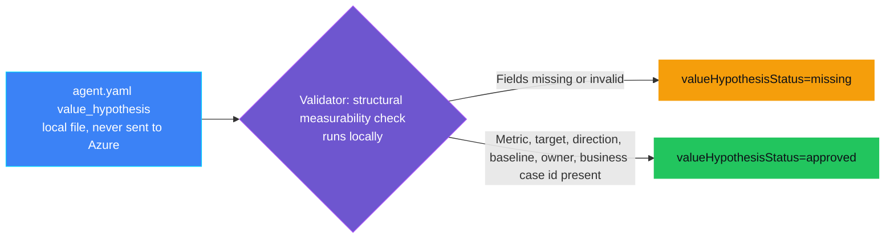
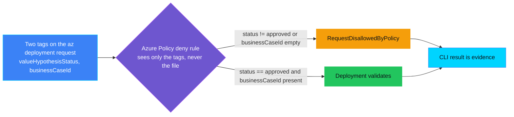
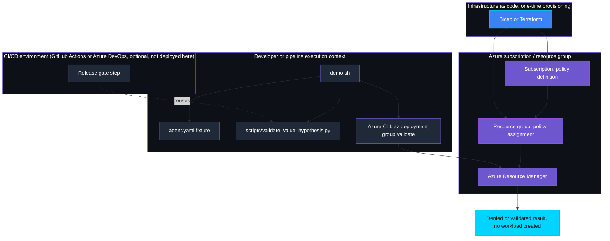
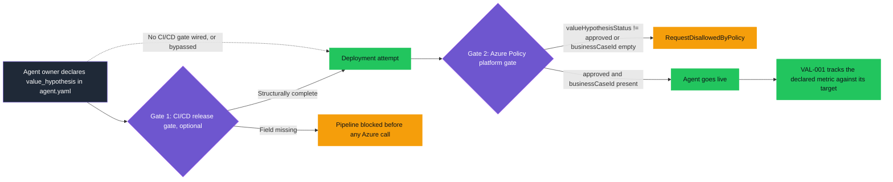

<p align="center">
  
</p>

# VAL-PRE-001 — Value hypothesis missing

> **Status:** Validated
>
> **Last reviewed:** 2026-09-18

## Overview

A team wants to launch an AI agent, but nobody can say what business outcome
it is actually supposed to move, or by how much. Six months later, someone
asks "is this thing working?" and there is no target to compare against, no
baseline to measure from, and no owner accountable for the answer. The
initiative quietly becomes unmeasurable, and any later problem review has
nothing concrete to check.

Every value hypothesis in this category lives in one place: the agent's
**`agent.yaml`**, in a `value_hypothesis` block with a named metric, a
numeric target with a direction, a baseline status, a named owner, and a
business case identifier. `agent.yaml` is designed to sit behind two gates
across the lifecycle, and the two work independently of each other:

- A **CI/CD release gate** (a documented GitHub Actions or Azure DevOps
  pattern, see Implementation, also runnable for real through an optional
  GitHub Actions + Microsoft Entra Workload Identity Federation workflow,
  verified live end to end) can parse the full `agent.yaml` structure before
  any deployment is attempted, giving the fastest feedback.
- An **Azure Policy `deny` assignment**, the gate this demo deploys and
  validates, evaluates the same fact at deployment time regardless of
  whether a CI/CD pipeline exists at all. Azure Policy cannot reason over
  nested YAML, only flat resource tags, so a small validator script reduces
  `agent.yaml` to the two tags policy checks. A team with no CI/CD release
  gate wired up, or one that bypasses it with a manual `az deployment` call,
  is still covered: Azure Policy denies the request from the tags alone,
  using only Azure-native capability.

This demo runs the Azure Policy path end to end: a go-live request built
from an incomplete `agent.yaml` is denied, and the same request built from a
complete `agent.yaml` validates. Both paths use `az deployment group
validate`, so no demo workload is created. Declaring the hypothesis once in
`agent.yaml` also seeds the mechanism the category's Live controls use
later: `VAL-001_kpi_underperformance` reads the same `metric` and `target`
fields to know what to track once the agent is running, so nothing needs to
be redeclared for value tracking to work.

The running example used throughout this category's demos is an **IT
Helpdesk Tier-1 Triage Agent** that auto-resolves password reset, account
unlock, and standard software install tickets.

> **`agent.yaml` declares the hypothesis; Azure Policy enforces it
> independently. The first request is denied; the remediated request
> validates.**

## Demo profile

| Property | Value |
|---|---|
| **Demo format** | `DEPLOYABLE_DEMO` |
| **Learning level** | Foundation |
| **Estimated time** | 15–20 minutes, including policy propagation |
| **Primary decision** | Deny a tagged go-live request when it lacks a structurally measurable value hypothesis |
| **Primary capabilities** | `agent.yaml`'s `value_hypothesis` block and its validator script, the shared source of truth both gates read; Azure Policy's `deny` effect (deployed and validated), which enforces the reduced tags independently of any CI/CD pipeline; the same validator also backs a real, optional GitHub Actions workflow authenticating to Azure via Microsoft Entra Workload Identity Federation (OIDC), demonstrating both gates end to end (see Optional: run the real CI/CD + OIDC gate demo) |
| **Deployment** | Required for the core learning outcome |
| **Infrastructure** | One custom policy definition and one resource-group-scoped assignment |
| **AGT / ACS** | Not used: this is Azure resource admission, not an agent-runtime decision |
| **Model/Foundry role** | `Not used — not applicable to the core path` |

## Demo scope

### Core demo

The core demo runs two validations against the same harmless Azure Action
Group template, tagged as an IT Helpdesk Tier-1 Triage Agent go-live request.
Each scenario starts from an `agent.yaml` fixture, assessed by
`scripts/validate_value_hypothesis.py`, whose output becomes the two tags
Azure Policy checks:

1. `fixtures/agent.incomplete.yaml`, missing `owner` and `business_case_id`:
   the validator reports `valueHypothesisStatus=missing`, and Azure Policy
   returns `RequestDisallowedByPolicy`.
2. `fixtures/agent.yaml`, with `metric`, `target.value`, `target.direction`
   (`increase`/`decrease`), `baseline.status` (`measured`/`net_new`),
   `owner`, and `business_case_id` all present: the validator reports
   `valueHypothesisStatus=approved`, and Azure validates the deployment.

### Intentional simplifications

- The demo checks that a hypothesis is *structurally* measurable (a named
  metric, target, direction, baseline status, owner, and business case id).
  It does not check whether the target is realistic, whether the named owner
  is a real person, or whether the metric is well-chosen.
- The demo carries only one metric per hypothesis. Real agents often track a
  primary business KPI alongside secondary metrics; this is a documented
  simplification, not a solved general case.
- Tags stand in for an authoritative business-case or intake system.
- The placeholder is validated only; it is never deployed.
- The Live counterpart of this hypothesis — the agent actually reporting
  measured values back against the same metric name — is a separate,
  not-yet-built telemetry stream (see Further exploration); this control
  covers only the Pre-Live declaration.

### What this demo proves

- A Microsoft-native policy can technically deny the demonstrated go-live
  request when a structurally measurable value hypothesis is absent.
- Remediating the exact request with a complete hypothesis changes the
  authoritative Azure result from denied to validated.
- No model or custom policy engine participates in the decision.

### What this demo does not prove

It does not prove that the hypothesis is a *good* one, that the target is
achievable, that the named owner has agreed to be accountable, or that every
organizational deployment supplies the trigger tags. It does not measure
whether the agent later achieves the target — that is VAL-001's job, reading
the same metric name from a separate Live telemetry source. The core demo
above does not execute the CI/CD release-gate pattern described in
Implementation and Overview by default; that requires the separate, optional
GitHub Actions + OIDC path (see Optional: run the real CI/CD + OIDC gate
demo), which is not part of this control's core, always-required learning
outcome, even though that optional path has itself been run live end to end
against a real GitHub repository and Azure subscription, not just described.

## Control contract

| Field | Value |
|---|---|
| **ID** | VAL-PRE-001 |
| **Lifecycle phase** | Pre-Live |
| **Category / domain** | Value |
| **Control / signal** | Value hypothesis missing |
| **Evidence / source** | `agent.yaml`'s `value_hypothesis` block, reduced to two deployment tags |
| **Trigger / threshold** | No measurable business hypothesis |
| **Action / gate effect** | Block approval to proceed |
| **Accountable role** | Business Owner |

## Control objective

Deny the demonstrated go-live request when it lacks a structurally measurable
value hypothesis. The decision is deterministic and belongs to Azure Policy.
Whether the hypothesis is a *good* one, and genuine Business Owner sign-off,
remain explicit upstream trust boundaries rather than hidden model decisions.

## Logical design

This control has two logically separate stages that run in different
places, on different sides of a hard boundary. They are shown as two
diagrams, not one, so neither implies that Azure ever touches `agent.yaml`.

### Stage 1: local assessment (agent.yaml to tags)



`scripts/validate_value_hypothesis.py` runs entirely on the machine or
pipeline calling it. It reads `agent.yaml`'s `value_hypothesis` block and
checks that `metric`, `target.value`, `target.direction`
(`increase`/`decrease`), `baseline.status` (`measured`/`net_new`), `owner`,
and `business_case_id` are all present and valid. It never enforces
anything; it only reduces that assessment to two tag values,
`valueHypothesisStatus` and `businessCaseId`. Only those two values cross
into the next stage, which `demo.sh` does by attaching them as tags on the
go-live request before calling Azure.

### Stage 2: platform enforcement (Azure Policy on the tagged request)



Azure never reads `agent.yaml`. Azure Policy has no access to source
repository files at all; it can only evaluate properties already present on
the resource it is asked to validate or deploy, such as tags. It evaluates
only `valueHypothesisStatus` and `businessCaseId` on the tagged request, the
same two-tag shape `PRI-PRE-001` uses for its own DPIA gate, so the tag
surface stays fixed as VAL-PRE-002/003/004 extend the same `agent.yaml`.

## Infrastructure architecture



The CI/CD environment is shown only to place this control's role in a larger
pipeline; the core demo (`demo.sh`/`infra/deploy.sh`) never provisions or
runs one, though a real, optional, manually-triggered workflow exists at
`.github/workflows/val-pre-001-value-gate-demo.yml` for readers who want to
exercise Gate 1 for real (see Optional: run the real CI/CD + OIDC gate
demo). Two Azure-facing building blocks are shown separately because they
run at different times and use different tooling: Bicep (this control's actual IaC choice, though Terraform
would work the same way) provisions the policy definition and assignment
once, ahead of any demo run; the Azure CLI then calls `az deployment group
validate` on every demo run afterward, using whichever policy state Bicep
left in place. Everything else in the diagram is real: `demo.sh` and the
fixture and validator run wherever the operator invokes them, and Azure
Resource Manager is the only authoritative decision point.

## Implementation

### Components

| Component | Responsibility | Location |
|---|---|---|
| `agent.yaml` fixture | Authoritative, structured value hypothesis for the helpdesk agent example | [fixtures/agent.yaml](fixtures/agent.yaml), [fixtures/agent.incomplete.yaml](fixtures/agent.incomplete.yaml) |
| Configuration assessment | Reduces `agent.yaml` to the two tags Azure Policy checks | [scripts/validate_value_hypothesis.py](scripts/validate_value_hypothesis.py) |
| Azure Policy definition | Expresses the authoritative `deny` rule on those two tags | [infra/policy-definition.bicep](infra/policy-definition.bicep) |
| Policy assignment | Limits the demo policy to one resource group | [infra/main.bicep](infra/main.bicep) |
| Validation target | Applies the assessed tags to a harmless resource for validation | [infra/demo-target.bicep](infra/demo-target.bicep) |
| Demo runner | Runs the assessment then both validations, printing evidence | [demo.sh](demo.sh) |

### Decision rules

- The configuration assessment denies structural measurability unless
  `metric` is non-empty, `target.value` is non-empty,
  `target.direction` is `increase` or `decrease`, `baseline.status` is
  `measured` or `net_new`, `owner` is non-empty, and `business_case_id` is
  non-empty. Its result becomes the `valueHypothesisStatus` tag
  (`approved`/`missing`) and the `businessCaseId` tag.
- The Azure Policy rule applies only when `goLiveRequested=true`. It denies
  when `valueHypothesisStatus` is not `approved`, or `businessCaseId` is
  missing or empty.
- The shell runner fails if Azure does not deny the first request or validate
  the second.

### Best-practice choices

The demo uses the supported Azure Policy engine directly, scopes its
assignment to one resource group, authenticates through the Azure CLI, stores
no secrets or PII, and validates rather than creates the placeholder
workload.

### CI/CD release gate: agent.yaml as a mandatory pipeline input

`agent.yaml` is not only a local fixture for this demo. Because it is a
single, static file checked into source control, any CI/CD platform, such as
a GitHub Actions workflow or an Azure DevOps pipeline, can treat it as a
mandatory element of an agent's definition: a release gate step runs before
deployment, parses and checks `agent.yaml`, and blocks the pipeline when a
required value is missing, so no agent reaches production without a
structurally measurable value hypothesis already recorded.

A minimal GitHub Actions step, for example:

```yaml
- name: Value hypothesis gate
  run: |
    result=$(python scripts/validate_value_hypothesis.py agent.yaml)
    echo "$result"
    status=$(echo "$result" | python -c "import json, sys; print(json.load(sys.stdin)['valueHypothesisStatus'])")
    [ "$status" = "approved" ]
```

An equivalent Azure DevOps pipeline task would run the same command in a
script step and check its result the same way.

This CI/CD gate and the Azure Policy deployment gate this control builds are
independent and complementary, not duplicative. The pipeline gate gives fast
feedback before any Azure call is made, and can check multiple Pre-Live
signals against the same file in one stage once VAL-PRE-002/003/004 exist
(see the Broader gate design section in `../ARCHITECTURE.md`). The Azure
Policy gate remains the final, authoritative check at deployment time, and
still denies a request that bypasses the pipeline entirely, such as a manual
`az deployment` call. By default `scripts/validate_value_hypothesis.py`
returns exit code 0 regardless of status, since it is a configuration
assessment for this local demo, not an enforcement point; a pipeline step
that reuses it as a release gate can either check the `valueHypothesisStatus`
value itself, as shown above, or pass `--enforce` to make the script itself
exit non-zero on a missing hypothesis, which is what the optional real
GitHub Actions workflow below does.

### Why AI/IT management gets two gates, not one

For an AI/IT management or platform governance audience, this control puts
one requirement (a structurally measurable value hypothesis) behind two
independent checkpoints on the path to production, so no single missed step
or bypassed pipeline lets an unmeasurable agent go live:

- **Gate 1, DevOps/CI/CD (documented pattern, example step shown below;
  entirely optional, and also runnable for real via
  `.github/workflows/val-pre-001-value-gate-demo.yml`, see Optional: run the
  real CI/CD + OIDC gate demo):** runs inside the team's own release
  pipeline, on every pull request or release build, before any Azure
  resource is touched. It gives the agent owner immediate feedback and keeps
  the cost of a missing hypothesis at "fix a YAML file," not "explain a
  blocked go-live to management."
- **Gate 2, the platform (deployed and validated by this demo):** Azure
  Policy evaluates the same underlying fact at deployment time, regardless of
  which pipeline, script, or person requested the deployment, and regardless
  of whether Gate 1 exists at all. It is the authoritative, fail-closed
  backstop: even a manual `az deployment` call that skips CI/CD entirely
  still gets denied.

The two gates do not depend on each other to function. A repository with no
CI/CD release gate wired up still gets a real decision from Azure Policy
alone, because policy reads the same two tags the validator always produces
from `agent.yaml`. Management does not have to trust that every team wired
up the pipeline gate correctly. The platform gate is the one that cannot be
quietly skipped, and the pipeline gate is the one that keeps that platform
gate from being a surprise late in the release process.



Gate 2 is the one this control's core demo always deploys and validates end
to end. Gate 1 is illustrative by default (the GitHub Actions step shown
above), but the optional path below runs both gates for real, including the
case where Gate 1 is deliberately bypassed, proving Gate 2 still denies the
request on its own.

### Optional: run the real CI/CD + OIDC gate demo

This extends the core demo with a real, manually triggered GitHub Actions
workflow authenticating to Azure through Microsoft Entra Workload Identity
Federation (OIDC, no client secret). It is not required for the core learning
outcome above, and is not part of `demo.sh` or `infra/deploy.sh`.

**What it adds beyond the core demo:** a real Gate 1 that reuses
`scripts/validate_value_hypothesis.py --enforce` (a real non-zero exit,
fixing the local-only exit-code limitation noted above), a real Gate 2
deployment (`az deployment group create`, not just `validate`) so Azure
Policy evaluates an actual request, and a third scenario proving Gate 2
still denies a request that skips Gate 1 entirely.

**Setup (one time, in addition to the core Deploy step):**

1. Deploy the OIDC identity:

   ```bash
   ./controls/value_adoption_and_finops/VAL-PRE-001_value_hypothesis_missing/infra/deploy-oidc.sh
   ```

   Set `VALPRE001_GITHUB_REPOSITORY` (e.g. `your-org/your-fork`) in the
   control's `.env` first; it defaults to this repository.
2. In the GitHub repository, create an **Environment** named `production`
   (Settings → Environments) and add the four Actions variables the script
   prints (`AZURE_CLIENT_ID`, `AZURE_TENANT_ID`, `AZURE_SUBSCRIPTION_ID`,
   `AZURE_RESOURCE_GROUP`).
3. Run the **"VAL-PRE-001: value hypothesis gate demo (optional, manual)"**
   workflow from the Actions tab (`workflow_dispatch`).

**Expected result:** the `gate-1-cicd-release-gate` job fails fast on the
incomplete fixture with no Azure call made; `gate-1-and-2-approved` passes
Gate 1, authenticates via OIDC, deploys the demo target for real, and
cleans it up; `gate-2-backstop-when-gate-1-bypassed` skips Gate 1 on
purpose and shows Azure Policy still returns `RequestDisallowedByPolicy`.
Verified live end to end (all three jobs green) against a standalone copy
of this workflow.

**Troubleshooting `AADSTS700213` ("No matching federated identity record
found")**: GitHub's OIDC token can present a subject in either
`repo:{owner}/{repo}:environment:{env}` or
`repo:{owner}@{owner_id}/{repo}@{repo_id}:environment:{env}` form (the
second, with immutable owner/repo IDs, was observed live on a repository in
this category). If login fails with this error, read the exact `subject`
value from the Azure AD error message in the failed `azure/login` step and
update the federated credential to match it precisely:

```bash
az identity federated-credential update \
  --name <credential-name> --identity-name id-val-pre-001-github-oidc \
  --resource-group "${AZURE_RESOURCE_GROUP}" \
  --issuer https://token.actions.githubusercontent.com \
  --subject "<exact subject from the error message>" \
  --audiences api://AzureADTokenExchange
```

**Cleanup:** remove the OIDC identity, federated credential, and role
assignment with:

```bash
./controls/value_adoption_and_finops/VAL-PRE-001_value_hypothesis_missing/infra/cleanup-oidc.sh
```

## Demo

### Prerequisites

- Azure CLI authenticated with `az login`.
- Python 3 with `pip install -r requirements.txt` (PyYAML, for the
  configuration assessment script).
- An existing Azure resource group in which you have permission to validate a
  deployment and create a policy assignment.
- Permission to create a custom policy definition at subscription scope, such
  as **Resource Policy Contributor**.

### Deploy

From the repository root:

```bash
cp controls/value_adoption_and_finops/VAL-PRE-001_value_hypothesis_missing/.env.example \
  controls/value_adoption_and_finops/VAL-PRE-001_value_hypothesis_missing/.env
```

Set `AZURE_SUBSCRIPTION_ID` and `AZURE_RESOURCE_GROUP` in the copied file. If
they already exist in `infra/.env`, the control reuses those values.

```bash
./controls/value_adoption_and_finops/VAL-PRE-001_value_hypothesis_missing/infra/deploy.sh
```

Azure Policy assignments can take several minutes to propagate.

### Inspect in Azure

| What to inspect | Azure Portal path | What to verify |
|---|---|---|
| Policy definition | **Policy** → **Definitions** → `val-pre-001-value-hypothesis-gate` | The effect is `deny`; the rule requires `valueHypothesisStatus=approved` and a non-empty `businessCaseId` for the demonstrated tagged request. |
| Policy assignment | **Policy** → **Assignments** → select the resource group | The assignment is scoped only to the chosen demo resource group. |
| Activity evidence | Resource group → **Activity log** | The blocked validation is attributed to the custom policy. No placeholder Action Group appears in the resource list. |

### Run or complete the exercise

```bash
./controls/value_adoption_and_finops/VAL-PRE-001_value_hypothesis_missing/demo.sh
```

### Demo walkthrough

Captured terminal output from actually running the command above against the
live deployed policy, proving the control was built and executed, not just
described:

```text
1/2 Assessing an agent.yaml with an incomplete value hypothesis...
Validating a go-live request with valueHypothesisStatus=missing...
BLOCKED as expected by Azure Policy.
2/2 Assessing an agent.yaml with a complete, measurable value hypothesis...
Validating the same request with valueHypothesisStatus=approved...
VALIDATED as expected by Azure Policy.
{
  "control_id": "VAL-PRE-001",
  "policy_definition": "val-pre-001-value-hypothesis-gate",
  "policy_version": "2.0.0",
  "missing_hypothesis_result": "denied",
  "missing_hypothesis_correlation": "val-pre-001-missing-hypothesis",
  "approved_hypothesis_result": "validated",
  "approved_hypothesis_correlation": "val-pre-001-approved-hypothesis",
  "verified_at": "2026-09-17T13:56:10Z",
  "resource_created": false,
  "action": "block go-live until a measurable value hypothesis is present",
  "accountable_role": "Business Owner"
}
```

The first assessment reads `fixtures/agent.incomplete.yaml` and Azure denies
the request; the second reads `fixtures/agent.yaml` and Azure validates it.
Both calls ran against `val-pre-001-value-hypothesis-gate`, the real policy
definition deployed to the shared resource group, with no resource created.

Expected output:

- `BLOCKED as expected` for the missing-hypothesis request;
- `VALIDATED as expected` for the complete-hypothesis request;
- a small JSON evidence record printed to the terminal.

The command fails if either result differs from the expectation. It never
uses `az deployment group create` for the placeholder workload.

### Expected scenarios

| Scenario | Input | Expected decision | Expected evidence |
|---|---|---|---|
| Missing hypothesis | `fixtures/agent.incomplete.yaml`, no owner or business case id | Deny | `RequestDisallowedByPolicy` |
| Complete hypothesis | `fixtures/agent.yaml`, metric/target/direction/baseline/owner/business case id all present | Validate | Successful Azure validation |
| Policy unavailable or not propagated | Azure cannot produce the expected deny | Fail the demo | Safe error; no success claim |

## Evidence and observability

The terminal record contains the control and policy version, both
authoritative Azure results, the deployment correlation names, a UTC
timestamp, the action, and accountable role. It contains no real business
case, personal data, prompt, or model output. The optional GitHub Actions
extension produces the same class of evidence as a real workflow run: three
green job results (Gate 1 block, Gate 1+2 approved with cleanup, Gate 2
backstop), inspectable in the Actions tab's run log for as long as the
workflow exists.

Example:

```json
{
  "control_id": "VAL-PRE-001",
  "policy_version": "2.0.0",
  "missing_hypothesis_result": "denied",
  "approved_hypothesis_result": "validated",
  "resource_created": false,
  "action": "block go-live until a measurable value hypothesis is present",
  "accountable_role": "Business Owner"
}
```

## Security and privacy

- Azure CLI authentication uses the current Entra identity; credentials are
  not stored in the control.
- Only synthetic, non-personal tags are sent to Azure.
- The policy assignment is resource-group scoped; creating the reusable
  custom definition still requires subscription-scope permission.
- Validation errors are inspected only for the authoritative Azure Policy
  error code, and a non-policy failure is surfaced rather than treated as a
  deny.
- The demo creates no workload or business-case record.
- The optional GitHub Actions demo authenticates with Microsoft Entra
  Workload Identity Federation (OIDC); no client secret is stored in GitHub.
  The federated identity is scoped to the `production` GitHub Environment
  and holds only the built-in **Monitoring Contributor** role on the demo
  resource group, not `Contributor`, matching the least-privilege
  role-per-resource pattern used by `controls/privacy/PRI-001`/`PRI-004`.

## Validation

### Automated tests

There is no pytest suite; the configuration assessment
(`scripts/validate_value_hypothesis.py`) is simple enough that `validate.sh`
runs it directly against both fixtures as its test, including the
`--enforce` flag (must pass on the complete fixture, must fail on the
incomplete one), and compiles `infra/oidc-identity.bicep` alongside the core
templates. The reproducible `demo.sh` walkthrough and its expected scenarios
above are the validation for the deterministic Azure Policy decision; the
optional GitHub Actions workflow is validated by its own live run (see
Optional: run the real CI/CD + OIDC gate demo).

### Manual checks

Run the local, read-only checks:

```bash
./controls/value_adoption_and_finops/VAL-PRE-001_value_hypothesis_missing/validate.sh
```

This compiles all three Bicep templates, checks the shell scripts, and runs
the configuration assessment script against both fixtures. The
deployed behavior is validated by running the core demo itself.

### Known limitations

- The demo does not evaluate whether the target value is realistic or
  achievable, only that one is present and structured correctly.
- Only one metric per hypothesis is supported; multi-metric agents are not
  represented.
- No revision history is tracked in `agent.yaml`; a re-baselined hypothesis
  simply overwrites its fields with no audit trail (see Further exploration).

## Cleanup

The core demo creates no workload, so it has no demo-resource cleanup. Remove
only this control's policy assignment and definition with:

```bash
./controls/value_adoption_and_finops/VAL-PRE-001_value_hypothesis_missing/infra/cleanup.sh
```

If you also ran the optional GitHub Actions + OIDC demo, remove that
identity separately (see Optional: run the real CI/CD + OIDC gate demo):

```bash
./controls/value_adoption_and_finops/VAL-PRE-001_value_hypothesis_missing/infra/cleanup-oidc.sh
```

Neither script deletes the resource group or shared infrastructure.

## Further exploration

- Connect the trigger metadata to a trusted intake/business-case system so
  teams cannot silently omit it.
- Build the Live telemetry stream (the agent emitting measured values against
  the same metric name declared in `agent.yaml`, via Application
  Insights/Log Analytics, reusing the pattern in `controls/privacy/PRI-003`/
  `PRI-004`) so `VAL-001_kpi_underperformance`, the designated value tracking
  and reporting control for this category, can compare actuals against this
  hypothesis's target. Without this control's hypothesis, VAL-001 has no
  target to track or report against.
- Add a revision-history field so a re-baselined hypothesis (VAL-002's
  "reassess hypothesis" action) is auditable rather than silently overwritten.
- Extend the schema to a named `productivity` vs `business_kpi` metric
  category once the Live telemetry stream is built.
- Extend the optional GitHub Actions gate to check VAL-PRE-002/003/004's
  validators too, once those controls exist, in one release-gate stage
  against the same `agent.yaml`; see the two-layer gate design in
  `../ARCHITECTURE.md`.

## References

- [Glossary](../../../docs/glossary.md)
- [Azure Policy `deny` effect](https://learn.microsoft.com/en-us/azure/governance/policy/concepts/effect-deny)
- [Azure Policy definition structure](https://learn.microsoft.com/en-us/azure/governance/policy/concepts/definition-structure-policy-rule)
- [Configure Microsoft Entra Workload ID federation for GitHub Actions](https://learn.microsoft.com/en-us/entra/workload-id/workload-identity-federation-create-trust-github)
- [`azure/login` GitHub Action](https://github.com/marketplace/actions/azure-login)
- `controls/privacy/PRI-PRE-001_dpia_required_but_missing` — the reused
  enforcement pattern this control adapts.
- [../ARCHITECTURE.md](../ARCHITECTURE.md) — the cross-control data flow this
  control's `agent.yaml` feeds into.
- [../VAL-001_kpi_underperformance/README.md](../VAL-001_kpi_underperformance/README.md)
  — the value tracking and reporting control that reads this control's
  hypothesis once it is implemented.

---

<p align="center">
  
</p>
