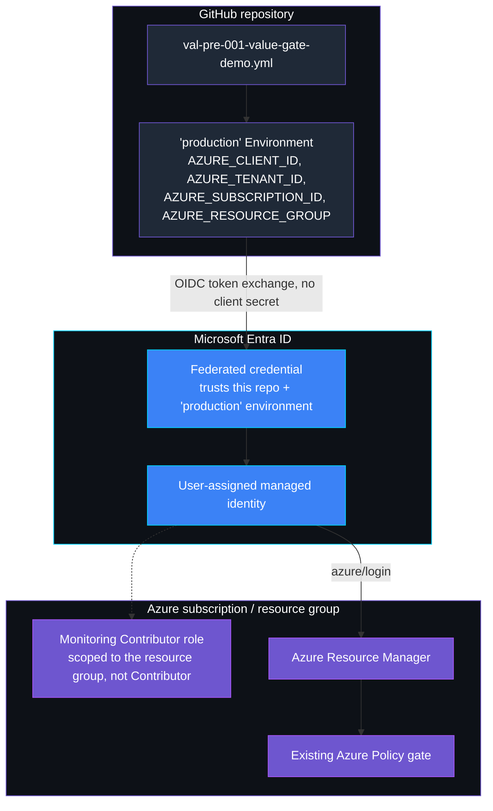
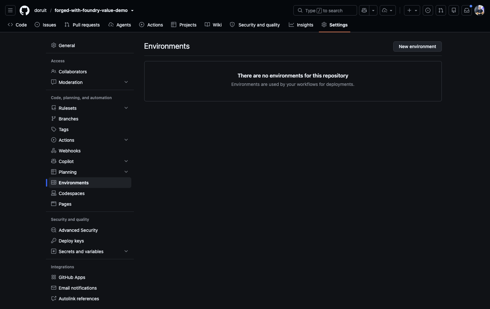
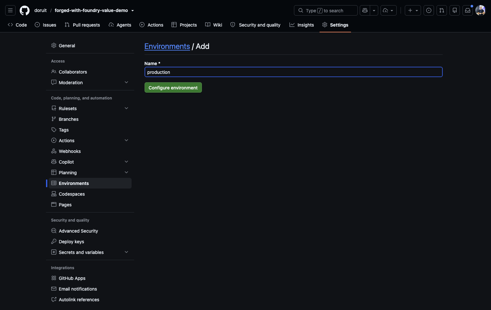
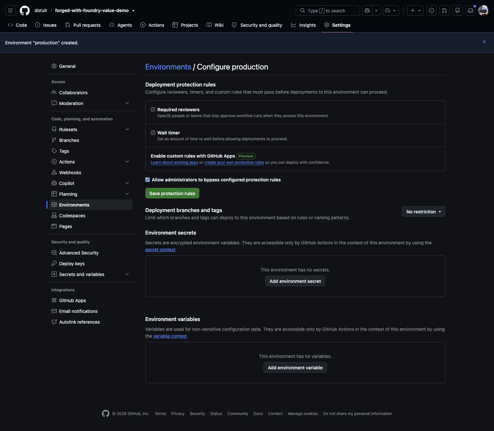
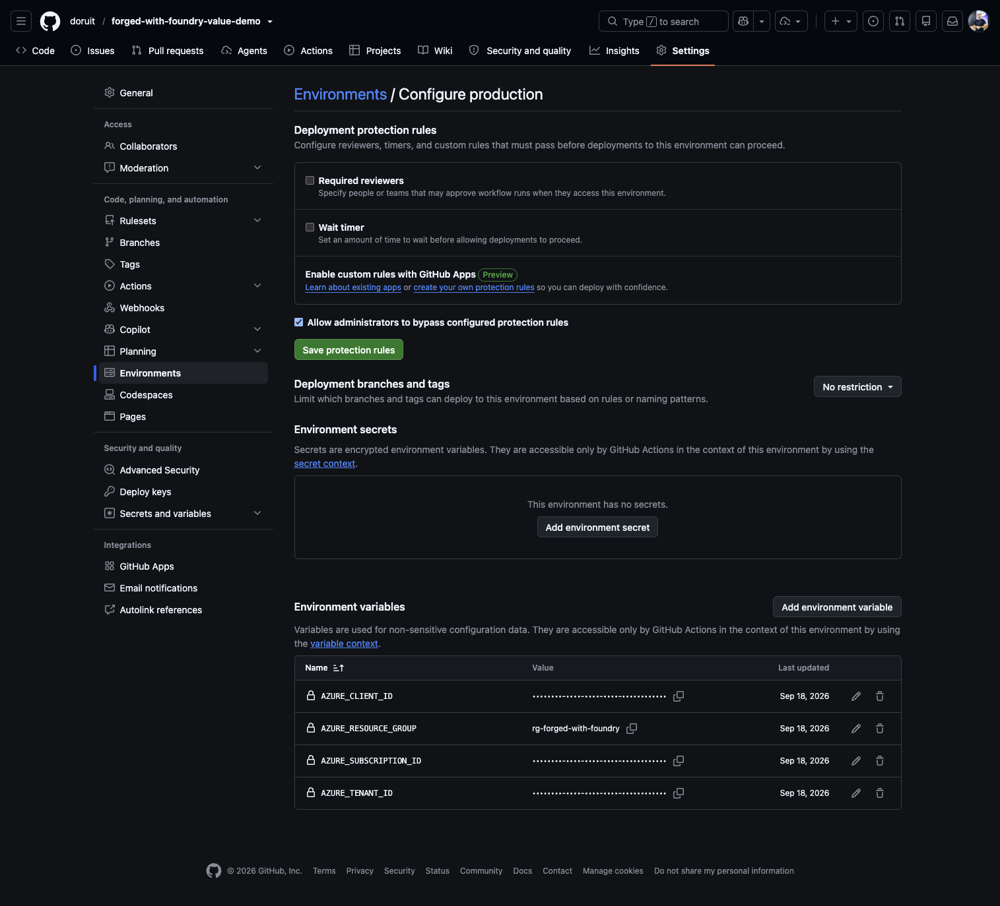
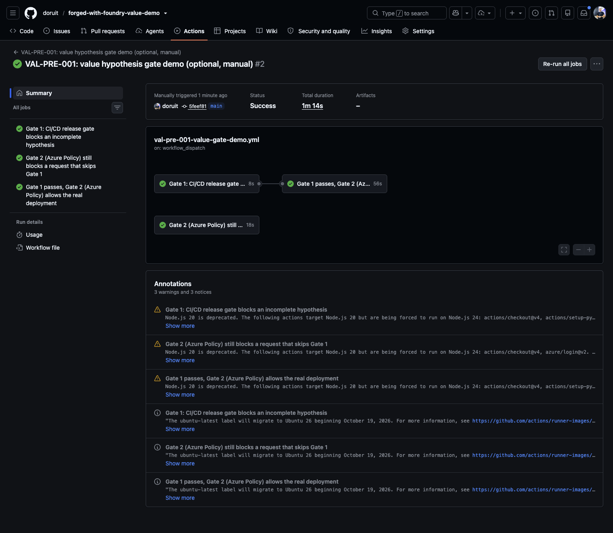

# VAL-PRE-001 — real CI check + CD deployment demo (OIDC)

Deep-dive companion to [`../README.md`](../README.md)'s "Production hardening"
section. This walks through the optional, real GitHub Actions extension:
setup, screenshots, the identity trust model, and troubleshooting.

## What it adds beyond the core demo

A real CI check that reuses `scripts/validate_governance_contract.py --enforce`,
a real CD deployment (`az deployment group create`, not just `validate`) so
Azure Policy evaluates an actual request, and a third scenario proving Azure
Policy still denies a request that skips the CI check entirely.

## Identity trust model



No Azure Policy resource is duplicated: `infra/oidc-identity.bicep` only adds
the identity, federated credential, and role assignment shown above; the
policy definition and assignment are the same ones `infra/deploy.sh` already
deployed for the core demo.

## Setup

1. Deploy the OIDC identity. `deploy-oidc.sh` derives GitHub's current OIDC
   subject automatically via `gh api` (the GitHub CLI, authenticated) and
   prints the exact subject it configured, so there is no need to
   deliberately fail `azure/login` once to read the subject from an error:

   ```bash
   ./controls/value_adoption_and_finops/VAL-PRE-001_value_hypothesis_missing/infra/deploy-oidc.sh
   ```

   Set `VALPRE001_GITHUB_REPOSITORY` (e.g. `your-org/your-fork`) in the
   control's `.env` first; it defaults to this repository. If `gh` is not
   available, set `VALPRE001_GITHUB_OIDC_SUBJECT` explicitly instead (see
   [Subject format](#subject-format) below); the script fails with a clear
   message rather than deploying a guessed value.
2. In the GitHub repository, create an **Environment** named `production`
   (Settings → Environments) and add the four Actions variables the script
   prints (`AZURE_CLIENT_ID`, `AZURE_TENANT_ID`, `AZURE_SUBSCRIPTION_ID`,
   `AZURE_RESOURCE_GROUP`).
3. Run the **"VAL-PRE-001: CI check + CD deployment gate demo"** workflow
   from the Actions tab (`workflow_dispatch`), or push a change under
   `fixtures/` or `scripts/` to trigger the CI check job automatically.

<details>
<summary>Full setup screenshot sequence</summary>

Settings → Environments starts empty. Select **New environment**:





Name it `production` to match the federated credential's subject, then
select **Configure environment**:



Add the four Actions variables the script printed:



The three GUID values (client ID, subscription ID, tenant ID) are masked in
this screenshot; only `AZURE_RESOURCE_GROUP` is a non-sensitive name. These
are **variables**, not secrets — no client secret exists anywhere, since the
identity authenticates through OIDC federation instead.

</details>

**Expected result:** the `ci-check` job fails fast on the incomplete fixture
with no Azure call made; `cd-deploy-gate-2-allowed` passes the CI check,
authenticates via OIDC, deploys the demo target for real, and cleans it up;
`cd-deploy-gate-2-backstop` skips the CI check on purpose and shows Azure
Policy still returns `RequestDisallowedByPolicy`. Verified live end to end
(all three jobs green) against a standalone copy of this workflow:



> **This screenshot predates the Conftest policy gate.** `cd-deploy-gate-2-allowed`
> now also runs `scripts/deployment_gate.sh` against the protected
> `val-pre-001-only` manifest before the OIDC login step, uploading its
> evidence artifact. That new step has been verified locally (reproducing
> the exact command against the real `fixtures/complete-workload` fixture)
> but has not yet been re-run live through GitHub Actions with real Azure
> credentials since it was added -- the screenshot above still accurately
> represents the CI-check-then-deploy path it was captured from, not the
> current job definition.

## Subject format

GitHub's OIDC token `sub` claim can present in either the legacy
`repo:{owner}/{repo}:environment:{environment}` form or the current
immutable `repo:{owner}@{ownerId}/{repo}@{repoId}:environment:{environment}`
form (the second, with numeric owner/repo IDs, was observed live on a
repository in this category). `deploy-oidc.sh` derives the immutable form by
default via `gh api repos/{owner}/{repo}`. If you must set it by hand
(`VALPRE001_GITHUB_OIDC_SUBJECT`), read the exact `subject` value GitHub
presents from a failed `azure/login` step's `AADSTS700213` error, or from
`gh api repos/{owner}/{repo} --jq '{owner: .owner.login, ownerId: .owner.id, repo: .name, repoId: .id}'`,
and update the federated credential to match it precisely:

```bash
az identity federated-credential update \
  --name github-production --identity-name id-val-pre-001-github-oidc \
  --resource-group "${AZURE_RESOURCE_GROUP}" \
  --issuer https://token.actions.githubusercontent.com \
  --subject "<exact subject>" \
  --audiences api://AzureADTokenExchange
```

## Demo setup vs. production hardening

This demo configures **identity binding** only: the federated credential
scopes which repository and Environment name may authenticate as this
managed identity. It does not configure GitHub's separate **Environment
protection rules**. The `production` Environment created above has no
required reviewers, no wait timer, and no deployment branch restriction — the
name is a label the subject string matches, not a guarantee of
production-grade change control.

For an organization's real production identity, additionally configure (in
Settings → Environments → production → Deployment protection rules):

- required reviewers before a deployment job can use the environment;
- a deployment branch/tag restriction (e.g. only `main` or release tags);
- a wait timer, if your organization requires a cool-down before deploy;
- no admin bypass, if your organization's policy requires that.

These are manual GitHub configuration steps this repository's own IaC cannot
provision; keeping the demo runnable without them is intentional so the
bite-sized demo stays easy to reproduce.

## Cleanup

```bash
./controls/value_adoption_and_finops/VAL-PRE-001_value_hypothesis_missing/infra/cleanup-oidc.sh
```

Removes the OIDC identity, federated credential, and role assignment. It does
not delete the GitHub Environment or its Actions variables; remove those in
GitHub Settings if desired.
