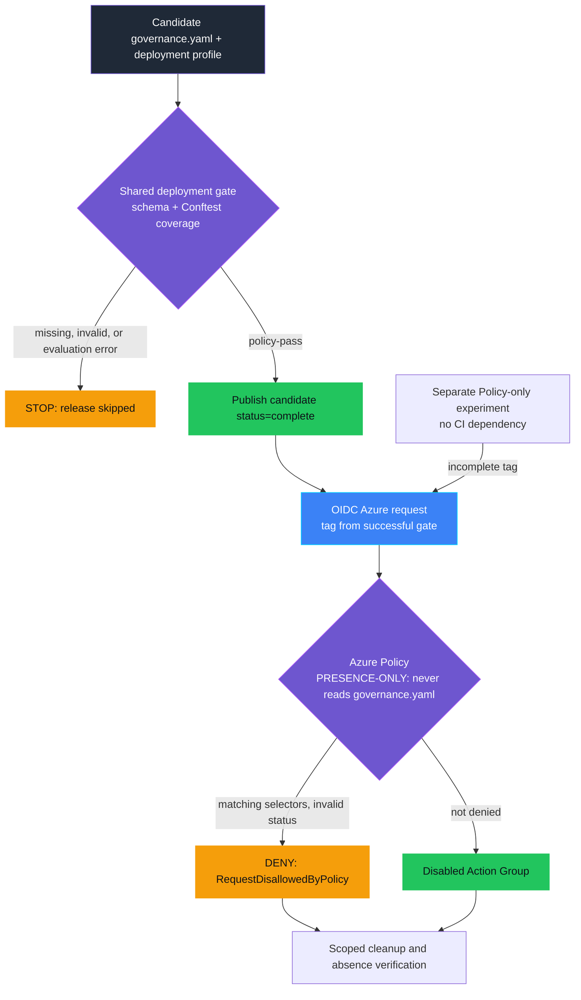

<p align="center">
  
</p>

# VAL-PRE-002 — KPI baseline missing

> **Status:** Implemented
>
> **Last reviewed:** 2026-09-21
>
> CI and cleanup are locally tested. The earlier Azure validate-only path
> was validated live; the new GitHub/OIDC route awaits live validation.

## Table of contents

* [Overview](#overview)
* [Demo profile](#demo-profile)
* [Demo scope](#demo-scope)
* [Control contract](#control-contract)
* [Control objective](#control-objective)
* [Logical design](#logical-design)
* [Infrastructure architecture](#infrastructure-architecture)
* [Implementation](#implementation)
* [Demo](#demo)
* [Evidence and observability](#evidence-and-observability)
* [Security and privacy](#security-and-privacy)
* [Validation](#validation)
* [Cleanup](#cleanup)
* [References](#references)

## Overview

A service team says it already measures its performance, but the starting
number was never recorded. Months later, nobody can tell
whether the agent moved the needle, because there is nothing concrete to
compare the measured outcome against. A baseline that exists only as a
label ("measured") is not a baseline.

This control requires that when a `VAL-PRE-002` entry in the agent's Forged
with Foundry governance contract (`.fwf/agents/<agent-id>/governance.yaml`,
see [`docs/governance-contract.md`](../../../docs/governance-contract.md))
claims its KPI baseline is `measured`, it also records an actual numeric
`value` and the `measuredDate` it was captured. A `net_new` baseline
(genuinely no prior history) needs neither field and is trivially complete.

```yaml
controls:
  - id: VAL-PRE-002
    version: "1.0.0"
    evidence:
      baseline:
        status: measured
        value: 28
        measuredDate: "2026-06-01"
```

> **Governance before enforcement.** The organisation should have an
> upstream process where the workload team actually measures and records
> the baseline before go-live, and where that measurement is reviewed. This
> demo assumes that process has happened and the governance contract
> records the agreed result; the control only enforces structural
> completeness at the platform boundary.

## Demo profile

| Property | Value |
|---|---|
| **Demo format** | `DEPLOYABLE_DEMO` |
| **Learning level** | Foundation |
| **Estimated time** | CI: 5 minutes; Azure/OIDC: 20-30 minutes including setup and propagation |
| **Primary decision** | Deny a tagged go-live request when it claims a measured KPI baseline with no recorded value or date |
| **Primary capabilities** | Shared schema validator, Conftest/OPA coverage policy, GitHub Actions job dependencies, Azure Policy `deny`, Entra OIDC |
| **Deployment** | None for CI-only; required for the Azure routes |
| **Infrastructure** | Azure routes: existing resource group, policy definition and assignment; OIDC release: federated identity and temporary disabled Action Group |
| **AGT / ACS** | Not used: this is Azure resource admission, not an agent-runtime decision |
| **Model/Foundry role** | `Not used — not applicable to the core path` |

## Demo scope

### Core demo

| Route | Executes | Guarantee |
|---|---|---|
| CI-only | Shared deployment gate over [candidate/](candidate/), profile `val-pre-002-only` | Schema-valid evidence and mandatory control coverage; failure prevents the dependent release job |
| Azure Policy-only | Independent, manually selected denial experiment | Matching ARM requests with missing/invalid status are denied, even without CI |
| Combined | Successful candidate gate, then OIDC-authenticated deployment using its output tag | Both checks apply to the demonstrated release path |

The [workflow](../../../.github/workflows/val-pre-002-baseline-gate-demo.yml)
keeps negative regression fixtures separate from the candidate decision.
Azure creates only an inactive Action Group without receivers, then verifies
its removal. The existing `demo.sh` validates both fixture requests without
creating any resource.

### Intentional simplifications

- Checks *structural* completeness only: that a claimed measured baseline
  records a number and a date. It does not check that the number is
  accurate or was measured with a sound method.
- Deliberately does not re-validate `metric`/`target`/`direction` — that
  stays [VAL-PRE-001](../VAL-PRE-001_value_hypothesis_missing/README.md)'s
  territory, even though the catalog's trigger text for this control
  ("No baseline or target before build") mentions both.
- The synthetic deployment candidate represents one disabled Action Group,
  not a production agent. CI-only needs neither an identity nor Azure.

### What this demo proves

- Azure Policy denies the demonstrated go-live request when a claimed
  measured baseline has no recorded value or date, and validates it once
  both are present.
- No model or custom policy engine participates in the decision.
- This control's evidence is fully self-contained: it validates correctly
  with no VAL-PRE-001 entry present in the same contract, so a workload can
  implement either control independently.
- Missing agents, contracts, required controls, invalid evidence and
  evaluation errors stop the candidate gate and withhold its deployment tag.
- `net_new` remains complete without a measured value or date.

### What this demo does not prove

- **Automated validation proves structural completeness, not measurement
  quality.** The shared schema validator proves a claimed measured baseline
  records a number and a calendar-valid date (not merely a `YYYY-MM-DD`-shaped
  string), rejects an exact placeholder token (for example `TODO`, `TBD`) in
  its evidence fields, and rejects any `version` other than the one
  currently implemented (`"1.0.0"`) — see
  [`tests/test_governance_contract_hardening.py`](../../../tests/test_governance_contract_hardening.py)
  for the tests proving this. It cannot verify the number is *accurate*, was
  measured with a sound method, or reflects the real historical baseline —
  that verification belongs to the organisation's own measurement and
  review process, upstream of this control. This is **schema-valid**, one
  of three distinct guarantees this architecture makes; see
  [`docs/governance-contract.md`](../../../docs/governance-contract.md#where-enforcement-happens)
  for how it differs from **policy-pass** and **deployment-allowed**.
- That the recorded baseline is a *good* comparison point for the agent's
  eventual measured outcome (VAL-001's job, from a separate Live telemetry
  source). **A passing schema validation never proves the agent will
  create value.**
- **Azure Policy cannot distinguish genuine metadata from forged metadata.**
  A caller who supplies a trusted-looking tag without ever running the
  validator gets the same platform decision as one who did.
- Missing `control-id=VAL-PRE-002` or `goLiveRequested=true` selectors put a
  request outside this Policy rule. Neither route universally protects agent
  publishing, alternate pipelines or data-plane APIs. Protect workflow,
  schema, profile, policy and deployment identity changes upstream.

## Control contract

| Field | Value |
|---|---|
| **ID** | VAL-PRE-002 |
| **Lifecycle phase** | Pre-Live |
| **Category / domain** | Value |
| **Control / signal** | KPI baseline missing |
| **Evidence / source** | The agent's Forged with Foundry governance contract, reduced to one deployment tag |
| **Trigger / threshold** | No baseline or target before build (this control: baseline value/date only) |
| **Action / gate effect** | Create baseline before approval |
| **Accountable role** | Business Owner |

## Control objective

Deny the demonstrated go-live request when it claims a measured KPI
baseline with no recorded value or date. CI deterministically enforces
evidence and coverage; Azure Policy independently enforces its tag rule.
Whether the recorded number is accurate remains an
explicit upstream trust boundary rather than a hidden model decision.

## Logical design



CI inspects the contract and expected-control coverage. Azure Policy only
reads request tags and cannot verify that CI ran. The independent experiment
is never a release authorization path.

## Infrastructure architecture

The diagram above already shows every building block this control uses.
Bicep provisions the policy definition and resource-group assignment once,
ahead of any demo run (`infra/deploy.sh`); the Azure CLI then calls
`az deployment group validate` on every run afterward, against whichever
policy state Bicep left in place. GitHub's credential-free candidate job is
separate from its environment-bound Azure jobs, which use Entra OIDC to call
ARM. CI and ARM each own their respective enforcement decision.

## Implementation

### Components

| Component | Responsibility | Location |
|---|---|---|
| Governance contract fixtures | Recorded baseline, one complete-workload and one incomplete-workload | [fixtures/](fixtures/) |
| Shared schema validator | Reduces the governance contract to the tag Azure Policy checks | [../../../scripts/validate_governance_contract.py](../../../scripts/validate_governance_contract.py), schema: [../../../schemas/governance-contract/v1alpha1/controls/VAL-PRE-002.schema.json](../../../schemas/governance-contract/v1alpha1/controls/VAL-PRE-002.schema.json) |
| Azure Policy definition + assignment | Expresses and scopes the authoritative `deny` rule | [infra/policy-definition.bicep](infra/policy-definition.bicep), [infra/main.bicep](infra/main.bicep) |
| Demo runner | Runs the assessment then both validations, printing evidence | [demo.sh](demo.sh) |
| Candidate release workflow | Gates the checked-out candidate before OIDC release, with an independent denial experiment | [workflow](../../../.github/workflows/val-pre-002-baseline-gate-demo.yml) |
| Azure runner | Real deployment, exact denial check and run-scoped cleanup | [azure-demo.sh](azure-demo.sh) |
| Boundary-case + consistency tests | Field-level coverage for this control's schema | [../../../tests/test_val_pre_002_governance_contract.py](../../../tests/test_val_pre_002_governance_contract.py), [../../../tests/test_governance_contract_consistency.py](../../../tests/test_governance_contract_consistency.py) |

Architecture-wide reference for the governance contract itself:
[docs/governance-contract.md](../../../docs/governance-contract.md).

### Decision rules

The shared validator's JSON Schema marks this control's evidence `complete`
when `baseline.status` is `net_new` (no value/date required), or
`measured` with both `baseline.value` (numeric) and `baseline.measuredDate`
(`YYYY-MM-DD`) present; otherwise `incomplete`. The deployment profile also
requires the expected agent and `VAL-PRE-002` entry. Azure Policy denies when
its two selector tags match and `kpiBaselineStatus != complete`.

## Demo

Start with the [three-route walkthrough](docs/DEPLOYMENT-DEMO.md) for
credential-free CI, OIDC setup, candidate failure tests and combined release.
The commands below retain the existing Azure validate-only route.

### Prerequisites

- Azure CLI authenticated (`az login`); Python 3 with
  `pip install -r requirements.txt`.
- An Azure resource group, with permission to validate a deployment and
  create a policy assignment (subscription-scope for the definition, e.g.
  **Resource Policy Contributor**).

### Deploy

```bash
cp controls/value_adoption_and_finops/VAL-PRE-002_kpi_baseline_missing/.env.example \
  controls/value_adoption_and_finops/VAL-PRE-002_kpi_baseline_missing/.env
# set AZURE_SUBSCRIPTION_ID and AZURE_RESOURCE_GROUP in the copied file
./controls/value_adoption_and_finops/VAL-PRE-002_kpi_baseline_missing/infra/deploy.sh
```

Azure Policy assignments can take several minutes to propagate.

### Inspect in Azure

| What to inspect | Azure Portal path | What to verify |
|---|---|---|
| Policy definition | **Policy** → **Definitions** → `val-pre-002-kpi-baseline-gate` | Effect is `deny`; requires `kpiBaselineStatus=complete`. |
| Policy assignment | **Policy** → **Assignments** → resource group | Scoped only to the chosen demo resource group. |
| OIDC identity | **Managed Identities** → chosen identity → **Federated credentials** | Exact repository/environment subject; no client secret. |
| Demo target | Resource group → **Activity log** | Run-named Action Group create/delete, or `RequestDisallowedByPolicy`; successful cleanup leaves no demo resource. |

### Run

```bash
./controls/value_adoption_and_finops/VAL-PRE-002_kpi_baseline_missing/demo.sh
```

### Demo walkthrough

Historical output captured on 2026-09-18 from the validate-only command
against the live policy, not proof of the new GitHub/OIDC workflow:

```text
1/2 Assessing a workload with a missing KPI baseline...
Validating a go-live request with kpiBaselineStatus=incomplete...
BLOCKED as expected by Azure Policy.
2/2 Assessing a workload with a recorded KPI baseline...
Validating the same request with kpiBaselineStatus=complete...
VALIDATED as expected by Azure Policy.
{
  "control_id": "VAL-PRE-002",
  "policy_version": "1.0.0",
  "incomplete_baseline_result": "denied",
  "complete_baseline_result": "validated",
  "resource_created": false,
  "action": "block go-live until a measured KPI baseline is recorded",
  "accountable_role": "Business Owner"
}
```

### Expected scenarios

| Input | Expected decision |
|---|---|
| `fixtures/incomplete-workload/.fwf/agents/helpdesk-tier1-triage/governance.yaml` | Deny (`RequestDisallowedByPolicy`) |
| `fixtures/complete-workload/.fwf/agents/helpdesk-tier1-triage/governance.yaml` | Validate |

## Evidence and observability

The terminal record contains the control and policy version, both
authoritative Azure results, a UTC timestamp, the action, and accountable
role — no real business case, personal data, prompt, or model output.

## Security and privacy

- Azure CLI authentication only; no credentials stored in the control.
- Only synthetic, non-personal tags are sent to Azure.

## Validation

### Automated tests

`validate.sh` compiles all Bicep templates, checks the shell scripts, and
runs the shared governance-contract validator against both fixtures
(`--enforce` pass/fail). Boundary-case coverage (missing value, missing
date, non-numeric value, malformed date, invalid status, self-containment
without a VAL-PRE-001 sibling) lives in the repository-root test suite:
[tests/test_val_pre_002_governance_contract.py](../../../tests/test_val_pre_002_governance_contract.py)
and
[tests/test_governance_contract_consistency.py](../../../tests/test_governance_contract_consistency.py).

```bash
./controls/value_adoption_and_finops/VAL-PRE-002_kpi_baseline_missing/validate.sh
.venv/bin/python -m pytest tests/test_val_pre_002_governance_contract.py tests/test_governance_contract_consistency.py -q
.venv/bin/python -m pytest controls/value_adoption_and_finops/VAL-PRE-002_kpi_baseline_missing/tests -q
```

### Known limitations

Target realism and measurement-method soundness are out of scope. Tests
exercise the actual workflow gate with real Conftest; Azure CLI simulation
tests denial recognition and cleanup but does not prove live OIDC/RBAC.
Current validation evidence and remaining live prerequisites are recorded in
the [walkthrough](docs/DEPLOYMENT-DEMO.md#validation-record).

## Cleanup

```bash
./controls/value_adoption_and_finops/VAL-PRE-002_kpi_baseline_missing/infra/cleanup.sh
```

This tears down the control's policy configuration, not the shared resource
group. Per-run resources and deployment records are removed automatically by
`azure-demo.sh`; the [walkthrough](docs/DEPLOYMENT-DEMO.md#cleanup) documents
ownership-checked recovery and separate federation teardown. Never use
VAL-PRE-001's identity cleanup to remove a reused identity.

## References

- [Deep dive: Forged with Foundry Agent Governance Contract](../../../docs/governance-contract.md)
- [Glossary](../../../docs/glossary.md)
- [Azure Policy `deny` effect](https://learn.microsoft.com/en-us/azure/governance/policy/concepts/effect-deny)
- [Azure Policy definition structure](https://learn.microsoft.com/en-us/azure/governance/policy/concepts/definition-structure-policy-rule)
- `controls/value_adoption_and_finops/VAL-PRE-001_value_hypothesis_missing` — the reused pattern and shared contract architecture this control builds on.
- [../ARCHITECTURE.md](../ARCHITECTURE.md) — cross-control data flow.

---

<p align="center">
  
</p>
