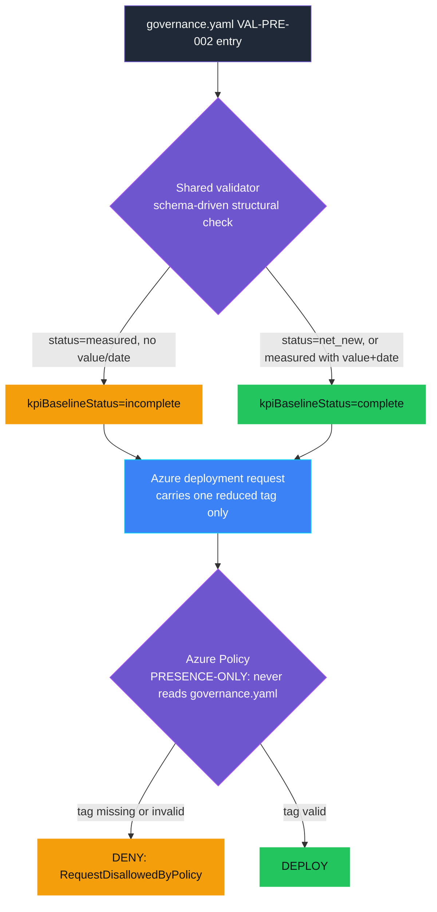

<p align="center">
  
</p>

# VAL-PRE-002 — KPI baseline missing

> **Status:** Validated
>
> **Last reviewed:** 2026-09-18

## Overview

A team declares a value hypothesis and says "we already measure this KPI" —
but the actual number was never recorded. Months later, nobody can tell
whether the agent moved the needle, because there is nothing concrete to
compare the measured outcome against. A baseline that exists only as a
label ("measured") is not a baseline.

This control requires that when a `VAL-PRE-002` entry in the agent's Forged
with Foundry governance contract (`.fwf/agents/<agent-id>/governance.yaml`,
see [`docs/governance-contract.md`](../../../docs/governance-contract.md))
claims its KPI baseline is `measured`, it also records an actual numeric
`value` and the `measuredDate` it was captured. A `net_new` baseline
(genuinely no prior history) needs neither field and is trivially complete.

```yaml
controls:
  - id: VAL-PRE-002
    version: "1.0.0"
    evidence:
      baseline:
        status: measured
        value: 28
        measuredDate: "2026-06-01"
```

> **Governance before enforcement.** The organisation should have an
> upstream process where the workload team actually measures and records
> the baseline before go-live, and where that measurement is reviewed. This
> demo assumes that process has happened and the governance contract
> records the agreed result; the control only enforces structural
> completeness at the platform boundary.

## Demo profile

| Property | Value |
|---|---|
| **Demo format** | `DEPLOYABLE_DEMO` |
| **Learning level** | Foundation |
| **Estimated time** | 15–20 minutes, including policy propagation |
| **Primary decision** | Deny a tagged go-live request when it claims a measured KPI baseline with no recorded value or date |
| **Primary capabilities** | Forged with Foundry governance contract (`.fwf/agents/<agent-id>/governance.yaml`) + shared schema validator; Azure Policy `deny` effect (deployed and validated) |
| **Deployment** | Required for the core learning outcome |
| **Infrastructure** | One custom policy definition + one resource-group assignment |
| **AGT / ACS** | Not used: this is Azure resource admission, not an agent-runtime decision |
| **Model/Foundry role** | `Not used — not applicable to the core path` |

## Demo scope

### Core demo

Two validations against the same harmless Azure resource template, tagged
as an IT Helpdesk Tier-1 Triage Agent go-live request:
`fixtures/incomplete-workload/.fwf/agents/helpdesk-tier1-triage/governance.yaml`
(claims `status: measured`, no `value`/`measuredDate`) is denied;
`fixtures/complete-workload/.fwf/agents/helpdesk-tier1-triage/governance.yaml`
(records both) validates. Both use `az deployment group validate`, so no
workload is created.

### Intentional simplifications

- Checks *structural* completeness only: that a claimed measured baseline
  records a number and a date. It does not check that the number is
  accurate or was measured with a sound method.
- Deliberately does not re-validate `metric`/`target`/`direction` — that
  stays [VAL-PRE-001](../VAL-PRE-001_value_hypothesis_missing/README.md)'s
  territory, even though the catalog's trigger text for this control
  ("No baseline or target before build") mentions both.
- No optional GitHub Actions/OIDC CI-CD extension is built for this control
  yet; see VAL-PRE-001's
  [`docs/OIDC-DEMO.md`](../VAL-PRE-001_value_hypothesis_missing/docs/OIDC-DEMO.md)
  for the pattern a future session can reuse here.

### What this demo proves

- Azure Policy denies the demonstrated go-live request when a claimed
  measured baseline has no recorded value or date, and validates it once
  both are present.
- No model or custom policy engine participates in the decision.
- This control's evidence is fully self-contained: it validates correctly
  with no VAL-PRE-001 entry present in the same contract, so a workload can
  implement either control independently.

### What this demo does not prove

- **Automated validation proves structural completeness, not measurement
  quality.** The shared schema validator proves a claimed measured baseline
  records a number and a date, and rejects placeholder or malformed input
  (a non-numeric value, a malformed date). It cannot verify the number is
  *accurate*, was measured with a sound method, or reflects the real
  historical baseline — that verification belongs to the organisation's own
  measurement and review process, upstream of this control.
- That the recorded baseline is a *good* comparison point for the agent's
  eventual measured outcome (VAL-001's job, from a separate Live telemetry
  source). **A passing schema validation never proves the agent will
  create value.**
- **Azure Policy cannot distinguish genuine metadata from forged metadata.**
  A caller who supplies a trusted-looking tag without ever running the
  validator gets the same platform decision as one who did.

## Control contract

| Field | Value |
|---|---|
| **ID** | VAL-PRE-002 |
| **Lifecycle phase** | Pre-Live |
| **Category / domain** | Value |
| **Control / signal** | KPI baseline missing |
| **Evidence / source** | The agent's Forged with Foundry governance contract, reduced to one deployment tag |
| **Trigger / threshold** | No baseline or target before build (this control: baseline value/date only) |
| **Action / gate effect** | Create baseline before approval |
| **Accountable role** | Business Owner |

## Control objective

Deny the demonstrated go-live request when it claims a measured KPI
baseline with no recorded value or date. The decision is deterministic and
belongs to Azure Policy. Whether the recorded number is accurate remains an
explicit upstream trust boundary rather than a hidden model decision.

## Logical design



The shared validator answers *intent* (does the governance contract's
`VAL-PRE-002` entry structurally declare a recorded baseline?); Azure
Policy enforces the *platform* (is the one required tag present on the
request?). Azure Policy never reads `governance.yaml` and cannot verify the
tag was produced by a real validator run.

## Infrastructure architecture

The diagram above already shows every building block this control uses.
Bicep provisions the policy definition and resource-group assignment once,
ahead of any demo run (`infra/deploy.sh`); the Azure CLI then calls
`az deployment group validate` on every run afterward, against whichever
policy state Bicep left in place. Azure Resource Manager is the only
authoritative decision point.

## Implementation

### Components

| Component | Responsibility | Location |
|---|---|---|
| Governance contract fixtures | Recorded baseline, one complete-workload and one incomplete-workload | [fixtures/](fixtures/) |
| Shared schema validator | Reduces the governance contract to the tag Azure Policy checks | [../../../scripts/validate_governance_contract.py](../../../scripts/validate_governance_contract.py), schema: [../../../schemas/governance-contract/v1alpha1/controls/VAL-PRE-002.schema.json](../../../schemas/governance-contract/v1alpha1/controls/VAL-PRE-002.schema.json) |
| Azure Policy definition + assignment | Expresses and scopes the authoritative `deny` rule | [infra/policy-definition.bicep](infra/policy-definition.bicep), [infra/main.bicep](infra/main.bicep) |
| Demo runner | Runs the assessment then both validations, printing evidence | [demo.sh](demo.sh) |
| Boundary-case + consistency tests | Field-level coverage for this control's schema | [../../../tests/test_val_pre_002_governance_contract.py](../../../tests/test_val_pre_002_governance_contract.py), [../../../tests/test_governance_contract_consistency.py](../../../tests/test_governance_contract_consistency.py) |

Architecture-wide reference for the governance contract itself:
[docs/governance-contract.md](../../../docs/governance-contract.md).

### Decision rules

The shared validator's JSON Schema marks this control's evidence `complete`
when `baseline.status` is `net_new` (no value/date required), or
`measured` with both `baseline.value` (numeric) and `baseline.measuredDate`
(`YYYY-MM-DD`) present; otherwise `incomplete`. Azure Policy denies whenever
`kpiBaselineStatus != complete`, reading only that one tag.

## Demo

### Prerequisites

- Azure CLI authenticated (`az login`); Python 3 with
  `pip install -r requirements.txt`.
- An Azure resource group, with permission to validate a deployment and
  create a policy assignment (subscription-scope for the definition, e.g.
  **Resource Policy Contributor**).

### Deploy

```bash
cp controls/value_adoption_and_finops/VAL-PRE-002_kpi_baseline_missing/.env.example \
  controls/value_adoption_and_finops/VAL-PRE-002_kpi_baseline_missing/.env
# set AZURE_SUBSCRIPTION_ID and AZURE_RESOURCE_GROUP in the copied file
./controls/value_adoption_and_finops/VAL-PRE-002_kpi_baseline_missing/infra/deploy.sh
```

Azure Policy assignments can take several minutes to propagate.

### Inspect in Azure

| What to inspect | Azure Portal path | What to verify |
|---|---|---|
| Policy definition | **Policy** → **Definitions** → `val-pre-002-kpi-baseline-gate` | Effect is `deny`; requires `kpiBaselineStatus=complete`. |
| Policy assignment | **Policy** → **Assignments** → resource group | Scoped only to the chosen demo resource group. |

### Run

```bash
./controls/value_adoption_and_finops/VAL-PRE-002_kpi_baseline_missing/demo.sh
```

### Demo walkthrough

Captured terminal output from actually running the command above against
the live deployed policy:

```text
1/2 Assessing a workload with a missing KPI baseline...
Validating a go-live request with kpiBaselineStatus=incomplete...
BLOCKED as expected by Azure Policy.
2/2 Assessing a workload with a recorded KPI baseline...
Validating the same request with kpiBaselineStatus=complete...
VALIDATED as expected by Azure Policy.
{
  "control_id": "VAL-PRE-002",
  "policy_version": "1.0.0",
  "incomplete_baseline_result": "denied",
  "complete_baseline_result": "validated",
  "resource_created": false,
  "action": "block go-live until a measured KPI baseline is recorded",
  "accountable_role": "Business Owner"
}
```

### Expected scenarios

| Input | Expected decision |
|---|---|
| `fixtures/incomplete-workload/.fwf/agents/helpdesk-tier1-triage/governance.yaml` | Deny (`RequestDisallowedByPolicy`) |
| `fixtures/complete-workload/.fwf/agents/helpdesk-tier1-triage/governance.yaml` | Validate |

## Evidence and observability

The terminal record contains the control and policy version, both
authoritative Azure results, a UTC timestamp, the action, and accountable
role — no real business case, personal data, prompt, or model output.

## Security and privacy

- Azure CLI authentication only; no credentials stored in the control.
- Only synthetic, non-personal tags are sent to Azure.

## Validation

### Automated tests

`validate.sh` compiles all Bicep templates, checks the shell scripts, and
runs the shared governance-contract validator against both fixtures
(`--enforce` pass/fail). Boundary-case coverage (missing value, missing
date, non-numeric value, malformed date, invalid status, self-containment
without a VAL-PRE-001 sibling) lives in the repository-root test suite:
[tests/test_val_pre_002_governance_contract.py](../../../tests/test_val_pre_002_governance_contract.py)
and
[tests/test_governance_contract_consistency.py](../../../tests/test_governance_contract_consistency.py).

```bash
./controls/value_adoption_and_finops/VAL-PRE-002_kpi_baseline_missing/validate.sh
.venv/bin/python -m pytest tests/test_val_pre_002_governance_contract.py tests/test_governance_contract_consistency.py -q
```

### Known limitations

Target realism and measurement-method soundness are out of scope; this
control does not verify the recorded baseline number is accurate. No
optional GitHub Actions/OIDC extension exists yet for this control.

## Cleanup

```bash
./controls/value_adoption_and_finops/VAL-PRE-002_kpi_baseline_missing/infra/cleanup.sh
```

This script deletes only this control's policy assignment and definition;
it never deletes the resource group or shared infrastructure.

## References

- [Deep dive: Forged with Foundry Agent Governance Contract](../../../docs/governance-contract.md)
- [Glossary](../../../docs/glossary.md)
- [Azure Policy `deny` effect](https://learn.microsoft.com/en-us/azure/governance/policy/concepts/effect-deny)
- [Azure Policy definition structure](https://learn.microsoft.com/en-us/azure/governance/policy/concepts/definition-structure-policy-rule)
- `controls/value_adoption_and_finops/VAL-PRE-001_value_hypothesis_missing` — the reused pattern and shared contract architecture this control builds on.
- [../ARCHITECTURE.md](../ARCHITECTURE.md) — cross-control data flow.

---

<p align="center">
  
</p>

