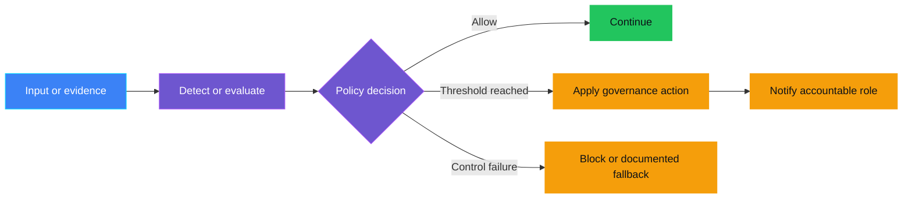
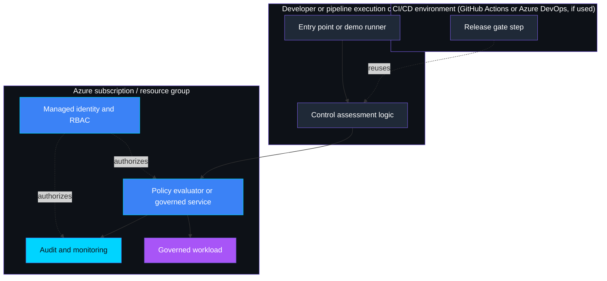

    

# `<CONTROL-ID>` — `<Control name>`

> **Status:** Planned | In progress | Implemented | Validated
>
> **Last reviewed:** YYYY-MM-DD against the linked authoritative references.

> **Authoring principle:** this file is a bite-sized learning surface, not an
> implementation reference. A technical reader should understand the problem,
> the control, its enforcement responsibilities, how to run the demo, and
> what it proves/does not prove in roughly 60-90 seconds. Keep each section
> short; move screenshots, credential/troubleshooting detail, RBAC specifics,
> and long scenario walkthroughs to `ASSESSMENT.md` or a control-local
> `docs/` folder (for example `docs/IMPLEMENTATION.md`, `docs/OIDC-DEMO.md`)
> and link to them instead. Prefer one primary Mermaid diagram; only add a
> second when it teaches a materially different view, never a near-duplicate
> of the first (see `governance-controls.instructions.md`).

## Table of contents

* [Overview](#overview)
* [Demo profile](#demo-profile)
* [Demo scope](#demo-scope)
* [Control contract](#control-contract)
* [Control objective](#control-objective)
* [Logical design](#logical-design)
* [Infrastructure architecture](#infrastructure-architecture)
* [Implementation](#implementation)
* [Demo](#demo)
* [Evidence and observability](#evidence-and-observability)
* [Security and privacy](#security-and-privacy)
* [Validation](#validation)
* [Cleanup](#cleanup)
* [References](#references)

## Overview

Open with a short, plain-language real-life scenario: name who is affected,
what goes wrong without the control, and why it matters, in two to four
sentences with no jargon, acronyms, or control IDs. Assume the reader has
never seen the control ID or signal name before. Then explain the control in
plain language, the risk it addresses, the lifecycle phase in which it
operates, and what the demo proves.

## Demo profile

| Property | Value |
|---|---|
| **Demo format** | Guided exercise / Hybrid demo / Deployable demo |
| **Learning level** | Foundation / Intermediate / Advanced |
| **Estimated time** | `<Time to complete the core demo>` |
| **Primary decision** | `<One governance decision>` |
| **Primary capabilities** | `<Microsoft services, AGT, ACS, or other tools>` |
| **Deployment** | Not applicable / Optional / Required for the core learning outcome |
| **Infrastructure** | `<Requirements, or Not applicable>` |
| **AGT / ACS** | Capability and role in the core demo / Not applicable with reason |
| **Model/Foundry role** | `Active — governed subject` / `Explanatory only` / `Not used — not applicable to the core path` |

## Demo scope

### Core demo

List the exact control path that is implemented, reproducible, and validated.
Keep it focused on one primary governance decision.

### Intentional simplifications

List deliberate simplifications that keep the demo accessible. Explain which
additional capability each simplification leaves for further exploration. A
simplification must not create an undocumented unsafe path.

### What this demo proves

State only conclusions directly supported by the implementation and validation.

### What this demo does not prove

State unsupported security, compliance, scale, reliability, and operational
claims explicitly.

## Control contract

| Field | Value |
|---|---|
| **ID** | `<CONTROL-ID>` |
| **Lifecycle phase** | Pre-Live / Live / Portfolio |
| **Category / domain** | `<Category>` |
| **Control / signal** | `<Signal>` |
| **Evidence / source** | `<Evidence>` |
| **Trigger / threshold** | `<Threshold>` |
| **Action / gate effect** | `<Action>` |
| **Accountable role** | `<Role>` |

## Control objective

Describe the desired governance outcome, policy invariants, scope, and explicit
non-goals. State whether the decision is deterministic, model-assisted, or
human-approved.

## Logical design

Explain the runtime or assessment flow. Show trust boundaries, decision points,
actions, escalations, and fail-closed/fallback behavior.

## Infrastructure architecture

For a guided exercise with no deployed components, state `Not applicable` and
show the evidence-and-decision flow instead. Otherwise show the building
blocks that exist or could exist, grouped by the environment or boundary they
run in, using mermaid `subgraph` blocks. This is a component overview, not a
numbered execution trace: do not model it as one `A --> B --> C --> D` chain
that just replays the demo script's call order. Replace the conceptual
diagram with the actual building blocks used by the demo.

## Implementation

<!--
  Section order below (Implementation -> Demo -> Evidence and observability)
  must match REQUIRED_SECTIONS in tests/test_control_readme_structure.py and
  scripts/scaffold_controls.py's template. Update all three together.
-->

### Components

| Component | Responsibility | Location |
|---|---|---|
| Scenario or detector | `<What it presents or evaluates>` | `<Link>` |
| Decision rubric or policy | `<Decision rules>` | `<Link>` |
| Action/escalation | `<Gate or notification>` | `<Link>` |
| Infrastructure | `<Required resources, optional extension, or Not applicable>` | `<Link or N/A>` |

### Decision rules

List the exact rules, ordering, thresholds, edge cases, and failure behavior.
Never leave mandatory policy behavior implicit in model instructions.

### Best-practice choices

Explain how the implementation applies current authoritative guidance, including
version choices, least privilege, managed identity, data minimization,
observability, resilience, and secure defaults.

## Demo

### Prerequisites

List required tools, permissions, environment variables, synthetic test data,
and deployment dependencies. For a guided exercise, list only the materials
needed to complete it.

### Deploy (when applicable)

Provide control-specific deployment steps or link to shared infrastructure.
Do not include credentials or environment-specific secret values. State `Not
applicable` when the core demo requires no deployment. Keep optional deployment
clearly separated from the core path.

### Inspect in Azure (when applicable)

For a hybrid or deployable demo that creates or configures Azure resources,
show the smallest useful Azure Portal walkthrough. Omit this section or state
`Not applicable` for a guided exercise without Azure resources.

| What to inspect | Where in Azure Portal | What to verify and why it matters |
|---|---|---|
| `<Resource or configuration>` | `<Resource group > Resource > Blade>` | `<Expected safe state and relationship to the control>` |

Cover only the important resources and configuration, such as identity, RBAC,
lifecycle rules, networking, diagnostics, or monitoring. Use deployment outputs
or placeholders for resource names. Never include subscription IDs, tenant IDs,
credentials, secrets, or other sensitive environment values. Add an optional
CLI inspection command only when it materially improves verification.

### Run or complete the exercise

Provide the smallest reproducible run command or guided walkthrough and its
expected entry point.

### Expected scenarios

| Scenario | Input | Expected decision | Expected evidence |
|---|---|---|---|
| Healthy/below threshold | `<Synthetic input>` | Allow/continue | `<Safe evidence>` |
| Threshold reached | `<Synthetic input>` | Gate/escalate | `<Safe evidence>` |
| Unavailable/incomplete/ambiguous | `<Simulated condition>` | Fail closed, request review, or documented fallback | `<Safe error or review evidence>` |

## Evidence and observability

Document the decision record and evidence required to show that the control
operated as designed. Where applicable, also document metrics, traces, logs,
events, alert payloads, dashboards, correlation IDs, and retention. Explicitly
list data that must never enter evidence or telemetry.

## Security and privacy

Document:

- trust boundaries and threat assumptions;
- authentication, managed identities, and RBAC scopes;
- data classification, minimization, encryption, and retention;
- secret handling and network exposure;
- cleanup and deletion behavior;
- fail-closed behavior and information disclosed by errors.

## Validation

### Automated tests (when applicable)

List test files, coverage intent, and the validation command. For a guided
exercise with no executable decision logic, state `Not applicable` and rely on
the reproducible walkthrough and answer key.

### Manual checks

List safe, reproducible demo checks and expected outcomes.

### Known limitations

State unsupported formats, quotas, regional constraints, preview features,
operational trade-offs, and anything not proven by the demo.

## Further exploration

Document optional follow-up without implementing it unless it adds a distinct
learning outcome.

| Topic | Core demo | Possible extension | Microsoft guidance |
|---|---|---|---|
| Identity | `<Demo choice>` | `<Optional extension>` | `<Link>` |
| Networking | `<Demo choice>` | `<Optional extension>` | `<Link>` |
| Audit/evidence | `<Demo choice>` | `<Optional extension>` | `<Link>` |
| Approval | `<Demo choice>` | `<Optional extension>` | `<Link>` |
| Monitoring | `<Demo choice>` | `<Optional extension>` | `<Link>` |

These extensions are optional and are not required to complete the core demo.
Documentation links provide learning paths; they do not validate or certify the
demo.

### Community ideas

List small, independent follow-up exercises suitable for community contributors.
Do not imply that optional exploration is required to understand the core demo.

## Cleanup

When the demo creates resources or records, provide precise control-specific
cleanup steps and identify shared resources that must not be deleted
accidentally. Otherwise state `Not applicable` and why.

## References

- Link to official legislation, regulators, or standards bodies for normative
  legal, regulatory, or standards claims.
- Link to current authoritative Microsoft Learn/API/SDK documentation.
- Record pinned API, SDK, and model versions where relevant.
- Link to the [source governance catalog](Governance%20Signals%20Repo.pdf).

---

    

