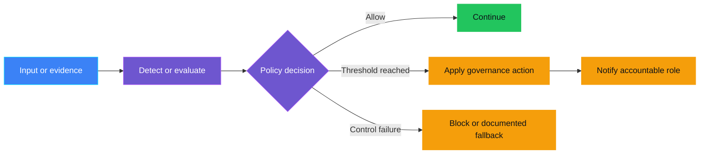
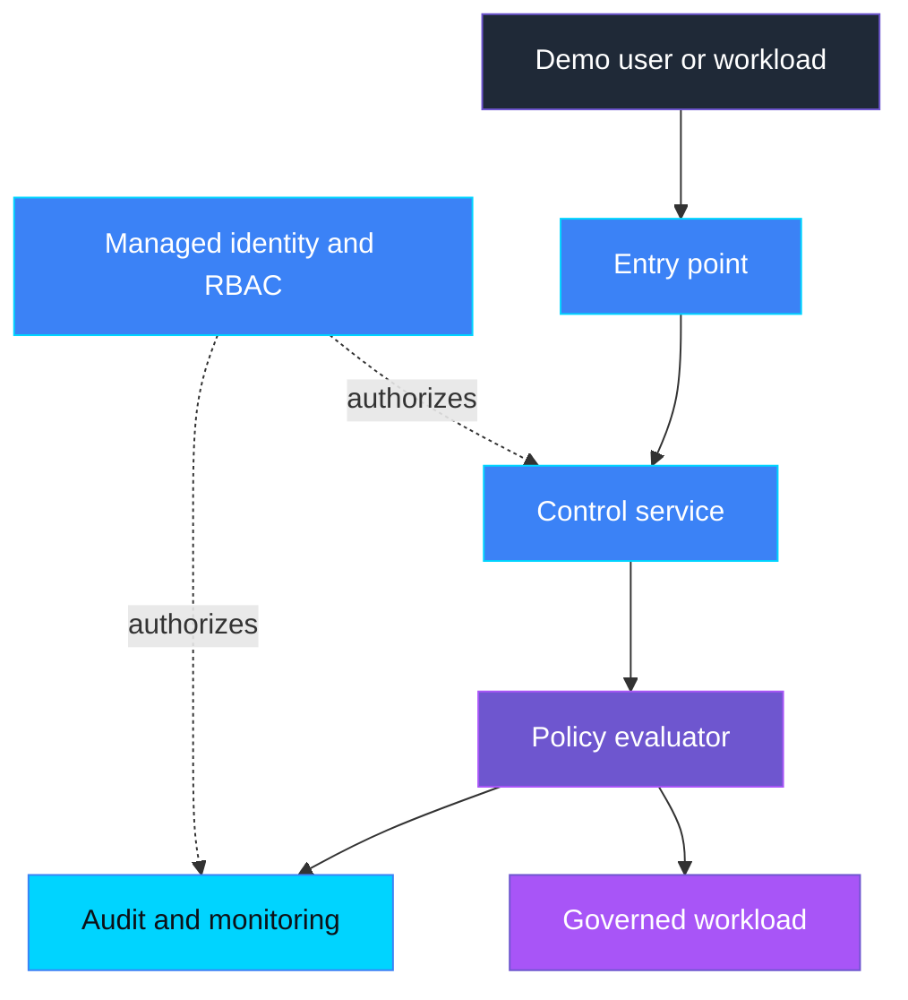

    

# `<CONTROL-ID>` — `<Control name>`

> **Status:** Planned | In progress | Implemented | Validated
>
> **Last reviewed:** YYYY-MM-DD against the linked authoritative references.

## Overview

Open with a short, plain-language real-life scenario: name who is affected,
what goes wrong without the control, and why it matters, in two to four
sentences with no jargon, acronyms, or control IDs. Assume the reader has
never seen the control ID or signal name before. Then explain the control in
plain language, the risk it addresses, the lifecycle phase in which it
operates, and what the demo proves.

## Demo profile

| Property | Value |
|---|---|
| **Learning level** | Foundation / Intermediate / Advanced |
| **Estimated time** | `<Time to deploy and run>` |
| **Primary decision** | `<One governance decision>` |
| **Primary capabilities** | `<Microsoft services, AGT, ACS, or other tools>` |
| **Infrastructure** | `<Local and cloud requirements>` |
| **AGT / ACS** | Used / Not used in the core demo |

## Demo scope

### Core demo

List the exact control path that is implemented, runnable, and tested. Keep it
focused on one primary governance decision.

### Intentional simplifications

List deliberate simplifications that keep the demo accessible. Explain which
additional capability each simplification leaves for further exploration. A simplification
must not create an undocumented unsafe path.

### What this demo proves

State only conclusions directly supported by the implementation and validation.

### What this demo does not prove

State unsupported security, compliance, scale, reliability, and operational
claims explicitly.

## Control contract

| Field | Value |
|---|---|
| **ID** | `<CONTROL-ID>` |
| **Lifecycle phase** | Pre-Live / Live / Portfolio |
| **Category / domain** | `<Category>` |
| **Control / signal** | `<Signal>` |
| **Evidence / source** | `<Evidence>` |
| **Trigger / threshold** | `<Threshold>` |
| **Action / gate effect** | `<Action>` |
| **Accountable role** | `<Role>` |

## Control objective

Describe the desired governance outcome, policy invariants, scope, and explicit
non-goals. State whether the decision is deterministic, model-assisted, or
human-approved.

## Logical design

Explain the runtime or assessment flow. Show trust boundaries, decision points,
actions, escalations, and fail-closed/fallback behavior.

## Infrastructure architecture

Describe the deployed components, identities, data stores, network paths,
monitoring, and external integrations. Replace the conceptual diagram with the
actual architecture used by the demo.

## Implementation

### Components

| Component | Responsibility | Location |
|---|---|---|
| Detector/evaluator | `<What it evaluates>` | `<Link>` |
| Policy | `<Decision rules>` | `<Link>` |
| Action/escalation | `<Gate or notification>` | `<Link>` |
| Infrastructure | `<Required resources>` | `<Link>` |

### Decision rules

List the exact rules, ordering, thresholds, edge cases, and failure behavior.
Never leave mandatory policy behavior implicit in model instructions.

### Best-practice choices

Explain how the implementation applies current authoritative guidance, including
version choices, least privilege, managed identity, data minimization,
observability, resilience, and secure defaults.

## Demo

### Prerequisites

List required tools, permissions, environment variables, synthetic test data,
and deployment dependencies.

### Deploy

Provide control-specific deployment steps or link to shared infrastructure.
Do not include credentials or environment-specific secret values.

### Run

Provide the smallest reproducible run command and expected entry point.

### Expected scenarios

| Scenario | Input | Expected decision | Expected evidence |
|---|---|---|---|
| Healthy/below threshold | `<Synthetic input>` | Allow/continue | `<Safe evidence>` |
| Threshold reached | `<Synthetic input>` | Gate/escalate | `<Safe evidence>` |
| Dependency/control failure | `<Simulated failure>` | Fail closed or documented fallback | `<Safe error evidence>` |

## Evidence and observability

Document metrics, traces, logs, events, alert payloads, dashboards, correlation
IDs, retention, and evidence required for audit. Explicitly list data that must
never enter telemetry.

## Security and privacy

Document:

- trust boundaries and threat assumptions;
- authentication, managed identities, and RBAC scopes;
- data classification, minimization, encryption, and retention;
- secret handling and network exposure;
- cleanup and deletion behavior;
- fail-closed behavior and information disclosed by errors.

## Validation

### Automated tests

List test files, coverage intent, and the validation command.

### Manual checks

List safe, reproducible demo checks and expected outcomes.

### Known limitations

State unsupported formats, quotas, regional constraints, preview features,
operational trade-offs, and anything not proven by the demo.

## Further exploration

Document optional follow-up without implementing it unless it adds a distinct
learning outcome.

| Topic | Core demo | Possible extension | Microsoft guidance |
|---|---|---|---|
| Identity | `<Demo choice>` | `<Optional extension>` | `<Link>` |
| Networking | `<Demo choice>` | `<Optional extension>` | `<Link>` |
| Audit/evidence | `<Demo choice>` | `<Optional extension>` | `<Link>` |
| Approval | `<Demo choice>` | `<Optional extension>` | `<Link>` |
| Monitoring | `<Demo choice>` | `<Optional extension>` | `<Link>` |

These extensions are optional and are not required to complete the core demo.
Documentation links provide learning paths; they do not validate or certify the
demo.

### Community ideas

List small, independent follow-up exercises suitable for community contributors.
Do not imply that optional exploration is required to understand the core demo.

## Cleanup

Provide precise control-specific cleanup steps and identify any shared resources
that must not be deleted accidentally.

## References

- Link to current authoritative Microsoft Learn/API/SDK documentation.
- Record pinned API, SDK, and model versions where relevant.
- Link to the [source governance catalog](Governance%20Signals%20Repo.pdf).

---

    

