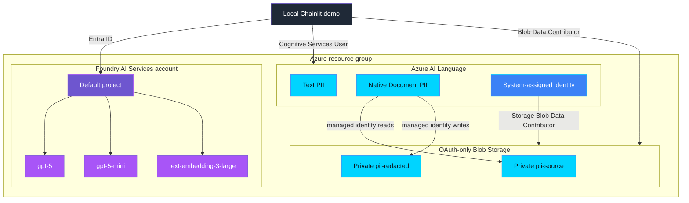

<p align="center">
  
</p>

# Infrastructure — Foundry, GPT-5, and PII Enforcement

Provisions the Microsoft Foundry resources and deterministic Azure AI Language
PII boundary using Bicep. Configuration is read from `infra/.env`.

## What gets deployed

| Resource | Details |
|---|---|
| Foundry account | `Microsoft.CognitiveServices/accounts` (kind `AIServices`), system-assigned identity, project management enabled |
| Default project | `accounts/projects` child resource |
| `gpt-5` | GA chat/reasoning model (`2025-08-07`), `GlobalStandard` |
| `gpt-5-mini` | GA cost-efficient model (`2025-08-07`), `GlobalStandard` |
| `text-embedding-3-large` | GA embeddings model, `GlobalStandard` |
| Language account | Single-service `TextAnalytics` resource with local auth disabled |
| Storage account | OAuth-only Blob Storage for native Document PII |
| Blob containers | Private `pii-source` and `pii-redacted` containers |
| RBAC | Language managed identity and local deployer receive scoped data-plane roles |

## Infrastructure design



## Files

- [main.bicep](main.bicep) — resource definitions and outputs
- [main.bicepparam](main.bicepparam) — parameters read from environment variables
- [deploy.sh](deploy.sh) — loads `.env`, runs the deployment, writes endpoints back to `.env`

## Prerequisites

- `az login` completed
- Bash and the Azure CLI available on your PATH
- An `infra/.env` file (copy from `infra/.env.example`) with at least:

  ```dotenv
  AZURE_SUBSCRIPTION_ID=<your-subscription-id>
  AZURE_RESOURCE_GROUP=rg-forged-with-foundry
  AZURE_LOCATION=swedencentral
  FOUNDRY_ACCOUNT_NAME=<globally-unique-name>
  AZURE_LANGUAGE_ACCOUNT_NAME=<globally-unique-name>
  PII_STORAGE_ACCOUNT_NAME=<globally-unique-lowercase-name>
  ```

## Deploy

```bash
./infra/deploy.sh
```

The script will:

1. Create the resource group if it doesn't exist.
2. Validate and deploy the Bicep template (models are deployed serially).
3. Write these values back into `infra/.env`:
   - `AZURE_AI_PROJECT_ENDPOINT`
   - `AZURE_CONTENT_SAFETY_ENDPOINT`
   - `AZURE_OPENAI_DEPLOYMENT` (gpt-5-mini)
   - `AZURE_OPENAI_CHAT_DEPLOYMENT` (gpt-5)
   - `AZURE_OPENAI_EMBEDDING_DEPLOYMENT` (text-embedding-3-large)
  - `AZURE_LANGUAGE_ENDPOINT`
  - `PII_STORAGE_BLOB_ENDPOINT`
  - `PII_SOURCE_CONTAINER`
  - `PII_TARGET_CONTAINER`

## Notes

- **Quota:** GA `gpt-5` / `gpt-5-mini` deploy on most Tier 1+ subscriptions. If a
  region lacks capacity, change `AZURE_LOCATION` (e.g. `eastus2`) and adjust the
  `*_CAPACITY` values in `.env`.
- **Newer models:** GPT-5.5 / GPT-5.6 require Tier 5–6 quota by default, so this
  template uses GA GPT-5 for reliability. To use them, change the `name`/`version`
  in [main.bicep](main.bicep).
- **Document PII:** the Language resource and storage account use the same
  geographic region so system-assigned managed identity access is supported.
- **RBAC propagation:** new role assignments can take several minutes to become
  effective. Runtime processing fails closed while access is unavailable.
- **Clean up:** `az group delete --name <AZURE_RESOURCE_GROUP> --yes --no-wait`

---

<p align="center">
  
</p>
