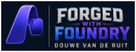
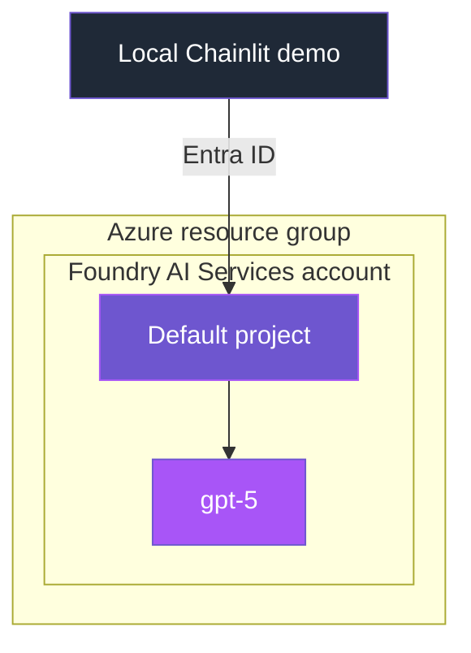

<p align="center">
  
</p>

# Shared Infrastructure — Microsoft Foundry

Provisions only resources shared by all controls. Each control owns and
incrementally deploys any additional Azure resources from its own folder.
Configuration is read from `infra/.env`.

## What gets deployed

| Resource | Details |
|---|---|
| Foundry account | `Microsoft.CognitiveServices/accounts` (kind `AIServices`), system-assigned identity, project management enabled |
| Default project | `accounts/projects` child resource |
| `gpt-5` | Shared GA chat/reasoning model (`2025-08-07`), `GlobalStandard` |

Only the model used by the current community demos is deployed here. A future
control that genuinely needs a mini or embedding model should own that
deployment in its control directory.

The Foundry account requires Microsoft Entra authentication; local key
authentication is disabled. Public network access remains enabled to keep the
community setup approachable. Individual control READMEs document their own
intentional networking simplifications.

## Infrastructure design



## Files

- [main.bicep](main.bicep) — resource definitions and outputs
- [main.bicepparam](main.bicepparam) — parameters read from environment variables
- [deploy.sh](deploy.sh) — loads `.env`, runs the deployment, writes endpoints back to `.env`

## Prerequisites

- `az login` completed
- Bash and the Azure CLI available on your PATH
- An `infra/.env` file (copy from `infra/.env.example`) with at least:

  ```dotenv
  AZURE_SUBSCRIPTION_ID=<your-subscription-id>
  AZURE_RESOURCE_GROUP=rg-forged-with-foundry
  AZURE_LOCATION=swedencentral
  FOUNDRY_ACCOUNT_NAME=<globally-unique-name>
  ```

## Deploy

```bash
./infra/deploy.sh
```

The script will:

1. Create the resource group if it doesn't exist.
2. Validate and deploy the Bicep template in incremental mode.
3. Write these values back into `infra/.env`:
   - `AZURE_AI_PROJECT_ENDPOINT`
   - `AZURE_OPENAI_CHAT_DEPLOYMENT` (gpt-5)

## Notes

- **Cost:** these templates create billable Azure resources. Charges depend on
  region, model usage, and control-specific services. Use the
  [Azure pricing calculator](https://azure.microsoft.com/pricing/calculator/)
  and the service documentation linked from each control README to estimate
  costs, use synthetic data only, and follow the cleanup instructions when finished.
- **Quota:** GA `gpt-5` deploys on most Tier 1+ subscriptions. If a
  region lacks capacity, change `AZURE_LOCATION` (e.g. `eastus2`) and adjust the
  `GPT5_CAPACITY` value in `.env`.
- **Newer models:** GPT-5.5 / GPT-5.6 require Tier 5–6 quota by default, so this
  template uses GA GPT-5 for reliability. To use them, change the `name`/`version`
  in [main.bicep](main.bicep).
- **Control resources:** deploy shared infrastructure first, then run the
  deployment script in the relevant control folder. Incremental deployments
  preserve resources owned by other templates.
- **Deployment behavior:** a resource included in an incremental deployment is
  reapplied from its complete declaration; do not split ownership of one Azure
  resource across control templates.
- **Microsoft guidance:** see [ARM deployment modes](https://learn.microsoft.com/azure/azure-resource-manager/templates/deployment-modes)
  and [Bicep parameter files](https://learn.microsoft.com/azure/azure-resource-manager/bicep/parameter-files).
- **Clean up:** `az group delete --name <AZURE_RESOURCE_GROUP> --yes --no-wait`

---

<p align="center">
  
</p>
